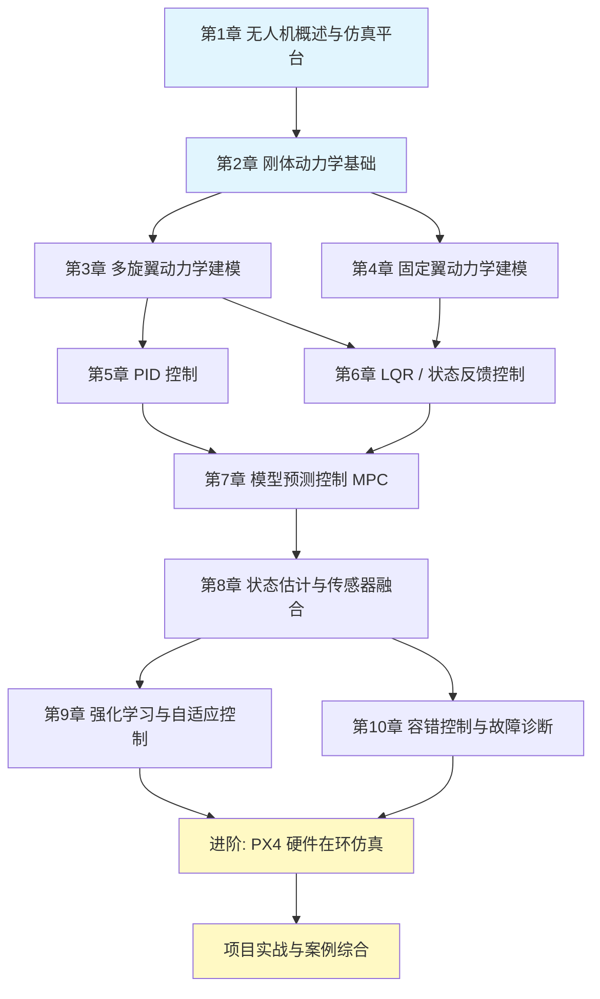

# Simulink 无人机动力学仿真 — 从入门到前沿

> **保姆级教学文档**，面向零基础初学者，覆盖从基础动力学建模到前沿控制算法的完整知识体系。

[](LICENSE)
[](https://www.mathworks.com/products/matlab.html)
[](https://www.mathworks.com/products/simulink.html)

---

## 项目简介

本项目是一套系统化的 Simulink 无人机动力学仿真教学文档，旨在帮助零基础学习者从物理学基本原理出发，逐步掌握多旋翼与固定翼无人机的动力学建模、飞控算法设计、仿真验证及前沿技术应用。所有内容均基于 MATLAB/Simulink 平台，配合丰富的开源项目参考和可复现的示例模型。

## 项目特色

- **零基础友好** — 从牛顿力学和刚体旋转讲起，无需航空航天背景即可入门
- **体系完整** — 涵盖动力学建模、PID/LQR/MPC 控制、状态估计、强化学习等 10 大知识模块
- **理论与实践并重** — 每章均含 Simulink 模型搭建步骤与仿真结果分析
- **前沿技术覆盖** — 包含强化学习自适应控制、容错控制、PX4 硬件在环仿真等前沿方向
- **丰富的开源资源** — 精选 40+ 高质量 GitHub 仓库，按主题分类整理，便于深入学习
- **中文为主、术语规范** — 正文以中文撰写，关键术语保留英文原文，确保专业性与可读性
- **Mermaid 可视化** — 学习路线图、系统架构图均采用 Mermaid 绘制，直观清晰
- **持续更新** — 跟踪 Simulink 新版本特性与学术前沿，定期补充内容

## 适合人群

| 角色 | 说明 |
|------|------|
| 高校学生 | 航空航天、自动化、机器人等相关专业的本科/研究生课程学习 |
| 科研工作者 | 需要快速搭建无人机仿真平台进行算法验证的研究人员 |
| 工程师 | 从事无人机飞控开发、系统集成的工程师，希望深入理解动力学模型 |
| 爱好者 | 对无人机技术感兴趣、希望系统学习仿真方法的自学者 |

## 前置知识

在开始学习之前，建议具备以下基础：

- **MATLAB/Simulink 基础** — 熟悉 MATLAB 命令行操作、矩阵运算，了解 Simulink 基本模块拖拽与仿真运行流程
- **基础物理与力学** — 掌握牛顿运动定律、刚体转动、欧拉角等基本概念
- **线性代数基础** — 了解矩阵运算、特征值分解（后续 LQR/MPC 等算法需要）
- **微分方程基础** — 能理解常微分方程的物理含义（不要求手算求解）

> 如果你对 MATLAB 完全陌生，建议先完成 [MATLAB Onramp](https://matlabacademy.mathworks.com/) 免费在线课程（约 2 小时）。

## 学习路线图



## 目录结构与学习时间

| 章节 | 标题 | 核心内容 | 预计阅读时间 |
|:----:|------|----------|:----------:|
| 01 | 无人机概述与仿真平台 | 无人机分类、Simulink 环境搭建、仿真基本流程 | 1.5 小时 |
| 02 | 刚体动力学基础 | 坐标系变换、欧拉角/四元数、牛顿-欧拉方程 | 3 小时 |
| 03 | 多旋翼动力学建模 | 四旋翼数学模型、电机模型、Simulink 建模实战 | 3 小时 |
| 04 | 固定翼动力学建模 | 气动力与力矩、六自由度模型、配平与线性化 | 3.5 小时 |
| 05 | PID 控制 | 级联 PID 结构、参数整定、Simulink 实现与调试 | 2.5 小时 |
| 06 | LQR / 状态反馈控制 | 状态空间模型、LQR 设计、观测器设计 | 3 小时 |
| 07 | 模型预测控制 MPC | MPC 原理、约束处理、Simulink MPC Toolbox 实战 | 3 小时 |
| 08 | 状态估计与传感器融合 | 卡尔曼滤波、扩展卡尔曼滤波、IMU/GPS 融合 | 3 小时 |
| 09 | 强化学习与自适应控制 | SAC/PPO 算法、Simulink RL Toolbox 集成、自适应 PID | 3.5 小时 |
| 10 | 容错控制与故障诊断 | 故障建模、鲁棒控制、控制分配重构 | 3 小时 |
| 11 | PX4 飞控系统对接 | PX4 架构、Simulink 控制链路、SITL 联合仿真、自定义模块开发、日志分析与调参 | 6 小时 |

> **总计约 35 小时**，建议按章节顺序学习，每章配合动手实操巩固理解。

## 精选开源仓库参考

以下是按主题分类整理的 40+ 高质量 GitHub 仓库，均可作为学习参考和二次开发基础。

### 多旋翼动力学 (Quadrotor Dynamics)

| 仓库 | Stars | 说明 |
|------|:-----:|------|
| [dch33/Quad-Sim](https://github.com/dch33/Quad-Sim) | 289 | 经典四旋翼 Simulink 仿真库，含完整建模与控制 |
| [EwingKang/QuadCopter-Quaternion-Dynamics-in-Simulink](https://github.com/EwingKang/QuadCopter-Quaternion-Dynamics-in-Simulink) | 49 | 基于四元数的四旋翼动力学 Simulink 实现 |
| [AngeloEspinoza/quadrotor-model-and-control](https://github.com/AngeloEspinoza/quadrotor-model-and-control) | 40 | 四旋翼建模与多种控制策略对比 |

### 固定翼无人机 (Fixed-Wing)

| 仓库 | Stars | 说明 |
|------|:-----:|------|
| [chengji253/Multiple-fixed-wing-UAVs-flight-simulation-platform](https://github.com/chengji253/Multiple-fixed-wing-UAVs-flight-simulation-platform) | 320 | 多固定翼无人机编队飞行仿真平台 |
| [jrgenerative/fixed-wing-sim](https://github.com/jrgenerative/fixed-wing-sim) | 155 | 固定翼无人机 Simulink 仿真，含完整气动模型 |

### 综合仿真库 (Comprehensive Libraries)

| 仓库 | Stars | 说明 |
|------|:-----:|------|
| [iff-gsc/LADAC](https://github.com/iff-gsc/LADAC) | 150 | 用于飞行力学与控制的开放仿真代码库，模块化设计 |
| [lamfur07/Flight-Dynamics-and-Control-UAVs](https://github.com/lamfur07/Flight-Dynamics-and-Control-UAVs) | 149 | UAV 飞行动力学与控制综合教程仓库 |

### Simscape 多物理场仿真

| 仓库 | Stars | 说明 |
|------|:-----:|------|
| [mathworks/Quadcopter-Drone-Model-Simscape](https://github.com/mathworks/Quadcopter-Drone-Model-Simscape) | 119 | MathWorks 官方 Simscape 四旋翼模型 |

### 控制算法 (Control Algorithms)

| 仓库 | Stars | 说明 |
|------|:-----:|------|
| [alexdada555](https://github.com/alexdada555) | 87 | 多种飞控算法 Simulink 实现 |
| [KouraniMEKA/Quadrotor-LQR](https://github.com/KouraniMEKA/Quadrotor-LQR) | 17 | 四旋翼 LQR 控制器 Simulink 实现 |
| [aralab-unr/HSMC-EKF](https://github.com/aralab-unr/HSMC-EKF) | 17 | 基于 EKF 的混合系统模型预测控制 |
| [FrancescoZ83](https://github.com/FrancescoZ83) | 2 | 多旋翼控制系统设计与仿真 |

### PX4 集成与硬件在环 (PX4 Integration)

| 仓库 | Stars | 说明 |
|------|:-----:|------|
| [MichaelSkadan/PX4-Autopilot-Simulink-Interface](https://github.com/MichaelSkadan/PX4-Autopilot-Simulink-Interface) | 39 | PX4 自驾仪与 Simulink 接口集成的完整示例，含 MAVLink 通信与控制器对接参考 |
| [optimAero/optimAeroPX4SIL](https://github.com/optimAero/optimAeroPX4SIL) | 19 | PX4 SITL 优化工具，提供高效的 Simulink-PX4 联合仿真方案与 UDP 桥接 |

> **推荐阅读**：第 11 章 [PX4 飞控系统对接](docs/11-PX4飞控系统对接/) 包含 5 篇详细教程，系统讲解 PX4 架构、Simulink 控制链路、SITL 联合仿真、自定义模块开发及日志调参方法。

### 强化学习控制 (RL-Based Control)

| 仓库 | Stars | 说明 |
|------|:-----:|------|
| [RamprasadRaj/Auto-tuning-PID-Q-Learning](https://github.com/RamprasadRaj/Auto-tuning-PID-Q-Learning) | 14 | 基于 Q-Learning 的 PID 参数自整定 |
| [scarletnova20/sac-augmented-pid-uav](https://github.com/scarletnova20/sac-augmented-pid-uav) | 3 | SAC 强化学习增强 PID 控制 |

### NASA 官方工具 (NASA Tools)

| 仓库 | Stars | 说明 |
|------|:-----:|------|
| [nasa/T-MATS](https://github.com/nasa/T-MATS) | 314 | NASA 涡轮发动机建模与仿真工具箱 |
| [nasa/TTECTrA](https://github.com/nasa/TTECTrA) | 67 | NASA 涡轮发动机瞬态控制仿真工具 |

### 容错控制 (Fault Tolerant Control)

| 仓库 | Stars | 说明 |
|------|:-----:|------|
| [iff-gsc/FTC_Quadrotor_EuroGNC_2022](https://github.com/iff-gsc/FTC_Quadrotor_EuroGNC_2022) | 12 | 四旋翼容错控制（EuroGNC 2022 论文配套） |
| [kiankhaneghahi](https://github.com/kiankhaneghahi) | 13 | 无人机故障检测与容错控制研究 |

### 更多资源

完整资源列表与分类索引请参阅 [资源汇总文档](docs/resources.md)。

## 所需 Simulink 工具箱

| 工具箱 | 用途 | 必需/推荐 |
|--------|------|:---------:|
| **Aerospace Blockset** | 航空航天模块库，含六自由度运动方程、大气模型等 | 必需 |
| **Aerospace Toolbox** | 航空航天坐标变换、大气数据计算 | 必需 |
| **UAV Toolbox** | 无人机任务规划、路径跟踪、GCS 接口 | 推荐 |
| **Simscape** | 多物理场建模（电机、机械、电气系统） | 推荐 |
| **Simulink Control Design** | 系统辨识、控制器自动整定、Bode 图分析 | 推荐 |
| **Model Predictive Control Toolbox** | MPC 控制器设计与仿真 | 第 7 章必需 |
| **Reinforcement Learning Toolbox** | 强化学习智能体训练与 Simulink 集成 | 第 9 章必需 |
| **Simulink Coder** | 模型代码生成（PX4 集成时使用） | 可选 |
| **Embedded Coder** | 嵌入式代码生成优化 | 可选 |

> 建议通过 MATLAB 命令 `ver` 查看已安装的工具箱，缺失的工具箱可通过 `add-ons` 管理器安装。

## 快速开始

```matlab
% 1. 克隆本仓库
% git clone https://github.com/your-username/Simulink-UAV-Dynamics-Sim.git

% 2. 在 MATLAB 中打开项目目录
cd Simulink-UAV-Dynamics-Sim

% 3. 运行初始化脚本（添加路径、检查工具箱）
init_project

% 4. 打开第一个示例模型
open_system('models/quadrotor_basic.slx')
```

## 贡献指南

欢迎社区贡献！无论是修正错别字、补充内容，还是添加新的章节，我们都十分感谢。

请阅读 [CONTRIBUTING.md](CONTRIBUTING.md) 了解详细的贡献流程和规范。

## 许可证

本项目采用 [MIT 许可证](LICENSE) 开源。

文档内容采用 [CC BY-SA 4.0](https://creativecommons.org/licenses/by-sa/4.0/) 协议分享，欢迎转载但请注明出处。

## 致谢

- 感谢 MathWorks 提供的优秀仿真平台与官方示例
- 感谢所有开源仓库作者的无私分享
- 特别感谢 [dch33/Quad-Sim](https://github.com/dch33/Quad-Sim)、[iff-gsc/LADAC](https://github.com/iff-gsc/LADAC) 等项目提供的高质量参考实现

---

**如果本项目对你有帮助，请给一个 Star 支持一下！**
