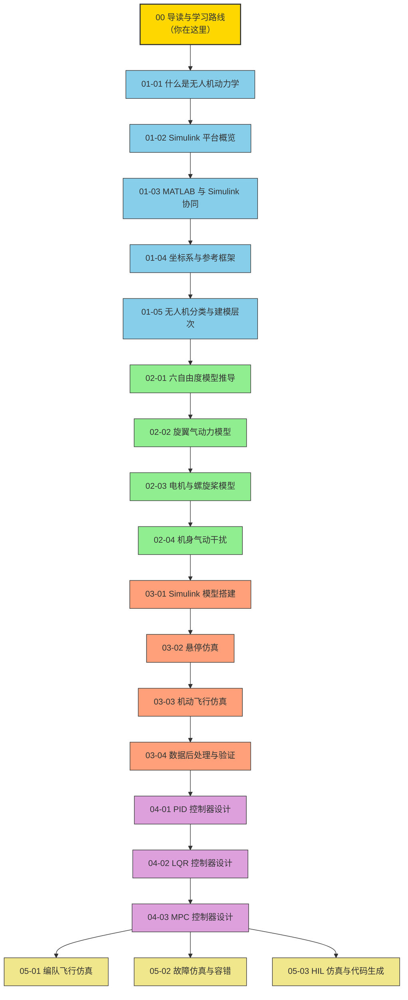

# Simulink 无人机动力学仿真 -- 导读与学习路线

> 预计阅读：15 分钟 | 前置知识：无（零基础友好）

---

## 1. 项目概述

本项目提供一套完整的 **Simulink 无人机动力学仿真** 学习文档，从零基础出发，帮助你掌握无人机动力学建模、仿真与控制的全流程。无论你是航空航天专业的学生、刚接触无人机的工程师，还是希望系统学习仿真技术的研究人员，这套文档都能为你提供清晰的学习路径。

**文档集覆盖的核心能力：**

| 能力维度 | 具体内容 | 对应文档 |
|---------|---------|---------|
| 理论基础 | 动力学概念、坐标系、建模层次 | 01-基础概念系列 |
| 平台工具 | Simulink 操作、MATLAB 协同 | 02-平台与工具系列 |
| 建模方法 | 6DOF 模型、气动力、电机模型 | 03-建模方法系列 |
| 仿真验证 | 悬停/机动仿真、数据后处理 | 04-仿真与验证系列 |
| 控制设计 | PID、LQR、MPC 控制器 | 05-控制设计系列 |
| 进阶应用 | 编队飞行、故障仿真、HIL 测试 | 06-进阶应用系列 |

---

## 2. 目标读者

| 读者类型 | 背景描述 | 学习目标 | 建议起点 |
|---------|---------|---------|---------|
| 高校学生 | 航空/自动化/机械专业本科生或研究生 | 完成课程设计或毕业设计 | 从头开始，按顺序阅读 |
| 工程师 | 有一定 MATLAB 基础的嵌入式/控制工程师 | 快速上手无人机仿真平台 | 可跳过 MATLAB 基础部分 |
| 研究人员 | 从事无人机相关课题的科研工作者 | 搭建高保真仿真环境 | 重点关注建模与控制部分 |
| 爱好者 | 对无人机技术感兴趣的自学者 | 理解无人机飞行原理 | 从基础概念开始，逐步深入 |
| 竞赛参与者 | 参加无人机相关竞赛（如 RoboMaster） | 快速搭建仿真验证环境 | 重点关注建模与控制部分 |

---

## 3. 前置知识要求

在开始学习之前，请确认你具备以下基础知识。如果某些方面有所欠缺，建议先补充相关内容。

| 知识领域 | 要求程度 | 具体内容 | 推荐补充资源 |
|---------|---------|---------|------------|
| **高等数学** | 中等 | 微积分、线性代数、微分方程 | MIT OCW 18.01/18.06 |
| **大学物理** | 基础 | 牛顿力学、刚体转动、力矩分析 | 费曼物理学讲义第一卷 |
| **MATLAB 基础** | 基础 | 变量操作、矩阵运算、脚本编写、绘图 | MathWorks 官方 Onramp 课程 |
| **Simulink 基础** | 入门即可 | 拖拽模块、连线、运行仿真 | Simulink Onramp 课程 |
| **编程基础** | 可选 | 任何语言的编程经验 | - |
| **控制理论** | 可选 | 传递函数、PID 基础概念 | 自动控制原理教材 |

**自测小问题：**

| 问题 | 如果你能回答... | 建议 |
|------|---------------|------|
| 矩阵乘法如何计算？ | 举出具体例子 | 可以开始 |
| 什么是微分方程？ | 能写出一个简单ODE | 可以开始 |
| MATLAB 中如何创建矩阵？ | 写出 `A = [1 2; 3 4]` | 可以开始 |
| Simulink 中 Scope 模块的作用？ | 显示仿真输出波形 | 可以开始 |

---

## 4. 推荐学习路线

以下是推荐的学习路径。实线箭头表示"必须先学"，虚线箭头表示"建议但非必须"。



**颜色说明：**
- 金色 -- 当前文档
- 蓝色 -- 基础概念（必读）
- 绿色 -- 建模方法（核心）
- 橙色 -- 仿真与验证（实践）
- 紫色 -- 控制设计（进阶）
- 黄色 -- 高级应用（选修）

---

## 5. 各章节阅读时间与难度

| 章节编号 | 章节标题 | 预计阅读时间 | 难度等级 | 核心收获 |
|---------|---------|------------|---------|---------|
| 00 | 导读与学习路线 | 15 分钟 | ★☆☆☆☆ | 了解学习全貌 |
| 01-01 | 什么是无人机动力学 | 20 分钟 | ★☆☆☆☆ | 建立动力学基本概念 |
| 01-02 | Simulink 平台概览 | 25 分钟 | ★★☆☆☆ | 了解仿真平台能力 |
| 01-03 | MATLAB 与 Simulink 协同 | 20 分钟 | ★★☆☆☆ | 掌握数据交互方法 |
| 01-04 | 坐标系与参考框架 | 25 分钟 | ★★★☆☆ | 理解坐标变换核心 |
| 01-05 | 无人机分类与建模层次 | 20 分钟 | ★★☆☆☆ | 选择合适的建模方案 |
| 02-01 | 六自由度模型推导 | 40 分钟 | ★★★★☆ | 掌握刚体动力学方程 |
| 02-02 | 旋翼气动力模型 | 30 分钟 | ★★★☆☆ | 理解旋翼力与力矩 |
| 02-03 | 电机与螺旋桨模型 | 25 分钟 | ★★★☆☆ | 建立动力系统模型 |
| 02-04 | 机身气动干扰 | 20 分钟 | ★★★★☆ | 理解耦合效应 |
| 03-01 | Simulink 模型搭建 | 45 分钟 | ★★★☆☆ | 完成模型搭建实践 |
| 03-02 | 悬停仿真 | 30 分钟 | ★★★☆☆ | 验证基本悬停性能 |
| 03-03 | 机动飞行仿真 | 35 分钟 | ★★★★☆ | 验证机动飞行能力 |
| 03-04 | 数据后处理与验证 | 25 分钟 | ★★☆☆☆ | 掌握数据分析方法 |
| 04-01 | PID 控制器设计 | 40 分钟 | ★★★☆☆ | 实现基本姿态控制 |
| 04-02 | LQR 控制器设计 | 40 分钟 | ★★★★☆ | 实现最优控制 |
| 04-03 | MPC 控制器设计 | 45 分钟 | ★★★★★ | 实现约束预测控制 |
| 05-01 | 编队飞行仿真 | 35 分钟 | ★★★★☆ | 多机协同仿真 |
| 05-02 | 故障仿真与容错 | 30 分钟 | ★★★★☆ | 故障注入与容错策略 |
| 05-03 | HIL 仿真与代码生成 | 35 分钟 | ★★★★★ | 硬件在环测试能力 |

**总计预计阅读时间：约 9.5 小时**

---

## 6. 难度进阶图


| 阶段 | 时间投入 | 核心能力 | 里程碑 |
|------|---------|---------|--------|
| 第一阶段 | 2-3 小时 | 理解基本概念 | 能解释什么是无人机动力学 |
| 第二阶段 | 3-4 小时 | 推导数学模型 | 能写出 6DOF 方程 |
| 第三阶段 | 3-4 小时 | Simulink 仿真 | 能运行悬停仿真 |
| 第四阶段 | 3-4 小时 | 控制器设计 | 能实现姿态稳定控制 |
| 第五阶段 | 3-4 小时 | 系统集成 | 能完成端到端仿真 |

---

## 7. 推荐参考书籍

| 书名 | 作者 | 出版社 | 推荐理由 | 适用阶段 |
|------|------|-------|---------|---------|
| 《多旋翼飞行器设计与控制》 | 全权 等 | 电子工业出版社 | 北航权威教材，系统讲解多旋翼设计与控制理论，覆盖动力学建模、状态估计、控制器设计全流程 | 全阶段必备 |
| 《MATLAB/Simulink系统仿真超级学习手册》 | 刘浩 等 | 人民邮电出版社 | 从基础到进阶全面覆盖 Simulink 使用，适合零基础快速上手 | 第一、三阶段 |
| 《小型无人机系统设计与仿真》 | 张伟 等 | 国防工业出版社 | 聚焦小型无人机，包含气动建模、飞行控制、仿真实例，工程导向强 | 第二、三、四阶段 |
| 《Aircraft Control and Simulation》 | Stevens & Lewis | Wiley | 经典英文教材，深入讲解飞行器动力学与控制仿真 | 第二、四阶段 |
| 《多旋翼无人机入门与实践》 | 夏新 等 | 机械工业出版社 | 侧重实践，配有大量 MATLAB/Simulink 仿真实例 | 第三阶段 |
| 《自动控制原理》 | 胡寿松 | 科学出版社 | 国内经典控制理论教材，PID/LQR/状态空间方法 | 第四阶段 |

---

## 8. 文档使用建议

### 如何高效使用本文档集

| 策略 | 说明 | 适合人群 |
|------|------|---------|
| **顺序学习** | 按编号顺序逐篇阅读，做每篇后的思考题 | 零基础学习者 |
| **按需查阅** | 直接跳转到需要的章节，查阅后回来补基础 | 有经验的工程师 |
| **项目驱动** | 从具体需求出发，选择性阅读相关章节 | 竞赛/项目参与者 |
| **对比验证** | 阅读后尝试自己推导，与文档结果对比 | 研究人员 |

### 学习建议

1. **动手为先** -- 每篇文档都建议配合 MATLAB/Simulink 实际操作
2. **笔记记录** -- 在阅读过程中记录疑问和心得
3. **思考题必做** -- 每篇末尾的思考题是检验理解的关键
4. **循序渐进** -- 不要跳过基础阶段直接进入控制设计
5. **参考书籍** -- 遇到难以理解的概念，查阅推荐书籍

---

## 9. 文档目录总览

```
Simulink-UAV-Dynamics-Sim/
└── docs/
    ├── 00-导读与学习路线.md          ← 你在这里
    └── 01-基础概念/
        ├── 01-什么是无人机动力学.md
        ├── 02-Simulink平台概览.md
        ├── 03-MATLAB与Simulink协同.md
        ├── 04-坐标系与参考框架.md
        └── 05-无人机分类与建模层次.md
    └── 02-建模方法/
        ├── 01-六自由度模型推导.md
        ├── 02-旋翼气动力模型.md
        ├── 03-电机与螺旋桨模型.md
        └── 04-机身气动干扰.md
    └── 03-仿真与验证/
        ├── 01-Simulink模型搭建.md
        ├── 02-悬停仿真.md
        ├── 03-机动飞行仿真.md
        └── 04-数据后处理与验证.md
    └── 04-控制设计/
        ├── 01-PID控制器设计.md
        ├── 02-LQR控制器设计.md
        └── 03-MPC控制器设计.md
    └── 05-进阶应用/
        ├── 01-编队飞行仿真.md
        ├── 02-故障仿真与容错.md
        └── 03-HIL仿真与代码生成.md
```

---

## 10. 常见问题

| 问题 | 回答 |
|------|------|
| 需要什么版本的 MATLAB？ | 建议 R2022b 及以上，需要 Simulink、Aerospace Blockset、UAV Toolbox |
| 没有航空航天背景能学吗？ | 可以，本文档从零基础出发，所有概念都会详细解释 |
| 学完能做什么？ | 能独立搭建无人机仿真环境，设计基本控制器，进行仿真验证 |
| 每篇都要学吗？ | 基础概念和建模方法是必读的，控制设计和进阶应用可按需选择 |
| 有配套代码吗？ | 文档中的 Simulink 模型代码均在项目 `models/` 目录下 |

---

## 思考题

1. 你目前的知识背景最接近哪类目标读者？根据上表，你会选择哪种学习策略？

2. 根据前置知识要求，你觉得自己在哪些方面需要补充？请列出具体计划。

3. 观察学习路线图，为什么建议在学习控制设计之前先完成建模和仿真验证？

4. 如果你只有 20 小时的学习时间，你会优先学习哪些章节？请说明理由。

5. 为什么文档推荐同时阅读《多旋翼飞行器设计与控制》和本文档集？

<details>
<summary>参考答案</summary>

1. 根据个人背景选择对应的读者类型。例如，如果是航空专业学生，建议从头顺序学习；如果是有 MATLAB 基础的工程师，可以跳过基础操作部分。关键是选择适合自己的学习策略（顺序学习/按需查阅/项目驱动/对比验证）。

2. 根据前置知识表格自查。最常见需要补充的是：(1) MATLAB 基础 -- 可通过 MathWorks Onramp 免费课程快速补充；(2) 线性代数 -- 矩阵运算和特征值是坐标变换和控制设计的基础；(3) 刚体力学 -- 力矩分析是动力学建模的核心。

3. 因为控制设计需要被控对象的数学模型。如果不理解动力学模型的推导过程，就无法正确设计控制器；如果不先通过仿真验证模型的正确性，就无法确认控制器的仿真结果是可靠的。建模是"知其然"，控制是"知其所以然"。

4. 建议优先学习：01-01（动力学概念）、01-04（坐标系）、02-01（6DOF模型）、03-01（Simulink搭建）、04-01（PID控制）。这5篇覆盖了从理论到实践的最小闭环，约占10小时。剩余10小时用于补充其他基础概念和做仿真练习。

5. 《多旋翼飞行器设计与控制》提供系统的理论基础和数学推导，而本文档侧重 Simulink 实现和工程实践。两者互补：书本给你深度，文档给你实操。理论与实践结合才能真正掌握无人机仿真技术。

</details>
