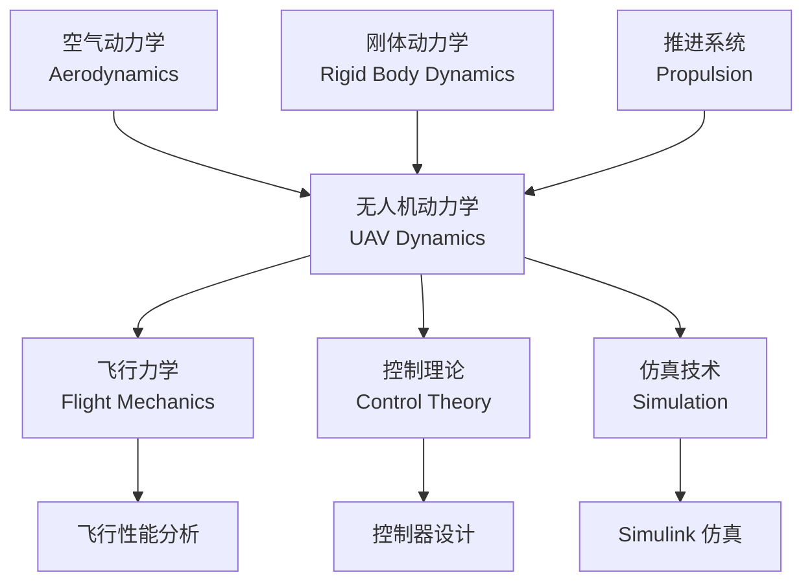
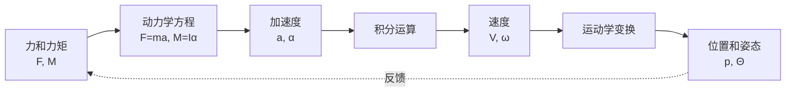

# 什么是无人机动力学

> 预计阅读：20 分钟 | 前置知识：大学物理（牛顿力学基础）

---

## 1. 一句话定义

**无人机动力学是研究无人机在力和力矩作用下的运动规律的学科。**

简单来说，它回答两个核心问题：
- **力 → 平动**：无人机受到的力如何改变它的位置和速度？
- **力矩 → 转动**：无人机受到的力矩如何改变它的姿态和角速度？

---

## 2. 动力学在学科体系中的位置

无人机动力学不是孤立存在的，它处于多个学科的交汇点：



| 相关学科 | 与动力学的关系 | 在本文档中的角色 |
|---------|--------------|----------------|
| **空气动力学** | 提供气动力和力矩的计算方法 | 输入：计算旋翼和机身的气动力 |
| **刚体动力学** | 提供牛顿-欧拉方程的基础框架 | 核心：建立运动方程 |
| **推进系统** | 提供电机-螺旋桨的力/力矩模型 | 输入：计算推力和反扭矩 |
| **飞行力学** | 研究飞行器在力作用下的运动特性 | 上位学科：动力学是其子集 |
| **控制理论** | 利用动力学模型设计控制器 | 应用：基于模型的控制设计 |
| **仿真技术** | 将数学模型转化为可执行程序 | 工具：Simulink 实现 |

---

## 3. 为什么动力学如此重要

### 3.1 没有动力学模型，就无法做好控制

控制的本质是"知道系统会如何响应，然后施加合适的输入"。动力学模型就是描述这个"响应"的数学语言。

| 应用场景 | 需要动力学的原因 | 具体示例 |
|---------|----------------|---------|
| **控制器设计** | 控制器需要知道被控对象的动态特性 | PID 参数整定需要知道系统增益和时间常数 |
| **轨迹规划** | 规划的轨迹必须是物理可实现的 | 加速度不能超过最大推力限制 |
| **故障分析** | 需要模拟部件失效后的系统行为 | 一个电机失效后无人机如何运动？ |
| **性能评估** | 评估飞行包线和操纵品质 | 最大飞行速度、最大爬升率是多少？ |
| **原型验证** | 在试飞前验证设计可行性 | 仿真发现设计问题，避免实机坠毁 |

### 3.2 仿真 vs 试飞

| 对比维度 | 实机试飞 | 仿真验证 |
|---------|---------|---------|
| 成本 | 高（硬件+场地+人员） | 低（仅需软件许可） |
| 安全性 | 有坠机风险 | 零风险 |
| 可重复性 | 受天气/环境影响 | 完全可重复 |
| 参数修改 | 需要硬件改动 | 修改参数即可 |
| 数据获取 | 需要传感器，有限 | 全状态可观测 |
| 迭代速度 | 慢（组装+调试+飞行） | 快（修改即运行） |
| 极端工况 | 危险，难以测试 | 可随意测试 |

---

## 4. 四种核心力

无人机在空中飞行时，主要受到四种力的作用：

| 力 | 方向 | 来源 | 表达式 | 特点 |
|----|------|------|--------|------|
| **重力 Gravity** | 始终竖直向下 | 地球引力 | $\mathbf{F}_g = m\mathbf{g}$ | 恒定，与质量成正比 |
| **推力 Thrust** | 沿旋翼轴方向 | 电机驱动螺旋桨 | $\mathbf{F}_T = \sum_{i=1}^{n} T_i$ | 可控，是主要操纵手段 |
| **阻力 Drag** | 与运动方向相反 | 空气粘性 | $\mathbf{F}_D = \frac{1}{2}\rho V^2 S C_D$ | 随速度增大而增大 |
| **升力 Lift** | 垂直于来流方向 | 翼面压差 | $\mathbf{F}_L = \frac{1}{2}\rho V^2 S C_L$ | 固定翼飞机的主要升力来源 |

**多旋翼 vs 固定翼的力平衡差异：**

| 飞行阶段 | 多旋翼 | 固定翼 |
|---------|--------|--------|
| 悬停 | 推力 = 重力 | 无法悬停（需要最小速度维持升力） |
| 前飞 | 推力分解为升力+前向分力 | 升力 + 推力 = 重力 + 阻力 |
| 爬升 | 增加总推力 | 增加推力或增大迎角 |

---

## 5. 三种核心力矩

力矩使无人机产生旋转运动，是姿态控制的关键：

| 力矩 | 对应轴 | 物理含义 | 产生原因 | 控制效果 |
|------|--------|---------|---------|---------|
| **滚转力矩 Roll** | x 轴（机头方向） | 左右倾斜 | 左右两侧旋翼推力差 | 左右侧移 |
| **俯仰力矩 Pitch** | y 轴（右翼方向） | 前后倾斜 | 前后两侧旋翼推力差 | 前后移动 |
| **偏航力矩 Yaw** | z 轴（垂直向下） | 左右转向 | 旋翼反扭矩差 | 航向改变 |

**四旋翼力矩产生示例：**

```
     前
  (1)   (2)
    \ /
     X        ← 四旋翼俯视图
    / \
  (3)   (4)
     后

滚转：增加(2)(4)推力，减小(1)(3)推力 → 右倾
俯仰：增加(1)(2)推力，减小(3)(4)推力 → 前倾
偏航：增加(1)(4)转速，减小(2)(3)转速 → 顺时针旋转
```

---

## 6. 状态变量

描述无人机运动状态需要一组完整的变量，称为**状态变量**：

| 状态类别 | 变量 | 符号 | 单位 | 数量 | 说明 |
|---------|------|------|------|------|------|
| **位置** | x, y, z | $\mathbf{p}$ | m | 3 | 在地球坐标系中的坐标 |
| **速度** | u, v, w 或 Vx, Vy, Vz | $\mathbf{V}$ | m/s | 3 | 线速度矢量 |
| **姿态** | φ, θ, ψ | $\mathbf{\Theta}$ | rad 或 deg | 3 | 欧拉角：滚转、俯仰、偏航 |
| **角速度** | p, q, r | $\mathbf{\omega}$ | rad/s | 3 | 绕各轴的旋转角速度 |

**总计 12 个状态变量**，构成完整的 6DOF 状态向量：

$$\mathbf{x} = [x, y, z, V_x, V_y, V_z, \phi, \theta, \psi, p, q, r]^T$$

| 状态变量 | 测量传感器 | 典型精度 |
|---------|----------|---------|
| 位置 (x, y, z) | GPS + 气压计 + UWB | GPS: 1-3m, UWB: 0.1-0.3m |
| 速度 (Vx, Vy, Vz) | GPS 多普勒 / IMU 积分 | 0.1-0.5 m/s |
| 姿态 (φ, θ, ψ) | IMU（加速度计+陀螺仪+磁力计） | 0.1-1 度 |
| 角速度 (p, q, r) | 陀螺仪 | 0.01-0.1 deg/s |

---

## 7. 运动学 vs 动力学

初学者经常混淆这两个概念，以下是关键区别：

| 对比维度 | 运动学 Kinematics | 动力学 Dynamics |
|---------|-------------------|----------------|
| **核心问题** | 运动的几何描述 | 运动的原因分析 |
| **关注点** | 位置、速度、加速度的数学关系 | 力、力矩如何产生运动 |
| **是否涉及力** | 不涉及 | 核心内容 |
| **典型问题** | "给定姿态角，速度如何变换？" | "给定推力，加速度是多少？" |
| **数学工具** | 坐标变换矩阵 | 牛顿-欧拉方程 |
| **类比** | 描述"车在跑" | 解释"为什么车在跑" |

**简单示例：**

```
运动学问题：
  已知：无人机以 10 m/s 速度、30° 俯仰角飞行
  求：水平速度和垂直速度分量
  答案：Vx = 10×cos(30°) ≈ 8.66 m/s, Vz = 10×sin(30°) = 5 m/s

动力学问题：
  已知：无人机总推力为 20N，质量 1.5kg，当前俯仰角 30°
  求：水平和垂直加速度
  答案：需要考虑重力、阻力，用牛顿第二定律求解
```

**两者的关系：**



动力学告诉你"加速度是多少"（力 → 加速度），运动学告诉你"如何变换坐标"（体轴速度 → 地轴位置）。两者结合才能完整描述运动。

---

## 8. 从有人机到无人机的演进

| 时期 | 特点 | 动力学建模重点 | 代表性工作 |
|------|------|--------------|-----------|
| **早期（1900s）** | 莱特兄弟时代 | 基本气动力辨识 | 风洞试验+试飞 |
| **经典时代（1950s）** | 喷气时代 | 线性化小扰动方程 | Etkin《Dynamics of Flight》 |
| **数字时代（1980s）** | 计算机辅助 | 数值仿真方法 | 6DOF 全量方程数值解 |
| **无人机时代（2000s）** | 小型化、低成本 | 多旋翼非线性模型 | PX4/ArduPilot 开源生态 |
| **智能时代（2020s）** | AI+自主飞行 | 数据驱动+物理混合模型 | 强化学习、端到端控制 |

**无人机特有的建模挑战：**

| 挑战 | 传统有人机 | 无人机（特别是多旋翼） |
|------|----------|-------------------|
| 飞行速度 | 高速（>100 m/s） | 低速（<20 m/s），气动建模更复杂 |
| 气动外形 | 固定翼，气动数据丰富 | 多旋翼，气动干扰严重 |
| 推进系统 | 涡扇/涡桨，模型成熟 | 小电机+螺旋桨，效率曲线非线性 |
| 质量分布 | 变化小 | 载荷变化显著影响质心 |
| 控制舵面 | 副翼、升降舵、方向舵 | 无舵面，靠旋翼差速控制 |
| 环境扰动 | 高空相对稳定 | 低空风场、建筑湍流 |

---

## 9. 动力学与 Simulink 的关系

### 为什么选择 Simulink 做仿真？

| 特性 | 说明 | 对无人机仿真的价值 |
|------|------|-----------------|
| **图形化建模** | 拖拽模块、连线即可构建系统 | 直观表达动力学方程的信号流 |
| **多域耦合** | 机械、电气、控制可在同一模型中 | 电机+螺旋桨+刚体+控制器联合仿真 |
| **求解器丰富** | 提供多种 ODE 求解器 | 选择合适的求解器处理刚性/非刚性系统 |
| **可视化** | Scope、Dashboard 实时显示 | 仿真过程中实时观察状态变化 |
| **代码生成** | 自动生成 C/C++ 代码 | 从仿真模型直接生成飞控代码 |
| **工具箱支持** | Aerospace Blockset 等 | 提供现成的坐标变换、大气模型等模块 |

### Simulink 在动力学仿真中的角色


---

## 思考题

1. 用你自己的话解释：为什么多旋翼无人机的"推力"既是平动力又是操纵力矩的来源？

2. 一架四旋翼无人机在悬停时受到哪些力？这些力是如何平衡的？

3. 运动学和动力学的核心区别是什么？请举一个具体的无人机飞行场景来说明。

4. 为什么说"没有动力学模型就无法做好控制"？如果直接用试飞来调参数会有什么问题？

5. 相比传统有人机，多旋翼无人机的动力学建模有哪些独特的挑战？

<details>
<summary>参考答案</summary>

1. 多旋翼通过改变各旋翼的转速来产生推力差。总推力的大小控制垂直运动（平动），而推力差产生绕各轴的力矩（转动）。例如，增加右侧旋翼推力、减小左侧旋翼推力，不仅增加了总推力（可能产生向上的加速度），还产生了滚转力矩（使机身右倾）。这种推力-力矩的耦合是多旋翼控制的核心特征。

2. 悬停时受力：(1) 重力，竖直向下，大小 mg；(2) 四个旋翼的总推力，竖直向上，大小等于 mg；(3) 气动阻力，由于悬停速度为零，阻力很小可忽略。力平衡条件：总推力 = 重力，即 ΣT_i = mg。力矩平衡：四个旋翼产生的滚转、俯仰力矩之和为零，且旋翼反扭矩相互抵消。

3. 运动学描述"运动的几何关系"，不涉及力。例如：已知无人机以某速度和某姿态角飞行，求在地面坐标系中的速度分量——这是纯坐标变换，属于运动学。动力学描述"力如何产生运动"。例如：已知电机推力和重力，求无人机的加速度——需要牛顿第二定律，属于动力学。

4. 动力学模型提供了系统输入（力/力矩）与输出（运动状态）之间的定量关系。有了模型，可以通过数学方法（如极点配置、最优控制）系统地设计控制器。如果仅靠试飞调参：(1) 试错成本高，每次调整都需要重新飞行；(2) 无法覆盖所有飞行条件，只能测试有限工况；(3) 难以理解为什么某个参数有效，缺乏理论指导；(4) 安全风险高，参数不当可能导致坠机。

5. 主要挑战：(1) 低速飞行时气动特性复杂，无法用简单的线性模型描述；(2) 多旋翼之间存在严重的气动干扰（下洗流效应）；(3) 小型螺旋桨的效率曲线高度非线性；(4) 无舵面控制，完全依赖旋翼差速，增加了耦合复杂性；(5) 低空飞行环境复杂，风扰影响大。

</details>
