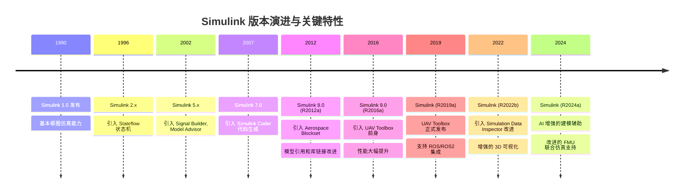
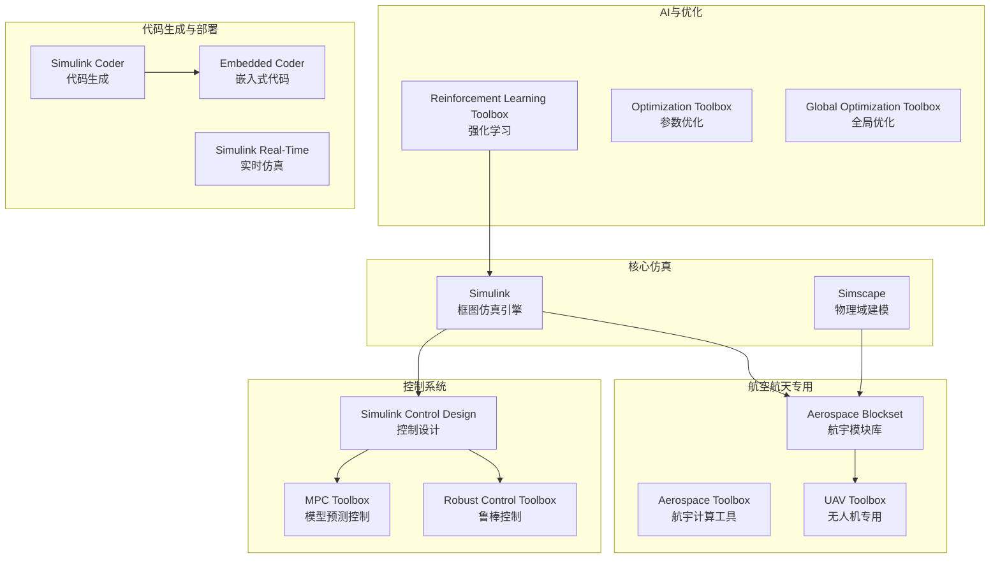
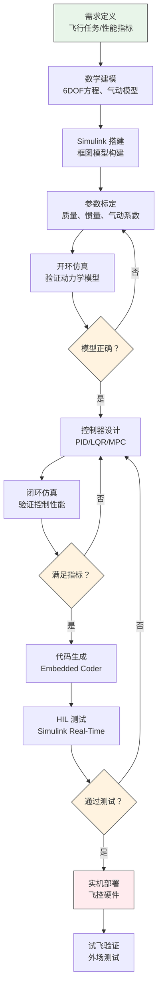

# Simulink 平台概览

> 预计阅读：25 分钟 | 前置知识：MATLAB 基础操作

---

## 1. 什么是 Simulink

**Simulink 是 MathWorks 公司开发的基于框图的多域仿真和模型设计平台。** 它是 MATLAB 的扩展，允许用户通过图形化拖拽模块和连线的方式构建动态系统模型，无需编写大量代码即可进行系统级仿真。

核心特征：

| 特征 | 说明 |
|------|------|
| **图形化建模** | 用方块（Block）和连线（Signal Line）表示系统结构 |
| **多域仿真** | 同一模型中混合机械、电气、液压、控制等子系统 |
| **时间驱动求解** | 基于微分方程的数值积分，支持变步长/定步长 |
| **层次化建模** | 子系统（Subsystem）支持模块化和复用 |
| **代码生成** | Embedded Coder 可从模型自动生成 C/C++ 代码 |
| **与 MATLAB 紧密集成** | 模型参数可来自 MATLAB 工作区，结果可回传分析 |

---

## 2. Simulink 发展历程

---

## 3. 核心能力详解

| 能力 | 说明 | UAV 仿真中的应用 |
|------|------|-----------------|
| **模型基础设计 (MBD)** | 从需求到代码的完整工作流 | 用模型驱动飞控软件开发 |
| **自动代码生成** | 将模型转换为嵌入式 C 代码 | 直接部署到飞控硬件 |
| **多域物理建模** | Simscape 支持机械/电气/流体联合仿真 | 电机+螺旋桨+机体耦合 |
| **控制系统设计** | PID 调参、频率响应分析、LQR/MPC 设计 | 飞控算法开发和验证 |
| **3D 可视化** | Unreal Engine / FlightGear 集成 | 实时观察飞行姿态 |
| **测试与验证** | Test Manager, 覆盖率分析 | 满足 DO-178C 认证要求 |
| **并行仿真** | parsim() 支持批量并行仿真 | 蒙特卡洛分析、参数扫描 |

---

## 4. Simulink vs 其他仿真工具

| 对比维度 | Simulink | Modelica (OpenModelica) | Gazebo | JSBSim | X-Plane |
|---------|----------|------------------------|--------|--------|---------|
| **建模方式** | 框图式（信号流） | 方程式（声明式） | 插件式（物理引擎） | 配置文件+XML | 内置气动模型 |
| **多域仿真** | 优秀（Simscape） | 优秀（原生多域） | 一般（侧重机器人） | 仅飞行动力学 | 仅飞行动力学 |
| **控制设计** | 内置工具箱 | 需外部工具 | 需 ROS 集成 | 无 | 无 |
| **代码生成** | 内置 Embedded Coder | 有限支持 | 无 | 无 | 无 |
| **实时仿真** | Simulink Real-Time | 需第三方 | 支持 | 支持 | 支持 |
| **3D 可视化** | 需 Unreal/FlightGear | 需第三方 | 内置（OGRE） | 需 FlightGear | 内置 |
| **学习曲线** | 中等 | 较陡 | 较陡 | 平缓 | 平缓 |
| **费用** | 商业许可（贵） | 开源免费 | 开源免费 | 开源免费 | 商业许可 |
| **社区生态** | 非常丰富 | 欧洲较强 | ROS 生态 | 较小 | 航空爱好者社区 |
| **学术支持** | 学术版免费/优惠 | 完全免费 | 完全免费 | 完全免费 | 学术折扣 |
| **适用场景** | 系统级仿真+控制 | 物理系统建模 | 机器人+感知 | 飞行动力学 | 飞行训练 |

**选择建议：**

| 你的需求 | 推荐工具 |
|---------|---------|
| 需要完整的控制设计+仿真+代码生成 | **Simulink** |
| 需要开源的多物理域建模 | **OpenModelica** |
| 需要视觉/激光雷达等感知仿真 | **Gazebo** |
| 只需要基本的飞行动力学 | **JSBSim** |
| 需要逼真的飞行视觉体验 | **X-Plane** |

---

## 5. UAV 相关工具箱生态

### 5.1 工具箱总览

### 5.2 各工具箱详解

#### Aerospace Blockset

| 项目 | 内容 |
|------|------|
| **简介** | 提供航空航天领域专用的 Simulink 模块库 |
| **关键模块** | 6DOF 方程模块、大气模型（ISA）、重力模型、风模型 |
| **UAV 价值** | 直接使用预置的 6DOF 模块，无需从零推导方程 |
| **典型使用** | 拖拽 `Six Degrees of Freedom` 模块搭建飞行动力学模型 |

#### Aerospace Toolbox

| 项目 | 内容 |
|------|------|
| **简介** | 提供航空航天计算和分析的 MATLAB 函数 |
| **关键功能** | 坐标系转换、大气属性计算、飞行性能分析 |
| **UAV 价值** | 快速计算标准大气参数、坐标变换矩阵 |
| **典型使用** | `atmosisa()` 函数获取某高度的大气密度和温度 |

#### UAV Toolbox

| 项目 | 内容 |
|------|------|
| **简介** | 专为无人机开发设计的工具箱 |
| **关键功能** | 路径规划（RRT*、Dubins）、参考追踪、Mission 模板 |
| **UAV 价值** | 提供从规划到控制的完整 UAV 开发流程 |
| **典型使用** | 使用 `uavDubinsConnection` 规划 Dubins 路径 |

#### Simscape

| 项目 | 内容 |
|------|------|
| **简介** | 基于物理网络方法的多物理域建模环境 |
| **关键模块** | 机械、电气、流体、热力学模块库 |
| **UAV 价值** | 精确建模电机、ESC、电池等物理系统 |
| **典型使用** | 用 Simscape Electrical 建模无刷电机 |

#### Simulink Control Design

| 项目 | 内容 |
|------|------|
| **简介** | Simulink 模型的线性化和控制设计工具 |
| **关键功能** | 模型线性化、波特图绘制、PID 自动调参 |
| **UAV 价值** | 从非线性仿真模型提取线性模型，用于控制设计 |
| **典型使用** | `linearize()` 函数在平衡点处线性化 UAV 模型 |

#### MPC Toolbox

| 项目 | 内容 |
|------|------|
| **简介** | 模型预测控制器设计和仿真工具 |
| **关键功能** | MPC 控制器设计、约束处理、显式 MPC |
| **UAV 价值** | 设计考虑输入/状态约束的先进控制器 |
| **典型使用** | 用 `mpc()` 创建 MPC 控制器，设定推力约束 |

#### Reinforcement Learning Toolbox

| 项目 | 内容 |
|------|------|
| **简介** | 基于强化学习的控制器设计工具 |
| **关键功能** | DQN、PPO、SAC、DDPG 等算法，Simulink 集成 |
| **UAV 价值** | 训练端到端的飞行控制策略，处理复杂非线性 |
| **典型使用** | 创建 RL Agent 模块，通过试错学习控制策略 |

---

## 6. UAV 仿真工作流

| 阶段 | 工具/方法 | 产出物 | 预计时间 |
|------|----------|--------|---------|
| 需求定义 | 任务分析、性能指标文档 | 需求规格 | 1-2 周 |
| 数学建模 | 手推方程、参考文献 | 动力学方程 | 1-2 周 |
| Simulink 搭建 | 框图建模、子系统封装 | .slx 模型文件 | 2-3 周 |
| 参数标定 | 实验测量、文献查询 | 参数表 | 1-2 周 |
| 开环仿真 | 运行模型、对比分析 | 仿真数据 | 1 周 |
| 控制器设计 | MATLAB 工具箱、手调 | 控制器参数 | 2-4 周 |
| 闭环仿真 | 运行闭环模型 | 性能评估报告 | 1-2 周 |
| 代码生成 | Embedded Coder | C 代码 | 1 周 |
| HIL 测试 | Speedgoat/dSPACE | 测试报告 | 2-3 周 |
| 实机部署 | 飞控硬件集成 | 可飞产品 | 2-4 周 |

---

## 7. Simulink 界面快速导航

| 界面元素 | 位置 | 功能 | 快捷键 |
|---------|------|------|--------|
| **Library Browser** | 左侧或独立窗口 | 浏览所有可用模块库 | Ctrl+Shift+L |
| **模型窗口** | 中央 | 搭建和编辑模型 | - |
| **工具栏** | 顶部 | 运行、停止、步进仿真 | - |
| **Configuration Parameters** | 模型菜单 | 设置求解器、步长等 | Ctrl+E |
| **Model Explorer** | 左侧 | 浏览模型层次结构 | Ctrl+H |
| **Scope** | 模型内 | 查看信号波形 | 双击模块 |
| **Data Inspector** | 底部 | 对比多次仿真结果 | 独立窗口 |

**最常用模块速查：**

| 模块名 | 所在库 | 功能 |
|--------|--------|------|
| Gain | Simulink > Math Operations | 信号乘以常数 |
| Integrator | Simulink > Continuous | 积分运算 |
| Sum | Simulink > Math Operations | 信号加减 |
| From Workspace | Simulink > Sources | 从 MATLAB 工作区读数据 |
| To Workspace | Simulink > Sinks | 将数据写回工作区 |
| Scope | Simulink > Sinks | 示波器显示 |
| Transfer Fcn | Simulink > Continuous | 传递函数 |
| State-Space | Simulink > Continuous | 状态空间模型 |
| Bus Creator | Simulink > Signal Routing | 信号打包 |
| Subsystem | Simulink > Ports & Subsystems | 创建子系统 |

---

## 8. 许可与学术访问

| 许可类型 | 费用 | 包含工具箱 | 获取方式 |
|---------|------|----------|---------|
| **个人版** | 约 $2,000-5,000/年 | 基础 MATLAB + Simulink | MathWorks 官网购买 |
| **学术版** | 约 $500-1,500/年 | 基础 + 部分工具箱 | 通过学校购买 |
| **学生版** | 约 $50-100/年 | 与学术版类似 | 学校邮箱注册 |
| **校园版** | 学校统一采购 | 全部工具箱 | 联系学校 IT 部门 |
| **试用版** | 免费 30 天 | 全部功能 | MathWorks 官网申请 |

**免费替代方案：**

| 方案 | 说明 | 局限性 |
|------|------|--------|
| MATLAB Online | 浏览器访问，学生可用 | 性能有限，部分工具箱缺失 |
| GNU Octave | 开源 MATLAB 替代品 | 不支持 Simulink |
| Scilab + Xcos | 开源替代方案 | 生态和文档不如 MATLAB |
| Python + SciPy | 纯代码仿真 | 无图形化建模，需自写求解器 |

---

## 思考题

1. Simulink 的"框图建模"与传统"代码建模"（如 Python 写 ODE 求解器）相比，各有什么优势和劣势？

2. 根据工具箱总览，如果你想实现一个带路径规划的多旋翼仿真，至少需要哪些工具箱？

3. 对比表中 Simulink 和 Gazebo 的差异，如果你的任务是"视觉避障+飞行控制"，应该选择哪个工具？为什么？

4. UAV 仿真工作流中，为什么需要在"开环仿真"之后才开始"控制器设计"？如果直接做闭环仿真会有什么问题？

5. 你所在学校或单位是否有 MATLAB 学术许可？如果没有，你会如何规划学习方案？

参考答案

1. 框图建模的优势：(1) 直观可视化系统结构，信号流向一目了然；(2) 模块化设计，子系统可复用；(3) 内置求解器管理，无需手动选择积分方法；(4) 与控制设计工具无缝集成。劣势：(1) 商业许可费用高；(2) 大型模型可能运行较慢；(3) 模型文件为专有格式，版本管理不便。代码建模的优势：(1) 灵活性高，可实现任意算法；(2) 开源免费；(3) 易于版本控制（Git）；(4) 便于批量化处理。劣势：(1) 可视化差，复杂系统难以直观理解；(2) 需要手动管理求解器；(3) 调试不如框图直观。

2. 最少需要：Simulink（核心仿真）、Aerospace Blockset（6DOF 动力学）、UAV Toolbox（路径规划）、Simulink Control Design（控制设计）。如果需要精确的电机模型，还需 Simscape Electrical。如果需要 MPC 控制，还需 MPC Toolbox。

3. 应选择 Gazebo。原因：(1) Gazebo 原生支持相机、激光雷达等传感器仿真，适合视觉避障；(2) 与 ROS/ROS2 深度集成，可方便地接入各种视觉算法（如 SLAM、目标检测）；(3) Simulink 虽然功能强大，但其 3D 可视化和传感器仿真能力相对较弱（需要 Unreal Engine 集成，配置复杂）。最佳方案是 Gazebo 做感知仿真，Simulink 做控制仿真，通过 ROS 桥接。

4. 开环仿真的目的是验证动力学模型本身的正确性——在没有控制器干预的情况下，给定输入（如阶跃推力），模型的响应是否符合物理直觉。如果直接做闭环仿真，控制器可能会掩盖模型中的错误。例如，如果质量参数设置错误，PID 控制器会通过调整推力来补偿，表面上看起来控制正常，但实际上模型是错误的。这种错误在开环仿真中会立即暴露（悬停时无人机会缓慢上升或下降）。

5. 略。建议通过学校图书馆、IT 部门或 MathWorks 教育计划查询。如果确实没有，可考虑：(1) 使用 MATLAB Online（部分功能免费）；(2) 购买学生版（约 $50/年）；(3) 使用 OpenModelica + Python 作为替代方案学习核心概念，未来有 MATLAB 许可时再迁移。

