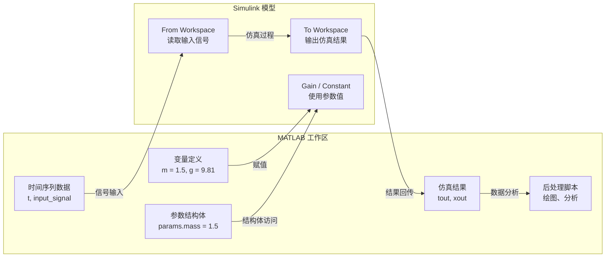

# MATLAB 与 Simulink 协同

> 预计阅读：20 分钟 | 前置知识：MATLAB 基础操作、Simulink 基本概念

---

## 1. MATLAB 与 Simulink 的关系

MATLAB 和 Simulink 是 MathWorks 产品的两大核心组件，它们既独立又紧密协作：

| 维度 | MATLAB | Simulink |
|------|--------|----------|
| **核心功能** | 数值计算、数据分析、脚本编程 | 图形化建模、动态系统仿真 |
| **工作方式** | 命令行 / 脚本 (.m 文件) | 框图 (.slx 文件) |
| **数据类型** | 矩阵、数组、表、结构体 | 信号（时间序列）、参数、状态 |
| **执行模式** | 顺序执行 | 基于时间步的连续/离散仿真 |
| **典型用途** | 数据处理、算法原型、后处理 | 系统建模、控制仿真、代码生成 |

**关键点：** Simulink 不能独立运行，它依赖 MATLAB 引擎。打开 Simulink 时，MATLAB 必须在后台运行。

---

## 2. 数据流：MATLAB 工作区与 Simulink 模型



---

## 3. 传递参数的三种方式

### 3.1 From Workspace / To Workspace 模块

这是最直接的方式，通过专用模块在 MATLAB 工作区和 Simulink 模型之间传递数据。

| 模块 | 方向 | 数据格式 | 典型用途 |
|------|------|---------|---------|
| **From Workspace** | MATLAB → Simulink | `[t, u]` 矩阵或 timeseries | 输入参考信号、风扰数据 |
| **To Workspace** | Simulink → MATLAB | 同上 | 保存仿真状态、输出数据 |
| **From File** | 文件 → Simulink | .mat 文件 | 大量预定义输入数据 |
| **To File** | Simulink → 文件 | .mat 文件 | 长时间仿真数据存储 |

**示例代码：**

```matlab
% 在 MATLAB 工作区定义输入信号
t = (0:0.01:10)';                    % 时间向量
u = sin(t);                          % 正弦输入信号
input_data = [t, u];                 % 组合为 [时间, 值] 矩阵

% 运行仿真（模型中包含 From Workspace 模块）
sim('my_uav_model');

% 从工作区读取结果（模型中包含 To Workspace 模块）
figure;
plot(tout, yout);
xlabel('时间 (s)'); ylabel('输出');
title('仿真结果');
```

### 3.2 基础工作区 vs 模型工作区

| 工作区类型 | 存储位置 | 生命周期 | 访问方式 | 适用场景 |
|-----------|---------|---------|---------|---------|
| **基础工作区 (Base)** | MATLAB 主窗口 | MATLAB 会话期间 | 直接访问 | 共享参数、仿真输入输出 |
| **模型工作区 (Model)** | 模型文件内部 | 模型打开期间 | Model Explorer | 模型专属参数，避免污染全局 |

```matlab
% 基础工作区：直接赋值
mass = 1.5;          % 模型中的 Gain 模块可直接使用变量名 'mass'

% 模型工作区：通过代码操作
mwl = get_param('my_model', 'ModelWorkspace');
assignin(mwl, 'mass', 1.5);  % 写入模型工作区
```

### 3.3 使用结构体组织参数

推荐使用结构体将所有参数组织在一起，便于管理和传递：

```matlab
% 定义无人机参数结构体
uav_params.mass = 1.5;              % 质量 (kg)
uav_params.Jxx = 0.0023;            % 滚转惯量 (kg·m²)
uav_params.Jyy = 0.0023;            % 俯仰惯量 (kg·m²)
uav_params.Jzz = 0.0046;            % 偏航惯量 (kg·m²)
uav_params.arm_length = 0.225;      % 机臂长度 (m)
uav_params.Ct = 1.105e-5;           % 推力系数
uav_params.Cq = 1.367e-7;           % 扭矩系数

% 在 Simulink 中通过结构体访问
% uav_params.mass, uav_params.Jxx 等
```

---

## 4. 脚本驱动仿真

### 4.1 sim() 命令

`sim()` 是 MATLAB 中运行 Simulink 仿真的核心命令：

```matlab
% 基本用法
out = sim('my_uav_model');

% 带参数的用法
out = sim('my_uav_model', ...
    'StopTime', '20', ...           % 仿真停止时间
    'Solver', 'ode45', ...          % 求解器
    'MaxStep', '0.01');             % 最大步长

% 访问输出信号
tout = out.tout;                    % 时间向量
yout = out.yout;                    % 输出数据
```

### 4.2 sim() 参数配置表

| 参数名 | 说明 | 示例值 | 推荐设置 |
|--------|------|--------|---------|
| `StopTime` | 仿真结束时间 | `'10'` | 根据任务需求设置 |
| `Solver` | ODE 求解器 | `'ode45'` | 非刚性系统用 ode45，刚性用 ode15s |
| `MaxStep` | 最大步长 | `'0.01'` | 一般取仿真时间的 1/100-1/1000 |
| `RelTol` | 相对误差容限 | `'1e-3'` | 精度要求高时用 1e-6 |
| `AbsTol` | 绝对误差容限 | `'1e-6'` | 同上 |
| `InitialState` | 初始状态向量 | `'[0;0;0;...]'` | 非零初始条件仿真 |

### 4.3 parsim() 批量并行仿真

当需要进行参数扫描或蒙特卡洛分析时，`parsim()` 可以显著加速：

```matlab
% 创建仿真输入对象数组
mass_values = [1.0, 1.5, 2.0, 2.5];  % 不同质量
num_sims = length(mass_values);

for i = 1:num_sims
    simIn(i) = Simulink.SimulationInput('my_uav_model');
    simIn(i) = simIn(i).setVariable('mass', mass_values(i));
    simIn(i) = simIn(i).setModelParameter('StopTime', '10');
end

% 并行运行所有仿真
simOut = parsim(simIn, ...
    'ShowSimulationManager', 'on', ...
    'UseFastRestart', 'on');

% 分析结果
figure;
for i = 1:num_sims
    plot(simOut(i).tout, simOut(i).yout, 'DisplayName', ...
        sprintf('m=%.1f kg', mass_values(i)));
    hold on;
end
legend; xlabel('时间 (s)'); ylabel('高度 (m)');
title('不同质量下的悬停响应');
```

| 方法 | 适用场景 | 并行能力 | 速度提升 |
|------|---------|---------|---------|
| `sim()` 循环 | 单次或少量仿真 | 无 | 基准 |
| `parsim()` | 参数扫描、蒙特卡洛 | 自动并行（多核） | 2-8 倍（取决于核心数） |
| `parsim()` + Fast Restart | 仅改变参数的批量仿真 | 并行 + 模型不重新编译 | 5-20 倍 |

---

## 5. 后处理：MATLAB 分析 Simulink 输出

仿真完成后，MATLAB 强大的数据处理和可视化能力用于分析结果：

```matlab
%% 基本绘图
out = sim('my_uav_model');
figure('Name', 'UAV 仿真结果');

subplot(2,2,1);
plot(out.tout, out.position);     % 位置响应
title('位置'); xlabel('时间 (s)'); ylabel('m');
legend('x', 'y', 'z');

subplot(2,2,2);
plot(out.tout, out.velocity);     % 速度响应
title('速度'); xlabel('时间 (s)'); ylabel('m/s');

subplot(2,2,3);
plot(out.tout, rad2deg(out.attitude));  % 姿态角
title('姿态角'); xlabel('时间 (s)'); ylabel('deg');
legend('\phi', '\theta', '\psi');

subplot(2,2,4);
plot(out.tout, out.motor_cmd);    % 电机指令
title('电机指令'); xlabel('时间 (s)'); ylabel('PWM');

%% 性能指标计算
step_info = stepinfo(out.position(:,3), out.tout);
fprintf('上升时间: %.2f s\n', step_info.RiseTime);
fprintf('超调量: %.1f%%\n', step_info.Overshoot);
fprintf('调节时间: %.2f s\n', step_info.SettlingTime);
fprintf('稳态误差: %.4f m\n', abs(1 - out.position(end,3)));
```

**常用分析函数：**

| 函数 | 用途 | 示例 |
|------|------|------|
| `stepinfo()` | 计算阶跃响应指标 | 上升时间、超调量、调节时间 |
| `fft()` | 频谱分析 | 分析振动频率成分 |
| `rms()` | 均方根计算 | 评估控制信号的平滑度 |
| `max()` / `min()` | 极值计算 | 检查是否超出物理限制 |
| `mean()` | 均值计算 | 计算平均功耗 |
| `std()` | 标准差 | 评估仿真不确定性 |
| `corrcoef()` | 相关系数 | 分析变量间相关性 |

---

## 6. MATLAB Function 模块

Simulink 中的 MATLAB Function 模块允许在框图模型中直接编写 MATLAB 代码，这是实现自定义算法的常用方式：

| 特性 | 说明 |
|------|------|
| **代码支持** | 支持大部分 MATLAB 语法和内置函数 |
| **代码生成** | 支持通过 Embedded Coder 生成 C 代码 |
| **输入输出** | 通过端口定义输入/输出信号 |
| **数据类型** | 需要明确指定数据类型（代码生成要求） |

**示例：实现一个简单的风扰模型**

```matlab
function wind_force = wind_disturbance(t, V_wind_nom, turbulence_intensity)
% 风扰模型：稳态风 + Dryden 素流
% 输入：t - 时间, V_wind_nom - 平均风速, turbulence_intensity - 素流强度
% 输出：wind_force - 风力 (N)

% 稳态风分量
V_steady = V_wind_nom;

% 简化的 Dryden 素流模型
sigma_w = turbulence_intensity * V_steady;
L_w = 175;  % 素流尺度 (m)
V_turb = sigma_w * sin(2*pi*0.5*t) * exp(-t/L_w);

% 总风速
V_wind = V_steady + V_turb;

% 简化的阻力模型
Cd = 0.3;   % 阻力系数
A = 0.05;   % 迎风面积 (m²)
rho = 1.225; % 空气密度 (kg/m³)
wind_force = 0.5 * rho * V_wind^2 * Cd * A;
end
```

---

## 7. 模型线性化

从非线性 Simulink 模型提取线性模型是控制设计的重要步骤：

```matlab
%% 方法一：使用 Simulink Control Design 工具箱
% 指定工作点
op = operpoint('my_uav_model');         % 获取当前工作点
io = getlinio('my_uav_model');          % 获取线性化 I/O 端口

% 在指定工作点线性化
sys_linear = linearize('my_uav_model', io, op);

% 查看线性化结果
figure;
bode(sys_linear);                       % 波特图
title('线性化模型频率响应');

% 提取状态空间矩阵
[A, B, C, D] = ssdata(sys_linear);
fprintf('状态矩阵 A:\n'); disp(A);
fprintf('输入矩阵 B:\n'); disp(B);

%% 方法二：手动线性化（数值方法）
% 在平衡点附近施加小扰动
delta_u = 0.001;  % 小扰动量
x0 = zeros(12,1); % 平衡状态
u0 = ones(4,1) * 9.81*1.5/4; % 平衡输入（悬停推力）

% 数值雅可比矩阵
for i = 1:12
    x_plus = x0; x_plus(i) = x_plus(i) + delta_u;
    x_minus = x0; x_minus(i) = x_minus(i) - delta_u;
    f_plus = uav_dynamics(0, x_plus, u0);
    f_minus = uav_dynamics(0, x_minus, u0);
    A_numerical(:, i) = (f_plus - f_minus) / (2 * delta_u);
end
```

---

## 8. 自动化示例

### 8.1 参数扫描

```matlab
%% 扫描机臂长度对悬停稳定性的影响
arm_lengths = 0.15:0.025:0.35;  % 机臂长度范围
stability_margin = zeros(size(arm_lengths));

for i = 1:length(arm_lengths)
    arm_length = arm_lengths(i);
    out = sim('my_uav_hover_model');

    % 计算稳定性裕度（简化示例）
    overshoot = stepinfo(out.attitude(:,1), out.tout).Overshoot;
    stability_margin(i) = 100 - overshoot;  % 越大越稳定
end

figure;
plot(arm_lengths*100, stability_margin, 'bo-', 'LineWidth', 2);
xlabel('机臂长度 (cm)'); ylabel('稳定性裕度 (%)');
title('机臂长度对悬停稳定性的影响');
grid on;
```

### 8.2 蒙特卡洛仿真

```matlab
%% 蒙特卡洛分析：评估参数不确定性对飞行性能的影响
num_trials = 100;
results = struct('max_tilt', zeros(num_trials,1), ...
                 'max_velocity', zeros(num_trials,1));

for i = 1:num_trials
    % 随机扰动参数（±10% 不确定性）
    mass = 1.5 * (1 + 0.1*randn);
    Ct = 1.105e-5 * (1 + 0.1*randn);
    Jxx = 0.0023 * (1 + 0.1*randn);

    % 运行仿真
    out = sim('my_uav_monte_carlo_model');

    % 记录关键指标
    results.max_tilt(i) = max(abs(out.attitude(:,1)));   % 最大滚转角
    results.max_velocity(i) = max(vecnorm(out.velocity')); % 最大速度
end

% 统计分析
fprintf('最大滚转角: %.2f ± %.2f deg\n', ...
    mean(rad2deg(results.max_tilt)), std(rad2deg(results.max_tilt)));
fprintf('最大速度: %.2f ± %.2f m/s\n', ...
    mean(results.max_velocity), std(results.max_velocity));
```

---

## 9. 项目组织最佳实践

| 最佳实践 | 说明 | 反面示例 |
|---------|------|---------|
| **参数集中管理** | 所有参数在一个 .m 脚本中定义 | 参数分散在各处，难以追踪 |
| **模型+脚本配套** | 每个 .slx 对应一个初始化 .m 脚本 | 手动在工作区输入参数 |
| **版本控制友好** | 使用 MATLAB Projects 管理项目 | 文件散落在多个目录 |
| **命名规范** | 采用一致的命名约定 | 变量名混乱无规律 |
| **注释充分** | 模型和代码都有清晰注释 | 无注释，无法理解逻辑 |
| **子系统封装** | 复杂功能封装为子系统 | 所有模块堆在一个层级 |

**推荐的目录结构：**

```
Simulink-UAV-Dynamics-Sim/
├── models/                  % Simulink 模型文件
│   ├── uav_6dof.slx        % 主动力学模型
│   ├── uav_hover.slx       % 悬停仿真模型
│   └── uav_mission.slx     % 任务仿真模型
├── scripts/                 % MATLAB 脚本
│   ├── init_params.m        % 参数初始化
│   ├── run_hover_sim.m      % 悬停仿真脚本
│   ├── post_process.m       % 后处理脚本
│   └── monte_carlo.m        % 蒙特卡洛分析
├── functions/               % 自定义函数
│   ├── wind_model.m         % 风扰模型
│   ├── aero_forces.m        % 气动力计算
│   └── motor_model.m        % 电机模型
├── data/                    % 数据文件
│   ├── flight_test.mat      % 试飞数据
│   └── aero_coefficients.csv % 气动系数
└── results/                 % 仿真结果
    ├── figures/             % 输出图片
    └── logs/                % 仿真日志
```

**初始化脚本示例：**

```matlab
%% init_params.m - 无人机仿真参数初始化
% 运行此脚本加载所有仿真参数到基础工作区
% 使用方法：在运行仿真前执行 >> run('scripts/init_params.m')

% 清空工作区（可选）
% clear; clc;

%% 物理参数
mass = 1.5;                    % 总质量 (kg)
g = 9.81;                      % 重力加速度 (m/s²)

%% 惯性参数
Jxx = 0.0023;                  % 滚转惯量 (kg·m²)
Jyy = 0.0023;                  % 俯仰惯量 (kg·m²)
Jzz = 0.0046;                  % 偏航惯量 (kg·m²)
J = diag([Jxx, Jyy, Jzz]);    % 惯性矩阵

%% 几何参数
arm_length = 0.225;            % 机臂长度 (m)
motor_angle = pi/4;            % 电机安装角 (rad)

%% 推进系统参数
Ct = 1.105e-5;                 % 推力系数
Cq = 1.367e-7;                 % 扭矩系数
motor_Kv = 920;                % 电机 Kv 值
prop_diameter = 0.24;          % 螺旋桨直径 (m)

%% 仿真参数
Ts = 0.001;                    % 仿真步长 (s)
T_sim = 20;                    % 仿真时长 (s)

%% 初始状态
x0 = zeros(12,1);             % 12 维初始状态向量

fprintf('参数初始化完成。\n');
fprintf('  质量: %.2f kg\n', mass);
fprintf('  机臂长度: %.3f m\n', arm_length);
fprintf('  仿真时长: %.1f s\n', T_sim);
```

---

## 思考题

1. 在 MATLAB 工作区定义的变量如何传递给 Simulink 模型使用？请列举至少三种方式并说明各自的适用场景。

2. `sim()` 和 `parsim()` 的主要区别是什么？在什么情况下应该使用 `parsim()`？

3. 为什么推荐使用结构体来组织无人机参数，而不是使用独立的变量（如 `mass = 1.5`、`Jxx = 0.0023`）？

4. MATLAB Function 模块和普通的 MATLAB 脚本有什么区别？在什么情况下应该使用 MATLAB Function 模块？

5. 模型线性化的目的是什么？为什么不能直接用非线性模型设计 LQR 或 MPC 控制器？

<details>
<summary>参考答案</summary>

1. 三种主要方式：(1) **直接变量名** -- 在工作区定义 `mass = 1.5`，模型中的 Gain 模块直接输入 `mass` 作为参数值，适用于简单参数；(2) **From Workspace 模块** -- 用 `[t, u]` 矩阵传递时间序列信号，适用于输入信号（如风扰、参考轨迹）；(3) **setVariable() 方法** -- 通过 `sim()` 或 `parsim()` 的参数传递，适用于脚本化仿真和参数扫描。推荐对参数使用方式1或结构体，对信号使用方式2，对批量仿真使用方式3。

2. `sim()` 串行运行单次仿真，每次调用都会重新初始化模型。`parsim()` 可以并行运行多个仿真实例（利用多核 CPU），且支持 Fast Restart 模式（跳过模型编译），适合参数扫描和蒙特卡洛分析。当需要运行 10 个以上不同参数配置的仿真时，`parsim()` 可节省大量时间。

3. 使用结构体的优势：(1) 避免基础工作区变量污染，所有参数都在 `uav_params.xxx` 下；(2) 参数分组清晰，便于管理和传递；(3) 可以方便地保存/加载整个参数集（`save('params.mat', 'uav_params')`）；(4) 多个模型可以使用不同的参数结构体而不冲突；(5) 函数传参只需传递一个结构体变量。

4. 区别：(1) MATLAB Function 模块嵌入在 Simulink 模型中，作为仿真的一部分执行；MATLAB 脚本在 MATLAB 工作区独立运行。(2) MATLAB Function 模块支持代码生成（可转为 C 代码），普通脚本不支持。(3) MATLAB Function 模块需要定义输入/输出端口和数据类型（代码生成要求），脚本无此限制。应使用 MATLAB Function 模块的场景：需要在仿真中实现自定义算法且未来可能需要代码生成。

5. 线性化的目的是将非线性系统在工作点附近近似为线性系统，从而使用成熟的线性控制理论（如 LQR、H-infinity、MPC）进行控制器设计。非线性模型无法直接用于 LQR 设计，因为 LQR 基于状态空间线性模型；对于 MPC，虽然可以使用非线性 MPC，但计算复杂度远高于线性 MPC。线性化提供了一种在工程精度范围内简化问题的方法，且线性控制器的稳定性分析有严格的理论保证。

</details>
