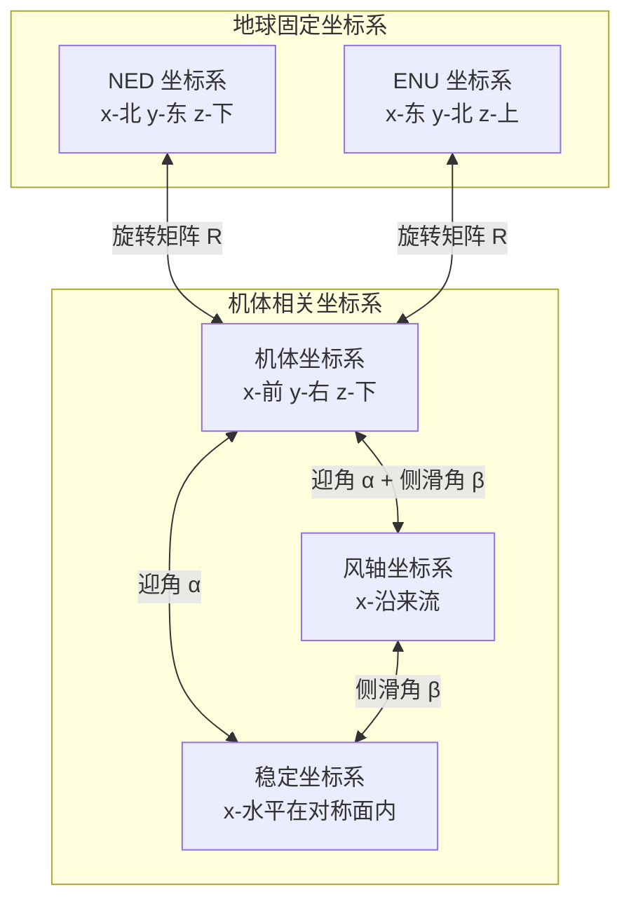
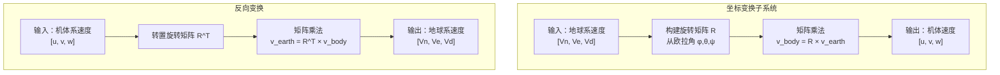

# 坐标系与参考框架

> 预计阅读：25 分钟 | 前置知识：线性代数基础（矩阵乘法）、大学物理（向量运算）

---

## 1. 为什么坐标系如此重要

无人机动力学的核心是描述"力如何产生运动"。但是，**力和运动都需要在特定的坐标系中才能被定量描述**。

举例说明：

| 物理量 | 在哪个坐标系中描述？ | 为什么？ |
|--------|-------------------|---------|
| 重力 | 地球坐标系 | 重力方向始终竖直向下（相对地面） |
| 推力 | 机体坐标系 | 推力方向随无人机姿态变化 |
| 位置 | 地球坐标系 | 位置是相对地面某点的 |
| 气动力 | 风轴坐标系 | 气动力与来流方向相关 |
| GPS 速度 | 地球坐标系 | GPS 给出的是地速 |

**如果不统一坐标系，所有计算都会出错。** 这就是为什么坐标系是学习动力学的第一步。

---

## 2. 常用坐标系总览

| 坐标系 | 英文名 | 原点位置 | 轴方向 | 主要用途 |
|--------|--------|---------|--------|---------|
| **NED** | North-East-Down | 地面某固定点 | x-北, y-东, z-下 | 位置、速度的参考基准 |
| **ENU** | East-North-Up | 地面某固定点 | x-东, y-北, z-上 | 地图、导航系统常用 |
| **机体坐标系** | Body Frame | 无人机质心 | x-前, y-右, z-下 | 描述机体受力和运动 |
| **风轴坐标系** | Wind Frame | 无人机质心 | x-沿来流方向 | 气动力分解 |
| **稳定坐标系** | Stability Frame | 无人机质心 | x-在对称面内水平 | 线性化气动分析 |



---

## 3. NED vs ENU 坐标系

这是两种最常用的地球固定坐标系，需要理解它们的区别和适用场景：

| 对比维度 | NED | ENU |
|---------|-----|-----|
| **x 轴** | 北 (North) | 东 (East) |
| **y 轴** | 东 (East) | 北 (North) |
| **z 轴** | 下 (Down) | 上 (Up) |
| **右手系** | 是 | 是 |
| **常用领域** | 航空航天、惯性导航 | 地图、GPS、ROS |
| **高度表示** | z 为负值表示上升 | z 为正值表示上升 |
| **常用软件** | PX4, ArduPilot, Simulink | ROS, Google Earth, 地图 |
| **欧拉角定义** | 偏航从北顺时针为正 | 偏航从东逆时针为正 |

**为什么多旋翼常用 NED？**

- NED 的 z 轴向下，与重力方向一致（重力在 NED 中为 [0, 0, mg]）
- 航空传统：飞行员习惯"向下看高度表"
- 与惯性导航系统（INS）的输出自然对应

**为什么 ROS/地图系统用 ENU？**

- ENU 的 z 轴向上，符合日常直觉（"向上飞"对应 z 增加）
- 地图投影（如 UTM）自然使用东-北-上方向
- ROS 的 `nav_msgs/Odometry` 消息使用 ENU

**NED 与 ENU 的转换：**

$$\mathbf{p}_{ENU} = \begin{bmatrix} 0 & 1 & 0 \\ 1 & 0 & 0 \\ 0 & 0 & -1 \end{bmatrix} \mathbf{p}_{NED}$$

---

## 4. 机体坐标系 (Body Frame)

机体坐标系固定在无人机上，随无人机一起运动和旋转：

| 轴 | 方向 | 物理意义 | 正方向 |
|----|------|---------|--------|
| **x_b** | 机头方向（前） | 纵轴 (Longitudinal) | 指向飞行方向 |
| **y_b** | 右翼方向 | 横轴 (Lateral) | 指向右侧 |
| **z_b** | 垂直向下 | 法向轴 (Normal) | 指向机腹 |

**机体坐标系中的力和力矩：**

| 物理量 | 符号 | 分量 | 含义 |
|--------|------|------|------|
| 合力 | $\mathbf{F}_b$ | $[F_x, F_y, F_z]^T$ | 体轴系下的合力 |
| 合力矩 | $\mathbf{M}_b$ | $[L, M, N]^T$ | 滚转、俯仰、偏航力矩 |
| 速度 | $\mathbf{V}_b$ | $[u, v, w]^T$ | 体轴系下的速度分量 |
| 角速度 | $\mathbf{\omega}_b$ | $[p, q, r]^T$ | 绕各轴的角速度 |

**常见混淆点：**

| 问题 | 解释 |
|------|------|
| z 轴为什么向下？ | 航空传统，与 NED 坐标系一致，完成右手系 |
| 速度 u 的正方向？ | 向前（机头方向）为正 |
| 角速度 p 的正方向？ | 按右手定则，绕 x 轴旋转，右翼向下为正 |
| 力矩 L 的正方向？ | 与角速度 p 一致，右翼向下滚转为正 |

---

## 5. 风轴坐标系 (Wind Frame)

风轴坐标系用于分解气动力，其 x 轴始终沿来流（相对风速）方向：

| 轴 | 方向 | 与体轴的关系 |
|----|------|------------|
| **x_w** | 沿来流方向 | 由迎角 α 和侧滑角 β 从体轴旋转得到 |
| **y_w** | 垂直于来流，在水平面内 | - |
| **z_w** | 垂直于来流，在对称面内 | - |

**迎角 (Angle of Attack, α) 和侧滑角 (Sideslip Angle, β)：**

| 角度 | 符号 | 定义 | 物理意义 |
|------|------|------|---------|
| **迎角** | α (alpha) | 来流与机体 x 轴的夹角 | 描述气流"从下方吹来"的程度 |
| **侧滑角** | β (beta) | 来流偏离机体对称面的角度 | 描述气流"从侧面吹来"的程度 |

```
        来流方向 V
           ↗
          / α (迎角)
         /
    ----→ x_b (机体x轴)
```

**风轴中的气动力：**

| 力 | 风轴表示 | 说明 |
|----|---------|------|
| 阻力 D | $-x_w$ 方向 | 与来流方向相反 |
| 升力 L | $-z_w$ 方向 | 垂直于来流方向 |
| 侧力 Y | $y_w$ 方向 | 垂直于来流和对称面 |

---

## 6. 欧拉角 (Euler Angles)

欧拉角是描述无人机姿态最直观的方式，使用三个角度来描述机体坐标系相对于地球坐标系的旋转：

| 角度 | 符号 | 英文 | 旋转轴 | 物理含义 | 正方向 |
|------|------|------|--------|---------|--------|
| **滚转角** | φ (phi) | Roll | x 轴 | 机身左右倾斜 | 右翼向下为正 |
| **俯仰角** | θ (theta) | Pitch | y 轴 | 机头上下抬 | 机头向上为正 |
| **偏航角** | ψ (psi) | Yaw | z 轴 | 机头左右转 | 从北顺时针为正（NED） |

**直观理解：**

```
         Roll (φ)              Pitch (θ)             Yaw (ψ)
      绕 x 轴旋转           绕 y 轴旋转            绕 z 轴旋转

      右翼 ↓                机头 ↑                 机头 →
     ┌──┐                  ┌──┐                   ┌──┐
     │  │← 左倾            │↗│← 抬头              │→│← 右转
     └──┘                  └──┘                   └──┘
      左翼 ↑                机尾 ↓
```

---

## 7. 旋转矩阵与变换

### 7.1 单轴旋转矩阵

绕各轴的旋转矩阵：

$$R_x(\phi) = \begin{bmatrix} 1 & 0 & 0 \\ 0 & \cos\phi & \sin\phi \\ 0 & -\sin\phi & \cos\phi \end{bmatrix}$$

$$R_y(\theta) = \begin{bmatrix} \cos\theta & 0 & -\sin\theta \\ 0 & 1 & 0 \\ \sin\theta & 0 & \cos\theta \end{bmatrix}$$

$$R_z(\psi) = \begin{bmatrix} \cos\psi & \sin\psi & 0 \\ -\sin\psi & \cos\psi & 0 \\ 0 & 0 & 1 \end{bmatrix}$$

### 7.2 旋转顺序：ZYX 约定

**从地球坐标系到机体坐标系** 的变换，按 ZYX 顺序旋转（也称 Tait-Bryan 角或航空欧拉角）：

$$\mathbf{R}_{e}^{b} = R_x(\phi) \cdot R_y(\theta) \cdot R_z(\psi)$$

展开后的完整变换矩阵：

$$\mathbf{R}_{e}^{b} = \begin{bmatrix} \cos\theta\cos\psi & \cos\theta\sin\psi & -\sin\theta \\ \sin\phi\sin\theta\cos\psi - \cos\phi\sin\psi & \sin\phi\sin\theta\sin\psi + \cos\phi\cos\psi & \sin\phi\cos\theta \\ \cos\phi\sin\theta\cos\psi + \sin\phi\sin\psi & \cos\phi\sin\theta\sin\psi - \sin\phi\cos\psi & \cos\phi\cos\theta \end{bmatrix}$$

**使用方法：**

```matlab
% 给定欧拉角
phi = 0.1;    % 滚转角 (rad)
theta = 0.05; % 俯仰角 (rad)
psi = 0;      % 偏航角 (rad)

% 计算旋转矩阵（地球→机体）
R = eul2rotm([psi, theta, phi], 'ZYX');  % MATLAB 函数

% 将地球坐标系中的向量转换到机体坐标系
v_earth = [10; 0; 0];  % 在地球系中向北 10 m/s
v_body = R * v_earth;  % 转换到机体坐标系

% 逆变换（机体→地球）
R_inv = R';  % 旋转矩阵的转置 = 逆（正交矩阵性质）
v_earth_recovered = R_inv * v_body;
```

### 7.3 ZYX vs ZXY 约定

| 约定 | 旋转顺序 | 常用领域 | 注意事项 |
|------|---------|---------|---------|
| **ZYX** | 先偏航，再俯仰，最后滚转 | 航空航天（最常用） | PX4, ArduPilot, Simulink 默认 |
| **ZXY** | 先偏航，再滚转，最后俯仰 | 部分机器人系统 | ROS 中某些 IMU 使用 |
| **XYZ** | 先滚转，再俯仰，最后偏航 | 部分工业机器人 | - |

**重要：不同的旋转顺序会导致完全不同的结果！** 使用时必须确认约定一致。

---

## 8. 常见陷阱

### 8.1 万向锁 (Gimbal Lock)

当俯仰角 θ = ±90° 时，旋转矩阵出现奇异性，滚转和偏航轴重合，丢失一个自由度：

| 情况 | 说明 | 影响 |
|------|------|------|
| θ = 90° | 机头垂直向上 | φ 和 ψ 无法区分，姿态估计失效 |
| θ = -90° | 机头垂直向下 | 同上 |
| θ 接近 ±90° | 接近奇异点 | 欧拉角变化剧烈，数值不稳定 |

**解决方案：**

| 方案 | 适用场景 | 说明 |
|------|---------|------|
| **四元数 (Quaternion)** | 飞控软件内部表示 | 4 个参数表示姿态，无奇异性 |
| **旋转矩阵** | 数学推导和仿真 | 9 个参数，无奇异性但有冗余 |
| **限制俯仰角** | 工程约束 | 多旋翼通常不会达到 ±90° |

### 8.2 角度缠绕 (Angle Wrapping)

偏航角 ψ 的范围通常是 [-π, π] 或 [0, 2π]，当角度超过范围时会发生"缠绕"：

| 问题 | 示例 | 后果 |
|------|------|------|
| 角度跳变 | 179° → -179°（实际只转了 2°） | 控制器误判为 358° 的误差 |
| 积分累积 | 角度持续增大，不断缠绕 | 无法正确跟踪航向 |

**解决方案：**

```matlab
% 角度归一化到 [-π, π]
function angle = normalize_angle(angle)
    angle = mod(angle + pi, 2*pi) - pi;
end

% 计算两个角度的最小差值
function diff = angle_diff(a, b)
    diff = normalize_angle(a - b);
end
```

### 8.3 坐标系混用

这是初学者最常犯的错误：

| 错误类型 | 示例 | 正确做法 |
|---------|------|---------|
| 混合 NED 和 ENU | GPS 数据（ENU）直接用于 NED 动力学方程 | 统一到同一坐标系 |
| 地球力用于机体方程 | 重力 [0,0,mg] 直接加入体轴方程 | 先将重力转换到体轴系 |
| 忘记转置旋转矩阵 | 用 R 而非 R^T 做体轴→地轴变换 | 确认变换方向 |

---

## 9. Simulink 实现

### 9.1 坐标变换模块

| 模块名 | 所在库 | 功能 |
|--------|--------|------|
| **Rotation Angles to Direction Cosine Matrix** | Aerospace > Axes Transformations | 欧拉角 → 旋转矩阵 |
| **Direction Cosine Matrix to Rotation Angles** | Aerospace > Axes Transformations | 旋转矩阵 → 欧拉角 |
| **Quaternion to Rotation Angles** | Aerospace > Axes Transformations | 四元数 → 欧拉角 |
| **Rotation Angles to Quaternion** | Aerospace > Axes Transformations | 欧拉角 → 四元数 |
| **Flat Earth to LLA** | Aerospace > Transformations | 平面坐标 → 经纬度高度 |

### 9.2 Simulink 坐标变换示例

```
[信号流示意]

   NED 速度信号                    机体速度信号
   [Vn; Ve; Vd] ──→ [旋转矩阵模块 R] ──→ [u; v; w]
                      (欧拉角输入 φ,θ,ψ)

   机体推力信号                    NED 推力信号
   [0; 0; -T] ──→ [旋转矩阵模块 R^T] ──→ [Fx; Fy; Fz]
                   (欧拉角输入 φ,θ,ψ)
```

```matlab
%% MATLAB 函数实现坐标变换（可用于 MATLAB Function 模块）
function v_body = earth_to_body(v_earth, phi, theta, psi)
% 将地球坐标系向量转换到机体坐标系
% 输入：v_earth - 地球系向量 [3x1]
%       phi, theta, psi - 欧拉角 (rad)
% 输出：v_body - 机体系向量 [3x1]

    R = [cos(theta)*cos(psi), cos(theta)*sin(psi), -sin(theta);
         sin(phi)*sin(theta)*cos(psi)-cos(phi)*sin(psi), ...
         sin(phi)*sin(theta)*sin(psi)+cos(phi)*cos(psi), ...
         sin(phi)*cos(theta);
         cos(phi)*sin(theta)*cos(psi)+sin(phi)*sin(psi), ...
         cos(phi)*sin(theta)*sin(psi)-sin(phi)*cos(psi), ...
         cos(phi)*cos(theta)];

    v_body = R * v_earth;
end
```

### 9.3 推荐的 Simulink 模型结构



---

## 10. 快速参考卡

| 变换 | 公式 | MATLAB 函数 |
|------|------|------------|
| 欧拉角 → 旋转矩阵 | R = Rx(φ)Ry(θ)Rz(ψ) | `eul2rotm([ψ,θ,φ], 'ZYX')` |
| 旋转矩阵 → 欧拉角 | 反三角函数 | `rotm2eul(R, 'ZYX')` |
| 欧拉角 → 四元数 | 三角函数组合 | `eul2quat([ψ,θ,φ], 'ZYX')` |
| 四元数 → 欧拉角 | 反三角函数 | `quat2eul(q, 'ZYX')` |
| 四元数 → 旋转矩阵 | 公式展开 | `quat2rotm(q)` |
| 旋转矩阵 → 四元数 | Shepperd 方法 | `rotm2quat(R)` |
| 地球力 → 机体力 | F_b = R × F_e | 自定义函数 |
| 机体力 → 地球力 | F_e = R^T × F_b | 自定义函数 |
| 体轴速度 → 地轴速度 | V_e = R^T × V_b | 自定义函数 |

---

## 思考题

1. 为什么航空航天领域普遍使用 NED 坐标系而不是 ENU？如果将 ROS 中的 ENU 数据用于 NED 动力学模型，应该如何转换？

2. 给定欧拉角 φ=10°, θ=5°, ψ=30°，手动计算旋转矩阵的第一行（提示：使用 ZYX 约定）。然后用 MATLAB 的 `eul2rotm()` 验证你的结果。

3. 万向锁问题的本质是什么？为什么四元数可以避免这个问题？在实际飞控软件中，姿态通常用什么表示？

4. 如果在 Simulink 模型中，重力信号被错误地定义为 `[0; 0; -9.81]`（而不是 `[0; 0; 9.81]`，假设使用 NED 坐标系），会对仿真结果产生什么影响？

5. 在风轴坐标系中，阻力和升力的方向分别是什么？当迎角 α 增大时，阻力和升力如何变化？

<details>
<summary>参考答案</summary>

1. NED 的优势：(1) z 轴向下与重力方向一致，重力向量为 [0,0,mg]，简化方程；(2) 符合航空传统，飞行员直觉"向下看高度表"；(3) 与惯性导航系统的输出自然对应。ENU 转 NED 的方法：Vn = Ve_enu_y, Ve = Ve_enu_x, Vd = -Ve_enu_z，即交换 x/y 并取反 z。或者用矩阵 [0,1,0; 1,0,0; 0,0,-1] 左乘 ENU 向量。

2. φ=10°, θ=5°, ψ=30°。第一行：R(1,1) = cos(5°)×cos(30°) ≈ 0.9962×0.8660 ≈ 0.8627; R(1,2) = cos(5°)×sin(30°) ≈ 0.9962×0.5 ≈ 0.4981; R(1,3) = -sin(5°) ≈ -0.0872。MATLAB 验证：`R = eul2rotm([30,5,10]*pi/180, 'ZYX'); disp(R(1,:))`。

3. 万向锁的本质是欧拉角参数化在某些姿态下失去一个自由度（三个旋转轴中有两个重合）。四元数用 4 个参数表示 3 个自由度的旋转，始终是满秩的，没有奇异性。实际飞控软件（如 PX4）内部使用四元数表示姿态，只在需要人类可读的显示时才转换为欧拉角。

4. 在 NED 坐标系中，重力应为 [0, 0, +mg]（z 轴向下，重力方向为正 z）。如果错误定义为 [0, 0, -mg]，则重力方向变成向上，无人机在仿真中会"飞向天空"而不是悬停。本质上是重力方向反了。

5. 在风轴中：阻力 D 沿 -x_w 方向（与来流方向相反），升力 L 沿 -z_w 方向（垂直于来流向上）。当迎角 α 增大时：升力先增大后减小（超过临界迎角后失速），阻力持续增大（与 α 的平方大致成正比）。在小迎角范围内，升力近似线性增长：L ≈ qS(C_Lα × α)，其中 q 为动压，S 为参考面积，C_Lα 为升力线斜率。

</details>
