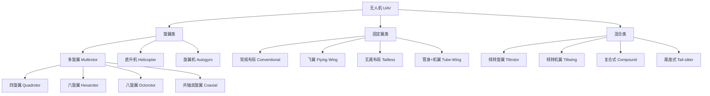
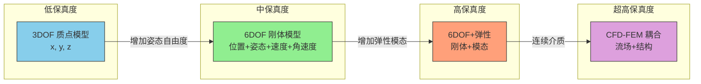
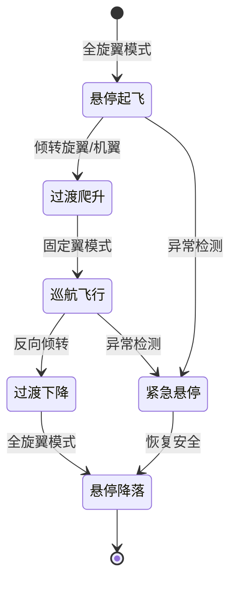
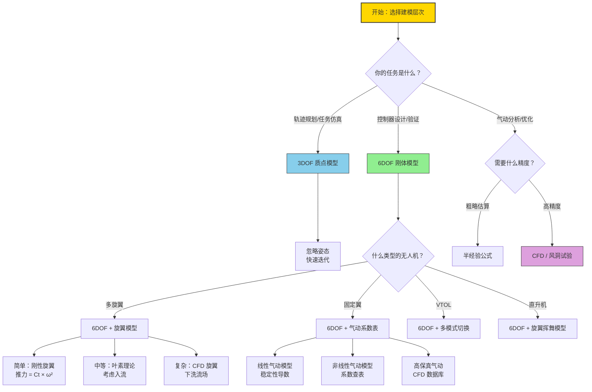

# 无人机分类与建模层次

> 预计阅读：20 分钟 | 前置知识：基本物理概念

---

## 1. 无人机分类总览

无人机（UAV, Unmanned Aerial Vehicle）按气动构型和飞行方式可分为以下主要类别：

| 类型 | 英文名 | 典型构型 | 升力来源 | 飞行方式 |
|------|--------|---------|---------|---------|
| **多旋翼** | Multirotor | 四/六/八旋翼 | 旋翼推力 | 垂直起降、悬停 |
| **固定翼** | Fixed-Wing | 常规布局/飞翼 | 机翼升力 | 前飞、滑翔 |
| **直升机** | Helicopter | 单旋翼+尾桨 | 主旋翼 | 垂直起降、前飞 |
| **VTOL** | Vertical Take-Off and Landing | 倾转旋翼/倾转机翼 | 旋翼+机翼 | 垂起+前飞 |
| **飞艇/气球** | Airship/Balloon | 囊体 | 浮力 | 低速巡航 |



---

## 2. 各类型详细对比

| 对比维度 | 多旋翼 | 固定翼 | 直升机 | VTOL |
|---------|--------|--------|--------|------|
| **起降方式** | 垂直起降 | 需跑道/弹射 | 垂直起降 | 垂直起降 |
| **悬停能力** | 优秀 | 无 | 优秀 | 优秀 |
| **巡航效率** | 低（~15 min 飞行时间） | 高（>1 h 飞行时间） | 中等 | 高 |
| **最大速度** | ~20 m/s | ~30-50 m/s | ~30 m/s | ~30 m/s |
| **载荷能力** | 低（<5 kg） | 中高（1-50 kg） | 中（1-20 kg） | 中高 |
| **机械复杂度** | 低 | 低 | 高（主旋翼+尾桨） | 高（倾转机构） |
| **控制复杂度** | 中 | 低 | 高 | 高 |
| **抗风能力** | 弱 | 强 | 中 | 中 |
| **成本** | 低 | 低-中 | 高 | 高 |
| **典型应用** | 航拍、巡检、室内 | 测绘、农业、物流 | 重载、救援 | 城市空中交通 |

### 2.1 多旋翼细分

| 配置 | 旋翼数 | 优点 | 缺点 | 典型平台 |
|------|--------|------|------|---------|
| **四旋翼 X 型** | 4 | 最简单、成本最低 | 冗余性差，一轴故障即坠毁 | DJI Mini, PX4 SITL |
| **四旋翼 H 型** | 4 | 机械结构简单 | 同上 | 部分竞速穿越机 |
| **六旋翼** | 6 | 单电机故障可安全降落 | 成本和重量增加 | DJI M600 |
| **八旋翼** | 8 | 双电机冗余，载荷大 | 成本高、效率低 | DJI M100 |
| **共轴双旋翼** | 2（同轴） | 紧凑，无反扭矩 | 机械复杂，效率损失 | 部分小型无人机 |
| **共轴四旋翼** | 4（8桨） | 紧凑+冗余 | 机械复杂 | 部分工业无人机 |

### 2.2 固定翼细分

| 构型 | 特点 | 优点 | 缺点 | 典型应用 |
|------|------|------|------|---------|
| **常规布局** | 主翼+水平尾翼+垂直尾翼 | 稳定性好，设计成熟 | 阻力较大 | 通用 |
| **飞翼** | 无尾翼，翼身融合 | 低阻力、大内部空间 | 稳定性差，需飞控辅助 | 隐身侦察 |
| **无尾布局** | 主翼+ V 尾 | 阻力小 | 控制耦合 | 长航时 |
| **管身+机翼** | 简单矩形翼+管状机身 | 结构简单、廉价 | 气动效率低 | 教学/爱好者 |

---

## 3. 建模保真度层次

根据物理细节的程度，无人机动力学建模可分为多个层次：

| 层次 | 自由度 | 核心假设 | 状态变量 | 适用场景 |
|------|--------|---------|---------|---------|
| **3DOF（质点模型）** | 3 | 无人机为质点，忽略姿态 | 位置 [x,y,z] | 轨迹规划、任务级仿真 |
| **6DOF（刚体模型）** | 6 | 刚体假设，忽略弹性变形 | 位置+速度+姿态+角速度 | 控制器设计、标准仿真 |
| **6DOF+气动弹性** | 6+ | 考虑机翼/旋翼弹性变形 | 6DOF + 模态坐标 | 大展弦比固定翼 |
| **CFD-FEM 耦合** | 连续体 | 求解 N-S 方程 + 结构力学 | 流场 + 结构场 | 气动细节分析 |



### 3.1 3DOF 质点模型

| 项目 | 内容 |
|------|------|
| **核心假设** | 无人机是一个有质量的点，忽略所有转动 |
| **状态变量** | 位置 [x, y, z] 和速度 [Vx, Vy, Vz] |
| **输入** | 推力方向和大小、阻力模型 |
| **优势** | 极简，计算快速，适合大规模仿真 |
| **局限** | 无法模拟姿态控制、无法评估控制品质 |
| **典型用途** | 轨迹规划验证、能耗估算、任务级仿真 |

```matlab
% 3DOF 质点模型示例
% 状态：x = [x, y, z, Vx, Vy, Vz]
% 假设：推力方向可以任意控制

function dxdt = point_mass_3dof(t, x, m, g, T, alpha, beta)
    % T - 推力大小
    % alpha - 推力仰角
    % beta - 推力方位角

    % 推力分量（地球坐标系）
    Fx = T * cos(alpha) * cos(beta);
    Fy = T * cos(alpha) * sin(beta);
    Fz = T * sin(alpha) - m*g;

    % 加速度
    ax = Fx / m;
    ay = Fy / m;
    az = Fz / m;

    dxdt = [x(4); x(5); x(6); ax; ay; az];
end
```

### 3.2 6DOF 刚体模型

| 项目 | 内容 |
|------|------|
| **核心假设** | 刚体假设，质量和惯量恒定，忽略弹性变形 |
| **状态变量** | 12 个：位置(3) + 速度(3) + 姿态(3) + 角速度(3) |
| **输入** | 各旋翼推力/力矩（多旋翼）或舵面偏角+推力（固定翼） |
| **优势** | 足够精确，计算量适中，适合控制设计 |
| **局限** | 忽略气动弹性、旋翼-机身耦合等高阶效应 |
| **典型用途** | 控制器设计与验证、标准仿真任务 |

**6DOF 模型的核心方程（牛顿-欧拉方程）：**

$$m\dot{\mathbf{V}} + \mathbf{\omega} \times (m\mathbf{V}) = \mathbf{F}$$

$$\mathbf{J}\dot{\mathbf{\omega}} + \mathbf{\omega} \times (\mathbf{J}\mathbf{\omega}) = \mathbf{M}$$

其中：
- $m$ -- 质量
- $\mathbf{V}$ -- 机体速度向量 [u, v, w]
- $\mathbf{\omega}$ -- 角速度向量 [p, q, r]
- $\mathbf{J}$ -- 惯性矩阵
- $\mathbf{F}$ -- 合力
- $\mathbf{M}$ -- 合力矩

### 3.3 建模层次选择指南

| 你的任务 | 推荐层次 | 理由 |
|---------|---------|------|
| 轨迹规划初步验证 | 3DOF | 只需位置和速度，计算快 |
| PID 控制器参数整定 | 6DOF | 需要姿态动力学 |
| 高保真控制验证 | 6DOF | 标准选择 |
| 旋翼气动干扰分析 | 6DOF+旋翼模型 | 需要旋翼下洗流效应 |
| 机翼颤振分析 | 6DOF+弹性 | 需要结构动力学 |
| 螺旋桨设计优化 | CFD | 需要详细的流场信息 |

---

## 4. 多旋翼建模的复杂性

### 4.1 旋翼数量对建模的影响

| 旋翼数 | 力/力矩通道 | 独立控制量 | 冗余性 | 模型复杂度 |
|--------|-----------|----------|--------|----------|
| 4 | 4（推力+3力矩） | 4 个电机转速 | 无 | 低 |
| 6 | 4（推力+3力矩） | 6 个电机转速 | 有（过驱动） | 中 |
| 8 | 4（推力+3力矩） | 8 个电机转速 | 有（过驱动） | 中 |
| 共轴 4 | 4 | 8 个电机转速 | 有 | 高（需考虑上下旋翼干扰） |

**四旋翼的控制分配矩阵：**

```
电机布局（X型）：
     前
  M1   M2       M1: 逆时针, M2: 顺时针
    \ /          M3: 顺时针, M4: 逆时针
     X
    / \
  M3   M4
     后

[Tx]   [ Ct    Ct    Ct    Ct ] [ω1²]
[Ty] = [ -dCt  dCt   dCt  -dCt] [ω2²]
[Tz]   [ -Cq   Cq   -Cq   Cq ] [ω3²]
[L ]   [ ...                    ] [ω4²]
```

### 4.2 旋翼间气动干扰

| 干扰类型 | 说明 | 影响 | 建模方法 |
|---------|------|------|---------|
| **下洗流效应** | 上游旋翼的下洗流影响下游旋翼 | 推力损失 5-15% | 入流系数修正 |
| **地面效应** | 接近地面时推力增加 | 悬停效率提升 | 经验修正公式 |
| **旋翼间涡流** | 旋翼尾涡相互干扰 | 推力波动 | 需 CFD 或经验模型 |
| **机身阻力** | 旋翼气流吹过机身 | 增加阻力 | 风洞试验或 CFD |

---

## 5. 固定翼建模特点

### 5.1 气动力建模

| 气动力/力矩 | 依赖参数 | 典型表达式 |
|------------|---------|----------|
| 升力 L | 迎角 α、速度 V、舵面偏角 δe | $L = qSC_L(\alpha, \delta_e)$ |
| 阻力 D | 迎角 α、速度 V | $D = qSC_D(\alpha)$ |
| 侧力 Y | 侧滑角 β、方向舵偏角 δr | $Y = qSC_Y(\beta, \delta_r)$ |
| 滚转力矩 L | β、副翼偏角 δa、滚转角速度 p | $L = qSbC_l(\beta, \delta_a, p)$ |
| 俯仰力矩 M | α、δe、俯仰角速度 q | $M = qS\bar{c}C_m(\alpha, \delta_e, q)$ |
| 偏航力矩 N | β、δr、偏航角速度 r | $N = qSbC_n(\beta, \delta_r, r)$ |

其中 $q = \frac{1}{2}\rho V^2$ 为动压，$S$ 为参考面积，$b$ 为翼展，$\bar{c}$ 为平均气动弦长。

### 5.2 推进系统建模

| 组件 | 输入 | 输出 | 模型复杂度 |
|------|------|------|----------|
| 电池 | 电压/容量 | 放电曲线 | 低（等效电路模型） |
| 电子调速器 (ESC) | PWM 指令 | 电机电压 | 低（一阶延迟） |
| 无刷电机 (BLDC) | 电压 | 转速、扭矩 | 中（电气+机械方程） |
| 螺旋桨 | 转速、来流速度 | 推力、扭矩 | 中（叶素理论或查表） |

---

## 6. VTOL 建模挑战

VTOL（垂直起降）无人机结合了多旋翼和固定翼的特点，建模面临独特的挑战：

| 挑战 | 说明 | 建模方法 |
|------|------|---------|
| **模式切换** | 多旋翼模式 ↔ 固定翼模式的过渡 | 定义切换逻辑+过渡状态 |
| **倾转机构** | 旋翼/机翼的倾转动力学 | 增加倾转自由度 |
| **气动耦合** | 倾转过程中旋翼和机翼的气动干扰 | 分段气动模型+插值 |
| **控制分配** | 模式切换时控制策略的平滑过渡 | 混合控制分配策略 |
| **效率优化** | 何时切换模式最节能 | 能量最优轨迹规划 |

**VTOL 飞行阶段：**



---

## 7. 模型选择决策流程



---

## 8. 开源参考资源

以下 GitHub 仓库提供了优秀的无人机仿真参考实现：

| 仓库 | 类型 | 语言/平台 | 特点 | 链接 |
|------|------|----------|------|------|
| **dch33/Quad-Sim** | 多旋翼 | MATLAB/Simulink | 经典四旋翼仿真，文档完善，适合入门 | github.com/dch33/Quad-Sim |
| **chengji253/fixed-wing-UAV** | 固定翼 | MATLAB/Simulink | 固定翼动力学仿真，含气动模型 | github.com/chengji253 |
| **LADAC** | 全类型 | MATLAB/Simulink | 德国斯图加特大学开发，支持多旋翼/固定翼/VTOL | github.com/LADAC-VTOL |
| **PX4-SITL** | 全类型 | Gazebo/jMAVSim | PX4 软件在环仿真，工程级 | px4.io |
| **ArduPilot SITL** | 全类型 | Gazebo/FlightGear | ArduPilot 软件在环仿真 | ardupilot.org |
| **RotorS** | 多旋翼 | ROS/Gazebo | ETH 苏黎世的多旋翼仿真包 | github.com/ethz-asl/rotors_simulator |
| **TUMsim** | 多旋翼 | ROS/Gazebo | 慕尼黑工大的仿真环境 | github.com/tum-vision |

**各资源适用阶段：**

| 学习阶段 | 推荐资源 | 理由 |
|---------|---------|------|
| 初学 Simulink 建模 | dch33/Quad-Sim | 代码清晰，文档详细，模型简单 |
| 固定翼学习 | chengji253 | 专注固定翼，气动模型完整 |
| 综合学习 | LADAC | 覆盖多种构型，学术级质量 |
| 工程开发 | PX4-SITL / ArduPilot SITL | 工业级，可直接对接飞控 |
| ROS 集成 | RotorS | 与 ROS 深度集成 |

---

## 思考题

1. 如果你需要设计一个用于农田喷洒的无人机，应该选择哪种构型？为什么？需要什么层次的仿真模型？

2. 四旋翼和六旋翼在控制分配上有什么区别？六旋翼的"过驱动"特性在什么情况下有优势？

3. 3DOF 模型和 6DOF 模型的核心区别是什么？在什么情况下 3DOF 模型就足够了？

4. VTOL 无人机在过渡模式（从悬停到前飞）的建模中面临哪些挑战？为什么不能简单地将多旋翼模型和固定翼模型拼接？

5. 选择一个你感兴趣的开源仿真仓库，简述其建模层次、适用场景和学习价值。

<details>
<summary>参考答案</summary>

1. 农田喷洒推荐选择 **多旋翼**（六旋翼或八旋翼）或 **VTOL**。理由：(1) 农田通常没有跑道，需要垂直起降能力；(2) 喷洒作业需要低速悬停能力；(3) 六旋翼/八旋翼提供冗余安全性；(4) 如果作业面积大，VTOL 可提供更长航时。仿真模型推荐 6DOF 刚体模型，如果关注喷洒均匀性，还需加入风场和雾滴扩散模型。

2. 四旋翼有 4 个控制输入（4 个电机转速）对应 4 个控制输出（推力+3 力矩），是"恰好驱动"系统。六旋翼有 6 个控制输入对应 4 个输出，是"过驱动"系统。过驱动的优势：(1) 单电机故障时，可通过重新分配剩余 5 个电机实现安全降落；(2) 控制分配有冗余度，可以优化能耗或减少饱和；(3) 推力能力更强。代价是增加了控制分配的复杂度。

3. 核心区别：3DOF 模型只描述位置和速度（6 个状态变量），将无人机视为质点；6DOF 模型还描述姿态和角速度（12 个状态变量），将无人机视为刚体。3DOF 足够的场景：(1) 轨迹规划的初步验证——只需确认路径可行性；(2) 能耗估算——只需知道推力和距离；(3) 大规模多机仿真——简化模型降低计算量；(4) 任务级仿真——关注"能否到达目的地"而非"如何控制姿态"。

4. VTOL 过渡模式建模的挑战：(1) 气动特性随倾转角度连续变化，需要用多个倾转角度的气动数据插值；(2) 旋翼下洗流吹过机翼，产生额外的升力/阻力，耦合效应复杂；(3) 倾转机构有动力学延迟，不能假设瞬时完成；(4) 过渡过程中可能经过不稳定区域（如某些迎角范围）；(5) 控制策略需要平滑切换，避免突变导致的不稳定。简单拼接的问题：多旋翼模型假设推力方向固定（垂直），固定翼模型假设前飞速度足够大，两者在过渡区域都不准确。

5. 略。根据个人兴趣选择仓库并分析。建议参考 LADAC（综合性强）或 dch33/Quad-Sim（入门友好）。

</details>
