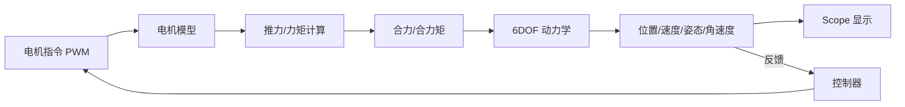

# 搭建第一个 6DOF 模型

> 预计阅读：25 分钟 | 前置知识：Simulink 基础操作、线性代数基础、刚体动力学概念

本文将手把手带你从零搭建一个四旋翼无人机的六自由度 (6DOF) 动力学模型。这是 UAV 仿真的核心基础，完成后你将拥有一个可以模拟悬停、机动飞行的完整动力学仿真框架。

---

## 1. 模型整体架构

在动手之前，先了解整个模型的信号流：



简化为四个核心子系统：

```
┌──────────────┐    ┌──────────────┐    ┌──────────────┐    ┌──────────────┐
│  电机模型     │───>│  推力/力矩    │───>│  6DOF 动力学  │───>│  状态输出     │
│ Motor Model  │    │ Force & Torq │    │  Dynamics    │    │ State Output │
└──────────────┘    └──────────────┘    └──────────────┘    └──────────────┘
       ▲                                                            │
       └────────────────────────────────────────────────────────────┘
                              控制回路(后续添加)
```

---

## 2. Step 1: 创建模型文件并设置求解器

### 2.1 新建模型

```matlab
% MATLAB 命令行
>> new_system('quadrotor_6dof')
>> open_system('quadrotor_6dof')
>> save_system('quadrotor_6dof')
```

### 2.2 配置求解器

打开 `Ctrl+E`，设置如下：

| 参数 | 设置值 | 理由 |
|------|--------|------|
| Type | Fixed-step | 为后续代码生成做准备 |
| Solver | ode4 (Runge-Kutta) | 4阶精度，计算效率高 |
| Fixed-step size | 0.001 | 1kHz，满足 UAV 动态响应 |
| Start time | 0 | — |
| Stop time | 10 | 10 秒悬停仿真 |

### 2.3 创建参数脚本

在 MATLAB 中创建 `quadrotor_params.m`，集中管理所有参数：

```matlab
% quadrotor_params.m - 四旋翼物理参数
% 质量与惯量
params.m = 1.5;              % 总质量 (kg)
params.g = 9.81;             % 重力加速度 (m/s^2)
params.Ixx = 0.0216;         % X轴转动惯量 (kg·m^2)
params.Iyy = 0.0216;         % Y轴转动惯量 (kg·m^2)
params.Izz = 0.0405;         % Z轴转动惯量 (kg·m^2)

% 电机与螺旋桨
params.Ct = 1.48e-07;        % 推力系数 (N/(rpm)^2)
params.Cm = 2.31e-09;        % 力矩系数 (N·m/(rpm)^2)
params.arm_length = 0.225;   % 机臂长度 (m)
params.Jm = 3.357e-06;       % 电机转子惯量 (kg·m^2)
params.max_rpm = 10000;      % 电机最大转速 (rpm)

% 初始状态
params.pos0 = [0; 0; 10];    % 初始位置 (m) [x;y;z]
params.vel0 = [0; 0; 0];     % 初始速度 (m/s)
params.euler0 = [0; 0; 0];   % 初始欧拉角 (rad) [phi;theta;psi]
params.omega0 = [0; 0; 0];   % 初始角速度 (rad/s)
```

在模型的 `PreLoadFcn` 回调中加载参数：
`Model Properties > Callbacks > PreLoadFcn` 输入 `quadrotor_params`。

---

## 3. Step 2: 构建力计算子系统

### 3.1 子系统输入输出

```
输入:
  - motor_rpm (4x1): 四个电机转速 (rpm)
  - euler     (3x1): 当前欧拉角 [phi; theta; psi] (rad)

输出:
  - F_total   (3x1): 机体坐标系下的合力 (N)
  - M_total   (3x1): 机体坐标系下的合力矩 (N·m)
```

### 3.2 推力计算

每个电机产生的推力：`T_i = Ct * rpm_i^2`

```
               ┌─────────────┐
  rpm_1 ──────>│  Gain (Ct)  │──> [乘法] ──> T1
               │  然后平方    │
               └─────────────┘

  实现方式: Product 模块 (u.*u) + Gain 模块 (Ct)
```

四个电机推力合成到机体坐标系：

```
  T_total = T1 + T2 + T3 + T4     (沿机体 Z 轴向上)

  ┌─────────────────────────────────┐
  │         Force Subsystem          │
  │                                 │
  │  rpm_1 ──>[Ct*rpm^2]──> T1 ─┐  │
  │  rpm_2 ──>[Ct*rpm^2]──> T2 ─┤  │
  │  rpm_3 ──>[Ct*rpm^2]──> T3 ─┼──>[Sum]──> T_body = [0; 0; T_total]
  │  rpm_4 ──>[Ct*rpm^2]──> T4 ─┘  │
  │                                 │
  │  重力分解到机体坐标系:           │
  │  euler ──>[旋转矩阵R']──> G_body│
  │                                 │
  │  F_total = T_body + G_body      │
  └─────────────────────────────────┘
```

### 3.3 重力分解

重力在地球坐标系中为 `[0; 0; -m*g]`，需要通过旋转矩阵转换到机体坐标系：

```
G_body = R_body_to_earth' * [0; 0; -m*g]

其中 R_body_to_earth 是从机体坐标系到地球坐标系的旋转矩阵
R' (转置) 即为从地球到机体的旋转矩阵
```

### 3.4 力矩计算

四旋翼的力矩来源于推力差和反扭矩：

```
力矩计算公式:
  Mx = L * Ct * (rpm4^2 - rpm2^2)        # 滚转力矩
  My = L * Ct * (rpm3^2 - rpm1^2)        # 俯仰力矩
  Mz = Cm * (rpm1^2 - rpm2^2 + rpm3^2 - rpm4^2)  # 偏航力矩

  其中 L = arm_length

电机布局 (俯视图):

        前方 (机头)
         ↑ Y
         |
   M3(CCW) ──── M4(CW)      M1: 右前, 顺时针
         |        |           M2: 左后, 顺时针
   ──────+──────────→ X      M3: 左前, 逆时针
         |        |           M4: 右后, 逆时针
   M2(CW) ──── M1(CCW)
         |
```

---

## 4. Step 3: 构建旋转矩阵子系统

### 4.1 从欧拉角到旋转矩阵

使用 ZYX 欧拉角约定 (偏航-俯仰-滚转)：

```
R_body_to_earth = Rz(psi) * Ry(theta) * Rx(phi)

展开:

R = [cos(θ)cos(ψ),  sin(φ)sin(θ)cos(ψ)-cos(φ)sin(ψ),  cos(φ)sin(θ)cos(ψ)+sin(φ)sin(ψ)]
    [cos(θ)sin(ψ),  sin(φ)sin(θ)sin(ψ)+cos(φ)cos(ψ),  cos(φ)sin(θ)sin(ψ)-sin(φ)cos(ψ)]
    [-sin(θ),       sin(φ)cos(θ),                        cos(φ)cos(θ)                      ]
```

### 4.2 Simulink 实现

```
┌───────────────────────────────────────────────────────┐
│              Rotation Matrix Subsystem                 │
│                                                       │
│  phi ──>[sin]──> sφ    phi ──>[cos]──> cφ             │
│  theta──>[sin]──> sθ    theta──>[cos]──> cθ           │
│  psi ──>[sin]──> sψ    psi ──>[cos]──> cψ            │
│                                                       │
│  R(1,1) = cθ*cψ                                      │
│  R(1,2) = sφ*sθ*cψ - cφ*sψ    使用 Gain 和 Sum 模块  │
│  R(1,3) = cφ*sθ*cψ + sφ*sψ    组合计算               │
│  ...                                                  │
│                                                       │
│  输出: R (3x3 矩阵，通过 Mux 组合)                     │
└───────────────────────────────────────────────────────┘
```

> **实用技巧**：将 3x3 矩阵用 `Reshape` 模块转为 9x1 向量传递，用 `Mux` 合并，在使用端用 `Reshape` 恢复为 3x3。

---

## 5. Step 4: 构建平移动力学

### 5.1 牛顿第二定律

```
地球坐标系下的平移方程:

  v_dot = (1/m) * R * F_body + [0; 0; -g]

  其中:
    v_dot: 地球坐标系下的加速度 (3x1)
    R:     机体到地球的旋转矩阵 (3x3)
    F_body: 机体坐标系下的合力 (3x1)
    g:     重力加速度
```

### 5.2 积分链

```
  F_total ──>[÷m]──>[×R]──>[+g_vec]──>[Integrator]──> velocity
                                                  │
                                                  └──>[Integrator]──> position
```

### 5.3 Simulink 实现

```
┌─────────────────────────────────────────────────────────────┐
│              Translational Dynamics Subsystem                 │
│                                                             │
│  输入: F_body (3x1), R (3x3), 初始位置/速度                  │
│  输出: position (3x1), velocity (3x1)                       │
│                                                             │
│  F_body ──>[Gain 1/m]──> a_body                             │
│  a_body ──>[Matrix Multiply (R*a_body)]──> a_earth          │
│  a_earth ──>[Sum + gravity]──> a_total                      │
│  a_total ──>[Integrator (IC=vel0)]──> velocity              │
│  velocity ──>[Integrator (IC=pos0)]──> position             │
│                                                             │
│  注意: Integrator 的 Initial Condition 设置为 params.vel0    │
│        和 params.pos0                                        │
└─────────────────────────────────────────────────────────────┘
```

---

## 6. Step 5: 构建旋转动力学

### 6.1 欧拉方程

刚体旋转动力学的欧拉方程：

```
  I * omega_dot + omega × (I * omega) = M_total

  解出角加速度:
  omega_dot = I^(-1) * (M_total - omega × (I * omega))

  其中:
    I: 惯量矩阵 (对角阵)
    omega: 机体角速度 [p; q; r] (3x1)
    M_total: 机体合力矩 (3x1)
    ×: 叉积
```

### 6.2 展开形式

```
  p_dot = (Mx - (Izz - Iyy)*q*r) / Ixx
  q_dot = (My - (Ixx - Izz)*p*r) / Iyy
  r_dot = (Mz - (Iyy - Ixx)*p*q) / Izz
```

### 6.3 Simulink 实现

```
┌──────────────────────────────────────────────────────────────┐
│              Rotational Dynamics Subsystem                     │
│                                                              │
│  输入: M_total (3x1), omega (3x1)                             │
│  输出: omega (3x1), euler (3x1)                               │
│                                                              │
│  ┌─── 欧拉方程 ───────────────────────────────────────────┐  │
│  │  q,r ──>[乘]──>(Izz-Iyy)*q*r ──>[Sum减]──>[÷Ixx]──>p_dot│ │
│  │  p,r ──>[乘]──>(Ixx-Izz)*p*r ──>[Sum减]──>[÷Iyy]──>q_dot│ │
│  │  p,q ──>[乘]──>(Iyy-Ixx)*p*q ──>[Sum减]──>[÷Izz]──>r_dot│ │
│  └────────────────────────────────────────────────────────┘  │
│                                                              │
│  p_dot,q_dot,r_dot ──>[Integrator]──> p,q,r (omega)          │
│                                                              │
│  ┌─── 运动学方程 ─────────────────────────────────────────┐  │
│  │  欧拉角速率与角速度的关系:                               │  │
│  │  [φ̇]   [1   sinφ*tanθ   cosφ*tanθ] [p]                │  │
│  │  [θ̇] = [0   cosφ        -sinφ     ] [q]                │  │
│  │  [ψ̇]   [0   sinφ/cosθ   cosφ/cosθ] [r]                │  │
│  └────────────────────────────────────────────────────────┘  │
│                                                              │
│  euler_dot ──>[Integrator]──> euler (phi, theta, psi)        │
└──────────────────────────────────────────────────────────────┘
```

> **注意**：欧拉角运动学方程在 `theta = ±90°` 时存在万向锁 (Gimbal Lock) 奇异点。对于四旋翼正常飞行，俯仰角通常不会达到 90°，所以欧拉角方法是可行的。如果需要大机动飞行，建议使用四元数表示（见后续章节）。

---

## 7. Step 6: 构建电机模型子系统

### 7.1 一阶电机模型

电机从接收 PWM 指令到输出实际转速，存在响应延迟，用一阶惯性环节近似：

```
  rpm_actual = rpm_cmd / (tau*s + 1)

  其中 tau 是电机时间常数，典型值 0.02~0.05 s
```

### 7.2 Simulink 实现

```
┌───────────────────────────────────────────────┐
│           Motor Model Subsystem                │
│                                               │
│  输入: pwm_cmd (4x1, 0~1000)                  │
│  输出: motor_rpm (4x1)                        │
│                                               │
│  pwm_cmd ──>[Gain (映射到rpm)]──> rpm_cmd     │
│  rpm_cmd ──>[Transfer Fcn 1/(τs+1)]──> rpm   │
│                                               │
│  饱和限制: rpm 限制在 [0, max_rpm]             │
│  rpm ──>[Saturation]──> motor_rpm             │
│                                               │
│  增益映射: Gain = max_rpm / 1000              │
│  例如: 10000 / 1000 = 10                      │
└───────────────────────────────────────────────┘
```

### 7.3 电机参数

| 参数 | 符号 | 典型值 | 单位 |
|------|------|--------|------|
| 推力系数 | Ct | 1.48e-07 | N/(rpm)^2 |
| 力矩系数 | Cm | 2.31e-09 | N·m/(rpm)^2 |
| 时间常数 | tau | 0.03 | s |
| 最大转速 | max_rpm | 10000 | rpm |
| 转子惯量 | Jm | 3.357e-06 | kg·m^2 |
| 机臂长度 | L | 0.225 | m |

---

## 8. Step 7: 添加初始条件和参数

### 8.1 Integrator 初始条件配置

每个 Integrator 模块都需要设置初始条件：

| Integrator 位置 | 初始条件变量 | 说明 |
|----------------|-------------|------|
| 速度积分器 | `params.vel0` | 初始速度 [0;0;0] |
| 位置积分器 | `params.pos0` | 初始位置 [0;0;10] |
| 角速度积分器 | `params.omega0` | 初始角速度 [0;0;0] |
| 欧拉角积分器 | `params.euler0` | 初始姿态 [0;0;0] |

设置方法：双击 Integrator > Initial condition > 输入 `params.pos0` 等。

### 8.2 悬停测试的输入设置

悬停时，四个电机需要提供等于重力的总推力：

```matlab
% 计算悬停转速
T_hover = params.m * params.g;        % 1.5 * 9.81 = 14.715 N
T_per_motor = T_hover / 4;           % 3.679 N
rpm_hover = sqrt(T_per_motor / params.Ct);  % ≈ 4985 rpm
pwm_hover = rpm_hover * 1000 / params.max_rpm;  % ≈ 499
```

在模型输入端使用 `Constant` 模块设置 `pwm_hover`（四个电机相同）。

---

## 9. Step 8: 添加 Scope 可视化

### 9.1 关键观测信号

| 信号 | 维度 | 观测意义 |
|------|------|----------|
| 位置 position | 3x1 | x/y/z 轨迹，验证悬停稳定性 |
| 速度 velocity | 3x1 | 速度是否收敛到 0 |
| 欧拉角 euler | 3x1 | 姿态是否保持水平 |
| 角速度 omega | 3x1 | 角速率是否收敛 |
| 电机转速 rpm | 4x1 | 各电机工作状态 |

### 9.2 Scope 布局建议

```
模型输出:
  ├── Scope: Position  (3路: x, y, z)
  ├── Scope: Velocity  (3路: vx, vy, vz)
  ├── Scope: Attitude  (3路: phi, theta, psi)
  ├── Scope: Angular Rate (3路: p, q, r)
  └── Scope: Motor RPM (4路: rpm1~4)
```

同时使用 `To Workspace` 模块将数据保存到 MATLAB 工作区，便于后续绘图分析。

---

## 10. 完整模型信号流

将所有子系统连接起来，完整的信号流如下：

```
┌─────────────────────────────────────────────────────────────────────────┐
│                        quadrotor_6dof 完整模型                           │
│                                                                         │
│  Constant ──>┌──────────┐    ┌──────────┐    ┌──────────┐    ┌───────┐│
│   (PWM指令)   │ Motor    │───>│ Force &  │───>│  6DOF    │───>│ State ││
│              │ Model    │    │ Torque   │    │ Dynamics │    │ Output││
│              └──────────┘    └──────────┘    └──────────┘    └───┬───┘│
│                   ▲              ▲                    │           │    │
│                   │              │    ┌───────────┐   │           │    │
│                   │              │    │ Rotation  │<──┘           │    │
│                   │              │    │ Matrix    │               │    │
│                   │              │    └───────────┘               │    │
│                   │              │                                │    │
│                   │              └──── euler <────────────────────┘    │
│                   │                                                    │
│                   └──── motor_rpm <── omega (陀螺效应，可选)           │
│                                                                         │
│  输出连接: position, velocity, euler, omega ──> Scope + To Workspace    │
└─────────────────────────────────────────────────────────────────────────┘
```

---

## 11. 预期仿真结果

### 11.1 悬停测试

给定恒定 PWM 指令（悬停转速），预期结果：

| 指标 | 预期值 | 说明 |
|------|--------|------|
| z 位置 | 稳定在 10m 附近 | 由于无控制器，可能有小幅漂移 |
| x, y 位置 | 接近 0 | 无水平推力分量 |
| phi, theta | 接近 0 rad | 无滚转/俯仰力矩 |
| psi | 接近 0 rad | 无偏航力矩 |
| 速度 | 接近 0 m/s | 悬停稳定 |
| 电机转速 | ≈ 4985 rpm | 等于计算的悬停转速 |

### 11.2 常见异常结果及分析

| 异常现象 | 可能原因 | 排查方法 |
|----------|----------|----------|
| 高度持续上升 | 推力过大 | 检查 Ct 参数和悬停转速计算 |
| 高度持续下降 | 推力不足 | 同上 |
| 姿态发散 (NaN) | 初始条件不合理 | 检查 euler0 是否为 0 |
| 振荡不收敛 | 无阻尼/积分器步长过大 | 减小步长或检查惯量参数 |
| 位置漂移 | 浮点累积误差 | 正常现象，加控制器后可消除 |

---

## 12. 故障排除

### 12.1 编译错误

| 错误信息 | 含义 | 解决 |
|----------|------|------|
| `Signal dimension mismatch` | 信号维度不匹配 | 检查 Mux/矩阵乘法维度 |
| `Unconnected input port` | 输入端口未连接 | 连接信号或用 Ground |
| `Sample time conflict` | 采样时间冲突 | 检查连续/离散混用 |
| `Inf or NaN detected` | 数值发散 | 检查初始条件和参数 |

### 12.2 仿真结果异常

```matlab
% 调试脚本: check_model.m
% 检查参数合理性
assert(params.Ct > 0, '推力系数必须为正');
assert(params.Ixx > 0 && params.Iyy > 0 && params.Izz > 0, '惯量必须为正');
T_hover = params.m * params.g;
rpm_hover = sqrt(T_hover/4/params.Ct);
fprintf('悬停转速: %.0f rpm\n', rpm_hover);
fprintf('悬停转速占比: %.1f%%\n', rpm_hover/params.max_rpm*100);
% 应在 40%~70% 之间，留有裕度
```

### 12.3 性能优化

如果仿真速度慢：
1. 减少 Scope 模块数量（Scope 会显著降低速度）
2. 使用 `To Workspace` 代替实时显示
3. 增大步长（先试 0.005s）
4. 简化不必要的子系统

---

## 思考题

1. **在力计算子系统中，为什么重力需要从地球坐标系转换到机体坐标系？如果直接在地球坐标系中计算合力，实现方式有何不同？**

2. **四旋翼的电机布局中，M1/M2 顺时针旋转、M3/M4 逆时针旋转。如果将 M1 改为逆时针，偏航力矩会发生什么变化？**

3. **在旋转动力学中使用了欧拉角表示，存在万向锁问题。请说明在什么飞行条件下会遇到万向锁，并简述四元数如何避免这个问题。**

4. **电机模型使用了一阶惯性环节 `1/(τs+1)`。如果 τ 设置为 0（无延迟），仿真结果会有什么不同？实际中为什么不能设为 0？**

5. **当前模型没有控制器，悬停时为什么高度会缓慢漂移？如果要实现稳定悬停，至少需要哪几个控制环？**

<details>
<summary>参考答案</summary>

**1.** 在 Simulink 中，力和运动的积分必须在同一坐标系下进行。推力沿机体 Z 轴产生，是机体坐标系下的力；而位置积分需要在地球坐标系下进行。因此需要将所有力统一转换到地球坐标系（通过旋转矩阵 R 左乘），或者将重力也转换到机体坐标系后在机体坐标系中计算合力再变换。如果直接在地球坐标系计算：`a_earth = R * F_body_earth + [0;0;-g]`，需要先用 R 将推力转到地球坐标系。

**2.** M1 改为逆时针后，M1 和 M3 都是逆时针，M2 和 M4 为顺时针。偏航力矩公式变为 `Mz = Cm * (-rpm1^2 + rpm2^2 - rpm3^2 + rpm4^2)`，改变了偏航力矩的方向和平衡条件。悬停时可能产生持续的偏航角加速度，导致无人机自旋。

**3.** 当俯仰角 theta 接近 ±90° 时，欧拉角运动学方程中的 `tan(theta)` 和 `1/cos(theta)` 趋于无穷大，即万向锁。此时滚转和偏航自由度合并，失去一个自由度的控制。四元数用四个参数 (q0,q1,q2,q3) 表示姿态，没有三角函数除法，在任何姿态下都是非奇异的。代价是需要维护单位四元数约束 (||q||=1)。

**4.** τ=0 时电机响应瞬时，`rpm_actual = rpm_cmd`，没有动态延迟。实际中电机有转子惯量和电气时间常数，从静止加速到目标转速需要时间。τ=0 会导致仿真中推力突变，产生不真实的高频响应，且在控制器设计中会忽略执行器带宽限制，导致实际飞行时控制器可能不稳定。

**5.** 无控制器时，推力指令恒定，但数值积分存在累积误差，且没有误差修正机制，微小的推力偏差会随时间累积导致高度漂移。实现稳定悬停至少需要 4 个控制环：
   - (1) 高度环：z 位置 → 期望总推力
   - (2) 滚转环：phi → 期望滚转力矩
   - (3) 俯仰环：theta → 期望俯仰力矩
   - (4) 偏航环：psi → 期望偏航力矩
   通常每个环还有角速率内环，共 8 个 PID 环路。

</details>
