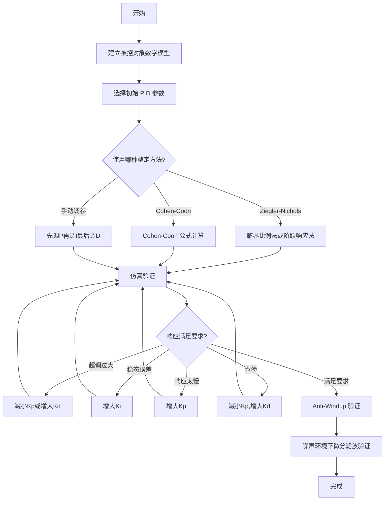

# PID 控制基础与实现

> 预计阅读：25 分钟 | 前置知识：自动控制原理基础、拉普拉斯变换、Simulink 基本操作

---

## 1. PID 控制器概述

PID（Proportional-Integral-Derivative）控制器是工业控制中应用最广泛的控制器，据统计超过 90% 的工业控制回路采用 PID 或其变体。在无人机（UAV）领域，PID 同样是姿态控制、位置控制的基础方案。

PID 控制器的核心思想：**根据误差的过去（I）、现在（P）和未来趋势（D）来计算控制量**。

```
                  ┌─────────────────────────────────┐
  r(t) ──►(+)───►│   u(t) = Kp·e + Ki·∫e dt + Kd·de/dt  │───► u(t) ──► Plant ──► y(t)
          -▲      └─────────────────────────────────┘            │
           │                                                      │
           └──────────────────────────────────────────────────────┘
```

---

## 2. PID 各项的物理意义

### 2.1 比例项（Proportional）

**作用**：对当前误差做出即时响应，误差越大，控制力越大。

```
u_P(t) = Kp · e(t)
```

- 优点：响应速度快，能迅速减小误差
- 缺点：存在稳态误差（steady-state error），无法完全消除静态偏差

### 2.2 积分项（Integral）

**作用**：对历史误差进行累积，消除稳态误差。

```
u_I(t) = Ki · ∫₀ᵗ e(τ) dτ
```

- 优点：消除稳态误差，提高系统精度
- 缺点：响应慢，易引起超调和积分饱和（Integral Windup）

### 2.3 微分项（Derivative）

**作用**：预测误差变化趋势，提供阻尼作用。

```
u_D(t) = Kd · de(t)/dt
```

- 优点：减小超调，改善动态性能，增加系统阻尼
- 缺点：对噪声敏感，纯微分在物理上不可实现

### 2.4 各项对比总结

| 项 | 作用 | 优点 | 缺点 | 对应参数 |
|---|---|---|---|---|
| P（比例） | 对当前误差即时响应 | 响应快 | 存在稳态误差 | Kp |
| I（积分） | 消除历史累积误差 | 消除稳态误差 | 超调、积分饱和 | Ki |
| D（微分） | 预测误差变化趋势 | 减小超调、增加阻尼 | 放大噪声 | Kd |

---

## 3. PID 传递函数

### 3.1 连续域传递函数

理想的 PID 控制器在 s 域中的传递函数为：

```
C(s) = Kp + Ki/s + Kd·s
```

改写为标准形式：

```
C(s) = Kp · (1 + 1/(Ti·s) + Td·s)
```

其中 Ti = Kp/Ki 为积分时间常数，Td = Kd/Kp 为微分时间常数。

### 3.2 实际 PID 传递函数

实际实现中，微分项需要加低通滤波器：

```
C(s) = Kp + Ki/s + Kd·s/(τf·s + 1)
```

其中 τf 为滤波器时间常数，通常取 τf = Td/N，N 为滤波系数（典型值 5~20）。

---

## 4. 离散 PID 实现

### 4.1 位置式 PID

将连续 PID 离散化，得到位置式 PID：

```
u(k) = Kp·e(k) + Ki·T·Σe(j) + Kd·(e(k)-e(k-1))/T
```

其中 T 为采样周期。

### 4.2 增量式 PID

增量式 PID 只输出控制量的增量，更适合嵌入式实现：

```
Δu(k) = u(k) - u(k-1)
       = Kp·(e(k)-e(k-1)) + Ki·T·e(k) + Kd·(e(k)-2e(k-1)+e(k-2))/T
```

| 实现方式 | 优点 | 缺点 | 适用场景 |
|---|---|---|---|
| 位置式 | 直观易理解 | 需保存全部历史误差 | 模拟电路、连续系统 |
| 增量式 | 无累积误差、安全性好 | 需保存最近三次误差 | 嵌入式、数字控制 |

### 4.3 离散化方法对比

| 方法 | 公式 | 精度 | 稳定性 |
|---|---|---|---|
| 前向欧拉 | s ≈ (z-1)/T | 一般 | 可能不稳定 |
| 后向欧拉 | s ≈ (z-1)/(Tz) | 较好 | 稳定 |
| 双线性变换（Tustin） | s ≈ (2/T)·(z-1)/(z+1) | 最好 | 稳定 |

---

## 5. Simulink 中的 PID 控制器

### 5.1 PID Controller Block

Simulink 提供了内置的 PID Controller 模块，位于路径：

```
Simulink > Continuous > PID Controller
```

**关键参数配置：**

| 参数 | 说明 | 典型值范围 |
|---|---|---|
| P | 比例增益 | 0.1 ~ 100 |
| I | 积分增益 | 0 ~ 50 |
| D | 微分增益 | 0 ~ 10 |
| N | 微分滤波系数 | 5 ~ 20 |
| Initial condition | 积分器初始值 | 0 |
| Upper/Lower saturation | 输出限幅 | ±100% |

### 5.2 Simulink 搭建步骤

1. 从 Library Browser 拖入 `Step`（参考信号）、`PID Controller`、`Transfer Fcn`（被控对象）、`Scope`
2. 连接信号线：Step → PID → Transfer Fcn → Scope，同时反馈回 PID
3. 双击 PID Controller，设置 P、I、D 参数
4. 设置仿真时间和求解器（推荐 ode45 或固定步长 ode4）
5. 运行仿真，观察 Scope 中的响应曲线

---

## 6. Ziegler-Nichols 整定方法

### 6.1 临界比例法（Ultimate Sensitivity Method）

**步骤：**

1. 将 Ki = 0，Kd = 0，仅使用比例控制
2. 逐渐增大 Kp，直到系统产生等幅振荡
3. 记录此时的比例增益 Ku（临界增益）和振荡周期 Tu
4. 根据下表计算 PID 参数：

| 控制器类型 | Kp | Ki | Kd |
|---|---|---|---|
| P | 0.5·Ku | 0 | 0 |
| PI | 0.45·Ku | 0.54·Ku/Tu | 0 |
| PID | 0.6·Ku | 1.2·Ku/Tu | 0.075·Ku·Tu |

### 6.2 阶跃响应法（Reaction Curve Method）

**步骤：**

1. 对开环系统施加阶跃输入
2. 记录响应曲线，确定延迟时间 L 和时间常数 T
3. 计算斜率 R = Δy/L
4. 根据下表计算参数：

| 控制器类型 | Kp | Ti | Td |
|---|---|---|---|
| P | 1/(R·L) | ∞ | 0 |
| PI | 0.9/(R·L) | 3.33·L | 0 |
| PID | 1.2/(R·L) | 2·L | 0.5·L |

---

## 7. Cohen-Coon 整定方法

Cohen-Coon 方法是对 Ziegler-Nichols 方法的改进，适用于具有显著延迟的系统。

**定义无量纲参数：**
- a = K·L/T（其中 K 为增益，L 为延迟，T 为时间常数）

| 控制器类型 | Kp | Ti | Td |
|---|---|---|---|
| P | (1/a)·(1 + 0.35·L/T) | - | - |
| PI | (1/a)·(0.9 + 0.17·L/T) | L·(3.33 + 0.37·L/T)/(1 + 0.2·L/T) | - |
| PID | (1/a)·(1.24 + 0.17·L/T) | L·(0.56 + 0.17·L/T)/(1 + 0.2·L/T) | L·0.37/(1 + 0.2·L/T) |

Cohen-Coon 方法在大延迟系统中通常比 Ziegler-Nichols 表现更好。

---

## 8. 抗积分饱和（Anti-Windup）

### 8.1 积分饱和问题

当执行器饱和（如电机最大推力）时，误差持续累积导致积分项过大，系统产生严重超调。

```
                积分项持续增长
                    │
    u(t) ──────────┤━━━━━━━━━━━ 输出饱和上限
                    │        ╱
                    │      ╱  ← 超调
                    │    ╱
    设定点 ─────────┼──╱──────
                    │╱
                    └───────────────── t
                         饱和期间积分仍在累积
```

### 8.2 积分限幅法（Clamping）

最简单的方法：限制积分项的范围。

```
if u_I > u_I_max:
    u_I = u_I_max
elif u_I < u_I_min:
    u_I = u_I_min
```

### 8.3 反计算法（Back-Calculation）

更先进的方法：利用饱和差值反馈修正积分项。

```
du_I = Ki·e + (1/Tt)·(u_sat - u_unsat)
```

其中 Tt 为跟踪时间常数，u_sat 为饱和后的输出，u_unsat 为未饱和的输出。

| 方法 | 实现复杂度 | 效果 | 推荐场景 |
|---|---|---|---|
| 积分限幅 | 低 | 一般 | 简单系统 |
| 反计算法 | 中 | 好 | 大多数应用 |
| 条件积分 | 低 | 好 | 误差较小时停止积分 |

---

## 9. 微分项滤波

### 9.1 为什么需要滤波

纯微分项 Kd·s 在物理上不可实现，且会放大幅值噪声。实际实现必须对微分项加低通滤波。

### 9.2 一阶低通滤波

```
D_filtered(s) = Kd · s / (τf·s + 1)
```

截止频率 ωf = 1/τf，通常设为采样频率的 1/10 ~ 1/5。

### 9.3 不完全微分

```
D(s) = Kd · s / (1 + s·Td/N)
```

N 为滤波系数，典型值 5~20。N 越大，滤波越弱，越接近理想微分。

---

## 10. PID 整定工作流



---

## 11. Simulink PID Autotuner

Simulink 提供了 **PID Autotuner** 模块，可自动整定 PID 参数。

### 11.1 使用步骤

1. 将 `PID Autotuner` 模块连接到 PID Controller 的输出端
2. 配置目标带宽（Desired Bandwidth）和相位裕度（Phase Margin）
3. 运行仿真，Autotuner 自动施加激励信号
4. 整定完成后，将新参数写入 PID Controller

### 11.2 Autotuner 参数

| 参数 | 说明 | 推荐值 |
|---|---|---|
| Desired Bandwidth | 期望闭环带宽 | 被控对象带宽的 1/10 ~ 1/5 |
| Phase Margin | 期望相位裕度 | 45° ~ 60° |
| Tuning Method | 整定方法 | Robust（默认）或 Default |

---

## 12. PID 在无人机中的应用示例

以四旋翼俯仰角控制为例：

```
参考俯仰角 ──► PID Controller ──► 电机混控 ──► 四旋翼动力学 ──► 实际俯仰角
     ▲                                                              │
     └──────────────────────────────────────────────────────────────┘
```

**典型参数范围（四旋翼姿态环）：**

| 控制环 | Kp | Ki | Kd | 采样频率 |
|---|---|---|---|---|
| 角速率环 | 0.5 ~ 2.0 | 0.1 ~ 1.0 | 0.001 ~ 0.02 | 400 ~ 1000 Hz |
| 姿态角环 | 2.0 ~ 8.0 | 0.0 ~ 0.5 | 0.0 ~ 0.3 | 100 ~ 400 Hz |
| 位置环 | 0.5 ~ 2.0 | 0.0 ~ 0.2 | 0.1 ~ 0.5 | 50 ~ 100 Hz |

---

## 13. 参考资源

- **shirunqi/PID-Control-for-a-Quadrotor**：四旋翼 PID 控制的 MATLAB/Simulink 实现
- **AngeloEspinoza**：PID 控制器在无人机系统中的工程实践
- Astrom K.J., Murray R.M. *Feedback Systems: An Introduction for Scientists and Engineers*
- Quanser QDrone 实验平台 PID 控制案例

---

## 思考题

**1.** 为什么纯比例控制（P 控制器）无法消除四旋翼的高度稳态误差？从物理角度解释。

<details>
<summary>参考答案</summary>

四旋翼悬停时，重力与推力平衡。纯比例控制器的输出 u = Kp·e，当误差 e → 0 时，控制量 u → 0，推力降至零，无法维持悬停。因此系统会在一个非零误差处平衡（推力刚好等于重力但高度存在偏差）。积分项通过累积误差可以提供这个"基础推力"，从而消除稳态误差。
</details>

**2.** 在四旋翼角速率控制环中，为什么微分项的增益 Kd 通常非常小（0.001~0.02）？如果增益过大会发生什么？

<details>
<summary>参考答案</summary>

角速率信号（陀螺仪输出）噪声较大，微分项会放大高频噪声。Kd 过大会导致：
- 控制信号中噪声成分被放大，电机频繁微调，缩短电机寿命
- 可能激励结构振动模态，导致机体抖动
- 严重时引起系统不稳定

角速率环本身已有较好的阻尼特性，较小的 Kd 即可满足需求。
</details>

**3.** Ziegler-Nichols 临界比例法中的"等幅振荡"条件，在实际四旋翼调试中是否安全？为什么？如何改进？

<details>
<summary>参考答案</summary>

不安全。在实际四旋翼上，增大 Kp 直到等幅振荡意味着无人机已经在剧烈摆动，可能导致：
- 炸机风险
- 电机过热
- 结构损坏

改进方法：
1. 在仿真环境中完成 Ziegler-Nichols 整定，再微调到实机
2. 使用阶跃响应法代替临界比例法
3. 采用 Simulink PID Autotuner 进行自动整定
4. 使用保守的初始参数，逐步小幅增大
</details>

**4.** 反计算法（Back-Calculation）中的跟踪时间常数 Tt 如何影响系统性能？Tt 太大和太小分别有什么问题？

<details>
<summary>参考答案</summary>

Tt 控制积分项"退饱和"的速度：
- Tt 太小：退饱和过快，积分项迅速减小，可能无法有效消除稳态误差
- Tt 太大：退饱和过慢，系统从饱和状态恢复时间长，超调仍然严重

经验法则：Tt 通常设为积分时间常数 Ti 的 0.1~1 倍。在 Simulink PID Controller 中对应 `Kb = Kp/(Kt·Tt)` 的 Anti-windup 参数。
</details>

**5.** 对比位置式 PID 和增量式 PID 在四旋翼失控保护（fail-safe）场景下的表现差异。

<details>
<summary>参考答案</summary>

增量式 PID 在失控保护中更安全：
- **位置式 PID**：输出为绝对控制量，如果传感器出现瞬时异常，积分项可能累积到很大值，导致输出突变（如瞬间满油门）
- **增量式 PID**：输出为增量 Δu，即使当前时刻异常，增量被自然限制（因为只与最近三次误差之差有关），且上一时刻的输出作为基础，不会产生跳变

在故障恢复时，增量式 PID 可以从当前控制量平滑过渡，而位置式 PID 可能因积分项清零产生阶跃。
</details>
