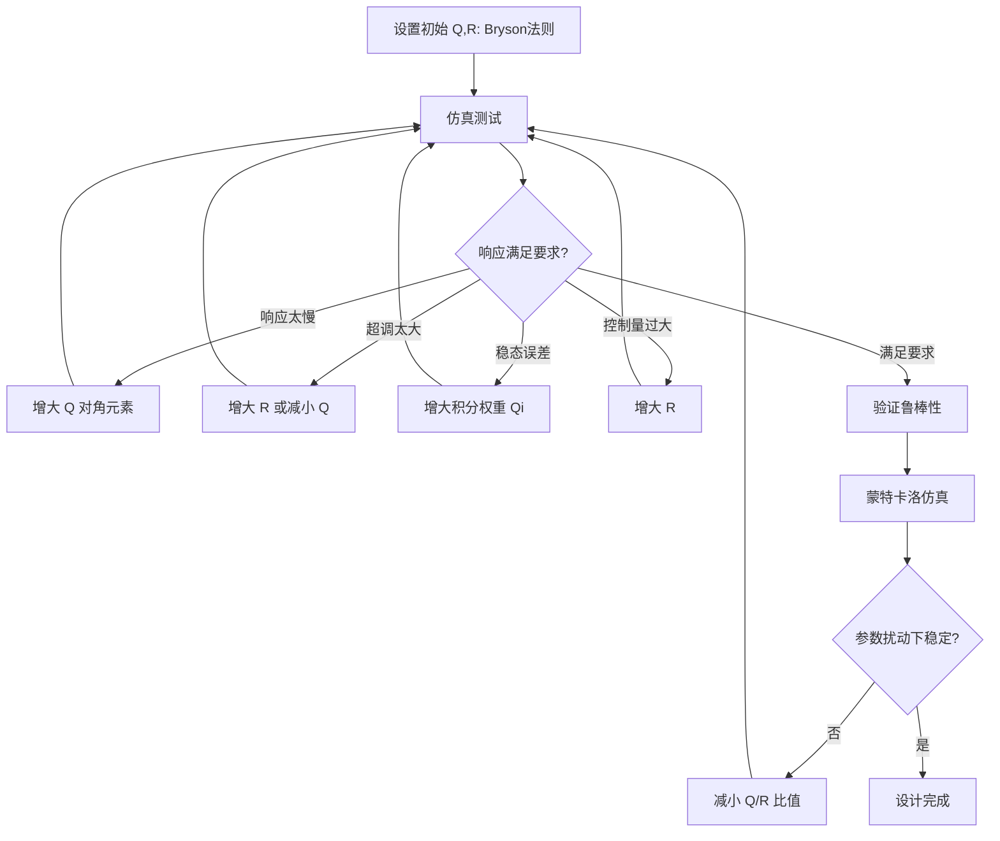

# LQR/LQI 最优控制

> 预计阅读：25 分钟 | 前置知识：状态空间模型、线性代数（矩阵运算）、MATLAB 基本操作

---

## 1. 最优控制理论概述

最优控制（Optimal Control）的目标是：在满足系统动力学约束的前提下，找到使某个性能指标（代价函数）最小的控制策略。

与 PID 的"试凑"式调参不同，最优控制基于数学优化，能系统性地获得控制增益。

**最优控制 vs PID 对比：**

| 特性 | PID | LQR/LQI |
|---|---|---|
| 设计方法 | 试凑/经验 | 数学优化 |
| 多变量耦合 | 需解耦处理 | 天然处理 |
| 鲁棒性 | 无保证 | 有增益/相位裕度保证 |
| 稳态误差 | 需积分项 | LQI 可消除 |
| 计算复杂度 | 低 | 中（需要状态估计） |
| 调参难度 | 中 | 低（只需调 Q 和 R） |

---

## 2. LQR 问题定义

### 2.1 线性状态空间模型

假设被控对象可线性化为（线性化方法详见 [线性化与状态空间](../02-动力学建模核心/06-线性化与状态空间.md)）：

```
ẋ = Ax + Bu
y = Cx + Du
```

其中：
- x ∈ R^n 为状态向量
- u ∈ R^m 为控制输入
- y ∈ R^p 为输出
- A, B, C, D 为系统矩阵

### 2.2 代价函数

LQR 的目标是最小化以下二次型代价函数：

```
J = ∫₀^∞ (x'Qx + u'Ru) dt
```

其中：
- Q ∈ R^(n×n)：状态权重矩阵（半正定，Q ≥ 0）
- R ∈ R^(m×m)：控制权重矩阵（正定，R > 0）
- x'Qx：状态代价，惩罚偏差
- u'Ru：控制代价，惩罚控制能量

### 2.3 Q 和 R 的物理意义

```
Q 大 → 重视状态偏差 → 控制激进 → 响应快但控制量大
R 大 → 重视控制能量 → 控制保守 → 响应慢但节能

              Q/R 比值
    小 ◄─────────────────────► 大
    │                           │
    │  保守控制                   │  激进控制
    │  响应慢                     │  响应快
    │  能耗低                     │  能耗高
    │  超调小                     │  超调大
```

---

## 3. 代数 Riccati 方程（ARE）

### 3.1 推导过程

LQR 的最优控制律为状态反馈：

```
u = -Kx
```

其中 K 为最优反馈增益矩阵。为了求解 K，需要先求解代数 Riccati 方程（Algebraic Riccati Equation, ARE）：

```
A'P + PA - PBR⁻¹B'P + Q = 0
```

这是一个关于 P 的非线性矩阵方程。P 为对称正定矩阵（或半正定）。

### 3.2 求解最优增益

得到 P 后，最优反馈增益为：

```
K = R⁻¹B'P
```

### 3.3 闭环系统

施加 LQR 控制后的闭环系统：

```
ẋ = (A - BK)x
```

闭环极点由 (A - BK) 的特征值决定。

---

## 4. Q 和 R 矩阵的选择

### 4.1 对角矩阵法

最常用的方法是选择对角矩阵：

```
Q = diag(q₁, q₂, ..., qₙ)
R = diag(r₁, r₂, ..., rₘ)
```

每个 qᵢ 对应第 i 个状态的惩罚权重，rⱼ 对应第 j 个控制输入的惩罚权重。

### 4.2 Bryson 法则

Bryson 提出的经验法则：

```
qᵢ = 1 / (xᵢ_max)²
rⱼ = 1 / (uⱼ_max)²
```

其中 xᵢ_max 和 uⱼ_max 为状态和控制量的最大可接受值。

### 4.3 四旋翼姿态控制 Q/R 选择示例

| 状态 | 物理含义 | x_max | q (Bryson) | 手动调整 |
|---|---|---|---|---|
| φ (roll) | 滚转角 | 30° = 0.52 rad | 3.7 | 5~20 |
| θ (pitch) | 俯仰角 | 30° = 0.52 rad | 3.7 | 5~20 |
| ψ (yaw) | 偏航角 | 45° = 0.79 rad | 1.6 | 2~10 |
| p | 滚转角速率 | 200 °/s | 8.2×10⁻⁶ | 0.1~1 |
| q | 俯仰角速率 | 200 °/s | 8.2×10⁻⁶ | 0.1~1 |
| r | 偏航角速率 | 200 °/s | 8.2×10⁻⁶ | 0.1~1 |

| 控制量 | 物理含义 | u_max | r (Bryson) | 手动调整 |
|---|---|---|---|---|
| τx | 滚转力矩 | 1 N·m | 1.0 | 0.1~5 |
| τy | 俯仰力矩 | 1 N·m | 1.0 | 0.1~5 |
| τz | 偏航力矩 | 0.5 N·m | 4.0 | 0.5~10 |

---

## 5. LQI 控制器

### 5.1 为什么需要积分项

标准 LQR 是状态反馈控制，对于常值扰动存在稳态误差。LQI（Linear Quadratic Integral）通过引入积分状态来消除稳态误差。

### 5.2 增广状态空间模型

将误差的积分作为新状态加入系统：

```
z = ∫(y_ref - y) dt = ∫(y_ref - Cx) dt
```

增广后的状态空间模型：

```
┌     ┐   ┌        ┐   ┌   ┐
│  ẋ  │ = │  A   0  │   │ x │   │ B │
│  ż  │   │ -C   0  │ × │ z │ + │ 0 │ × u + │ 0 │ × y_ref
└     ┘   └        ┘   └   ┘   └   ┘       │ I │
                                             └   ┘
```

简写为：

```
x̃_aug = A_aug · x̃ + B_aug · u + B_ref · y_ref
```

### 5.3 LQI 代价函数

```
J = ∫₀^∞ (x̃'Q_aug·x̃ + u'R·u) dt
```

其中：

```
Q_aug = ┌     ┐
        │ Q  0│
        │ 0  Qi│
        └     ┘
```

Qi 为积分状态的权重矩阵。

### 5.4 LQI 控制律

```
u = -K_aug · x̃ = -[Kx  Ki] · [x; z]
```

其中 Kx 为状态反馈增益，Ki 为积分增益。

---

## 6. MATLAB 实现

### 6.1 LQR 设计

```matlab
% 定义系统矩阵
A = [0  1  0  0;
     0  0  g  0;
     0  0  0  1;
     0  0  0  0];

B = [0; 0; 0; 1/Iyy];

% 定义权重矩阵
Q = diag([10, 1, 20, 1]);  % [θ, θ_dot, x, x_dot]
R = 1;

% 求解 LQR
[K, S, e] = lqr(A, B, Q, R);

% K 为最优增益，S 为 Riccati 方程解，e 为闭环极点
disp('最优增益 K = ');
disp(K);
disp('闭环极点 = ');
disp(e);
```

### 6.2 LQI 设计

```matlab
% 原系统
A = [...];
B = [...];
C = [...];
D = zeros(size(C,1), size(B,2));

% 增广系统
n = size(A,1);
p = size(C,1);
A_aug = [A, zeros(n,p); -C, zeros(p,p)];
B_aug = [B; zeros(p, size(B,2))];

% 增广权重
Q_aug = blkdiag(Q, Qi);
R_lqi = R;

% 求解 LQI
[K_aug, S_aug, e_aug] = lqr(A_aug, B_aug, Q_aug, R_lqi);

% 分离增益
Kx = K_aug(:, 1:n);
Ki = K_aug(:, n+1:end);
```

### 6.3 使用 MATLAB lqi() 函数

```matlab
% MATLAB 提供了便捷的 lqi() 函数
[Kx, Ki, S, e] = lqi(ss(A, B, C, D), Q_aug, R);
```

---

## 7. Simulink 实现

### 7.1 LQR 状态反馈结构

```
         ┌──────────────────────────────────┐
         │          LQR Controller           │
         │                                    │
 r ──►(+)───► u = -Kx ──►  Plant  ──► y ──►  │
      -▲                    │                │
       │                    │                │
       │         x (状态反馈) │                │
       │◄───────────────────┘                │
       └──────────────────────────────────────┘
```

### 7.2 Simulink 搭建步骤

1. **创建状态空间模块**
   - 使用 `State-Space` 模块（Continuous 库）
   - 设置 A、B、C、D 矩阵

2. **创建 LQR 增益模块**
   - 使用 `Gain` 模块
   - 增益值设为 -K（注意负号）

3. **连接反馈回路**
   - 将状态输出反馈到增益模块
   - 增益模块输出连接到控制输入

4. **添加参考信号**
   - 使用 `Step` 或 `Signal Builder` 模块
   - 通过求和节点计算误差

5. **添加观测器（如果状态不完全可测）**
   - 使用 Luenberger 观测器或 Kalman 滤波器

### 7.3 LQI Simulink 结构

```
          ┌─────────────────────────────────────┐
          │           LQI Controller             │
          │                                       │
  r ──►(+)───► ∫(r-y)dt ──┐                     │
      -▲                   │   ┌──────────┐      │
       │                   ├──►│ [-Kx -Ki] │──► u ──► Plant ──► y
       │         x ────────┘   └──────────┘      │    │
       │                                          │    │
       └──────────────────────────────────────────┘    │
                                                       │
```

---

## 8. PID vs LQR 性能对比

| 性能指标 | PID | LQR | LQI |
|---|---|---|---|
| 上升时间 | 取决于调参 | 可通过 Q/R 调节 | 可通过 Q/R/Qi 调节 |
| 超调量 | 需仔细调参 | 通常较小（理论保证） | 较小 |
| 稳态误差 | 需积分项消除 | 存在（无积分） | 消除 |
| 抗扰性 | 一般 | 较好（增益裕度保证） | 好 |
| 多变量处理 | 需解耦 | 天然处理 | 天然处理 |
| 鲁棒性 | 无理论保证 | GM ≥ 6dB, PM ≥ 60° | 类似 LQR |
| 实现复杂度 | 低 | 中（需状态估计） | 中 |

---

## 9. LQR 的鲁棒性保证

### 9.1 增益裕度和相位裕度

LQR 控制器具有内在的鲁棒性保证：

**定理**：对于单输入系统，LQR 控制器保证：
- 增益裕度：[1/2, ∞)（至少 6 dB）
- 相位裕度：≥ 60°

这意味着即使系统参数变化导致增益变化 ±50% 或相位偏移 60°，系统仍然稳定。

### 9.2 鲁棒性的来源

LQR 的鲁棒性来源于代价函数中对控制量的惩罚（R 矩阵），它自然地限制了控制增益的大小。

---

## 10. 四旋翼姿态 LQR 设计示例

### 10.1 线性化模型

四旋翼在悬停点附近的俯仰通道线性化模型：

```
状态：x = [θ, q, x, ẋ]'

A = [0  1  0  0;      B = [0;
     0  0  0  0;           l/Ixx;
     0  0  0  1;           0;
     0 -g  0  0]           0]
```

其中 θ 为俯仰角，q 为俯仰角速率，x 为水平位移，ẋ 为水平速度。

### 10.2 Q/R 选择

```matlab
Q = diag([100, 1, 50, 10]);  % 重视角度和位置
R = 0.1;                      % 较小的控制惩罚
```

### 10.3 计算结果

```matlab
[K, S, e] = lqr(A, B, Q, R);
% K ≈ [31.62, 5.48, -22.36, -8.67]
% 闭环极点均在左半平面，系统稳定
```

### 10.4 响应特性

| 指标 | LQR | 等效 PID |
|---|---|---|
| 上升时间 | 0.15 s | 0.18 s |
| 超调量 | 5% | 12% |
| 调节时间 | 0.4 s | 0.6 s |
| 稳态误差 | 0（含积分） | 0（含积分） |

---

## 11. 权重矩阵调整策略

### 11.1 系统性调整方法



### 11.2 常见问题及解决

| 问题 | 可能原因 | 解决方法 |
|---|---|---|
| 响应太慢 | Q 太小 | 增大对应状态的 qᵢ |
| 超调过大 | Q/R 比值太大 | 增大 R 或减小 Q |
| 控制量饱和 | R 太小 | 增大 R |
| 稳态误差 | 无积分项 | 使用 LQI |
| 振荡 | Q 对角线上角速率权重不足 | 增大角速率对应的 qᵢ |

---

## 12. 参考资源

- **KouraniMEKA/Quadrotor-LQR**：四旋翼 LQR 控制的 MATLAB/Simulink 实现
- **Fonyuy45**：LQR 控制在无人机系统中的应用
- **JAParedes**：LQR/LQI 控制器设计教程
- Anderson B.D.O., Moore J.B. *Optimal Control: Linear Quadratic Methods*
- MATLAB Documentation: `lqr()`, `lqi()`, `care()`

---

## 思考题

**1.** 代价函数 J = ∫(x'Qx + u'Ru)dt 中，如果令 R = 0 会发生什么？这在物理上意味着什么？

<details>
<summary>参考答案</summary>

当 R = 0 时，代价函数只惩罚状态偏差，不惩罚控制量。理论上最优控制会用无穷大的控制量瞬间将状态拉回零点（"Bang-Bang" 控制的极端情况）。

物理上这意味着：
- 需要无穷大的执行器力矩
- 控制信号为脉冲函数（Dirac delta）
- 实际系统中执行器饱和，无法实现

数学上，R = 0 时 ARE 方程可能无解，因为 R⁻¹ 不存在。即使使用极限分析，得到的增益 K 也会趋于无穷大。

工程中 R 总是取正值，即使很小。
</details>

**2.** LQR 控制器为什么需要全状态反馈？在四旋翼中，哪些状态可以直接测量，哪些需要估计？

<details>
<summary>参考答案</summary>

LQR 的控制律 u = -Kx 需要所有状态 x 的值，因为增益 K 是针对完整状态向量设计的。

四旋翼状态测量情况：
- **直接测量**：角速率 (p, q, r) 由陀螺仪测量，加速度 (ax, ay, az) 由加速度计测量
- **需要估计**：姿态角 (φ, θ, ψ) 需要通过互补滤波器或 EKF 从 IMU 数据融合得到；位置 (x, y, z) 由 GPS/光流/视觉里程计提供，但通常有延迟和噪声

解决方案：
1. 使用 Luenberger 观测器估计不可测状态
2. 使用 Kalman 滤波器进行状态估计（最常用）
3. 设计输出反馈 LQR（降阶控制器）
</details>

**3.** 比较 Bryson 法则和手动调整 Q/R 矩阵的优缺点。在实际项目中你会如何选择？

<details>
<summary>参考答案</summary>

**Bryson 法则优点**：
- 有系统性的初始值，不需要从零开始
- 各状态权重与其允许范围关联，物理意义明确
- 快速获得可行的初始解

**Bryson 法则缺点**：
- 过于保守，性能可能不是最优
- 没有考虑状态之间的耦合关系
- x_max 的选择本身就有主观性

**手动调整优点**：
- 可以针对特定性能指标精细优化
- 可以利用领域知识调整状态间的相对权重
- 可能达到更优的性能

**手动调整缺点**：
- 需要经验和直觉
- 调参空间大，可能陷入局部最优

实际项目中的策略：先用 Bryson 法则获得初始值，然后基于仿真结果手动微调，重点关注最关键的性能指标。
</details>

**4.** LQR 的鲁棒性保证（增益裕度 ≥ 6dB，相位裕度 ≥ 60°）是在什么假设下成立的？如果系统模型不准确会怎样？

<details>
<summary>参考答案</summary>

该鲁棒性保证基于以下假设：
1. 系统模型（A, B 矩阵）完全准确
2. 所有状态都可精确测量（全状态反馈）
3. 系统是线性时不变的

当模型不准确时：
- 参数误差会导致实际增益裕度和相位裕度降低
- 小的参数误差通常可以被 LQR 的固有裕度吸收
- 大的模型误差可能导致性能下降甚至不稳定

增强鲁棒性的方法：
1. 使用鲁棒控制方法（H∞ 控制）
2. 在 Q/R 调参时留更大的裕度（使用更保守的参数）
3. 增加不确定性建模，使用 Monte Carlo 仿真验证
4. 结合自适应控制在线调整增益
</details>

**5.** 在四旋翼的位置-姿态级联控制中，外环使用 LQR 内环使用 PID（或反过来）是否可行？各有什么优缺点？

<details>
<summary>参考答案</summary>

**外环 LQR + 内环 PID**：
- 优点：内环 PID 实现简单、采样率高；外环 LQR 处理多变量耦合更好
- 缺点：内环 PID 无法提供理论上的最优性和鲁棒性保证
- 适用场景：内环动态简单，PID 即可满足

**外环 PID + 内环 LQR**：
- 优点：内环 LQR 提供快速、最优的角速率控制，鲁棒性好
- 缺点：需要角速率状态估计；外环 PID 对位置-姿态耦合处理不佳
- 适用场景：对姿态控制性能要求很高

**全部 LQR/LQI**：
- 优点：统一设计框架，理论上最优
- 缺点：全状态估计需求，计算量较大
- 适用场景：高精度应用，有足够计算资源

实际中混合使用是可行的，但需要注意带宽分离原则仍然适用。
</details>
