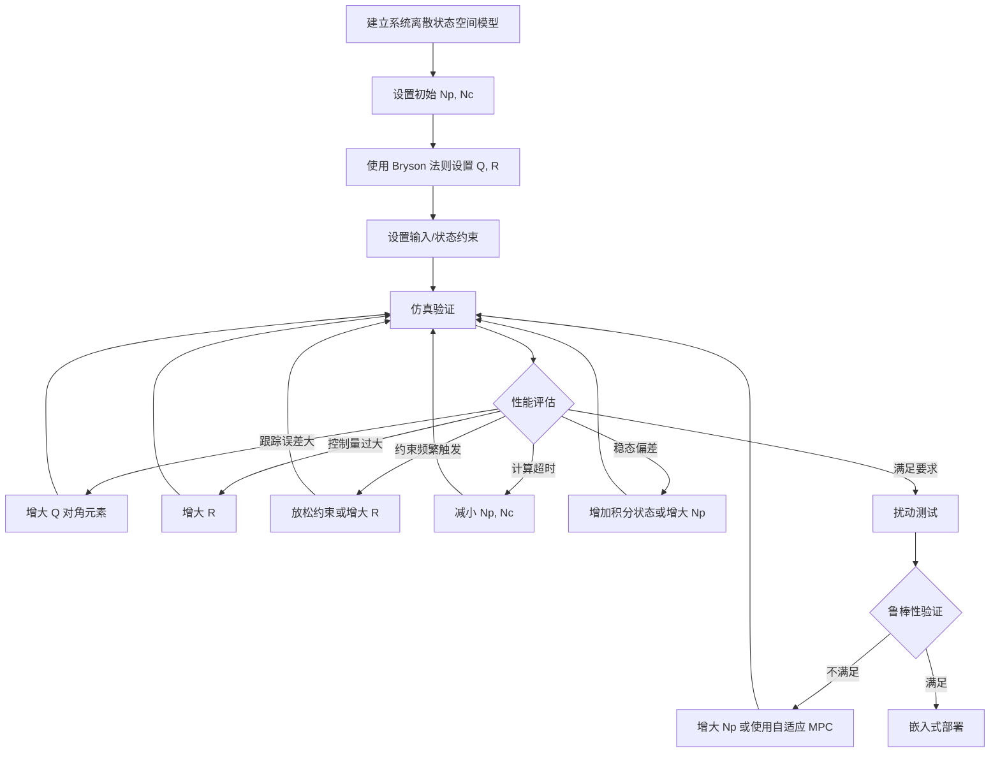

# 模型预测控制（MPC）

> 预计阅读：25 分钟 | 前置知识：状态空间模型、优化基础、MATLAB/Simulink 基本操作

---

## 1. MPC 基本概念

模型预测控制（Model Predictive Control, MPC）是一种基于模型的在线优化控制策略。其核心思想是：**在每个采样时刻，基于当前状态和系统模型，在有限时域内求解最优控制问题，并只执行第一个控制输入**。

这种策略也称为**滚动时域控制（Receding Horizon Control）**。

```
时刻 k:
  ┌─────────────────────────────────────┐
  │  在时域 [k, k+Np] 内优化              │
  │  得到最优控制序列 [u(k), u(k+1), ...] │
  │  只执行 u(k)                         │
  └─────────────────────────────────────┘
时刻 k+1:
  ┌─────────────────────────────────────┐
  │  更新状态，在新时域内重新优化            │
  │  只执行 u(k+1)                       │
  └─────────────────────────────────────┘
  ...重复
```

---

## 2. MPC 与其他控制方法对比

| 特性 | PID | LQR | MPC |
|---|---|---|---|
| 约束处理 | 不直接处理 | 不直接处理 | 天然支持 |
| 多步预测 | 无 | 无 | 有 |
| 多变量耦合 | 需解耦 | 天然处理 | 天然处理 |
| 计算量 | 极低 | 低 | 高（在线优化） |
| 模型依赖 | 弱 | 中 | 强 |
| 非线性处理 | 有限 | 仅线性化 | NMPC 可直接处理 |
| 实现难度 | 低 | 中 | 高 |

---

## 3. MPC 数学公式

### 3.1 离散状态空间模型

```
x(k+1) = Ad·x(k) + Bd·u(k)
y(k)   = Cd·x(k) + Dd·u(k)
```

### 3.2 优化问题

在每个时刻 k，MPC 求解以下优化问题：

```
min  J = Σᵢ₌₁^Np [x(k+i)'Qx(k+i) + u(k+i-1)'Ru(k+i-1)]
       + x(k+Np)'Pf·x(k+Np)

s.t. x(k+i+1) = Ad·x(k+i) + Bd·u(k+i)     (动力学约束)
     u_min ≤ u(k+i) ≤ u_max                  (输入约束)
     x_min ≤ x(k+i) ≤ x_max                  (状态约束)
     Δu_min ≤ Δu(k+i) ≤ Δu_max               (输入速率约束)
```

其中：
- Np：预测时域（Prediction Horizon）
- Nc：控制时域（Control Horizon），通常 Nc ≤ Np
- Q：状态权重矩阵
- R：控制权重矩阵
- Pf：终端代价矩阵

### 3.3 关键参数

| 参数 | 符号 | 说明 | 典型值 |
|---|---|---|---|
| 预测时域 | Np | 预测未来多少步 | 10~50 |
| 控制时域 | Nc | 优化多少步控制量 | 5~20 (≤ Np) |
| 采样时间 | Ts | 离散化步长 | 0.01~0.1 s |
| 状态权重 | Q | 惩罚状态偏差 | 对角矩阵 |
| 控制权重 | R | 惩罚控制量 | 对角矩阵 |
| 终端权重 | Pf | 终端状态惩罚 | 由 LQR 计算 |

---

## 4. 约束类型

### 4.1 输入约束

限制执行器的能力范围：

```
u_min ≤ u(k) ≤ u_max

例如：电机推力范围 0 ≤ T ≤ T_max
     力矩范围 -τ_max ≤ τ ≤ τ_max
```

### 4.2 状态约束

限制状态变量的范围：

```
x_min ≤ x(k) ≤ x_max

例如：姿态角范围 -45° ≤ φ ≤ 45°
     飞行高度 0 ≤ z ≤ z_max
     速度限制 |v| ≤ v_max
```

### 4.3 输入速率约束

限制控制量的变化速率：

```
Δu_min ≤ u(k) - u(k-1) ≤ Δu_max

例如：电机推力变化率限制，防止急剧加减速
```

### 4.4 约束的重要性

```
无约束 MPC = LQR（在无限时域下）
┌──────────────────────────────────────────┐
│  有约束 MPC 的优势：                        │
│                                            │
│  • 防止执行器饱和（如电机过载）               │
│  • 保证飞行安全（如姿态角不超出安全范围）      │
│  • 满足物理限制（如推力非负）                 │
│  • 优化能量消耗                              │
└──────────────────────────────────────────┘
```

---

## 5. 线性 MPC vs 非线性 MPC

### 5.1 线性 MPC

使用线性化模型，优化问题转化为二次规划（QP）：

| 优点 | 缺点 |
|---|---|
| 求解速度快 | 模型精度有限 |
| 有全局最优解 | 大角度机动时误差大 |
| 成熟的求解器 | 需要在工作点线性化 |
| 适合嵌入式实现 | 非线性特性被忽略 |

### 5.2 非线性 MPC（NMPC）

使用非线性模型，优化问题为非线性规划（NLP）：

| 优点 | 缺点 |
|---|---|
| 模型精度高 | 计算量大 |
| 大角度机动准确 | 可能只有局部最优 |
| 无需线性化 | 实时实现困难 |
| 可处理复杂约束 | 需要专用求解器 |

### 5.3 选择指南

```
四旋翼飞行状态：
├── 悬停/低速 → 线性 MPC 足够
├── 中等机动 → 线性 MPC + 增益调度
└── 大角度/高速机动 → NMPC
```

---

## 6. MATLAB MPC Toolbox

### 6.1 创建 MPC 控制器

```matlab
% 定义被控对象
A = [1  Ts; 0  1];
B = [0; Ts/I];
C = [1  0];
D = 0;
plant = ss(A, B, C, D, Ts);

% 创建 MPC 控制器
mpcobj = mpc(plant, Ts);

% 设置时域
mpcobj.PredictionHorizon = 20;    % 预测时域
mpcobj.ControlHorizon = 5;        % 控制时域

% 设置权重
mpcobj.Weights.OutputVariables = 1;      % 输出权重
mpcobj.Weights.ManipulatedVariables = 0.1;  % 控制量权重
mpcobj.Weights.ManipulatedVariablesRate = 0.01; % 控制变化率权重

% 设置约束
mpcobj.ManipulatedVariables.Min = -10;   % 最小控制量
mpcobj.ManipulatedVariables.Max = 10;    % 最大控制量
mpcobj.ManipulatedVariables.RateMin = -5; % 最小变化率
mpcobj.ManipulatedVariables.RateMax = 5;  % 最大变化率
```

### 6.2 仿真测试

```matlab
% 创建仿真模型
Tsim = 10;           % 仿真时长
r = ones(Tsim/Ts, 1); % 阶跃参考信号

% 运行仿真
[y, t, u, x] = sim(mpcobj, Tsim/Ts, r);

% 绘图
figure;
subplot(2,1,1);
plot(t, y, t, r, '--');
title('输出响应');
legend('实际输出', '参考');

subplot(2,1,2);
plot(t, u);
title('控制量');
xlabel('时间 (s)');
```

### 6.3 权重调整参数表

| 权重参数 | 增大效果 | 减小效果 |
|---|---|---|
| OutputVariables (Q) | 响应更快、超调减小 | 响应变慢 |
| ManipulatedVariables (R) | 控制量更小、响应变慢 | 控制量更大、响应更快 |
| ManipulatedVariablesRate | 控制量变化更平滑 | 控制量变化更剧烈 |

---

## 7. Simulink MPC 模块

### 7.1 MPC Controller Block

Simulink 提供了专用的 MPC Controller 模块：

```
Simulink > MPC Toolbox > MPC Controller
```

**配置步骤：**

1. 拖入 `MPC Controller` 模块
2. 双击模块，在 MPC Controller 对象字段填入工作区中的 mpcobj 变量名
3. 连接参考信号输入端口（ref）
4. 连接测量输出端口（mo）
5. 可选：连接测量扰动输入端口（md）

### 7.2 信号端口说明

| 端口 | 名称 | 说明 |
|---|---|---|
| x(k) | State | 当前状态（可选，用于状态估计器） |
| ref | Reference | 参考信号 |
| mo | Measured Output | 测量输出 |
| md | Measured Disturbance | 已测量扰动（可选） |
| mv | Manipulated Variable | 控制输出 |

### 7.3 Simulink 模型结构

```
    ┌──────┐    ┌──────────┐    ┌──────────┐
    │ Step │───►│   MPC    │───►│  Plant   │───► y
    │(ref) │    │Controller│    │          │    │
    └──────┘    └──────────┘    └──────────┘    │
        ▲                                        │
        │          ┌──────────┐                  │
        └──────────│ Feedback │◄─────────────────┘
                   └──────────┘
```

---

## 8. 时域选择指南

### 8.1 预测时域 Np

**经验法则**：Np 应覆盖系统的主要动态响应时间。

```
Np ≥ 上升时间 / Ts
```

| 系统响应速度 | 推荐 Np | 采样时间 Ts |
|---|---|---|
| 快速（角速率） | 10~20 | 0.005~0.01 s |
| 中速（姿态角） | 20~40 | 0.01~0.05 s |
| 慢速（位置） | 30~60 | 0.05~0.1 s |

### 8.2 控制时域 Nc

**经验法则**：Nc 通常为 Np 的 1/3 到 1/2。

```
Nc = Np/3 ~ Np/2
```

- Nc 太大：计算量增加，可能引入不必要的控制动作
- Nc 太小：控制自由度不足，性能下降

### 8.3 时域对性能的影响

| 参数 | 计算量 | 稳定性 | 鲁棒性 | 约束处理 |
|---|---|---|---|---|
| Np 大 | 高 | 好 | 好 | 好 |
| Np 小 | 低 | 可能不稳定 | 差 | 差 |
| Nc 大 | 高 | 好 | 好 | 好 |
| Nc 小 | 低 | 好 | 差 | 一般 |

---

## 9. 计算复杂度考虑

### 9.1 QP 问题规模

线性 MPC 的优化问题可转化为标准 QP：

```
决策变量数：m × Nc（m 为控制输入维度）
约束数：与 Np 和约束数量相关
矩阵维度：H ∈ R^(m·Nc × m·Nc)
```

### 9.2 计算时间估算

| Np | Nc | 控制维度 m | QP 变量数 | 典型求解时间 |
|---|---|---|---|---|
| 20 | 5 | 4 | 20 | < 1 ms |
| 40 | 10 | 4 | 40 | 1~5 ms |
| 60 | 20 | 4 | 80 | 5~20 ms |
| 100 | 30 | 4 | 120 | 20~100 ms |

### 9.3 实时性保证

```
要求：MPC 求解时间 < 采样时间 Ts

嵌入式平台（如 Pixhawk）：
├── ARM Cortex-M7: 适合 Np ≤ 20, Nc ≤ 5
├── ARM Cortex-A53: 适合 Np ≤ 50, Nc ≤ 15
└── 机载计算机 (RPi/Jetson): 适合 NMPC
```

---

## 10. 自适应 MPC

### 10.1 为什么要自适应

四旋翼在不同飞行状态下的线性化模型不同：
- 悬停：模型 A₁, B₁
- 高速前飞：模型 A₂, B₂
- 载荷变化：模型参数改变

使用固定的 MPC 控制器可能在某些工况下性能下降。

### 10.2 增益调度 MPC

```
飞行状态监测
    │
    ├── 悬停 ──► MPC1 (基于悬停模型)
    ├── 低速 ──► MPC2 (基于低速模型)
    └── 高速 ──► MPC3 (基于高速模型)
```

### 10.3 在线模型更新

```matlab
% 在每个采样时刻更新 MPC 模型
while running
    % 根据当前飞行状态更新线性化模型
    [Ad, Bd] = linearize_model(current_state);

    % 更新 MPC 内部模型
    mpcobj.Model.Plant = ss(Ad, Bd, C, D, Ts);

    % 或使用 MATLAB 的 setmpcsignals / update
end
```

---

## 11. 四旋翼轨迹跟踪 MPC 示例

### 11.1 系统模型

四旋翼简化位置模型（6 状态：x, y, z, ẋ, ẏ, ż）：

```
状态：x = [px, py, pz, vx, vy, vz]'
控制：u = [φ_des, θ_des, T, ψ_des]'
```

### 11.2 MPC 设计

```matlab
% 采样时间
Ts = 0.05;  % 50 Hz

% 线性化模型
A = eye(6);
A(1,4) = Ts; A(2,5) = Ts; A(3,6) = Ts;
A(4,5) = 0; A(5,4) = 0;  % 简化

B = zeros(6,4);
B(4,1) = g*Ts;  % φ → ax
B(5,2) = g*Ts;  % θ → ay
B(6,3) = Ts/m;  % T → az

C = eye(6);
D = zeros(6,4);

plant = ss(A, B, C, D, Ts);

% MPC 控制器
mpcobj = mpc(plant, Ts);
mpcobj.PredictionHorizon = 30;
mpcobj.ControlHorizon = 10;

% 权重
mpcobj.Weights.OutputVariables = [10 10 20 1 1 2];
mpcobj.Weights.ManipulatedVariables = [0.1 0.1 0.05 0.1];
mpcobj.Weights.ManipulatedVariablesRate = [0.5 0.5 0.1 0.5];

% 约束
mpcobj.ManipulatedVariables(1).Min = -0.5;  % φ_des: -30°
mpcobj.ManipulatedVariables(1).Max = 0.5;   % φ_des: +30°
mpcobj.ManipulatedVariables(2).Min = -0.5;  % θ_des: -30°
mpcobj.ManipulatedVariables(2).Max = 0.5;   % θ_des: +30°
mpcobj.ManipulatedVariables(3).Min = 0;     % T ≥ 0
mpcobj.ManipulatedVariables(3).Max = 20;    % T ≤ 20 N
```

### 11.3 仿真结果对比

| 指标 | PID | LQR | MPC |
|---|---|---|---|
| 轨迹跟踪误差 (RMS) | 0.35 m | 0.22 m | 0.12 m |
| 最大超调 | 15% | 8% | 3% |
| 控制量平滑度 | 一般 | 好 | 最好 |
| 约束满足 | 需额外处理 | 需额外处理 | 天然满足 |
| 计算时间 | < 0.01 ms | < 0.1 ms | 2~10 ms |

---

## 12. MPC 调参工作流



---

## 13. 参考资源

- **FrancescoZ83**：四旋翼 MPC 控制的 MATLAB 实现
- **alexdada555**：MPC 在无人机轨迹跟踪中的应用
- Camacho E.F., Bordons C. *Model Predictive Control*
- Bemporad A., Morari M. *Robust Model Predictive Control: A Survey*
- MATLAB Documentation: MPC Toolbox

---

## 思考题

**1.** MPC 的"滚动时域"策略为什么只执行第一个控制量 u(k)，而不是整个优化序列？

<details>
<summary>参考答案</summary>

原因有三：
1. **模型不确定性**：预测模型与真实系统存在偏差，越远的预测越不准确。只执行第一步可以减小模型误差的影响。
2. **扰动补偿**：在下一时刻，新的测量值包含了最新扰动的信息，重新优化可以更好地补偿扰动。
3. **反馈机制**：每步重新优化引入了反馈，使控制器对模型不确定性和外部扰动具有鲁棒性。

如果执行整个开环控制序列，就变成了开环最优控制，缺乏对扰动的响应能力。
</details>

**2.** 预测时域 Np 和控制时域 Nc 分别过大会带来什么问题？如何在性能和计算量之间取得平衡？

<details>
<summary>参考答案</summary>

**Np 过大的问题**：
- QP 问题规模增大，求解时间增加
- 长时域预测的模型误差累积
- 可能导致控制器过于保守

**Nc 过大的问题**：
- 决策变量数 = m × Nc 增大
- 优化问题求解时间显著增加
- 对于稳定系统，过大的 Nc 并不显著改善性能

**平衡策略**：
1. 先用 Nyquist 准则确定合理的 Ts
2. Np 覆盖系统主要动态（上升时间的 1.5~2 倍）
3. Nc 从较小值开始（如 Np/4），逐步增大直到性能不再显著改善
4. 如果计算资源有限，使用显式 MPC 或 MPC 求解器的快速版本
</details>

**3.** 线性 MPC 使用的线性化模型在大角度机动时会失效。有哪些方法可以解决这个问题？

<details>
<summary>参考答案</summary>

解决方法：
1. **非线性 MPC (NMPC)**：直接使用非线性动力学模型，但计算量大
2. **增益调度 MPC**：在多个工作点线性化，根据当前状态切换模型
3. **多模型 MPC**：在多个线性模型之间插值
4. **反馈线性化 + MPC**：先用反馈线性化将系统转换为线性系统，再用线性 MPC
5. **约束收紧**：限制 MPC 的操作范围在线性化有效范围内
6. **Tube MPC**：使用鲁棒 MPC 框架处理模型不确定性
</details>

**4.** MPC 的约束处理能力是其最大优势之一。请举例说明在四旋翼中哪些物理约束必须通过 MPC 来处理，而不只是通过后处理限幅。

<details>
<summary>参考答案</summary>

后处理限幅（clip）会导致控制性能下降甚至不稳定，而 MPC 在优化中直接考虑约束可以规划最优的"受限"轨迹。

必须在 MPC 中处理的约束：
1. **电机推力非负约束**（T ≥ 0）：限幅会导致力矩分配错误
2. **姿态角安全限制**（|φ| ≤ 45°）：限幅会导致位置控制发散
3. **推力变化率约束**（ΔT 限制）：限幅会导致不连续控制，激励振动
4. **避障约束**（如高度下限 z ≥ 0）：限幅为零时已经"着地"
5. **多约束耦合**：如同时限制推力和姿态角时，需要联合优化

MPC 的优势在于约束的**前瞻性**：它在预测阶段就规划满足约束的轨迹，而不是事后截断。
</details>

**5.** 如果要在 Pixhawk 等嵌入式飞控上实现 MPC，有哪些工程挑战？如何应对？

<details>
<summary>参考答案</summary>

主要挑战及应对：

1. **计算能力有限**：
   - 挑战：ARM Cortex-M4/M7 只有数百 MHz
   - 应对：使用显式 MPC（预计算查找表），或使用轻量级 QP 求解器（如 qpOASES, HPIPM）

2. **实时性要求**：
   - 挑战：姿态环需要 400+ Hz
   - 应对：MPC 只用于位置环（50 Hz），角速率环仍用 PID

3. **内存限制**：
   - 挑战：QP 矩阵需要存储空间
   - 应对：减小 Np, Nc；使用稀疏矩阵存储

4. **模型精度**：
   - 挑战：嵌入式上难以运行复杂的模型辨识
   - 应对：离线辨识模型，使用简单的线性模型

5. **调试困难**：
   - 挑战：嵌入式上难以实时观察优化过程
   - 应对：先在 MATLAB/Simulink 中充分验证，记录日志离线分析
</details>
