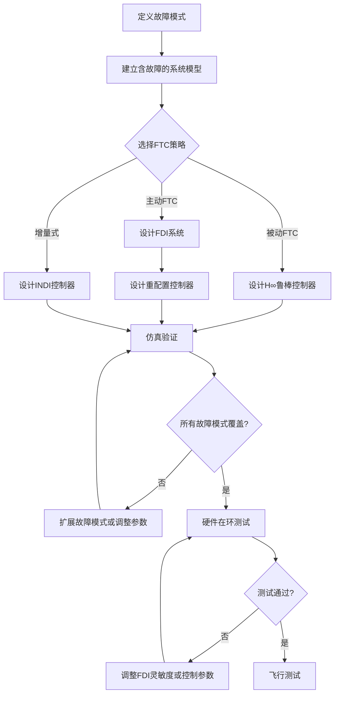

# 容错控制策略

> 预计阅读：22 分钟 | 前置知识：四旋翼动力学、PID 控制基础、电机混控原理

---

## 1. 容错控制概述

容错控制（Fault Tolerant Control, FTC）是指在系统发生故障时，控制器能够自动检测、隔离故障并调整控制策略，以维持系统可接受的性能或安全运行。

对于多旋翼无人机，容错控制至关重要——电机或传感器故障可能导致坠机。

**容错控制分类：**

| 类型 | 策略 | 响应速度 | 设计复杂度 | 典型应用 |
|---|---|---|---|---|
| 被动 FTC (PFTC) | 设计时考虑故障 | 无需切换 | 高 | 已知故障模式 |
| 主动 FTC (AFTC) | 检测后重配置 | 有延迟 | 中 | 未知故障时间 |
| 增量式控制 | 天然鲁棒 | 无需切换 | 低 | 通用 |

---

## 2. 多旋翼故障类型

### 2.1 执行器故障

| 故障类型 | 描述 | 表现 | 发生概率 |
|---|---|---|---|
| 完全失效 (Lock) | 电机卡死在某转速 | 失去控制力矩 | 中 |
| 部分失效 (Loss) | 电机效率降低 | 推力不足 | 高 |
| 失控 (Runaway) | 电机满转速 | 不可控推力 | 低 |
| 偏置故障 | 电机转速偏移 | 持续力矩偏差 | 中 |

### 2.2 传感器故障

| 故障类型 | 影响传感器 | 后果 |
|---|---|---|
| 偏置漂移 | 陀螺仪、加速度计 | 姿态估计偏差 |
| 噪声增大 | 所有传感器 | 控制信号噪声 |
| 卡死 | GPS、气压计 | 位置估计丢失 |
| 野值 | IMU | 状态估计跳变 |

### 2.3 故障时间特征

```
    性能
    │  ┌──────────┐
    │  │  正常运行  │
100%│  │          │
    │  │          │╲  突发故障
    │  │          │ ╲
    │  │          │  ╲___________
 50%│  │          │              ╲  渐进故障
    │  │          │               ╲
    │  │          │                ╲___________
  0%│  └──────────┘
    └───────────────────────────────────────► t
              t_fault        t_detected
```

---

## 3. 故障检测与隔离（FDI）

### 3.1 FDI 系统架构

```
传感器数据 ──► ┌──────────────────────────┐
               │    FDI 系统               │
               │                            │
               │  ┌────────┐  ┌──────────┐  │
               │  │故障检测 │→│ 故障隔离  │  │──► 故障信息
               │  │(FD)    │  │ (FI)     │  │
               │  └────────┘  └──────────┘  │
               │                            │
               │  ┌──────────────────────┐  │
               │  │ 故障估计              │  │──► 故障大小
               │  │ (FE)                 │  │
               │  └──────────────────────┘  │
               └──────────────────────────────┘
```

### 3.2 检测方法

| 方法 | 原理 | 优点 | 缺点 |
|---|---|---|---|
| 阈值检测 | 残差超限即报警 | 简单快速 | 灵敏度低 |
| 观测器法 | Luenberger/Kalman 观测器 | 灵敏度高 | 需要准确模型 |
| 参数辨识 | 在线估计电机参数 | 可估计故障程度 | 计算量大 |
| 数据驱动 | 机器学习分类 | 可检测复杂故障 | 需要训练数据 |
| 一致性检查 | 多传感器交叉验证 | 不依赖模型 | 传感器冗余需求 |

### 3.3 残差生成

使用观测器生成残差信号：

```
残差 r = y_measured - y_predicted

正常：r ≈ 0（噪声范围内）
故障：r 显著偏离 0
```

---

## 4. 控制分配与执行器冗余

### 4.1 标准四旋翼控制分配

四旋翼有 4 个电机，产生 4 个控制量（推力 + 3 个力矩）：

```
┌     ┐   ┌                            ┐   ┌     ┐
│ T   │   │  1     1     1     1       │   │ ω₁² │
│ τx  │ = │ -l     l     l    -l       │ × │ ω₂² │
│ τy  │   │ -l    -l     l     l       │   │ ω₃² │
│ τz  │   │ -c     c    -c     c       │   │ ω₄² │
└     ┘   └                            ┘   └     ┘
```

**问题**：四旋翼恰好是驱动数等于控制量数（4=4），没有冗余。一个电机失效后，无法独立控制所有 4 个自由度。

### 4.2 六旋翼控制分配

六旋翼有 6 个电机，产生 4 个控制量，有 2 个冗余度：

```
┌     ┐   ┌                                      ┐   ┌     ┐
│ T   │   │  1     1     1     1     1     1     │   │ ω₁² │
│ τx  │   │ -l   -l/2   l/2    l    l/2  -l/2   │   │ ω₂² │
│ τy  │ = │  0   -l√3/2 -l√3/2  0   l√3/2 l√3/2 │ × │ ω₃² │
│ τz  │   │ -c     c    -c     c    -c     c     │   │ ω₄² │
│     │   │                                      │   │ ω₅² │
│     │   │                                      │   │ ω₆² │
└     ┘   └                                      ┘   └     ┘
```

### 4.3 冗余度对比

| 构型 | 电机数 | 控制量 | 冗余度 | 可容忍故障数 |
|---|---|---|---|---|
| 四旋翼 | 4 | 4 | 0 | 0 |
| 六旋翼 | 6 | 4 | 2 | 1（完全控制）|
| 八旋翼 | 8 | 4 | 4 | 2（完全控制）|
| 共轴四旋翼 | 8 | 4 | 4 | 2（完全控制）|

---

## 5. 被动容错控制（PFTC）

### 5.1 设计思想

被动 FTC 在设计阶段就考虑可能的故障模式，使用一个固定的控制器在正常和故障状态下都能工作。

```
正常状态 ──┐
           ├──► 同一个控制器 ──► 可接受的性能
故障状态 ──┘
```

### 5.2 H∞ 控制方法

使用 H∞ 优化设计控制器，使系统在最坏情况下仍能稳定：

```
min ||T_zw||∞
K

其中 T_zw 为从扰动 w 到性能输出 z 的闭环传递函数
```

### 5.3 优缺点

| 优点 | 缺点 |
|---|---|
| 无需故障检测 | 故障时性能下降较大 |
| 无切换延迟 | 保守设计，正常时性能次优 |
| 实现简单 | 只能处理预设的故障模式 |

---

## 6. 主动容错控制（AFTC）

### 6.1 设计思想

主动 FTC 实时检测故障，然后重配置控制器：

```
正常运行 → 故障发生 → FDI 检测 → 控制器重配置 → 故障后运行
           │           │            │
           │   t_detect │  t_reconfig │
           │◄─────────►│◄──────────►│
           │   检测延迟  │  重配置延迟  │
```

### 6.2 控制重配置策略

#### 6.2.1 伪逆重配置

当某个电机失效时，重新计算控制分配矩阵：

```
正常：u = B · ω²   →  ω² = B⁺ · u
故障：移除失效电机列  →  ω² = B_fault⁺ · u
```

其中 B⁺ 为 B 的伪逆。

#### 6.2.2 优化重配置

在故障后重新求解约束优化问题：

```
min ||B_fault · ω²_fault - u_desired||² + λ·||ω²_fault||²
s.t. 0 ≤ ω²_fault ≤ ω_max²
```

### 6.3 四旋翼单电机故障的控制降级

当四旋翼一个电机失效时，只能控制 3 个自由度：

| 失效电机 | 可控自由度 | 必须放弃的控制 |
|---|---|---|
| 电机 1 (前左) | T, τx, τz 或 T, τy, τz | 一个轴的力矩 |
| 电机 2 (前右) | T, τx, τz 或 T, τy, τz | 一个轴的力矩 |
| 电机 3 (后右) | T, τx, τz 或 T, τy, τz | 一个轴的力矩 |
| 电机 4 (后左) | T, τx, τz 或 T, τy, τz | 一个轴的力矩 |

**常见降级策略**：放弃偏航控制，维持姿态和位置控制。

---

## 7. 增量式控制方法

### 7.1 增量控制思想

增量式控制（Incremental Control）不需要精确的动力学模型，只使用当前状态的增量关系：

```
Δu = G⁻¹ · Δẍ_desired

其中 G 为控制效能矩阵（从当前状态估计）
```

### 7.2 INDI（Incremental Nonlinear Dynamic Inversion）

INDI 是一种增量式非线性控制方法，天然具有容错能力：

```
u(k) = u(k-1) + Δu
Δu = G⁻¹ · [Δẍ_cmd + Kp·(ẍ_ref - ẍ) + Ki·∫(ẍ_ref - ẍ)dt]
```

| 特性 | 说明 |
|---|---|
| 模型依赖 | 仅需控制效能矩阵 G，不需要完整动力学 |
| 故障适应 | G 在线估计，自动适应故障 |
| 鲁棒性 | 对模型不确定性天然鲁棒 |
| 实时性 | 计算量小，适合实时控制 |

### 7.3 INDI 的容错能力

当电机效率下降时：
- 控制效能矩阵 G 会变化
- 通过在线估计 G（使用加速度计反馈），INDI 自动调整控制分配
- 无需显式的故障检测和重配置

---

## 8. 可重配置控制分配

### 8.1 分配问题公式化

```
min ||W_v · (B · u - v_des)||² + λ · ||W_u · (u - u_prev)||²
s.t. u_min ≤ u ≤ u_max
     Δu_min ≤ u - u_prev ≤ Δu_max
```

其中：
- B：控制效能矩阵（含故障信息）
- v_des：期望控制量
- W_v：优先级权重
- W_u：控制量权重
- λ：平滑性权重

### 8.2 故障后的重配置

```matlab
function u = reconfig_alloc(v_des, B, fault_mask, u_min, u_max)
    % 移除失效电机对应的列
    B_active = B(:, fault_mask);
    u_min_active = u_min(fault_mask);
    u_max_active = u_max(fault_mask);

    % 加权最小二乘分配
    W = diag([10, 1, 1, 1]);  % 推力优先
    H = B_active' * W * B_active;
    f = -B_active' * W * v_des;

    % 求解 QP
    u_active = quadprog(H, f, [], [], [], [], u_min_active, u_max_active);

    % 映射回完整电机向量
    u = zeros(4, 1);
    u(fault_mask) = u_active;
end
```

---

## 9. 不同故障等级的性能降级

### 9.1 四旋翼故障性能表

| 故障等级 | 描述 | 可控性 | 典型行为 |
|---|---|---|---|
| 无故障 | 4 个电机正常 | 完全控制 | 正常飞行 |
| 1 电机效率降低 | 如 70% 推力 | 完全控制（降级） | 姿态偏移，可补偿 |
| 1 电机完全失效 | 0 推力 | 3 DOF 控制 | 旋转下降或可控降落 |
| 2 电机失效 | 同侧 | 1~2 DOF | 不可控，快速下降 |
| 2 电机失效 | 对角 | 2 DOF | 可能可控螺旋下降 |
| 3+ 电机失效 | - | 不可控 | 坠机 |

### 9.2 六旋翼故障性能表

| 故障等级 | 描述 | 可控性 | 典型行为 |
|---|---|---|---|
| 1 电机失效 | 任一电机 | 完全控制（降级） | 可正常飞行 |
| 2 电机失效 | 非相邻 | 完全控制（大幅降级） | 可飞行但性能降低 |
| 2 电机失效 | 相邻 | 3~4 DOF 控制 | 需紧急降落 |
| 3+ 电机失效 | - | 不完全可控 | 紧急迫降 |

### 9.3 安全飞行包线

```
正常飞行 ──────── 完整性能包线
    │
1电机故障 ──────── 缩小包线（限速、限角）
    │
2电机故障(六旋翼) ── 最小包线（仅悬停/慢速降落）
    │
不可控 ─────────── 坠机保护（开伞/气囊）
```

---

## 10. Simulink 故障注入与 FTC 实现

### 10.1 故障注入模块

```
┌──────────────────────────────────────────┐
│          故障注入子系统                    │
│                                          │
│  正常电机信号 ──┐                         │
│                 ├──► 故障模型 ──► 实际电机 │
│  故障参数 ──────┘                         │
│  (故障类型、时间、严重程度)                 │
│                                          │
│  故障类型选择：                            │
│  ┌──────────────────────────────────┐    │
│  │ 0: 正常                          │    │
│  │ 1: 效率降低 (gain × efficiency)  │    │
│  │ 2: 完全失效 (gain = 0)           │    │
│  │ 3: 卡死 (output = stuck_value)  │    │
│  │ 4: 失控 (output = max_value)    │    │
│  └──────────────────────────────────┘    │
└──────────────────────────────────────────┘
```

### 10.2 MATLAB Function 实现

```matlab
function omega_actual = fault_injection(omega_command, fault_type, fault_time, ...
                                         current_time, efficiency, stuck_speed)
    if current_time < fault_time
        % 正常运行
        omega_actual = omega_command;
    else
        switch fault_type
            case 0  % 正常
                omega_actual = omega_command;
            case 1  % 效率降低
                omega_actual = omega_command * efficiency;
            case 2  % 完全失效
                omega_actual = 0;
            case 3  % 卡死
                omega_actual = stuck_speed;
            case 4  % 失控
                omega_actual = 1000;  % 满转速
            otherwise
                omega_actual = omega_command;
        end
    end
end
```

### 10.3 FTC 控制器 Simulink 结构

```
    ┌──────────┐     ┌──────────┐     ┌──────────┐     ┌──────────┐
    │ 参考信号  │────►│  主控制器 │────►│ 控制分配  │────►│  故障注入 │──► 电机
    │          │     │ (PID/LQR)│     │  重配置   │     │          │
    └──────────┘     └──────────┘     └──────────┘     └──────────┘
                          ▲               ▲                  │
                          │               │                  │
                     ┌────┴────┐    ┌─────┴─────┐           │
                     │  状态估计 │    │   FDI     │◄──────────┘
                     │  (EKF)  │    │  系统     │
                     └─────────┘    └───────────┘
```

### 10.4 完整 Simulink 模型

1. **正常控制回路**：标准级联 PID 或 LQR 控制器
2. **FDI 模块**：监测电机转速与指令的偏差
3. **故障重配置模块**：根据 FDI 结果调整控制分配矩阵
4. **故障注入模块**：用于测试不同故障场景
5. **性能监控模块**：跟踪飞行性能指标

---

## 11. 容错控制设计流程



---

## 12. 参考资源

- **iff-gsc/FTC_Quadrotor_EuroGNC_2022**：四旋翼容错控制的 EuroGNC 2022 论文及仿真
- **kiankhaneghahi**：多旋翼容错控制研究
- Zhang Y., Chamseddine A. *Fault Tolerant Control in Quadrotor UAV*
- Cen Z. *Fault-tolerant Flight Control Design*
- PX4 安全机制：`src/modules/commander/failure_detector/`

---

## 思考题

**1.** 四旋翼一个电机完全失效后，为什么通常选择放弃偏航控制而不是俯仰或滚转控制？

<details>
<summary>参考答案</summary>

选择放弃偏航控制的原因：

1. **安全性优先**：俯仰和滚转直接控制水平方向的速度和位置，如果失控会导致无人机快速水平漂移。偏航失控只是机体绕垂直轴旋转，不会立即导致位置发散。

2. **可观测性**：即使偏航失控，无人机仍在可控下降，操作员可以看到地面参考保持空间定向。

3. **物理限制**：四旋翼在 1 个电机失效后，剩余 3 个电机可以提供 3 个独立控制量。保持 T（总推力）、τx（滚转力矩）、τy（俯仰力矩）是最关键的 3 个量，偏航力矩 τz 被牺牲。

4. **降落需求**：安全降落需要控制下降速率（T）和水平姿态（τx, τy），而不需要精确的偏航角。
</details>

**2.** 被动容错控制（PFTC）和主动容错控制（AFTC）各在什么场景下更适用？给出具体的应用实例。

<details>
<summary>参考答案</summary>

**被动 FTC 更适用的场景**：
- 故障模式已知且有限（如电机效率 0%~100% 的连续下降）
- 对故障检测延迟零容忍（如高速飞行中）
- 计算资源受限（嵌入式平台）
- 实例：消费级无人机的"安全模式"——检测到异常自动切换到保守控制器

**主动 FTC 更适用的场景**：
- 故障模式多样（电机、传感器、结构等多种故障）
- 需要最优的故障后性能（而不是保守的最坏情况性能）
- 有足够的计算资源进行故障检测和重配置
- 实例：工业巡检无人机在电机效率下降时自动调整控制分配，维持完整飞行能力

实际中常采用混合策略：正常时用主动 FTC 追求最优性能，故障检测超时或不确定时回退到被动 FTC 的保守控制。
</details>

**3.** INDI 的控制效能矩阵 G 如何在线估计？如果 G 的估计不准确会有什么后果？

<details>
<summary>参考答案</summary>

G 的在线估计方法：

1. **加速度反馈法**：
   - 在 k-1 时刻施加控制量 u(k-1)，测量加速度 ẍ(k-1)
   - 在 k 时刻施加 u(k)，测量加速度 ẍ(k)
   - G ≈ Δẍ / Δu

2. **递推最小二乘**：
   - 使用历史数据递推更新 G 的估计
   - 需要持续的小激励信号保持可辨识性

G 估计不准的后果：
- 增量控制律 Δu = G⁻¹·Δẍ_cmd 计算错误
- 如果 G 估计偏大：控制量偏小，响应变慢
- 如果 G 估计偏小：控制量偏大，可能振荡或发散
- 严重的估计错误可能导致不稳定

解决方法：使用遗忘因子的递推最小二乘，对 G 施加上下界约束，使用滤波平滑估计。
</details>

**4.** 设计一个六旋翼的容错控制方案：当检测到一个电机失效时，系统应该执行哪些步骤？

<details>
<summary>参考答案</summary>

完整的容错控制步骤：

1. **故障检测**（< 100ms）：
   - 比较电机指令与转速反馈的偏差
   - 检测残差是否超过阈值
   - 确认故障（连续 N 个采样周期超限）

2. **故障隔离**（< 50ms）：
   - 确定哪个电机失效
   - 估计故障类型和严重程度

3. **控制重配置**（< 50ms）：
   - 移除失效电机的控制分配列
   - 重新计算伪逆或 QP 分配
   - 更新控制效能矩阵 G

4. **性能评估**：
   - 评估剩余控制能力
   - 确定安全飞行包线
   - 如果可能，继续任务（降级模式）

5. **安全措施**：
   - 通知地面站故障状态
   - 自动切换到安全飞行模式（限速、限高）
   - 触发自动返航或就近降落

6. **监控**：
   - 持续监控剩余电机状态
   - 如果性能进一步下降，触发紧急降落
</details>

**5.** 在 Simulink 中如何验证容错控制方案的有效性？需要测试哪些故障场景？

<details>
<summary>参考答案</summary>

Simulink 验证方法：

1. **故障注入测试**：
   - 在仿真中逐步注入各种故障
   - 使用故障注入模块在指定时刻触发故障

2. **必须测试的故障场景**：
   | 场景 | 故障类型 | 故障时刻 | 验证目标 |
   |---|---|---|---|
   | 1 | 单电机完全失效 | 悬停时 | 能否安全降落 |
   | 2 | 单电机效率 50% | 巡航时 | 能否维持飞行 |
   | 3 | 单电机卡死 | 机动时 | 能否稳定恢复 |
   | 4 | 传感器偏置 | 持续 | EKF 能否补偿 |
   | 5 | 多电机渐进故障 | 连续 | FDI 能否及时检测 |

3. **性能指标**：
   - 故障检测时间（目标 < 200ms）
   - 故障后位置偏差（目标 < 1m）
   - 故障后恢复时间（目标 < 3s）
   - 是否能安全着陆

4. **Monte Carlo 仿真**：
   - 随机故障时间、随机故障严重程度
   - 统计成功率和平均性能指标
</details>
