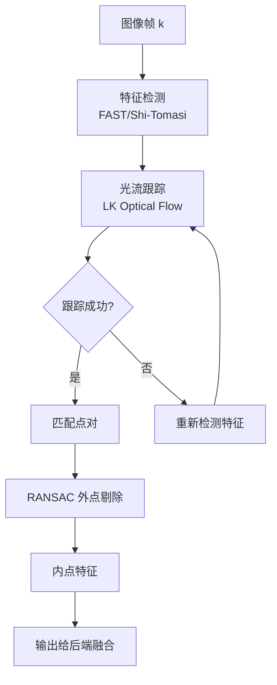
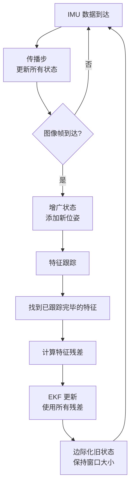
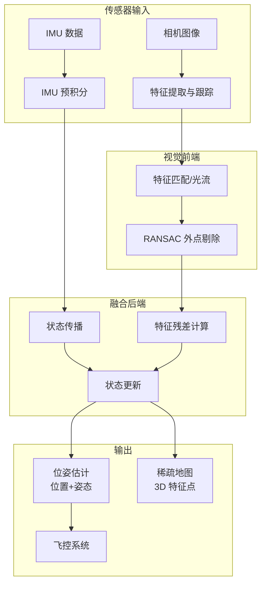
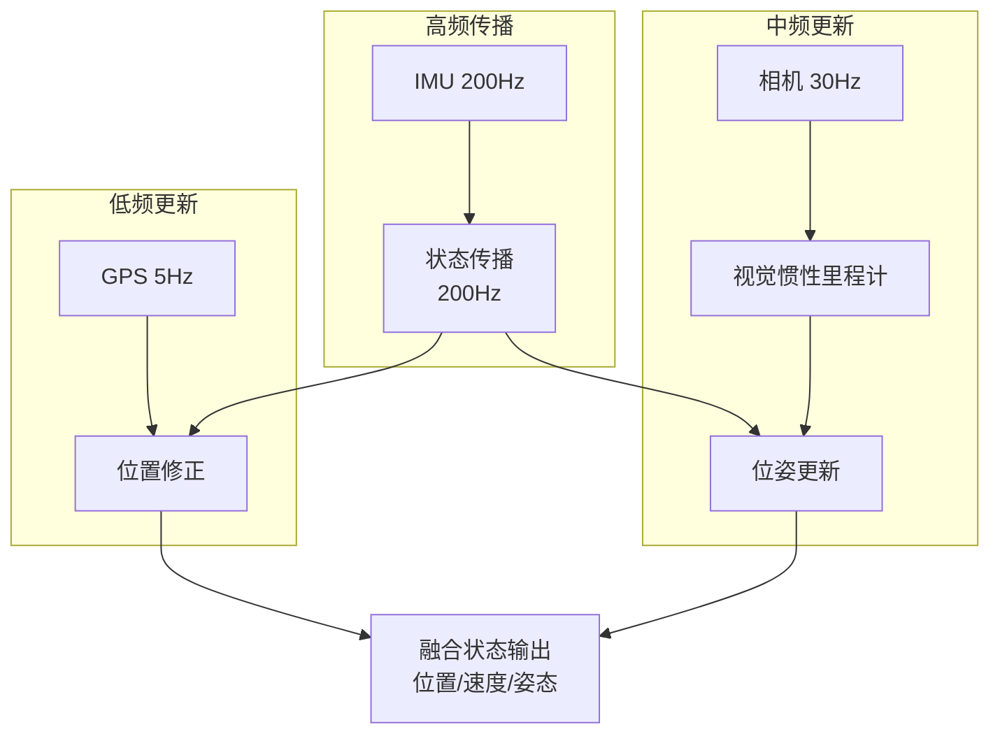

# 视觉惯性导航与融合

> 预计阅读：20 分钟 | 前置知识：EKF 基础、IMU 建模、计算机视觉基本概念

---

## 1. 视觉惯性导航系统 (VINS) 概述

### 1.1 为什么需要视觉传感器？

| 传感器 | 优势 | 局限 |
|--------|------|------|
| IMU | 高频率、短期精度高 | 积分漂移无界 |
| GPS | 长期位置稳定 | 室内不可用、更新率低 |
| 气压计 | 垂直方向参考 | 精度有限 |
| **相机** | **成本低、信息丰富、无漂移** | **计算量大、依赖纹理/光照** |

视觉传感器的引入使得无人机在**室内、GPS 拒止环境**下也能实现可靠的自主导航。

### 1.2 VINS 的核心思想

```
┌────────────────────────────────────────────────────────────┐
│                 VINS 核心架构                                │
│                                                            │
│  ┌──────────┐         ┌──────────────┐         ┌────────┐ │
│  │  相机    │────────►│  视觉前端    │────────►│ 特征点 │ │
│  │  图像流  │         │  跟踪/匹配   │         │ 轨迹   │ │
│  └──────────┘         └──────────────┘         └───┬────┘ │
│                                                     │      │
│  ┌──────────┐         ┌──────────────┐         ┌───▼────┐ │
│  │  IMU     │────────►│  预积分      │────────►│ 融合   │ │
│  │  数据    │         │  Preintegrate│         │ 后端   │ │
│  └──────────┘         └──────────────┘         └───┬────┘ │
│                                                     │      │
│                                                     ▼      │
│                                              ┌──────────┐ │
│                                              │ 状态估计 │ │
│                                              │ 位姿/地图│ │
│                                              └──────────┘ │
└────────────────────────────────────────────────────────────┘
```

### 1.3 相机作为位置/速度传感器

**针孔相机模型：**

$$
\begin{bmatrix} u \\ v \\ 1 \end{bmatrix} = \frac{1}{Z} \mathbf{K} \begin{bmatrix} X \\ Y \\ Z \end{bmatrix}
$$

其中 $\mathbf{K}$ 为相机内参矩阵，$[X, Y, Z]^T$ 为特征点在相机坐标系下的三维坐标。

**关键概念：**
- 单目相机只能测量**方向**，无法直接获取深度（尺度不可观）
- 双目相机或与 IMU 融合可以恢复**尺度**
- 相机测量的是**相对运动**，而非绝对位置

---

## 2. 特征跟踪与光流

### 2.1 特征点检测

常用特征检测器：

| 检测器 | 特点 | 实时性 |
|--------|------|--------|
| FAST | 速度快，角点检测 | 优秀 |
| ORB | 旋转不变，可描述 | 优秀 |
| Shi-Tomasi | 好的角点选择 | 优秀 |
| SIFT | 尺度不变，精度高 | 较慢 |

### 2.2 Lucas-Kanade 光流

光流是计算相邻帧间像素运动的经典方法：

$$
I_x \dot{x} + I_y \dot{y} + I_t = 0
$$

假设窗口内运动一致，求解最小二乘问题：

$$
\begin{bmatrix} \dot{x} \\ \dot{y} \end{bmatrix} = \left( \mathbf{A}^T \mathbf{A} \right)^{-1} \mathbf{A}^T \mathbf{b}
$$

### 2.3 视觉前端 Pipeline



---

## 3. MSCKF 简介

### 3.1 Multi-State Constraint Kalman Filter

MSCKF 是专门为视觉惯性导航设计的高效 EKF 变体。

**核心思想：**
- 不将地图点 (landmark) 作为状态（与传统 EKF SLAM 不同）
- 将多帧中观测到同一特征产生的约束直接用于更新
- 状态只包含当前帧和最近 N 帧的位姿

**状态向量：**

$$
\mathbf{x} = \begin{bmatrix} \mathbf{x}_{IMU} \\ \mathbf{T}_1 \\ \mathbf{T}_2 \\ \vdots \\ \mathbf{T}_N \end{bmatrix}
$$

其中 $\mathbf{x}_{IMU}$ 是当前 IMU 状态（15 维），$\mathbf{T}_i$ 是滑动窗口中第 $i$ 帧的 6-DOF 位姿。

### 3.2 MSCKF 流程



### 3.3 MSCKF vs 传统 EKF SLAM

| 特性 | MSCKF | EKF-SLAM |
|------|-------|----------|
| 状态维度 | O(N) | O(N + M) |
| 计算复杂度 | O(N²) | O((N+M)³) |
| N=滑动窗口大小 | 通常 10-20 | — |
| M=地图点数量 | 不在状态中 | 可达数千 |
| 适用场景 | 实时 VIO | 地图构建 |
| 内存需求 | 低 | 高 |

---

## 4. 视觉惯性里程计 (VIO) Pipeline

### 4.1 完整 VIO 流程图



### 4.2 IMU 预积分 (Preintegration)

在两次视觉帧之间，IMU 提供大量测量。预积分将这些测量累积为一个相对约束：

$$
\Delta \mathbf{R}_{ij} = \prod_{k=i}^{j-1} \exp([\boldsymbol{\omega}_k - \mathbf{b}_g]_\times \Delta t)
$$

$$
\Delta \mathbf{v}_{ij} = \sum_{k=i}^{j-1} \Delta \mathbf{R}_k (\mathbf{a}_k - \mathbf{b}_a) \Delta t
$$

$$
\Delta \mathbf{p}_{ij} = \sum_{k=i}^{j-1} \left[ \Delta \mathbf{v}_k \Delta t + \frac{1}{2} \Delta \mathbf{R}_k (\mathbf{a}_k - \mathbf{b}_a) \Delta t^2 \right]
$$

**预积分的优势：**当 IMU 偏置估计更新时，不需要重新积分所有 IMU 数据，只需通过偏置雅可比进行一阶修正。

---

## 5. 传感器融合架构

### 5.1 紧耦合 vs 松耦合

```
┌─────────────────────────────────────────────────────────────┐
│                    松耦合 (Loosely Coupled)                   │
│                                                             │
│  ┌──────────┐   ┌──────────┐                               │
│  │ 视觉 VIO │   │ IMU+EKF  │                               │
│  │ (独立)   │   │ (独立)   │                               │
│  └────┬─────┘   └────┬─────┘                               │
│       │              │                                      │
│       ▼              ▼                                      │
│  ┌────────────────────────┐                                 │
│  │ 位置/速度/姿态融合     │                                 │
│  └────────────────────────┘                                 │
└─────────────────────────────────────────────────────────────┘

┌─────────────────────────────────────────────────────────────┐
│                    紧耦合 (Tightly Coupled)                   │
│                                                             │
│  ┌──────────┐   ┌──────────┐                               │
│  │ 视觉特征 │   │ IMU 预   │                               │
│  │ (原始)   │   │ 积分测量 │                               │
│  └────┬─────┘   └────┬─────┘                               │
│       │              │                                      │
│       ▼              ▼                                      │
│  ┌────────────────────────┐                                 │
│  │ 统一 EKF/优化后端      │                                 │
│  │ (共同状态估计)         │                                 │
│  └────────────────────────┘                                 │
└─────────────────────────────────────────────────────────────┘
```

### 5.2 三传感器融合架构



### 5.3 Simulink 集成方案

```matlab
% VINS 集成框架参数
VINS.camera.freq = 30;         % Hz
VINS.camera.resolution = [640, 480];
VINS.camera.fov = 90;          % 度

VINS.feature.max_num = 200;    % 最大特征数
VINS.feature.min_dist = 20;    % 像素最小距离

VINS.msf.window_size = 10;    % MSCKF 滑动窗口大小

% 与EKF集成
EKF.vision_update.enable = true;
EKF.vision_update.noise_std = 0.5;  % 视觉测量噪声 (像素)
```

---

## 6. 挑战与解决方案

### 6.1 尺度漂移 (Scale Drift)

**问题：** 纯单目视觉无法确定绝对尺度，长时间运行后尺度会缓慢变化。

**解决方案：**
- **IMU 融合**：IMU 提供度量级的加速度信息，可以约束尺度
- **双目相机**：直接提供深度信息
- **深度传感器**：ToF、结构光等

### 6.2 特征匮乏环境

**问题：** 纹理缺失区域（白墙、天空）无法提取有效特征。

**解决方案：**
- **混合特征策略**：点特征 + 线特征 + 面特征
- **回环检测**：当重新到达已访问区域时修正漂移
- **GPS 辅助**：在室外环境切换到 GPS 辅助

### 6.3 运动模糊

**问题：** 快速运动或低光照导致图像模糊，特征跟踪失败。

**解决方案：**
- 使用事件相机 (Event Camera)
- 提高曝光补偿
- 运动预测辅助特征搜索

### 6.4 动态物体

**问题：** 移动物体（行人、车辆）上的特征会干扰位姿估计。

**解决方案：**
- 语义分割识别并排除动态物体
- RANSAC 鲁棒估计
- 光流一致性检查

---

## 7. Simulink 实现要点

### 7.1 图像处理模块

```matlab
% Simulink 中的视觉模块配置
% 使用 Computer Vision Toolbox

% 特征检测
featureDetector = detectFASTFeatures(img, 'MinQuality', 0.01);

% 光流跟踪
opticFlow = opticalFlowLK('NumPyramidLevels', 3);
flow = estimateFlow(opticFlow, img_gray);

% 与Simulink集成：使用 MATLAB Function block
% 输入：图像帧、IMU预测位姿
% 输出：视觉测量（位移/速度）
```

### 7.2 S-Function 封装 VIO

```matlab
function UAV_VIO_Init(block)
    block.NumInputPorts  = 3;  % IMU accel, gyro, image
    block.NumOutputPorts = 2;  % position, attitude

    block.SetPreCompPortInfoToDynamic;
    block.SampleTimes = [1/30, 0];  % 30Hz 图像帧率

    block.RegBlockMethod('Outputs', @Output);
end

function Output(block)
    img = block.InputPort(3).Data;
    accel = block.InputPort(1).Data;
    gyro = block.InputPort(2).Data;

    % 调用 VIO 处理管线
    [pos, att] = vio_pipeline(img, accel, gyro);

    block.OutputPort(1).Data = pos;
    block.OutputPort(2).Data = att;
end
```

---

## 8. 开源 VINS 参考实现

| 项目 | 特点 | 适用场景 |
|------|------|---------|
| VINS-Mono | 紧耦合滑动窗口优化 | 小型 UAV |
| MSCKF-VIO | EKF 框架，计算高效 | 计算受限平台 |
| ORB-SLAM3 | 多地图，最鲁棒 | 通用 SLAM |
| OpenVINS | 学术基准，模块化 | 研究/教学 |
| SVO Pro | 半直接法，速度快 | 高速飞行 |

---

## 思考题

1. **单目 VIO 为什么存在尺度不可观性？IMU 是如何帮助恢复尺度的？**

<details><summary>参考答案</summary>
单目相机只能测量像素平面上的位移方向，无法区分"近距离小运动"和"远距离大运动"（相似三角形原理）。即如果将整个场景和运动同时缩放 λ 倍，像素测量完全相同，因此纯单目系统中尺度是不可观的。IMU 测量的加速度包含重力分量，是度量级的物理量。在静止时加速度计读数为 $g ≈ 9.81 m/s²$，运动时加速度与位移关系为 $a = Δs/Δt²$。通过将 IMU 加速度积分的位移与视觉里程计的位移对齐，可以唯一确定尺度因子。这就是为什么 VINS 系统需要 IMU 初始化阶段来确定初始尺度。
</details>

2. **MSCKF 为什么不把地图点加入状态向量？这样做有什么好处和代价？**

<details><summary>参考答案</summary>
传统 EKF-SLAM 将每个地图点作为状态向量的一部分，导致状态维度与地图点数量 M 成正比，协方差矩阵为 O((N+M)²)，计算复杂度为 O((N+M)³)，难以实时运行。MSCKF 的做法是：当一个特征点被跟踪完毕（不再可见），利用它在多帧中的观测残差一次性更新状态，然后丢弃该特征点。好处：状态维度只与滑动窗口大小 N 成正比，计算量为 O(N²)；不需要存储和维护地图。代价：无法进行回环检测（没有地图用于重定位），也无法直接输出稠密地图。对于纯导航任务，这是可以接受的。
</details>

3. **在特征匮乏的环境中（如白墙走廊），如何提高 VINS 的鲁棒性？**

<details><summary>参考答案</summary>
可以从多个层面应对：(1) **特征层面**——除了点特征，引入线特征（LSD/BriefLines）和面特征，白墙的边缘和角落仍然可以检测；(2) **传感器层面**——加入超声波/ToF 测距仪作为额外的深度参考；(3) **算法层面**——增加对 IMU 预积分的权重（在视觉测量不足时更多依赖 IMU），但要注意 IMU 漂移；(4) **系统层面**——检测特征数量，当低于阈值时触发告警或切换到保守飞行模式（如降低速度、增加安全距离）；(5) **环境层面**——在环境中放置人工标志（AprilTag/QR码）提供位置参考。
</details>

4. **预积分 (Preintegration) 的数学意义是什么？为什么它对紧耦合 VIO 至关重要？**

<details><summary>参考答案</summary>
预积分将两帧之间的大量 IMU 测量（可能数百到数千个）累积为一个相对运动约束 $\Delta \mathbf{R}_{ij}, \Delta \mathbf{v}_{ij}, \Delta \mathbf{p}_{ij}$。这个约束只依赖于两帧之间的相对运动，而不依赖于起始帧的绝对位姿。这对紧耦合 VIO 至关重要，因为在优化过程中起始帧的位姿会不断更新，如果使用普通积分，每次更新都需要重新积分所有 IMU 数据。预积分通过引入偏置雅可比，在偏置微调时只需一阶修正，避免了重复积分的计算量。这是实时紧耦合 VIO（如 VINS-Mono、OKVIS）能够运行的关键。
</details>

5. **松耦合和紧耦合在精度和计算量上有什么具体差异？在 Simulink 原型验证阶段应选择哪种？**

<details><summary>参考答案</summary>
松耦合中，视觉和 IMU 分别独立处理后融合，信息损失较多，但实现简单、计算量低，精度通常在 1-2% 路程误差。紧耦合中，视觉特征的原始测量直接参与状态估计，信息利用更充分，精度通常在 0.5-1% 路程误差，但实现复杂、计算量大。在 Simulink 原型验证阶段，建议选择**松耦合**方案：(1) 各传感器模块可以独立验证，便于调试；(2) Simulink 的性能瓶颈不在算法精度，而在仿真速度；(3) 松耦合的 Simulink 模型更清晰，便于理解；(4) 验证通过后再考虑移植到 C++ 实现紧耦合方案。
</details>

---

> **参考资料：**
> - hoangvietdo/drone_vins_sim
> - Mourikis & Roumeliotis, *A Multi-State Constraint Kalman Filter for Vision-Aided Inertial Navigation*, ICRA 2007
> - Qin et al., *VINS-Mono: A Robust and Versatile Monocular Visual-Inertial State Estimator*, TRO 2018
> - Sun et al., *OpenVINS: A Research Platform for Visual-Inertial State Estimation*, ICRA 2020
