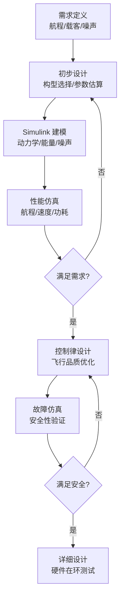

# eVTOL 与城市空中交通 (UAM)

> 预计阅读：18 分钟 | 前置知识：多旋翼/固定翼基础、电池与电机模型、适航认证概念

---

## 1. eVTOL 概述

### 1.1 什么是 eVTOL？

eVTOL（electric Vertical Takeoff and Landing）指采用**电力驱动**的垂直起降飞行器，是城市空中交通 (Urban Air Mobility, UAM) 的核心运载工具。

```
┌─────────────────────────────────────────────────────────────┐
│                    eVTOL 生态系统                             │
│                                                             │
│    ┌──────────┐     ┌──────────┐     ┌──────────┐          │
│    │ eVTOL   │     │ 基础设施 │     │ 空域管理 │          │
│    │ 飞行器   │     │ 起降场   │     │ UTM      │          │
│    └────┬─────┘     └────┬─────┘     └────┬─────┘          │
│         │                │                │                │
│         └────────────────┼────────────────┘                │
│                          ▼                                 │
│                 ┌──────────────────┐                       │
│                 │  城市空中交通    │                       │
│                 │  (UAM)          │                       │
│                 └──────────────────┘                       │
└─────────────────────────────────────────────────────────────┘
```

### 1.2 代表性 eVTOL 项目

| 公司 | 项目 | 构型 | 载客 | 航程 (km) | 速度 (km/h) |
|------|------|------|------|----------|-------------|
| Joby Aviation | S4 | 倾转旋翼 | 4+1 | 240 | 320 |
| Lilium | Jet | 电动涵道风扇 | 6+1 | 300 | 300 |
| Archer | Midnight | 倾转旋翼 | 4+1 | 100 | 240 |
| EHang | EH216 | 多旋翼 | 2 | 30 | 130 |
| Volocopter | VoloCity | 多旋翼 | 1+1 | 35 | 110 |
| 亿航 | EH216-S | 多旋翼 | 2 | 30 | 130 |
| 峰飞 | 盛世龙 | 复合翼 | 5+1 | 250 | 200 |

### 1.3 eVTOL vs 传统直升机

| 特性 | eVTOL | 传统直升机 |
|------|-------|-----------|
| 驱动方式 | 电动机 | 涡轴/活塞发动机 |
| 噪声 | 低 (< 65 dB) | 高 (> 80 dB) |
| 维护 | 简单 (电机少活动件) | 复杂 (传动系统) |
| 能源成本 | 低 (电费) | 高 (燃油) |
| 排放 | 零排放 | 碳排放 |
| 航程 | 30–300 km | 500+ km |
| 速度 | 100–320 km/h | 200–300 km/h |
| 适航认证 | 进行中 | 已有体系 |
| 自主程度 | L4/L5 目标 | L2/L3 |

---

## 2. 能量建模

### 2.1 电池模型

**等效电路模型 (ECM)：**

```
  ┌──────────┐
  │  OCV(SOC)│  开路电压 (SOC的函数)
  │    ──┤├──│
  │     R_0  │  欧姆内阻
  │    ──┤├──│
  │    R_1,C_1│  极化电阻/电容 (RC网络)
  │    ──┤├──│
  └──────────┘
```

**电池放电模型：**

$$
V_{terminal} = OCV(SOC) - I \cdot R_0 - V_{RC}
$$

$$
\frac{dSOC}{dt} = -\frac{I}{Q_{capacity}}
$$

$$
\frac{dV_{RC}}{dt} = -\frac{V_{RC}}{R_1 C_1} + \frac{I}{C_1}
$$

### 2.2 电池参数

| 参数 | 锂聚合物 (LiPo) | 固态电池 (预期) |
|------|----------------|----------------|
| 能量密度 | 150–250 Wh/kg | 400–500 Wh/kg |
| 功率密度 | 1–3 kW/kg | 2–5 kW/kg |
| 循环寿命 | 300–500 次 | 1000+ 次 |
| 充电速度 | 1C (标准) | 3C+ |
| 安全性 | 需保护电路 | 更安全 |

### 2.3 电机效率模型

**电机效率与工作点的关系：**

$$
\eta_{motor} = \frac{T \cdot \omega}{V_{bus} \cdot I_{bus}}
$$

典型效率曲线：

```
  η (%)
  ▲
  │         ╱──────╲
  │       ╱          ╲
  │     ╱    高效区    ╲
  │   ╱   (80-95%)      ╲
  │ ╱                      ╲
  │╱                          ╲
  └──────────────────────────────► 油门 (%)
  0    20    40    60    80   100
```

### 2.4 航程估算

**Breguet 电动航程公式：**

$$
R = \frac{\eta_{total}}{g \cdot SFC_{elec}} \cdot \frac{E_{battery}}{W} \cdot L/D
$$

简化估算：

$$
R \approx \frac{\eta_{total} \cdot E_{battery}}{P_{hover} \cdot t_{hover} + D_{cruise} \cdot R}
$$

**典型估算示例：**

```matlab
% eVTOL 航程估算
E_battery = 100;          % kWh 电池容量
eta_motor = 0.90;         % 电机效率
eta_prop = 0.80;          % 螺旋桨效率
eta_total = eta_motor * eta_prop;
mass = 2000;              % kg 最大起飞重量

% 悬停功耗 (简化)
T = mass * 9.81;          % 推力 = 重力
FM = 0.75;                % 品质因数
A_rotor = 15;             % 旋翼总面积 m^2
P_hover = T^(3/2) / (sqrt(2 * 1.225 * A_rotor) * FM);
P_hover = P_hover / 1000; % 转换为 kW

% 巡航功耗 (简化)
L_D = 10;                 % 升阻比
V_cruise = 200 / 3.6;     % m/s
P_cruise = mass * 9.81 * V_cruise / (L_D * eta_total);
P_cruise = P_cruise / 1000;

% 航程估算
t_cruise = E_battery / P_cruise;    % 小时
R = V_cruise * t_cruise * 3.6;      % km
fprintf('预估航程: %.0f km\n', R);
```

---

## 3. 噪声建模

### 3.1 eVTOL 噪声的重要性

城市空中交通必须满足严格的噪声标准，否则无法在城市上空运营。

**eVTOL 噪声源：**

| 噪声源 | 特性 | 占比 |
|--------|------|------|
| 旋翼/螺旋桨 | 宽频 + 叶片通过频率 (BPF) | 70–80% |
| 电机 | 高频电磁噪声 | 10–15% |
| 气动干扰 | 旋翼-机翼/机身干扰 | 10–15% |

### 3.2 噪声传播模型

**球面扩散 + 大气吸收：**

$$
L_p(r) = L_W - 20\log_{10}(r) - 11 - \alpha \cdot r
$$

其中：
- $L_p(r)$：距离 $r$ 处的声压级 (dB)
- $L_W$：声功率级 (dB)
- $\alpha$：大气吸收系数 (dB/m)
- $r$：到声源的距离 (m)

### 3.3 旋翼噪声预测

**BPF 噍声频率：**

$$
f_{BPF} = n_{blades} \times RPM / 60
$$

**悬停旋翼噪声 (半经验模型)：**

$$
L_W = 10\log_{10}\left(\frac{T^{7/2}}{\rho A_{disk}}\right) + K_{noise}
$$

### 3.4 噪声对 eVTOL 设计的影响

| 设计参数 | 对噪声的影响 |
|---------|------------|
| 旋翼直径 | 大直径 → 低转速 → 低噪声 |
| 叶片数量 | 多叶片 → 分散推力 → 降低 BPF |
| 翼尖速度 | 降低翼尖速度 → 显著降噪 |
| 涵道设计 | 涵道可屏蔽部分噪声 |
| 飞行剖面 | 优化下降角度降低地面噪声 |

---

## 4. 适航认证与仿真要求

### 4.1 认证框架

| 地区 | 标准 | 状态 |
|------|------|------|
| 美国 (FAA) | 14 CFR Part 21 / Special Conditions | 制定中 |
| 欧洲 (EASA) | SC-VTOL (Special Condition VTOL) | 已发布 |
| 中国 (CAAC) | CCAR-21 / 咨询通告 | 制定中 |

### 4.2 仿真在认证中的角色

```
┌──────────────────────────────────────────────────────────────┐
│           仿真在 eVTOL 适航认证中的角色                         │
│                                                              │
│  ┌──────────────┐    ┌──────────────┐    ┌──────────────┐   │
│  │ 概念设计阶段  │    │ 详细设计阶段 │    │ 验证阶段    │   │
│  │              │    │              │    │              │   │
│  │ • 性能仿真   │    │ • 控制律验证 │    │ • MIL/SIL   │   │
│  │ • 噪声预测   │    │ • 故障注入   │    │ • HIL       │   │
│  │ • 能量分析   │    │ • 环境适应性 │    │ • 飞行测试  │   │
│  └──────────────┘    └──────────────┘    └──────────────┘   │
│                                                              │
│  认证当局要求：                                               │
│  - 仿真模型需经过验证与确认 (V&V)                              │
│  - 故障模式覆盖率需满足要求                                    │
│  - 需要 Monte Carlo 仿真证明统计安全性                        │
└──────────────────────────────────────────────────────────────┘
```

### 4.3 故障模式仿真

| 故障类型 | 需要仿真的场景 | 安全性要求 |
|---------|--------------|-----------|
| 单电机失效 | 剩余电机维持安全着陆 | 必须演示 |
| 电池单体失效 | 降功率飞行 | 必须演示 |
| 传感器故障 | 失去 GPS/IMU | 必须演示 |
| 通信链路丢失 | 自主返航/着陆 | 必须演示 |
| 多重故障 | 最不利组合 | 概率分析 |

---

## 5. Simulink 在 eVTOL 设计中的应用

### 5.1 设计优化流程



### 5.2 Simulink 模型架构

```matlab
% eVTOL Simulink 模型参数框架
eVTOL.num_rotors = 6;             % 旋翼数量
eVTOL.rotor_diameter = 1.8;       % m
eVTOL.wing_area = 8;              % m^2
eVTOL.MTOW = 2000;                % kg 最大起飞重量
eVTOL.battery_capacity = 100;     % kWh
eVTOL.battery_mass = 300;         % kg

% 飞行剖面
profile.hover_time = 120;         % s 悬停时间
profile.cruise_altitude = 500;    % m
profile.cruise_speed = 200;       % km/h
profile.climb_rate = 5;           % m/s

% 噪声约束
noise.max_65dB_distance = 100;   % m (65dB等值线距离)
noise.ground_level_limit = 65;    % dB(A) 地面噪声限制
```

### 5.3 能量管理仿真

```matlab
function [SOC, P_total, range] = energy_simulation(eVTOL, profile, dt)
    % 能量管理仿真
    SOC = 1.0;  % 初始电量 100%
    P_total = 0;
    distance = 0;

    % 飞行阶段
    phases = {'hover_takeoff', 'climb', 'cruise', 'descent', 'hover_landing'};

    for phase = phases
        switch phase{1}
            case 'hover_takeoff'
                P = hover_power(eVTOL);
                t = profile.hover_time / 2;
            case 'climb'
                P = climb_power(eVTOL, profile.climb_rate);
                t = profile.cruise_altitude / profile.climb_rate;
            case 'cruise'
                P = cruise_power(eVTOL, profile.cruise_speed);
                t = estimate_cruise_time(eVTOL, profile, SOC);
                distance = distance + profile.cruise_speed/3.6 * t;
            case 'descent'
                P = descent_power(eVTOL, profile.climb_rate);
                t = profile.cruise_altitude / profile.climb_rate;
            case 'hover_landing'
                P = hover_power(eVTOL);
                t = profile.hover_time / 2;
        end

        % 更新电池状态
        energy = P * t / 3600;  % kWh
        SOC = SOC - energy / eVTOL.battery_capacity;
        P_total = P_total + P * t;
    end

    range = distance / 1000;  % km
end
```

---

## 6. 与传统直升机仿真的对比

| 仿真方面 | eVTOL | 传统直升机 |
|---------|-------|-----------|
| 动力系统 | 电机 + 电池 | 发动机 + 燃油 |
| 能量模型 | 电池 SOC + 电机效率 | 燃油流量 + 发动机性能 |
| 控制器 | 电调 (ESC) 直接控速 | 液压伺服控制 |
| 噪声特征 | 高频为主 | 低频为主 (BPF < 200 Hz) |
| 冗余设计 | 多电机冗余 | 双发 + 自旋 |
| 仿真工具链 | Simulink + Simscape | FLIGHTLAB / RCAS |
| 认证路径 | 新标准 (SC-VTOL) | CS-27 / CS-29 |

---

## 思考题

1. **eVTOL 的电池能量密度如何影响航程设计？如果电池能量密度从 250 Wh/kg 提升到 400 Wh/kg，航程大约能增加多少？**

<details><summary>参考答案</summary>
电池能量密度直接影响可用能量与电池重量的比值。假设总起飞重量中电池占比为 $\alpha$，那么每公斤起飞重量对应的可用能量为 $\alpha \cdot E_{density}$。航程与可用能量近似成正比，因此航程与能量密度成正比。从 250 提升到 400 Wh/kg，航程理论增加 $(400-250)/250 = 60\%$。但实际情况更复杂：(1) 如果保持电池重量不变，增加的能量意味着更大的总重（需要更强的结构），反而降低了效率；(2) 如果保持总重不变，更轻的电池允许更大的有效载荷或更少的电池重量，优化后航程增加约 40-50%；(3) 电池放电特性也随能量密度变化。这就是为什么固态电池被视为 eVTOL 的"game changer"。
</details>

2. **为什么 eVTOL 的噪声主要集中在旋翼/螺旋桨？可以从物理机制上解释吗？**

<details><summary>参考答案</summary>
旋翼噪声的主要物理机制包括：(1) **厚度噪声**——旋翼叶片在空气中运动，排出的空气体积产生压力脉冲，与叶片体积和转速有关；(2) **载荷噪声**——旋翼产生推力时对空气施加力，力的变化产生声波，频率与叶片通过频率 (BPF) 相关；(3) **宽带噪声**——叶片表面湍流边界层和翼尖涡脱落产生宽频噪声，是悬停时的主要噪声源；(4) **叶尖涡-叶片干扰 (BVI)**——下降时前飞旋翼的叶尖涡被后续叶片切割，产生强烈的脉冲噪声。电机噪声虽然频率高但幅度小，气动噪声主要由旋翼产生。因此 eVTOL 降噪的关键在于旋翼设计：大直径、低转速、多叶片、优化翼型。
</details>

3. **在 Simulink 中如何实现 eVTOL 单电机失效的故障注入仿真？需要评估哪些关键指标？**

<details><summary>参考答案</summary>
故障注入实现：(1) 在电机模型中加入故障开关，可以在任意时刻将某电机的推力置零或设为异常值；(2) 使用 Stateflow 定义故障模式（突然失效、渐进退化、过速等）；(3) 在控制器中加入故障检测逻辑，当检测到电机故障后切换到容错控制模式。关键评估指标：(1) 故障后的姿态偏差和恢复时间；(2) 能否在规定时间内安全着陆；(3) 结构载荷是否超过限制；(4) 电池在应急状态下的放电特性；(5) 最不利故障时机（如悬停最低高度、最大速度时）。EASA SC-VTOL 要求单电机失效后能够安全着陆，这是最基本的适航要求。
</details>

4. **eVTOL 的噪声模型如何集成到 Simulink 飞行仿真中？如何优化飞行剖面以降低地面噪声？**

<details><summary>参考答案</summary>
集成方式：(1) 在每个仿真时间步，根据当前旋翼转速、推力和位置，使用噪声传播模型计算地面各点的声压级；(2) 将噪声模型封装为 Simulink 子系统，输入为旋翼状态和位置，输出为地面噪声分布；(3) 使用 3D 可视化显示噪声等值线。优化策略：(1) **飞行高度**——增加巡航高度显著降低地面噪声（与距离平方成反比）；(2) **下降轨迹**——使用 3° 标准下滑道代替陡降，避免 BVI 噪声；(3) **速度剖面**——在噪声敏感区域降低速度，减少旋翼载荷；(4) **旋翼转速优化**——在满足推力需求的前提下最小化转速（增加桨距角代替增加转速）。
</details>

5. **eVTOL 与城市空中交通的未来发展中，仿真技术还需要在哪些方面取得突破？**

<details><summary>参考答案</summary>
需要突破的方面：(1) **高保真多物理场耦合**——气动-结构-声学-电磁的耦合仿真，当前各领域分别建模，缺乏集成；(2) **大规模城市环境仿真**——数百架 eVTOL 同时在城市峡谷中飞行，包括建筑绕流、尾流遭遇、通信干扰；(3) **数字孪生**——实时将飞行器状态与仿真模型同步，用于预测性维护和在线优化；(4) **AI 验证**——当 eVTOL 使用深度学习进行感知和决策时，如何通过仿真证明其安全性（对抗样本、极端场景）；(5) **电池退化建模**——长期使用后电池性能变化对飞行安全的影响，需要数千次循环的仿真验证；(6) **适航认证仿真标准**——建立统一的仿真 V&V 框架，使仿真结果被认证当局接受。
</details>

---

> **参考资料：**
> - nareshtuppathi — eVTOL 设计与仿真
> - Mariam-Wagdy — eVTOL 性能分析
> - Joby Aviation S4 技术白皮书
> - EASA SC-VTOL, *Special Condition for VTOL*, 2019
> - NASA AAM (Advanced Air Mobility) 仿真框架
> - Silva et al., *eVTOL Flight Dynamics Modeling and Simulation*, AIAA 2020
