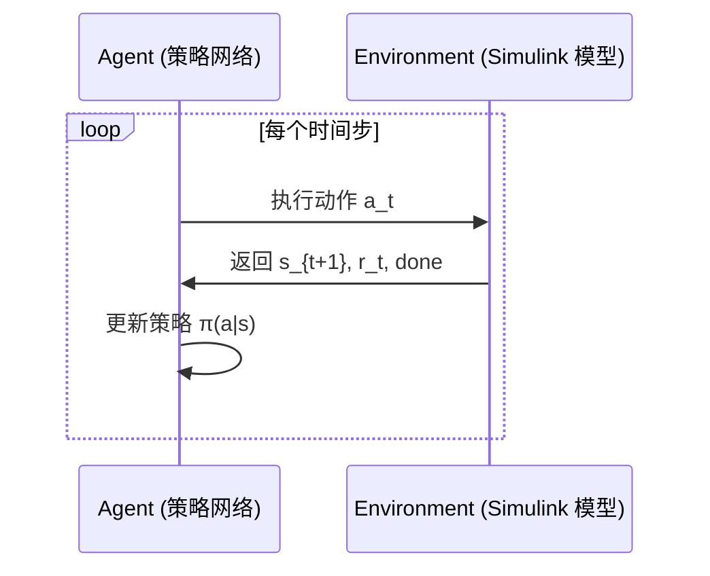
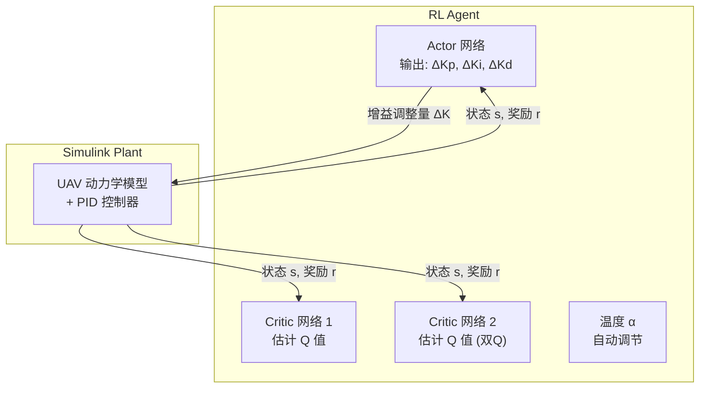
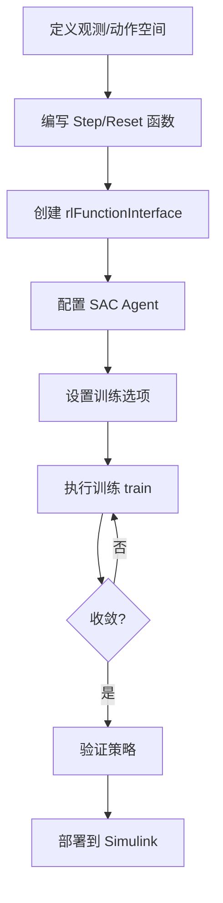
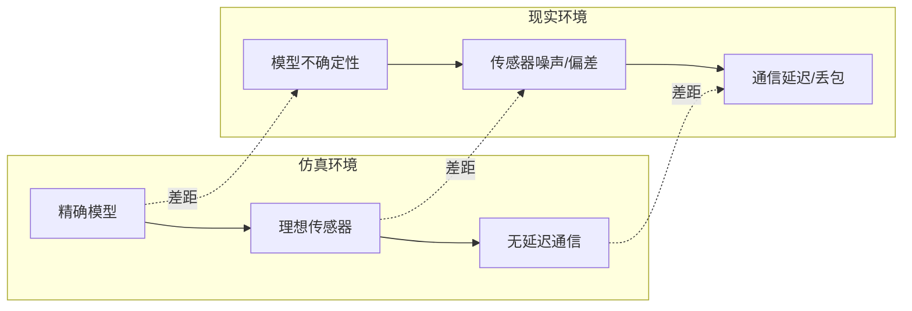

# 强化学习辅助控制

> 预计阅读：20 分钟 | 前置知识：PID 控制基础、Simulink 建模、Python 基础

---

## 1. 为什么用强化学习辅助 UAV 控制

传统 PID 控制器的参数整定依赖工程师经验或 Ziegler-Nichols 等经典方法，面对以下场景时往往力不从心：

- **非线性动力学**：大角度机动时线性化假设失效
- **时变参数**：载荷变化、电池电压下降导致模型参数漂移
- **多耦合通道**：姿态-位置-速度环之间存在强耦合
- **复杂约束**：执行器饱和、安全包络等硬约束

强化学习（Reinforcement Learning, RL）作为一种**无模型优化方法**，通过与环境的交互试错来学习最优策略，天然适合处理上述问题。

```
传统方法：  模型 → 推导 → 解析最优 → 参数
RL 方法：  交互 → 试错 → 经验积累 → 策略改进
```

---

## 2. 强化学习基础概念

### 2.1 马尔可夫决策过程（MDP）

强化学习问题通常建模为 MDP，由五元组定义：

| 符号 | 含义 | UAV 控制中的对应 |
|------|------|-----------------|
| S | 状态空间 | 姿态角、角速度、位置、速度 |
| A | 动作空间 | 电机 PWM / 力矩指令 |
| P | 状态转移概率 | 飞行动力学（未知） |
| R | 奖励函数 | 跟踪误差小 → 正奖励 |
| γ | 折扣因子 | 0.99（长期回报重要） |

### 2.2 Agent-Environment 交互循环



### 2.3 核心算法分类

| 算法类别 | 代表算法 | 适用场景 | 特点 |
|---------|---------|---------|------|
| 基于值 | DQN, Double DQN | 离散动作空间 | 简单高效 |
| 策略梯度 | REINFORCE, PPO | 连续动作空间 | 端到端优化 |
| Actor-Critic | SAC, TD3, A3C | 连续+高效采样 | 稳定+探索性强 |
| 模型-based | MBPO, Dreamer | 样本效率高 | 需要环境模型 |

UAV 控制中动作空间（油门、舵量）是连续的，**SAC 和 PPO** 是最常用的选择。

---

## 3. SAC (Soft Actor-Critic) 用于 PID 增益整定

### 3.1 SAC 算法核心思想

SAC 是一种**最大熵**强化学习算法，同时优化累计回报和策略熵：

```
J(π) = Σ E[γ^t (r_t + α · H(π(·|s_t)))]
```

其中 `H(π(·|s))` 是策略熵，`α` 是温度系数。最大化熵意味着：
- 鼓励探索：避免过早收敛到局部最优
- 提高鲁棒性：策略不会对某一状态过度特化

### 3.2 系统架构



### 3.3 状态空间设计

```
s_t = [e_p(t), e_p(t-1), ∫e_p dt, φ, θ, ψ, p, q, r, Kp, Ki, Kd]
```

| 状态变量 | 维度 | 说明 |
|---------|------|------|
| e_p(t), e_p(t-1) | 2 | 位置跟踪误差及上一步误差 |
| ∫e_p dt | 1 | 误差积分项 |
| φ, θ, ψ | 3 | 欧拉角 |
| p, q, r | 3 | 角速度 |
| Kp, Ki, Kd | 3 | 当前 PID 增益 |

**总维度：12**

### 3.4 动作空间设计

```
a_t = [ΔKp, ΔKi, ΔKd]  ∈ [-1, 1]^3
```

通过缩放因子映射到实际增益调整范围：
```
Kp_new = Kp_base + ΔKp × scale_Kp
```

---

## 4. Simulink-RL Toolbox 集成

### 4.1 rlFunctionInterface 概述

MATLAB Reinforcement Learning Toolbox 提供 `rlFunctionInterface`，允许将任意 Simulink 模型包装为 RL 环境。

```matlab
% 创建环境接口
env = rlFunctionInterface( ...
    @stepFunction, ...    % 步进函数
    @resetFunction, ...   % 重置函数
    obsInfo, ...          % 观测空间规格
    actInfo);             % 动作空间规格
```

### 4.2 Step Function 实现

```matlab
function [obs, reward, done, loggedSignals] = uavStepFcn(action, loggedSignals)
    % 1. 将 action 应用到 Simulink 模型
    set_param('uav_pid_rl/PID/Kp', 'Gain', num2str(baseKp + action(1)*scaleKp));

    % 2. 仿真一个时间步
    simOut = sim('uav_pid_rl', 'StopTime', num2str(currentTime + dt));

    % 3. 提取观测和奖励
    obs = [error; prevError; integralError; euler; omega; currentGains];
    reward = - (norm(error)^2 + 0.01*norm(action)^2);  % 带正则化的奖励
    done = (currentTime >= Tmax) || (norm(euler) > pi/2);  % 终止条件
end
```

### 4.3 Reset Function 实现

```matlab
function [obs, loggedSignals] = uavResetFcn()
    % 随机化初始条件以增强泛化能力
    initialEuler = (rand(3,1) - 0.5) * 0.2;  % ±5.7°
    initialOmega = (rand(3,1) - 0.5) * 0.1;

    % 重置 Simulink 模型初始状态
    set_param('uav_pid_rl/UAV/Phi0', 'Value', num2str(initialEuler(1)));
    % ... 其他状态重置

    obs = [zeros(3,1); initialEuler; initialOmega; baseGains];
end
```

---

## 5. 训练工作流

### 5.1 完整训练流程



### 5.2 Agent 配置代码

```matlab
%% 创建 SAC Agent
obsInfo = rlNumericSpec([12 1], 'LowerLimit', -inf, 'UpperLimit', inf);
actInfo = rlNumericSpec([3 1], 'LowerLimit', -1, 'UpperLimit', 1);

% Actor 网络
actorNet = [
    featureInputLayer(12, 'Name', 'state')
    fullyConnectedLayer(128, 'Name', 'fc1')
    reluLayer('Name', 'relu1')
    fullyConnectedLayer(64, 'Name', 'fc2')
    reluLayer('Name', 'relu2')
    fullyConnectedLayer(3, 'Name', 'fc3')
    tanhLayer('Name', 'tanh')  % 输出限制在 [-1, 1]
];

% Critic 网络（双 Q 网络）
criticNet = [
    featureInputLayer(15, 'Name', 'sa')  % 12 状态 + 3 动作
    fullyConnectedLayer(128, 'Name', 'fc1')
    reluLayer('Name', 'relu1')
    fullyConnectedLayer(64, 'Name', 'fc2')
    reluLayer('Name', 'relu2')
    fullyConnectedLayer(1, 'Name', 'qValue')
];

agentOpts = rlSACAgentOptions( ...
    'SampleTime', 0.01, ...
    'MiniBatchSize', 256, ...
    'ExperienceBufferLength', 1e6, ...
    'TargetSmoothFactor', 5e-3, ...
    'DiscountFactor', 0.99);
```

### 5.3 训练选项

```matlab
trainOpts = rlTrainingOptions( ...
    'MaxEpisodes', 2000, ...
    'MaxStepsPerEpisode', 1000, ...
    'ScoreAveragingWindowLength', 100, ...
    'StopTrainingCriteria', 'AverageReward', ...
    'StopTrainingValue', -10, ...
    'SaveAgentCriteria', 'EpisodeReward', ...
    'SaveAgentValue', -20, ...
    'Plots', 'training-progress');
```

---

## 6. 奖励函数设计

奖励函数（Reward Shaping）是 RL 成功的关键。

### 6.1 基础奖励结构

```
R_total = w1·R_tracking + w2·R_smooth + w3·R_energy + w4·R_safety
```

| 组成部分 | 公式 | 权重 | 作用 |
|---------|------|------|------|
| R_tracking | -\|\|e\|\|² | w1=1.0 | 跟踪误差最小化 |
| R_smooth | -\|\|Δu\|\|² | w2=0.1 | 控制量平滑 |
| R_energy | -\|\|u\|\|² | w3=0.01 | 节能 |
| R_safety | -100 if crash | w4=惩罚 | 安全约束 |

### 6.2 稀疏奖励 vs 密集奖励

```matlab
%% 密集奖励（推荐）
reward = - ( ...
    1.0 * norm(position_error)^2 + ...
    0.1 * norm(angular_rate)^2 + ...
    0.01 * norm(control_input)^2);

%% 稀疏奖励（不推荐，收敛慢）
if norm(position_error) < 0.1
    reward = 100;  % 达标
else
    reward = -1;   % 未达标
end
```

### 6.3 奖励塑形技巧

1. **课程学习（Curriculum Learning）**：从简单任务开始，逐步增加难度
2. **势能奖励塑形**：添加基于势函数的辅助奖励，不改变最优策略
3. **好奇心驱动**：使用 ICM（内在好奇心模块）鼓励探索

---

## 7. RL-PID vs 传统 PID 对比

| 对比维度 | 传统 PID | RL 辅助 PID |
|---------|---------|------------|
| 整定方式 | 手动/Ziegler-Nichols | 自动学习 |
| 非线性处理 | 差（线性化假设） | 好（直接优化） |
| 自适应能力 | 无/有限 | 在线自适应 |
| 训练时间 | 无 | 数小时到数天 |
| 可解释性 | 强 | 弱（黑箱） |
| 鲁棒性 | 依赖设计 | 训练分布内鲁棒 |
| 实时性 | 极好 | 好（推理快） |
| 适用场景 | 悬停/小幅机动 | 全包线/复杂任务 |
| 工程难度 | 低 | 高（需 RL 专业知识） |
| 安全性 | 可预测 | 需要安全层保护 |

---

## 8. Sim-to-Real 迁移挑战

### 8.1 仿真与现实的差距



### 8.2 常用迁移技术

| 技术 | 原理 | 效果 |
|------|------|------|
| 域随机化（Domain Randomization） | 训练时随机化物理参数 | 提高泛化能力 |
| 域适应（Domain Adaptation） | 学习仿真-现实映射 | 减少分布偏移 |
| 系统辨识+微调 | 先在仿真训练，再在实机微调 | 最稳妥的方法 |
| 模型集成 | 多个不同精度的仿真器训练 | 鲁棒策略 |

### 8.3 域随机化参数表

| 参数 | 仿真默认值 | 随机化范围 |
|------|-----------|-----------|
| 质量 | 1.5 kg | ±20% |
| 惯性矩 | 标称值 | ±30% |
| 推力系数 | 标称值 | ±15% |
| 空气密度 | 1.225 kg/m³ | ±10% |
| 传感器噪声 | 0 | 加高斯白噪声 |
| 通信延迟 | 0 ms | 0-50 ms |

---

## 9. 参考资源

- **GitHub 仓库**：
  - [scarletnova20/sac-augmented-pid-uav](https://github.com/scarletnova20/sac-augmented-pid-uav) — SAC 增强 PID 无人机控制
  - [RamprasadRaj/Auto-tuning-PID-Q-Learning](https://github.com/RamprasadRaj/Auto-tuning-PID-Q-Learning) — Q-Learning 自动整定 PID

- **MATLAB 官方文档**：
  - Reinforcement Learning Toolbox Getting Started
  - rlFunctionInterface Reference Page
  - Train SAC Agent for Cart-Pole Balancing Example

---

## 思考题

**1. 为什么选择 SAC 而不是 DQN 来进行 PID 增益整定？**

<details><summary>参考答案</summary>

DQN 只能处理离散动作空间，需要将连续的增益调整量离散化，这会导致精度损失和维度爆炸。SAC 原生支持连续动作空间，可以直接输出连续的 ΔKp、ΔKi、ΔKd 值。此外，SAC 的最大熵特性有助于在训练过程中保持探索，避免过早收敛到次优策略。

</details>

**2. 奖励函数中为什么需要包含控制量的正则化项？如果去掉会怎样？**

<details><summary>参考答案</summary>

正则化项 `-λ||u||²` 有两个作用：（1）惩罚过大的控制量，避免执行器饱和；（2）鼓励能量效率。如果去掉，RL 可能学到"暴力"策略——用极大的控制量来快速消除误差，这在仿真中可能表现良好，但在实机上会烧毁电机或导致电池快速耗尽。正则化使得策略更加实用。

</details>

**3. 域随机化中，为什么惯性矩的随机化范围（±30%）比质量（±20%）更大？**

<details><summary>参考答案</summary>

惯性矩的测量和建模通常比质量更不精确。质量可以通过简单称量获得，而惯性矩需要专门的摆锤实验或 CAD 模型估算，误差来源更多。此外，惯性矩受载荷安装位置、线缆走线等因素影响更大。给更大的随机化范围可以提高策略对这些不确定性的鲁棒性。

</details>

**4. 在 Simulink 中实现 RL 训练时，为什么推荐使用 `rlFunctionInterface` 而不是直接导出 Simulink 模型？**

<details><summary>参考答案</summary>

`rlFunctionInterface` 提供了最大灵活性：（1）可以使用任意 Simulink 模型，不需要模型可微；（2）可以在 step 函数中加入自定义逻辑（如安全检查、日志记录）；（3）便于与 MATLAB 生态系统集成（如并行仿真 `parsim`）。直接导出模型（如 `rlSimulinkEnv`）虽然更简洁，但对模型结构有约束。

</details>

**5. RL 训练后的策略如何保证安全性？有哪些部署时的安全保障措施？**

<details><summary>参考答案</summary>

常用安全保障措施包括：（1）安全层（Safety Layer）：在 RL 输出上叠加约束投影，确保控制量在安全范围内；（2）回退策略（Fallback Policy）：当 RL 策略的不确定性超过阈值时，切换到传统 PID；（3）动作裁剪：限制增益调整量的幅度；（4）监督学习约束：用专家示范数据约束 RL 策略的输出分布；（5）运行时监控：实时检测跟踪误差，超限时触发紧急保护。

</details>
