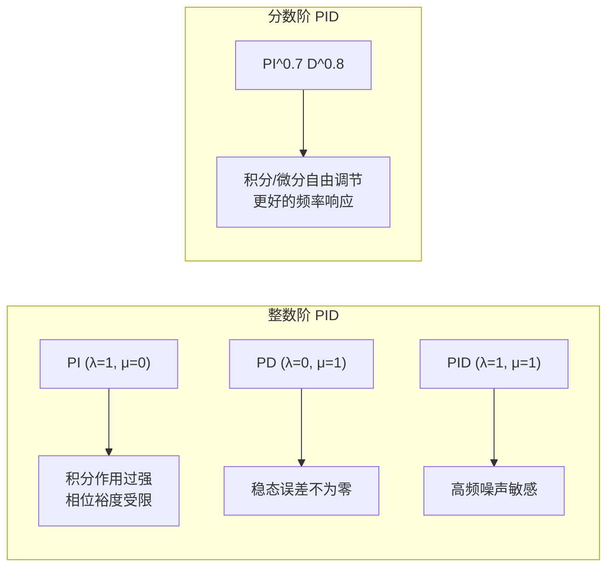

# 分数阶 PID 控制

> 预计阅读：18 分钟 | 前置知识：PID 控制基础、拉普拉斯变换、Simulink 建模

---

## 1. 什么是分数阶微积分

### 1.1 从整数阶到分数阶

经典微积分中，我们熟悉整数阶的导数和积分：

```
一阶导数：  df/dt
二阶导数：  d²f/dt²
一阶积分：  ∫f dt
```

分数阶微积分将阶次从整数推广到任意实数甚至复数：

```
分数阶导数：  D^α f(t),  α ∈ ℝ（如 α = 0.5）
分数阶积分：  D^(-β) f(t),  β ∈ ℝ（如 β = 0.7）
```

**直观理解**：`D^0.5` 既不是纯粹的微分，也不是纯粹的积分，而是介于两者之间的"半微分半积分"操作。

### 1.2 分数阶微积分的几何意义

```
D^0      = 恒等算子（不做任何操作）
D^0.5    = "半微分"（介于恒等和一阶微分之间）
D^1      = 一阶微分
D^1.5    = 介于一阶和二阶微分之间
D^2      = 二阶微分
D^(-1)   = 一阶积分
D^(-0.5) = "半积分"
```

### 1.3 三种经典定义

| 定义 | 公式 | 特点 |
|------|------|------|
| Riemann-Liouville | `D^α f(t) = 1/Γ(n-α) · d^n/dt^n ∫(t-τ)^{n-α-1} f(τ) dτ` | 需要初始分数阶积分 |
| Caputo | `D^α f(t) = 1/Γ(n-α) ∫(t-τ)^{n-α-1} f^(n)(τ) dτ` | 初始条件物理意义明确 |
| Grünwald-Letnikov | 离散差分推广 | 适合数值实现 |

工程中**Caputo 定义**最常用，因为初始条件可以用整数阶导数表示。

---

## 2. 分数阶 PID 控制器

### 2.1 传统 PID 的推广

传统 PID 控制器的传递函数：

```
C(s) = Kp + Ki/s + Kd·s
     = Kp + Ki·s^(-1) + Kd·s^1
```

分数阶 PID（PI^λ D^μ）将积分和微分的阶次推广为任意实数：

```
C(s) = Kp + Ki·s^(-λ) + Kd·s^μ

其中 λ > 0（积分阶次），μ > 0（微分阶次）
```

### 2.2 五个可调参数

| 参数 | 符号 | 范围 | 说明 |
|------|------|------|------|
| 比例增益 | Kp | > 0 | 响应速度 |
| 积分增益 | Ki | > 0 | 消除稳态误差 |
| 微分增益 | Kd | > 0 | 抑制超调 |
| 积分阶次 | λ | (0, 2) | 积分作用的"深度" |
| 微分阶次 | μ | (0, 2) | 微分作用的"强度" |

当 `λ=1, μ=1` 时退化为传统 PID；当 `λ=1, μ=0` 时退化为 PI 控制器。

### 2.3 为什么分数阶 PID 更好



**核心优势**：

1. **更灵活的频率响应**：两个额外参数（λ, μ）提供了更大的设计自由度
2. **更好的鲁棒性**：可以实现"等阻尼"（iso-damping）特性
3. **平坦相位裕度**：在穿越频率附近保持恒定的相位裕度
4. **参数整定空间更大**：五维参数空间 vs 三维

---

## 3. Oustaloup 递推近似

### 3.1 为什么需要近似

分数阶算子 `s^α` 是无理函数，无法直接在 Simulink 中实现。需要将其近似为有理传递函数（整数阶系统级联）。

### 3.2 Oustaloup 近似原理

在频率范围 `[ω_l, ω_h]` 内，用 N 阶零极点对来近似 `s^α`：

```
s^α ≈ K · ∏(k=-N to N) (s + ω_k') / (s + ω_k)
```

其中：
```
ω_k' = ω_l · (ω_h/ω_l)^((k+N+1/2-α/2)/(2N+1))
ω_k  = ω_l · (ω_h/ω_l)^((k+N+1/2+α/2)/(2N+1))
K    = ω_h^α
```

### 3.3 MATLAB 实现

```matlab
function [num, den] = oustaloup(alpha, N, wl, wh)
    % Oustaloup 近似: s^alpha ≈ 有理传递函数
    % alpha: 分数阶次
    % N:     近似阶数（每侧）
    % wl:    下限频率 (rad/s)
    % wh:    上限频率 (rad/s)

    k = -N:N;
    mu = (wh/wl);
    wk_p = wl * mu.^((k + N + 0.5 - alpha/2) / (2*N + 1));
    wk   = wl * mu.^((k + N + 0.5 + alpha/2) / (2*N + 1));
    K    = wh^alpha;

    num = K * poly(-wk_p);
    den = poly(-wk);
end
```

### 3.4 近似精度分析

| 近似阶数 N | 传递函数阶次 | 频率范围精度 | 计算开销 |
|-----------|-------------|------------|---------|
| 2 | 4 | 低 | 极低 |
| 3 | 6 | 中 | 低 |
| 5 | 10 | 高 | 中 |
| 7 | 14 | 很高 | 较高 |

工程中通常选择 **N=5**（10阶传递函数）作为精度和计算量的平衡点。

---

## 4. Simulink 实现（FOMCON 工具箱）

### 4.1 FOMCON 工具箱简介

FOMCON（Fractional-order Modeling and Control）是 MATLAB/Simulink 的开源工具箱，提供：

- 分数阶传递函数建模
- 分数阶 PID 控制器设计
- 频域/时域分析工具
- Simulink 模块库

**安装**：从 GitHub 下载后添加到 MATLAB 路径即可。

### 4.2 构建分数阶 PID Simulink 模型

```
┌─────────────────────────────────────────────────────────┐
│                    分数阶 PID 控制器                      │
│                                                         │
│  输入 e(t) ──┬── [Kp] ─────────────────────────┬── Σ ── 输出 u(t)
│              │                                  │       │
│              ├── [s^(-λ) × Ki] ──[Oustaloup]───┤       │
│              │                                  │       │
│              └── [s^μ × Kd]  ──[Oustaloup]─────┘       │
│                                                         │
└─────────────────────────────────────────────────────────┘
```

### 4.3 FOMCON 工具箱使用示例

```matlab
%% 创建分数阶 PID 控制器
% 使用 FOMCON 工具箱的 fopid 函数
C = fopid('kp', 2.5, 'ki', 1.2, 'kd', 0.8, 'lambda', 0.7, 'mu', 0.8);

%% 转换为整数阶近似（用于 Simulink）
[C_num, C_den] = oustaloup_fopid(C, 5, 1e-3, 1e3);
C_tf = tf(C_num, C_den);

%% 画 Bode 图比较
figure;
bode(C_tf);
title('分数阶 PID 控制器 Bode 图');
grid on;
```

### 4.4 Simulink 模型搭建步骤

1. 打开 Simulink，新建模型
2. 添加 `Transfer Fcn` 模块，填入 Oustaloup 近似的分子/分母
3. 用 `Sum` 模块组合 P、I^λ、D^μ 三条支路
4. 连接 UAV 传递函数模型
5. 配置仿真步长（建议 0.001s）

---

## 5. 整数阶 PID vs 分数阶 PID 对比

| 对比维度 | 整数阶 PID | 分数阶 PID |
|---------|-----------|-----------|
| 可调参数 | 3（Kp, Ki, Kd） | 5（Kp, Ki, Kd, λ, μ） |
| 设计自由度 | 有限 | 更大 |
| 频率响应 | 90°/倍频程斜率 | 任意斜率 |
| 鲁棒性 | 一般 | 更好（平坦相位裕度） |
| 稳态精度 | 高 | 更高（可调积分深度） |
| 实现复杂度 | 低 | 中（需要近似） |
| 计算开销 | 低 | 较高（高阶传递函数） |
| 参数整定 | 成熟方法多 | 方法较少，需要优化工具 |
| 工具支持 | 所有仿真平台 | FOMCON 等专用工具箱 |
| 工程应用 | 广泛 | 逐步增多 |

### 5.1 阶跃响应对比

```
         ↑ 输出
    1.2 ─┤          整数阶 PID（超调较大）
         │        ╱╲
    1.0 ─┤───────╱──╲────────── 分数阶 PI^0.7D^0.8（超调小）
         │      ╱    ╲_________
    0.8 ─┤     ╱                ╲____
         │    ╱
    0.6 ─┤   ╱
         │  ╱
    0.4 ─┤ ╱
         │╱
    0.0 ─┼──────────────────────────→ 时间
         0    0.5   1.0   1.5   2.0  (s)
```

---

## 6. 参数整定方法

### 6.1 频域整定法

基于相位裕度和增益裕度要求：

```
目标：在穿越频率 ωc 处
  |C(jωc) · G(jωc)| = 1
  arg[C(jωc) · G(jωc)] = -π + PM (期望相位裕度)

额外约束：d/dω arg[C(jω)·G(jω)] |_{ω=ωc} = 0（平坦相位条件）
```

### 6.2 优化整定法

使用智能优化算法（如 PSO、GA）搜索最优参数：

```matlab
%% 适应度函数
function J = fitness(params)
    Kp = params(1); Ki = params(2); Kd = params(3);
    lambda = params(4); mu = params(5);

    % 构建控制器和闭环系统
    C = build_fopid(Kp, Ki, Kd, lambda, mu);
    sys_cl = feedback(C * G_plant, 1);

    % 时域指标
    [y, t] = step(sys_cl);
    overshoot = (max(y) - 1) * 100;
    settling_time = get_settling_time(y, t, 0.02);
    ise = trapz(t, (1 - y).^2);

    % 加权目标函数
    J = 1.0*ise + 0.5*settling_time + 0.3*overshoot;
end
```

---

## 7. 分数阶控制的 UAV 应用场景

| 应用场景 | 优势 | 挑战 |
|---------|------|------|
| 悬停稳定 | 更好的抗扰性能 | 参数整定 |
| 航迹跟踪 | 平滑的跟踪响应 | 实时计算 |
| 载荷变化适应 | 鲁棒性更强 | 模型不确定性 |
| 风扰抑制 | 宽频段扰动抑制 | 传感器噪声 |
| 编队飞行 | 分布式一致性控制 | 通信延迟 |

---

## 8. 参考资源

- **GitHub 仓库**：
  - [cnpcshangbo/simscapeFOPD](https://github.com/cnpcshangbo/simscapeFOPD) — Simscape 分数阶 PD 控制
  - FOMCON 工具箱：[http://fomcon.net](http://fomcon.net)

- **经典文献**：
  - Podlubny, I. "Fractional-order systems and PI^λ D^μ controllers." IEEE Trans. Auto. Control, 1999.
  - Monje, C.A. et al. "Fractional-order Systems and Controls." Springer, 2010.

---

## 思考题

**1. 分数阶 PID 控制器的积分阶次 λ 从 1 减小到 0.5 时，系统响应会发生什么变化？**

<details><summary>参考答案</summary>

当 λ 从 1 减小到 0.5 时，积分作用减弱。具体表现为：（1）稳态误差消除速度变慢，因为"积分深度"降低；（2）但系统相位裕度增大，超调减小，稳定性改善；（3）对高频噪声的抑制增强，因为弱积分意味着更小的低频增益。这是一种在稳态精度和动态稳定性之间的权衡。

</details>

**2. Oustaloup 近似的频率范围 [ω_l, ω_h] 应该如何选择？选得太窄或太宽会有什么问题？**

<details><summary>参考答案</summary>

频率范围应覆盖系统工作频率带。通常取 ω_l = 0.01·ω_c（穿越频率的 1/100），ω_h = 100·ω_c（穿越频率的 100 倍）。范围太窄会导致在工作频率范围外近似误差大，可能影响高频噪声抑制或低频跟踪性能。范围太宽会导致需要更高的近似阶数才能维持精度，增加计算量。实际中建议先用 Bode 图确定系统带宽，再据此设定。

</details>

**3. 为什么分数阶 PID 控制器可以实现"等阻尼"特性？这对 UAV 控制有什么好处？**

<details><summary>参考答案</summary>

分数阶 PID 的平坦相位裕度特性意味着在穿越频率附近，闭环系统的阻尼比基本恒定。当系统参数（如质量、惯性矩）发生变化时，穿越频率会偏移，但由于相位曲线平坦，相位裕度变化很小，因此阻尼比保持稳定。对 UAV 来说，这意味着在不同飞行状态（悬停、前飞、载荷变化）下都能保持一致的动态品质，不需要频繁切换控制器参数。

</details>

**4. 在 Simulink 中实现分数阶 PID 时，仿真步长的选择对近似精度有什么影响？**

<details><summary>参考答案</summary>

仿真步长 dt 应满足 Nyquist 采样定理：dt < π/ω_h，其中 ω_h 是 Oustaloup 近似的上限频率。如果 dt 太大，会丢失高频信息，导致近似效果退化。同时，分数阶算子的 Oustaloup 近似产生的高阶传递函数（如 10 阶）在数值积分时需要足够小的步长来维持稳定性。一般建议 dt ≤ 1/(10·ω_h)，工程中常用 0.001s 或更小。

</details>

**5. 分数阶 PID 的五个参数比传统 PID 多出两个，这给参数整定带来了什么挑战？如何应对？**

<details><summary>参考答案</summary>

两个额外参数将搜索空间从三维扩展到五维，传统方法（如 Ziegler-Nichols）不再适用。应对策略：（1）使用智能优化算法（PSO、GA、差分进化）进行全局搜索；（2）分步整定：先固定 λ=1, μ=1 整定 Kp, Ki, Kd，再微调 λ, μ；（3）频域法：利用平坦相位裕度条件减少未知数；（4）利用 FOMCON 工具箱的自动整定功能。

</details>
