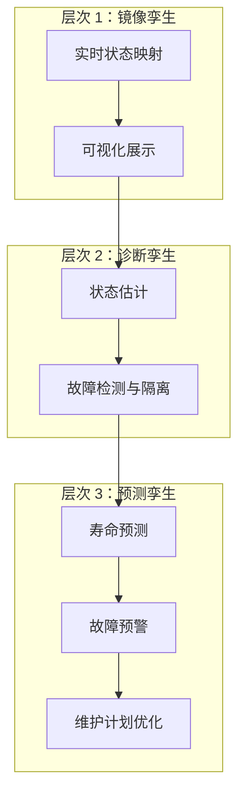
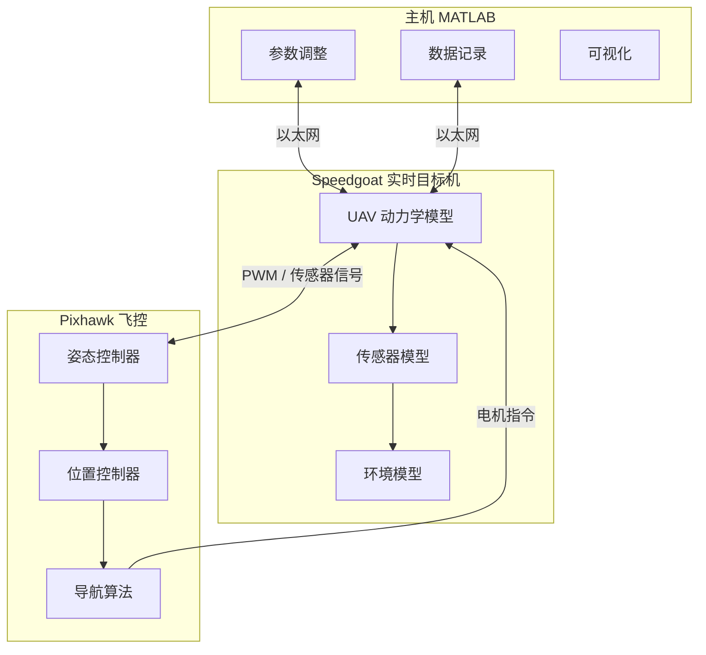
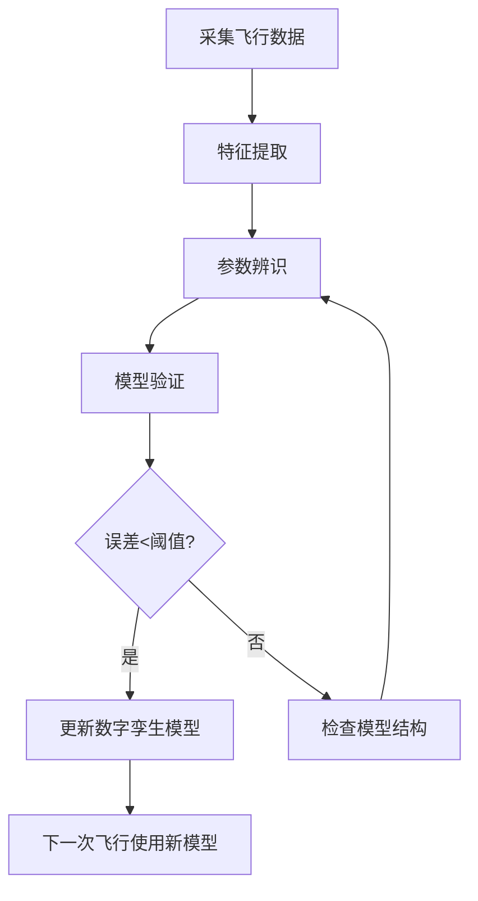
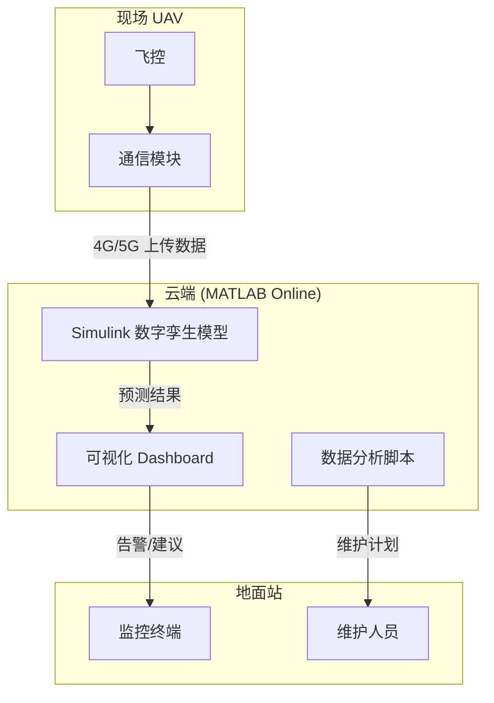
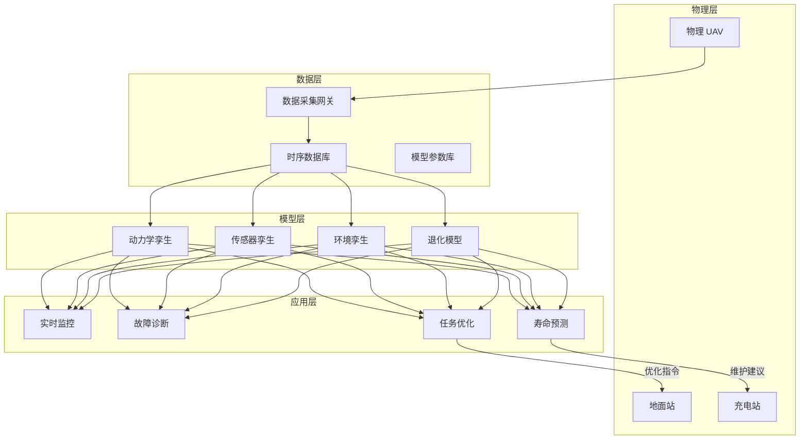

# 数字孪生与 Simulink

> 预计阅读：18 分钟 | 前置知识：Simulink 建模基础、传感器数据处理、控制系统基础

---

## 1. 数字孪生概念

### 1.1 什么是数字孪生

数字孪生（Digital Twin）是物理实体在数字空间中的**高保真虚拟镜像**，能够实时反映物理实体的状态、行为和生命周期。

```
┌──────────────┐     实时数据流      ┌──────────────┐
│   物理 UAV    │ ──────────────────→ │   数字孪生    │
│              │ ←────────────────── │              │
│  传感器数据   │     仿真预测/指令    │  高保真模型   │
│  执行器状态   │                     │  状态估计    │
│  环境信息     │                     │  预测分析    │
└──────────────┘                     └──────────────┘
```

### 1.2 数字孪生 vs 传统仿真

| 对比维度 | 传统仿真 | 数字孪生 |
|---------|---------|---------|
| 时间特性 | 离线、一次性 | 实时、持续同步 |
| 模型更新 | 手动校准 | 自动数据驱动更新 |
| 数据来源 | 假设/测试数据 | 实时传感器数据 |
| 用途 | 设计验证 | 全生命周期管理 |
| 双向交互 | 无 | 有（预测→物理端决策） |
| 保真度要求 | 中等 | 极高（与物理实体一致） |

### 1.3 UAV 数字孪生的三个层次



---

## 2. 实时模型同步

### 2.1 数据同步架构

```
物理 UAV                    Simulink 数字孪生
┌─────────┐                 ┌─────────────────┐
│ IMU     │── 100Hz ──→     │                 │
│ GPS     │── 10Hz  ──→     │  状态估计器     │
│ 气压计   │── 50Hz  ──→     │  (EKF/UKF)     │
│ 电流计   │── 100Hz ──→     │       ↓         │
│ 温度计   │── 1Hz   ──→     │  动力学模型     │
│         │                 │       ↓         │
│ 电机PWM  │←── 控制指令 ──  │  控制器         │
└─────────┘                 └─────────────────┘
```

### 2.2 状态估计与数据融合

使用扩展卡尔曼滤波（EKF）融合多传感器数据：

```matlab
%% EKF 状态估计（简化示例）
function [x_est, P_est] = ekf_update(x_pred, P_pred, z, R)
    % x_pred: 预测状态
    % P_pred: 预测协方差
    % z: 观测向量 [GPS_pos; IMU_acc; Baro_alt]
    % R: 观测噪声协方差

    % 观测矩阵（线性化）
    H = [eye(3), zeros(3,9);   % GPS → 位置
         zeros(3,3), eye(3), zeros(3,6);  % 加速度计 → 加速度
         0 0 1, zeros(1,9)];   % 气压计 → 高度

    % 卡尔曼增益
    K = P_pred * H' / (H * P_pred * H' + R);

    % 状态更新
    innovation = z - H * x_pred;
    x_est = x_pred + K * innovation;
    P_est = (eye(12) - K * H) * P_pred;
end
```

### 2.3 时间同步策略

| 同步方式 | 精度 | 复杂度 | 适用场景 |
|---------|------|--------|---------|
| 硬件时间戳 | < 1 μs | 高 | 高精度同步需求 |
| NTP/PTP | ~1 ms | 中 | 局域网内 |
| 软件时间戳 | ~10 ms | 低 | 非实时应用 |
| Simulink Real-Time | < 100 μs | 中 | HIL 数字孪生 |

---

## 3. Simulink Real-Time 与 HIL 数字孪生

### 3.1 Simulink Real-Time 概述

Simulink Real-Time（原 xPC Target）允许在专用实时硬件（Speedgoat）上运行 Simulink 模型，实现：

- **确定性执行**：微秒级抖动
- **硬件 I/O**：直接连接传感器和执行器
- **实时监控**：在主机上实时调整参数和观察信号

### 3.2 HIL 数字孪生架构



### 3.3 搭建 HIL 仿真步骤

1. **准备植物模型**：将 UAV 动力学 Simulink 模型编译为实时代码
2. **配置 I/O**：设置 Speedgoat 的 PWM 输入/输出、串口通信
3. **连接飞控**：将 Pixhawk 的 PWM 输出接入 Speedgoat 的 ADC 输入
4. **传感器仿真**：在 Simulink 中模拟 IMU、GPS、气压计信号
5. **飞控连接**：将仿真传感器数据通过串口发送给 Pixhawk
6. **运行测试**：执行飞行任务，监控性能

---

## 4. 数据驱动模型更新

### 4.1 模型-现实差距的来源

| 差距来源 | 示例 | 影响 |
|---------|------|------|
| 参数不确定性 | 电机推力系数偏差 | 动态响应误差 |
| 建模简化 | 忽略桨叶变形 | 高频振动 |
| 环境变化 | 温度/海拔影响 | 空气密度变化 |
| 老化效应 | 电池内阻增加 | 推力衰减 |
| 载荷变化 | 挂载不同相机 | 质心/惯量偏移 |

### 4.2 在线参数辨识

使用递推最小二乘（RLS）实时更新模型参数：

```matlab
function [theta, P] = rls_update(theta, P, phi, y, lambda)
    % theta: 参数估计
    % P: 协方差矩阵
    % phi: 回归向量
    % y: 实际输出
    % lambda: 遗忘因子 (0.95-0.999)

    % 增益计算
    K = P * phi / (lambda + phi' * P * phi);

    % 参数更新
    theta = theta + K * (y - phi' * theta);

    % 协方差更新
    P = (1/lambda) * (P - K * phi' * P);
end
```

### 4.3 模型更新工作流



---

## 5. 预测性维护

### 5.1 通过数字孪生实现预测维护

数字孪生可以持续监控 UAV 组件的健康状态：

| 组件 | 监控指标 | 健康指标 | 预警阈值 |
|------|---------|---------|---------|
| 电池 | 电压、电流、温度 | 内阻、容量衰减 | 容量<80%额定 |
| 电机 | 电流、转速、温度 | 效率退化 | 效率下降>10% |
| 螺旋桨 | 振动频谱 | 质量不平衡 | 振幅增大>20% |
| 轴承 | 振动频谱分析 | 磨损程度 | 特征频率出现 |
| 机架 | 应力应变 | 结构完整性 | 裂纹检测 |

### 5.2 剩余使用寿命（RUL）预测

```matlab
%% 简化的 RUL 预测（基于退化模型）
function rul = predict_rul(current_health, threshold, degradation_rate)
    % current_health: 当前健康指标 (0-1)
    % threshold: 失效阈值
    % degradation_rate: 退化速率 (%/飞行小时)

    remaining_capacity = current_health - threshold;
    rul = remaining_capacity / degradation_rate;  % 剩余飞行小时
end
```

### 5.3 维护决策矩阵

| 健康状态 | RUL > 50h | 10h < RUL < 50h | RUL < 10h |
|---------|-----------|-----------------|-----------|
| 电池 | 正常飞行 | 限制飞行时间 | 立即更换 |
| 电机 | 正常飞行 | 监控振动 | 停飞检修 |
| 螺旋桨 | 正常飞行 | 检查平衡 | 立即更换 |

---

## 6. 云端仿真与 MATLAB Online

### 6.1 云端数字孪生优势

- **无限算力**：运行高保真模型不受本地硬件限制
- **多机协同**：同时管理多架 UAV 的数字孪生
- **数据存储**：长期飞行历史数据的集中管理
- **远程访问**：随时随地监控和分析
- **协作开发**：团队成员共享模型和数据

### 6.2 MATLAB Online + Simulink 集成



### 6.3 通信协议选择

| 协议 | 带宽 | 延迟 | 功耗 | 适用场景 |
|------|------|------|------|---------|
| 4G LTE | 高 | ~50ms | 中 | 视频/大数据传输 |
| 5G | 极高 | ~10ms | 中 | 实时 HIL |
| LoRa | 低 | 高 | 极低 | 遥测数据 |
| WiFi | 高 | ~5ms | 中 | 近距离操作 |
| 卫星 | 中 | ~500ms | 高 | 远程/海洋作业 |

---

## 7. 数字孪生完整架构



---

## 8. 参考资源

- **MATLAB 官方**：
  - Simulink Real-Time 文档
  - MATLAB Online 使用指南
- **工具箱**：
  - Simulink Real-Time Explorer
  - System Identification Toolbox
- **学术文献**：
  - Grieves, M. "Digital Twin: Manufacturing Excellence through Virtual Factory Replication." 2014.
  - Tao, F. et al. "Digital twin-driven product design, manufacturing and service with big data." Int J Adv Manuf Technol, 2018.

---

## 思考题

**1. 数字孪生与传统 Simulink 仿真的核心区别是什么？请从数据来源、更新频率和用途三个方面回答。**

<details><summary>参考答案</summary>

（1）数据来源：传统仿真使用假设参数或地面测试数据，数字孪生使用来自物理实体的实时传感器数据。（2）更新频率：传统仿真在设计阶段进行，更新频率低（按项目周期），数字孪生持续同步，更新频率与传感器采样率一致（可达 100Hz 以上）。（3）用途：传统仿真主要用于设计验证和离线分析，数字孪生用于实时监控、预测维护、在线优化等全生命周期管理。

</details>

**2. 在 HIL 数字孪生中，为什么传感器仿真的保真度至关重要？低保真传感器模型会导致什么问题？**

<details><summary>参考答案</summary>

传感器仿真是连接植物模型和飞控的桥梁。飞控的控制决策完全依赖于"感知到的"传感器数据。低保真传感器模型会导致：（1）缺失真实的噪声特性，飞控的滤波器和鲁棒性设计无法被充分测试；（2）缺少传感器故障模式（如 GPS 多径效应、IMU 温漂），无法验证故障处理逻辑；（3）采样率和延迟不真实，可能导致控制器在实机上出现不稳定。因此，传感器模型应包含噪声、偏差、量化、延迟和故障模式。

</details>

**3. 递推最小二乘（RLS）中的遗忘因子 λ 对参数辨识有什么影响？应如何选择？**

<details><summary>参考答案</summary>

遗忘因子 λ 控制历史数据的权重衰减速度。λ 越接近 1，历史数据权重衰减越慢，参数估计越平稳但对突变响应慢；λ 越小，对新数据越敏感但估计越不稳定。对于 UAV 模型参数辨识：（1）如果参数缓慢变化（如电池老化），选 λ = 0.995-0.999；（2）如果参数可能突变（如载荷装卸），选 λ = 0.95-0.98；（3）如果参数恒定，选 λ = 1（无遗忘，等效于批量最小二乘）。

</details>

**4. 云端数字孪生面临的主要技术挑战有哪些？如何应对通信中断的情况？**

<details><summary>参考答案</summary>

主要挑战：（1）通信延迟和中断影响实时性——采用边缘计算，在飞控端保留轻量级本地模型，通信中断时切换到本地模式；（2）数据安全——使用加密传输和访问控制；（3）带宽限制——数据压缩和选择性上传（仅上传异常数据和摘要）；（4）云端计算延迟——使用 GPU 加速和模型降阶技术。通信中断时的应对策略：本地缓存数据，恢复连接后批量同步；飞控端保留基本的安全保护逻辑。

</details>

**5. 如何验证数字孪生模型的保真度？需要哪些量化指标？**

<details><summary>参考答案</summary>

验证方法：（1）收集物理 UAV 飞行数据和对应时刻的数字孪生输出；（2）计算量化指标：均方根误差（RMSE）、归一化均方根误差（NRMSE）、相关系数（R²）、最大绝对误差（MAE）；（3）对关键状态（位置、姿态、速度）分别评估，要求 NRMSE < 5%，R² > 0.95；（4）进行频域分析，比较传递函数的 Bode 图；（5）在不同飞行条件下（悬停、前飞、转弯）分别验证。保真度不足时，需要检查模型结构是否缺失关键动力学特性。

</details>
