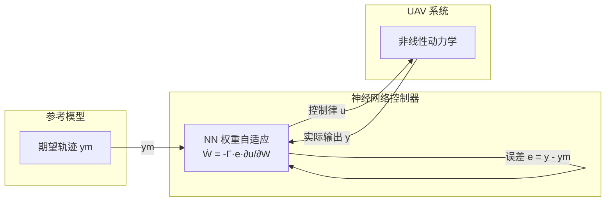
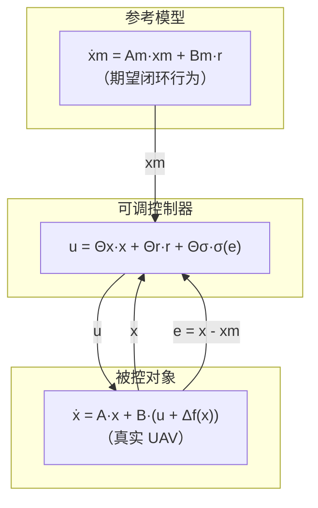
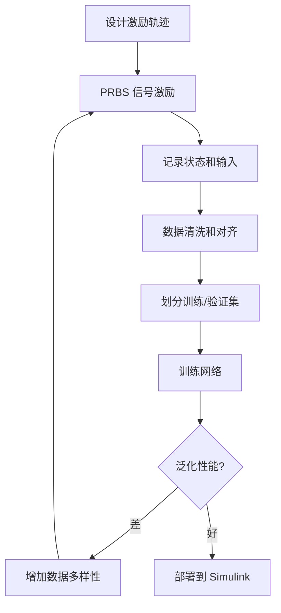
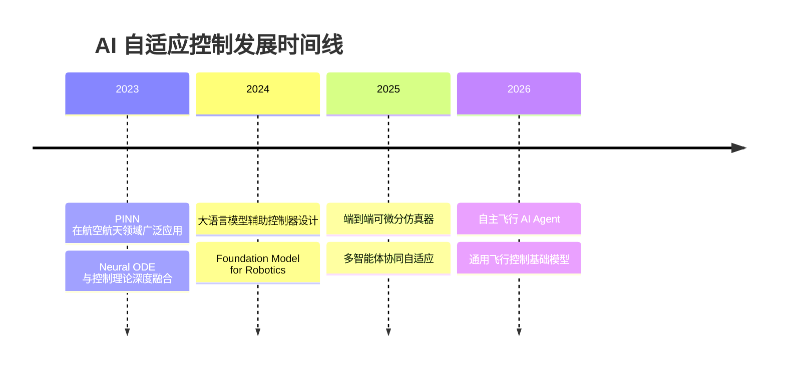

# AI 驱动的自适应控制

> 预计阅读：20 分钟 | 前置知识：控制理论基础、神经网络基础、Simulink 建模

---

## 1. 从经典自适应到 AI 自适应

### 1.1 自适应控制的需求

UAV 在飞行过程中面临参数变化和环境扰动：

```
参数变化：  质量（载荷装卸）→ 推力系数（电池电压）→ 气动特性（速度/姿态）
环境扰动：  风场 → 温度/气压 → GPS 信号质量 → 电磁干扰
```

传统自适应控制（如 MRAC、L1 自适应）基于**线性参数化模型**，在强非线性和高维系统中表现有限。

### 1.2 AI 自适应控制的优势

| 特性 | 经典自适应 | AI 自适应 |
|------|-----------|----------|
| 模型假设 | 线性/仿射非线性 | 任意非线性 |
| 逼近能力 | 有限（RBF 网络等） | 强（深度网络） |
| 先验知识 | 需要较多 | 可从数据学习 |
| 在线学习 | 规则简单 | 梯度下降/强化学习 |
| 可解释性 | 较好 | 较差 |
| 计算开销 | 低 | 较高 |

---

## 2. 神经网络自适应控制

### 2.1 基本框架



### 2.2 控制律结构

```
u(t) = u_ff(t) + u_fb(t) + u_nn(t)

其中：
  u_ff: 前馈补偿（基于参考模型）
  u_fb: 反馈线性化
  u_nn: 神经网络补偿（估计不确定性 Δf）
```

### 2.3 权重自适应律

使用 Lyapunov 稳定性理论推导权重更新规则：

```matlab
function [W, dW] = nn_adapt(W, e, sigma, Gamma, k)
    % W:     NN 权重矩阵
    % e:     跟踪误差
    % sigma: 激活函数输出 (如 sigmoid)
    % Gamma: 自适应增益
    % k:     正则化系数

    % 自适应律（保证 Lyapunov 稳定性）
    dW = -Gamma * sigma * e' - k * Gamma * norm(e) * W;

    % 更新权重
    W = W + dW * dt;
end
```

### 2.4 Simulink 实现

```matlab
%% 使用 Deep Learning Toolbox 构建自适应 NN
layers = [
    featureInputLayer(6, 'Name', 'state')   % [e, de, ∫e]
    fullyConnectedLayer(32, 'Name', 'fc1')
    tanhLayer('Name', 'tanh1')
    fullyConnectedLayer(32, 'Name', 'fc2')
    tanhLayer('Name', 'tanh2')
    fullyConnectedLayer(3, 'Name', 'output') % [τx, τy, τz]
];
```

---

## 3. 模型参考自适应控制（MRAC）

### 3.1 MRAC 原理



### 3.2 经典 MRAC vs 神经网络 MRAC

| 对比维度 | 经典 MRAC | NN-MRAC |
|---------|----------|---------|
| 不确定性处理 | 线性参数化 | 非线性逼近 |
| 适用系统 | 最小相位、相对阶已知 | 更广泛 |
| 自适应速度 | 较慢 | 快（非线性映射） |
| 鲁棒性 | 需要 σ-修正 | 天然正则化 |
| 计算量 | 低 | 中 |
| 调参难度 | 低 | 中（网络结构） |

### 3.3 NN-MRAC 的 Simulink 模型

```
                    ┌─────────────────────┐
  r(t) ──→ [参考模型] ──→ xm ──→ Σ(e=x-xm) ──→ [NN 控制器] ──→ [UAV]
                    │                     ↑         │              │
                    │                     └─────────┘              │
                    │                     (自适应律)                │
                    └──────────────────────────────────────────────┘
```

---

## 4. 深度学习系统辨识

### 4.1 数据驱动建模

传统方法基于第一性原理（牛顿力学）推导动力学方程，深度学习方法直接从数据学习：

```
第一性原理：  物理定律 → 解析方程 → 参数标定
深度学习：    飞行数据 → 神经网络训练 → 黑箱/灰箱模型
```

### 4.2 网络结构选择

| 网络类型 | 输入 | 输出 | 优势 | 适用场景 |
|---------|------|------|------|---------|
| MLP | 状态+输入 | 下一状态 | 简单快速 | 离散时间模型 |
| LSTM | 状态序列 | 下一状态 | 捕捉长程依赖 | 时变系统 |
| CNN | 时序信号 | 状态 | 特征提取能力强 | 传感器数据处理 |
| Transformer | 状态序列 | 状态序列 | 并行训练 | 长序列预测 |

### 4.3 LSTM 系统辨识实现

```matlab
%% LSTM 网络用于动力学辨识
layers = [
    sequenceInputLayer(10, 'Name', 'input')  % [ω, acc, euler, u]
    lstmLayer(64, 'OutputMode', 'sequence', 'Name', 'lstm1')
    dropoutLayer(0.2, 'Name', 'drop1')
    lstmLayer(32, 'OutputMode', 'last', 'Name', 'lstm2')
    fullyConnectedLayer(6, 'Name', 'fc')     % [Δω, Δeuler]
    regressionLayer('Name', 'output')
];

% 训练选项
opts = trainingOptions('adam', ...
    'MaxEpochs', 200, ...
    'MiniBatchSize', 128, ...
    'SequenceLength', 'longest', ...
    'GradientThreshold', 1, ...
    'ValidationFrequency', 50);
```

### 4.4 训练数据采集策略



**PRBS（伪随机二进制序列）** 激励信号可以有效激发系统在各频率上的响应。

---

## 5. 物理信息神经网络（PINN）

### 5.1 PINN 核心思想

在神经网络的损失函数中嵌入物理定律：

```
L_total = L_data + λ · L_physics

L_data   = Σ||y_pred - y_measured||²     （数据拟合）
L_physics = Σ||F(x_pred, ẋ_pred, u)||²   （物理残差）
```

### 5.2 UAV 动力学的 PINN 实现

```matlab
%% PINN 损失函数（含物理约束）
function loss = pinn_loss(net, X, U, X_dot_meas, params)
    % 前向传播
    X_dot_pred = predict(net, [X, U]);

    % 数据损失
    L_data = mean((X_dot_pred - X_dot_meas).^2, 'all');

    % 物理损失（牛顿-欧拉方程残差）
    omega = X(:, 4:6);  % 角速度
    tau = U(:, 1:3);    % 力矩

    % ω̇ = I^{-1} × (τ - ω × I·ω)
    I = params.inertia;
    omega_cross = cross(omega, (I * omega')', 2);
    physics_pred = (tau - omega_cross) / I;
    physics_net = X_dot_pred(:, 4:6);
    L_physics = mean((physics_net - physics_pred).^2, 'all');

    % 总损失
    loss = L_data + 0.1 * L_physics;
end
```

### 5.3 PINN vs 纯数据驱动对比

| 对比维度 | 纯数据驱动 | PINN |
|---------|-----------|------|
| 数据需求 | 大量 | 中等（物理约束补偿） |
| 外推能力 | 差 | 好（物理规律约束） |
| 训练难度 | 中 | 较高（多损失平衡） |
| 精度 | 训练域内高 | 训练域内外都较好 |
| 物理一致性 | 不保证 | 保证 |

---

## 6. Neural ODE

### 6.1 连续时间动力学学习

Neural ODE 将神经网络嵌入常微分方程：

```
dx/dt = f_θ(x, u)

其中 f_θ 是参数化为神经网络的向量场
```

### 6.2 与离散网络的区别

```
离散网络：  x_{t+1} = NN(x_t, u_t)        ← 一步预测
Neural ODE：dx/dt = NN_θ(x, u), 积分求解   ← 连续轨迹
```

| 对比维度 | 离散网络 (MLP/LSTM) | Neural ODE |
|---------|-------------------|-----------|
| 时间表示 | 离散步长 | 连续时间 |
| 长期预测 | 误差累积快 | 更稳定 |
| 训练方式 | 直接监督 | adjoint method |
| 计算量 | 固定 | 自适应步长 |
| 物理一致性 | 不保证 | 容易嵌入 |

### 6.3 Neural ODE 的优势

1. **自适应步长**：可根据系统动态自动调整积分步长
2. **内存效率**：使用 adjoint method，内存消耗与深度无关
3. **连续预测**：任意时刻的状态都可以计算
4. **可逆性**：理论上可以精确反向积分

---

## 7. Simulink 与 Deep Learning Toolbox 集成

### 7.1 部署方式

| 方式 | 优点 | 缺点 | 适用场景 |
|------|------|------|---------|
| MATLAB Function 块 | 灵活 | 不支持 GPU | 小型网络 |
| Deep Learning Toolbox 块 | 原生支持 | 版本限制 | 标准网络 |
| S-Function | 最灵活 | 编写复杂 | 自定义推理 |
| 代码生成 (C) | 实时部署 | 需要优化 | HIL/嵌入式 |

### 7.2 MATLAB Function 块集成

```matlab
function u = nn_controller(x, ref, net_params)
    % 在 Simulink MATLAB Function 块中使用
    %#codegen

    % 归一化输入
    x_norm = (x - net_params.input_mean) ./ net_params.input_std;

    % 前向推理
    h1 = tanh(net_params.W1 * x_norm + net_params.b1);
    h2 = tanh(net_params.W2 * h1 + net_params.b2);
    u = net_params.W3 * h2 + net_params.b3;

    % 反归一化输出
    u = u .* net_params.output_std + net_params.output_mean;

    % 限幅
    u = max(min(u, 1), -1);
end
```

### 7.3 工作流

```mermaid
graph TD
    A[收集飞行数据] --> B[训练神经网络 (MATLAB/Python)]
    B --> C[导出网络参数]
    C --> D[编写推理函数]
    D --> E[配置 Simulink 模型]
    E --> F[仿真验证]
    F --> G[代码生成 (Embedded Coder)]
    G --> H[部署到飞控硬件]
```

---

## 8. 经典自适应 vs AI 自适应对比

| 对比维度 | 经典自适应 | AI 自适应 |
|---------|-----------|----------|
| 理论基础 | Lyapunov 稳定性 | 深度学习+Lyapunov |
| 非线性处理 | 有限 | 强 |
| 在线计算量 | 低 | 中-高 |
| 离线训练需求 | 无 | 有 |
| 泛化能力 | 有限 | 强（数据充分时） |
| 安全保证 | 有理论保证 | 需要额外安全层 |
| 调参难度 | 中 | 高 |
| 工程成熟度 | 高 | 发展中 |

---

## 9. 近期趋势（2023-2026）

### 9.1 技术发展趋势



### 9.2 关键研究方向

| 方向 | 进展 | 挑战 |
|------|------|------|
| 可微分仿真 | Brax, DiffTaichi | 精度 vs 可微分性权衡 |
| 基础模型 | RT-2, Octo | 数据需求大，实时性 |
| 安全学习 | CBF+RL, 验证方法 | 形式化保证 |
| 迁移学习 | 仿真→实机 | 域偏移问题 |
| 多模态融合 | 视觉+动力学 | 计算量 |

---

## 10. 参考资源

- **MATLAB 工具箱**：
  - Deep Learning Toolbox
  - Reinforcement Learning Toolbox
  - System Identification Toolbox
- **开源项目**：
  - Neural ODE：[rtqichen/torchdiffeq](https://github.com/rtqichen/torchdiffeq)
  - PINN：[maziarraissi/PINNs](https://github.com/maziarraissi/PINNs)

---

## 思考题

**1. 为什么神经网络自适应控制的权重更新律必须基于 Lyapunov 稳定性理论推导，而不能直接使用标准的反向传播？**

<details><summary>参考答案</summary>

标准反向传播的优化目标是减小训练误差，不考虑闭环稳定性。如果在自适应控制中直接使用反向传播更新权重，可能导致：（1）权重更新方向不稳定，系统发散；（2）控制信号过大，执行器饱和；（3）无法保证跟踪误差有界。基于 Lyapunov 理论推导的自适应律（如 Ẇ = -Γ·σ·e'）通过选择 Lyapunov 函数 V = e'Pe + tr(W'Γ^{-1}W)，可以证明 V̇ ≤ 0，从而保证误差最终有界，系统稳定。

</details>

**2. PINN 中物理损失项的权重 λ 应如何选择？太大或太小会有什么问题？**

<details><summary>参考答案</summary>

λ 的选择需要平衡数据拟合和物理一致性。λ 太小：物理约束几乎不起作用，退化为纯数据驱动，外推能力差；λ 太大：网络过度关注满足物理方程，对数据中的真实非线性特征拟合不足。实践中的方法：（1）从 λ=0.1 开始，观察两项损失的量级；（2）使用自适应权重（如 NTK 方法）自动调节；（3）先训练数据损失，再逐步引入物理损失（课程学习）。

</details>

**3. Neural ODE 相比离散 LSTM 网络在长时间序列预测中的优势是什么？为什么？**

<details><summary>参考答案</summary>

LSTM 在多步预测时需要自回归展开，每一步的预测误差会累积，且固定时间步长意味着无法自适应系统动态。Neural ODE 的优势：（1）连续时间表示，不受固定步长限制，可以用自适应 ODE 求解器（如 RK45）在动态变化快时用小步长、变化慢时用大步长；（2）adjoint method 使得反向传播的内存消耗恒定；（3）理论上是连续可逆的，长期预测更稳定。但 Neural ODE 的训练较慢（每次前向传播需要 ODE 求解）。

</details>

**4. 在实际部署中，如何保证 AI 自适应控制器的安全性？**

<details><summary>参考答案</summary>

常用安全措施：（1）控制屏障函数（CBF）：在优化问题中加入安全约束，确保状态始终在安全集内；（2）监控模块：实时检测 NN 输出是否在合理范围内，超出时切换到经典控制器；（3）动作限幅：限制 NN 补偿量的幅值，确保总控制量在执行器能力范围内；（4）Lyapunov 约束：在训练中强制 NN 满足 Lyapunov 条件；（5）形式化验证：使用区间分析或 SMT 求解器验证 NN 在输入范围内的输出边界。

</details>

**5. 2024 年出现的"基础模型用于机器人"（Foundation Model for Robotics）对 UAV 自适应控制有什么潜在影响？**

<details><summary>参考答案</summary>

基础模型（如 RT-2、Octo）在大规模多任务数据上预训练，具有强大的泛化能力。对 UAV 控制的潜在影响：（1）预训练的动力学先验：基础模型可能隐式学会了多种飞行器的动力学特性，微调后即可适应新平台；（2）多模态理解：结合视觉、语言指令实现更自然的任务描述；（3）减少每个任务的数据需求：迁移学习可大幅减少针对特定 UAV 的数据采集量。但挑战包括：实时推理延迟、模型体积大不适合嵌入式部署、安全认证困难。

</details>
