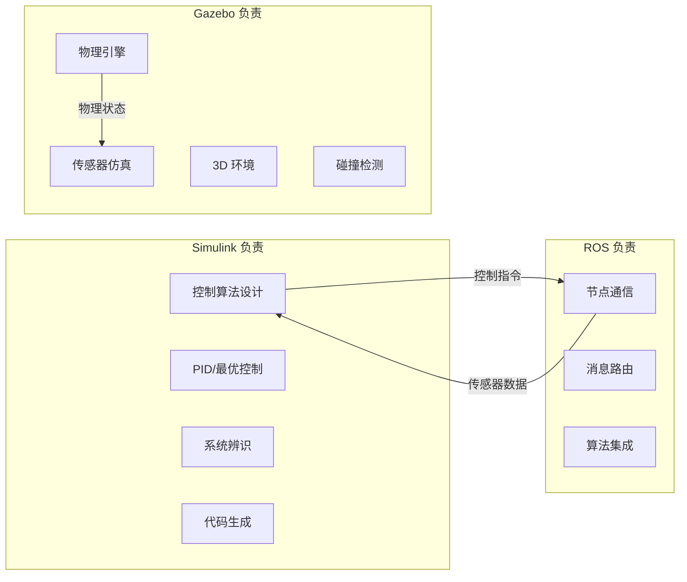
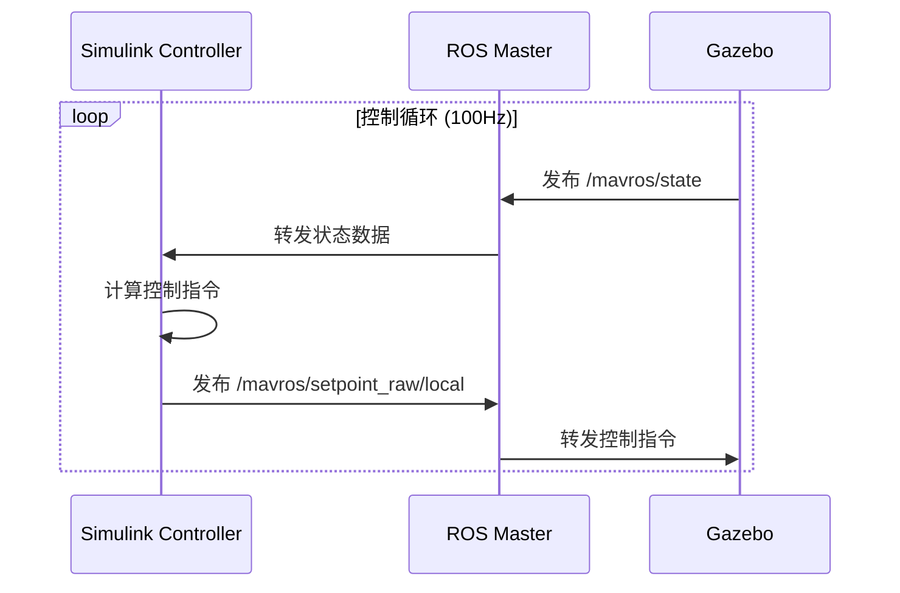
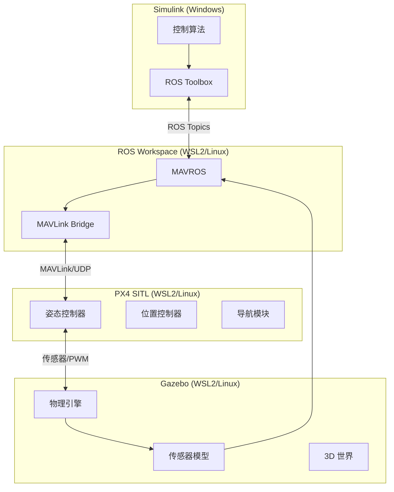
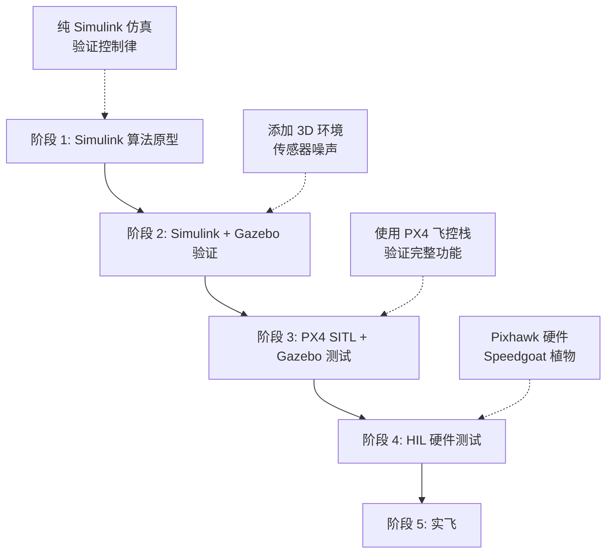

# Simulink 与 Gazebo/ROS 协同

> 预计阅读：20 分钟 | 前置知识：Simulink 建模、ROS 基础概念、PX4 基础

---

## 1. 为什么需要协同仿真

### 1.1 各工具的强项

| 工具 | 核心强项 | 相对弱项 |
|------|---------|---------|
| Simulink | 控制算法设计、代码生成、系统级建模 | 3D 可视化、物理碰撞、大规模场景 |
| Gazebo | 高保真物理仿真、3D 可视化、传感器仿真 | 控制算法快速迭代、代码生成 |
| ROS | 通信中间件、算法生态、多节点协同 | 实时性、确定性执行 |
| PX4 | 飞控算法、任务规划、MAVLink 协议 | 仅限飞控领域 |

**协同仿真的核心思想**：让每个工具做它最擅长的事。

### 1.2 典型协同场景



---

## 2. ROS Toolbox for Simulink

### 2.1 ROS Toolbox 概述

MATLAB ROS Toolbox 提供了 Simulink 与 ROS/ROS 2 之间的双向通信：

- **发布者/订阅者**：ROS Topic 通信
- **服务客户端/服务器**：ROS Service 调用
- **动作客户端**：ROS Action 交互
- **消息类型**：标准和自定义消息支持

### 2.2 Simulink 中的 ROS 模块

| 模块 | 功能 | 用途 |
|------|------|------|
| ROS Publish | 发布 ROS Topic | 发送控制指令 |
| ROS Subscribe | 订阅 ROS Topic | 接收传感器数据 |
| ROS Service Call | 调用 ROS Service | 请求特定功能 |
| Blank Message | 创建消息 | 构造自定义消息 |
| Bus Assignment | 赋值消息字段 | 填充消息内容 |

### 2.3 典型连接图

```
┌─────────────────────────────────────────────────────────┐
│                    Simulink 模型                          │
│                                                         │
│  [参考轨迹] ──→ [控制器] ──→ [ROS Publish]               │
│                    ↑               │                     │
│                    │               ↓                     │
│              [ROS Subscribe] ←  ROS Network              │
│                    │               ↑                     │
│              [传感器处理]          │                     │
│                                  ↓                     │
│                            [Gazebo/PX4]                 │
└─────────────────────────────────────────────────────────┘
```

---

## 3. 通信架构：ROS Topics/Services

### 3.1 Topic 通信（异步，持续数据流）



### 3.2 常用 ROS Topics

| Topic | 消息类型 | 方向 | 频率 | 用途 |
|-------|---------|------|------|------|
| /mavros/state | mavros_msgs/State | PX4→Simulink | 10Hz | 飞控状态 |
| /mavros/local_position/pose | geometry_msgs/PoseStamped | PX4→Simulink | 30Hz | 本地位置 |
| /mavros/imu/data | sensor_msgs/Imu | PX4→Simulink | 100Hz | IMU 数据 |
| /mavros/setpoint_raw/local | mavros_msgs/PositionTarget | Simulink→PX4 | 30Hz | 位置指令 |
| /mavros/rc/out | mavros_msgs/RCOut | PX4→Simulink | 50Hz | PWM 输出 |

### 3.3 Service 通信（同步，请求-响应）

| Service | 功能 | 使用场景 |
|---------|------|---------|
| /mavros/cmd/arming | 解锁/锁定电机 | 起飞前解锁 |
| /mavros/set_mode | 设置飞行模式 | 切换 Offboard |
| /mavros/param/set | 设置参数 | 在线调参 |

---

## 4. PX4 SITL + Gazebo + Simulink 集成

### 4.1 系统架构



### 4.2 启动流程

```bash
# 终端 1：启动 PX4 SITL + Gazebo
cd PX4-Autopilot
make px4_sitl_default gazebo

# 终端 2：启动 MAVROS
roslaunch mavros px4.launch fcu_url:=udp://:14540@localhost:14557

# MATLAB/Simulink：连接 ROS
setenv('ROS_MASTER_URI', 'http://localhost:11311')
rosinit

# 打开 Simulink 模型，运行仿真
open_system('uav_ros_control.slx')
sim('uav_ros_control.slx');
```

### 4.3 网络配置（WSL2 环境）

```matlab
%% MATLAB 中配置 ROS 连接（WSL2 IP）
wsl_ip = '172.x.x.x';  % WSL2 的 IP 地址
setenv('ROS_MASTER_URI', ['http://' wsl_ip ':11311']);
setenv('ROS_IP', '192.168.x.x');  % Windows 主机 IP
rosinit(wsl_ip, 11311);
```

---

## 5. 三种仿真方案对比

| 对比维度 | 纯 Simulink | Simulink + Gazebo | 纯 Gazebo/ROS |
|---------|------------|-------------------|--------------|
| 控制算法设计 | 优秀 | 优秀 | 一般 |
| 物理仿真精度 | 中 | 高 | 高 |
| 3D 可视化 | 基础 | 优秀 | 优秀 |
| 传感器仿真 | 简单模型 | 高保真 | 高保真 |
| 代码生成 | 原生支持 | 部分支持 | 需手动 |
| 学习曲线 | 低 | 中 | 高 |
| 调试便利性 | 优秀 | 中 | 一般 |
| 场景丰富度 | 有限 | 丰富（模型库） | 丰富 |
| 实时性 | 好 | 中（通信开销） | 好 |
| 适用阶段 | 算法原型 | 集成验证 | 全系统测试 |

---

## 6. 协同仿真工作流

### 6.1 开发流程



### 6.2 阶段 1：Simulink 算法原型

```
目标：快速验证控制算法
工具：纯 Simulink
优势：快速迭代、易于调试
输出：控制算法初版
```

### 6.3 阶段 2：Simulink + Gazebo 验证

```
目标：在高保真环境中验证
工具：Simulink（控制器）+ Gazebo（物理仿真）
优势：真实物理、3D 可视化
输出：经过验证的控制算法
```

### 6.4 阶段 3：PX4 SITL 集成

```
目标：在 PX4 飞控栈中测试
工具：PX4 SITL + Gazebo + MAVROS
优势：接近实飞的完整软件栈
输出：可部署的飞控配置
```

---

## 7. Simulink ROS 模型示例

### 7.1 位置控制模型

```matlab
%% Simulink ROS 位置控制示例
% 订阅位置反馈
posSub = rossubscriber('/mavros/local_position/pose', ...
    'geometry_msgs/PoseStamped');

% 发布控制指令
cmdPub = rospublisher('/mavros/setpoint_raw/local', ...
    'mavros_msgs/PositionTarget');

% 创建控制指令消息
cmdMsg = rosmessage(cmdPub);
cmdMsg.CoordinateFrame = 1;  % FRAME_LOCAL_NED
cmdMsg.TypeMask = 0b0000111111000;  % 仅使用位置

% Simulink 模型中的控制逻辑
% 在 MATLAB Function 块中：
function cmd = position_controller(pos_ref, pos_fb, vel_fb)
    Kp = [1.5; 1.5; 2.0];
    Kd = [0.8; 0.8; 1.0];

    error_pos = pos_ref - pos_fb;
    error_vel = -vel_fb;  % 期望速度为 0

    cmd = Kp .* error_pos + Kd .* error_vel;
    cmd = max(min(cmd, 5), -5);  % 限幅
end
```

### 7.2 解锁和模式切换

```matlab
%% 解锁服务调用
armClient = rossvcclient('/mavros/cmd/arming');
armMsg = rosmessage(armClient);
armMsg.Value = true;  % 解锁
call(armClient, armMsg);

%% 切换 Offboard 模式
modeClient = rossvcclient('/mavros/set_mode');
modeMsg = rosmessage(modeClient);
modeMsg.CustomMode = 'OFFBOARD';
call(modeClient, modeMsg);
```

---

## 8. 常见问题与解决方案

| 问题 | 原因 | 解决方案 |
|------|------|---------|
| ROS 连接失败 | IP 配置错误 | 检查 ROS_MASTER_URI 和 ROS_IP |
| 数据延迟大 | 网络开销 | 使用有线连接，减小消息频率 |
| Gazebo 卡顿 | 物理引擎计算量大 | 降低仿真精度或使用 ODE 引擎 |
| 时间同步问题 | 时钟不同步 | 使用 ROS sim_time，Gazebo 发布时钟 |
| 消息类型不匹配 | 自定义消息未编译 | 确保 MATLAB 和 ROS 使用相同消息包 |
| PX4 不响应 | MAVLink 连接断开 | 检查 UDP 端口映射 |

---

## 9. 参考资源

- **GitHub 仓库**：
  - [MichaelSkadan/PX4-Autopilot-Simulink-Interface](https://github.com/MichaelSkadan/PX4-Autopilot-Simulink-Interface) — PX4 与 Simulink 接口
  - [optimAero/optimAeroPX4SIL](https://github.com/optimAero/optimAeroPX4SIL) — PX4 SIL 仿真
- **MATLAB 官方**：
  - ROS Toolbox 文档
  - Connect to a ROS Network 示例
- **PX4 官方**：
  - PX4 Dev Guide: Simulation
  - Gazebo Simulation 文档

---

## 思考题

**1. 在 Simulink + Gazebo 协同仿真中，为什么推荐使用 ROS 作为通信中间件，而不是直接通过 TCP/UDP 通信？**

<details><summary>参考答案</summary>

ROS 提供了比原始 TCP/UDP 更高层次的抽象：（1）消息类型系统：自动序列化/反序列化，避免手动处理二进制数据；（2）发布/订阅模式：解耦发送方和接收方，方便添加新的数据流；（3）ROS Master：自动发现和路由，无需手动配置 IP 和端口；（4）丰富的工具链：rqt、rviz、rosbag 等用于可视化、调试和数据记录；（5）生态兼容：大量现成的算法包（如导航、定位）可直接使用。直接用 TCP/UDP 虽然延迟可能略低，但开发和维护成本大幅增加。

</details>

**2. 纯 Simulink 仿真和 Simulink + Gazebo 仿真分别适合开发的哪个阶段？何时应该从一种切换到另一种？**

<details><summary>参考答案</summary>

纯 Simulink 适合**算法原型阶段**：控制律设计、参数整定、稳定性分析。此阶段追求快速迭代，不需要高保真物理和 3D 可视化。Simulink + Gazebo 适合**集成验证阶段**：当控制算法在 Simulink 中表现满意后，需要在更真实的环境中验证。切换时机：（1）Simulink 中的简单物理模型无法捕捉的效应开始重要（如地面效应、气动干扰）；（2）需要测试视觉/激光雷达等传感器；（3）需要验证障碍物避让等功能；（4）准备集成到 PX4 飞控栈之前。

</details>

**3. 在 WSL2 环境下配置 Simulink (Windows) 与 ROS (Linux) 通信时，常见的网络问题有哪些？如何排查？**

<details><summary>参考答案</summary>

常见问题：（1）WSL2 使用 NAT 网络，Windows 不能直接访问 WSL2 的 localhost——需要使用 WSL2 的实际 IP（通过 `hostname -I` 获取）或配置端口转发；（2）ROS Master 绑定到 localhost，Windows 无法连接——设置 ROS_MASTER_URI 为 WSL2 IP；（3）防火墙阻止 UDP/TCP 连接——在 Windows 防火墙中添加例外；（4）ROS_IP 未设置导致回调失败——在 Windows 侧设置 ROS_IP 为 Windows 主机 IP。排查步骤：先用 `ping` 测试网络连通，再用 `rostopic list` 验证 ROS 连接。

</details>

**4. 对比表中"纯 Gazebo/ROS"方案的"控制算法设计"评分为"一般"，原因是什么？**

<details><summary>参考答案</summary>

Gazebo/ROS 生态中控制算法通常用 C++ 或 Python 编写，相比 Simulink 的不足：（1）没有可视化框图，算法结构不直观；（2）参数调整需要修改代码或配置文件，不能实时拖动滑块；（3）缺少 Simulink 的线性化工具，难以进行频域分析（Bode 图、根轨迹）；（4）没有内置的 PID 调优器等自动化工具；（5）调试主要依赖日志和 rviz，不如 Simulink 的示波器和数据检查器方便。因此，推荐在 Simulink 中完成算法设计和初步验证，再移植到 ROS/Gazebo 环境。

</details>

**5. 如果要在 Gazebo 中测试多架 UAV 的编队控制，Simulink + ROS 的通信架构应如何设计？**

<details><summary>参考答案</summary>

多机编队需要：（1）为每架 UAV 创建独立的命名空间（如 `/uav1/mavros/...`, `/uav2/mavros/...`），避免消息冲突；（2）在 Simulink 中为每架 UAV 创建独立的控制器子系统，各自订阅对应的话题；（3）添加编队协调模块，通过额外的 ROS Topic（如 `/formation/leader_pose`）共享领航者信息；（4）使用 ROS 的多机通信能力，将不同 UAV 的 PX4 SITL 实例分布在不同终端；（5）考虑通信拓扑：全连接、领导者-跟随者或一致性协议。关键挑战是实时性——多机场景下消息量增大，需要合理设置各 Topic 的发布频率。

</details>
