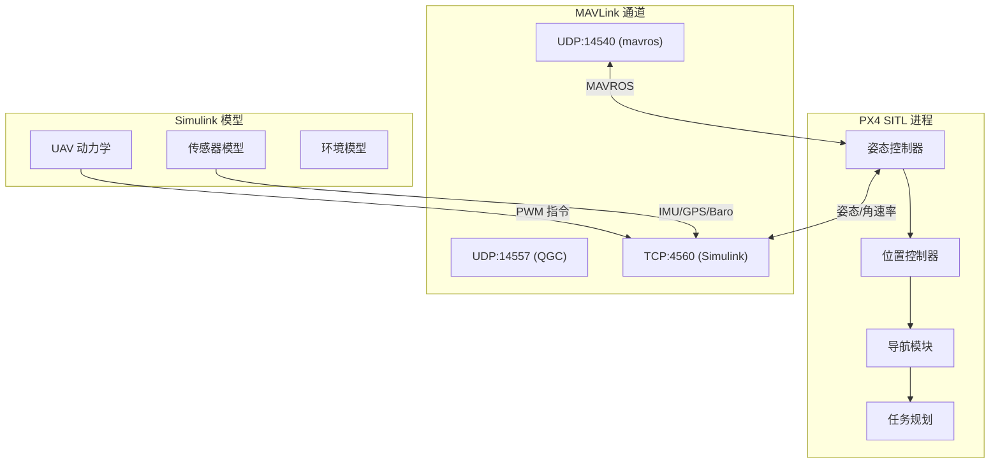
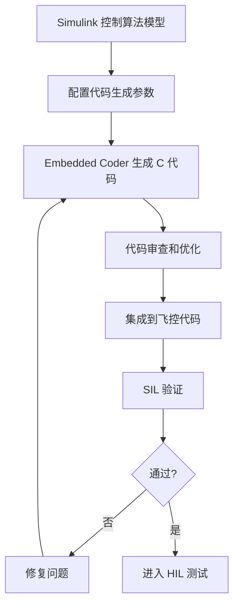
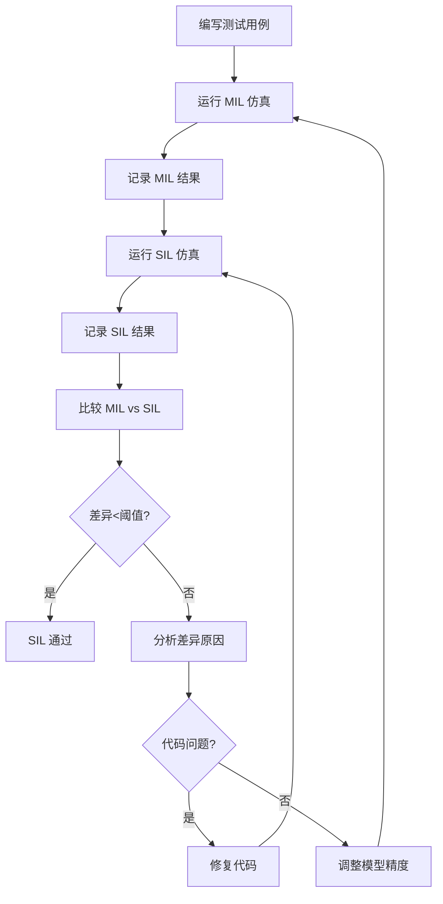

# SIL 软件在环仿真

> 预计阅读：20 分钟 | 前置知识：Simulink 建模、C/C++ 基础、PX4/ArduPilot 概念

---

## 1. SIL 概念与意义

### 1.1 什么是 SIL

软件在环仿真（Software-in-the-Loop, SIL）是指将**真实的飞控代码**（如 PX4、ArduPilot）运行在普通计算机上，与**仿真环境**（如 Simulink 模型）进行交互测试。

```
┌─────────────────────────────────────────────────────────┐
│                      计算机（PC）                         │
│                                                         │
│  ┌──────────────┐     通信接口     ┌──────────────────┐  │
│  │  PX4 飞控代码  │ ←─────────────→ │  Simulink 植物模型 │  │
│  │  (真实代码)    │   MAVLink/UDP   │  (UAV 动力学)     │  │
│  │  编译为 x86    │                 │  传感器仿真       │  │
│  └──────────────┘                 └──────────────────┘  │
│                                                         │
└─────────────────────────────────────────────────────────┘
```

### 1.2 SIL vs MIL 对比

| 对比维度 | MIL (Model-in-the-Loop) | SIL (Software-in-the-Loop) |
|---------|------------------------|---------------------------|
| 控制器形式 | Simulink 模型 | 编译后的 C/C++ 代码 |
| 执行平台 | MATLAB/Simulink | x86 Linux/Windows |
| 测试目的 | 验证控制算法逻辑 | 验证代码实现正确性 |
| 代码相关问题 | 无法发现 | 可以发现（溢出、精度） |
| 执行速度 | 快（模型简化） | 接近实时 |
| 调试便利性 | 非常方便 | 需要 GDB 等工具 |
| 开发阶段 | 早期 | 中期（代码生成后） |

### 1.3 SIL 在 V 模型中的位置


---

## 2. PX4 SITL 与 Simulink

### 2.1 PX4 SITL 概述

PX4 SITL（Software In The Loop）是 PX4 自动驾驶仪的仿真模式，飞控代码编译为原生可执行文件，在 Linux 上运行，通过 MAVLink 与仿真器通信。

### 2.2 通信架构



### 2.3 Simulink MAVLink 接收模块

```matlab
%% 在 Simulink 中接收 PX4 状态
% 使用 UDP Receive 模块接收 MAVLink 消息
% 或使用 ROS Toolbox 通过 MAVROS 接收

% 方法 1：直接 MAVLink
mavlinkStruct = mavlinkio('udpport', 14540);
msg = read(mavlinkStruct, 'ATTITUDE_QUATERNION');

% 方法 2：通过 MAVROS
attSub = rossubscriber('/mavros/imu/data', 'sensor_msgs/Imu');
attMsg = receive(attSub, 1);
```

### 2.4 启动 PX4 SITL 的步骤

```bash
# 步骤 1：克隆并编译 PX4
git clone https://github.com/PX4/PX4-Autopilot.git
cd PX4-Autopilot
make px4_sitl_default none  # 无 Gazebo 的纯 SITL

# 步骤 2：配置 UDP 端口（连接 Simulink）
# 在 PX4-Autopilot/ROMFS/px4fmu_common/init.d-posix/rcS 中设置
export MAVLINK_DIALECT=common

# 步骤 3：启动 PX4 SITL
make px4_sitl_default none
```

---

## 3. ArduPilot SITL 集成

### 3.1 ArduPilot SITL 概述

ArduPilot SITL 与 PX4 SITL 类似，但使用不同的通信协议和架构：

| 对比维度 | PX4 SITL | ArduPilot SITL |
|---------|---------|---------------|
| 飞控栈 | PX4 | ArduCopter/Plane |
| 通信协议 | MAVLink | MAVLink |
| 默认端口 | UDP:14540 | TCP:5760 |
| 仿真器接口 | MAVLink API | SITL JSON API |
| 参数系统 | .params | .param |
| 地面站 | QGroundControl | Mission Planner |

### 3.2 ArduPilot SITL + Simulink 连接

```matlab
%% ArduPilot SITL 通过 TCP 连接 Simulink
% ArduPilot 默认使用 TCP:5760 发送传感器数据
% 和 TCP:5762 接收 PWM 指令

% TCP 客户端（发送传感器数据给 ArduPilot）
arduClient = tcpclient('localhost', 5760);

% TCP 服务器（接收 ArduPilot 的 PWM 输出）
arduServer = tcpserver('localhost', 5762);

%% JSON 消息格式（ArduPilot SITL JSON 接口）
sensorMsg = struct( ...
    'timestamp', uint64(posixtime(datetime('now'))*1e6), ...
    'gyro', [0, 0, 0], ...
    'accel_body', [0, 0, -9.81], ...
    'pos_gps', [lat, lon, alt], ...
    'velocity', [vn, ve, vd], ...
    'wind', [0, 0, 0]);
```

### 3.3 ArduPilot SITL 启动

```bash
# 克隆 ArduPilot
git clone https://github.com/ArduPilot/ardupilot.git
cd ardupilot
git submodule update --init --recursive

# 启动 Copter SITL
cd ArduCopter
sim_vehicle.py -v ArduCopter --console --map
```

---

## 4. 从 Simulink 到飞控代码

### 4.1 代码生成工作流



### 4.2 代码生成配置

```matlab
%% Simulink 代码生成配置
% 设置求解器
set_param(model, 'SolverType', 'Fixed-step');
set_param(model, 'FixedStep', '0.001');
set_param(model, 'Solver', 'ode4');

% 设置代码生成目标
set_param(model, 'SystemTargetFile', 'ert.tlc');  % Embedded Coder
set_param(model, 'GenerateReport', 'on');
set_param(model, 'TargetLang', 'C');

% 生成代码
slbuild(model);
```

### 4.3 生成代码示例

```c
/* 生成的姿态控制器代码片段 */
void attitude_controller_step(void)
{
    real_T error_phi, error_theta, error_psi;
    real_T tau_x, tau_y, tau_z;

    /* 读取输入 */
    error_phi = rtU.phi_ref - rtU.phi;
    error_theta = rtU.theta_ref - rtU.theta;
    error_psi = rtU.psi_ref - rtU.psi;

    /* PID 控制律 */
    tau_x = rtP.Kp_roll * error_phi
          + rtP.Kd_roll * (-rtU.p)
          + rtP.Ki_roll * rtDW.phi_integrator;

    tau_y = rtP.Kp_pitch * error_theta
          + rtP.Kd_pitch * (-rtU.q)
          + rtP.Ki_pitch * rtDW.theta_integrator;

    tau_z = rtP.Kp_yaw * error_psi
          + rtP.Kd_yaw * (-rtU.r)
          + rtP.Ki_yaw * rtDW.psi_integrator;

    /* 写入输出 */
    rtY.tau_x = tau_x;
    rtY.tau_y = tau_y;
    rtY.tau_z = tau_z;
}
```

---

## 5. SIL 验证工作流

### 5.1 完整验证流程



### 5.2 MIL vs SIL 比较指标

| 指标 | 计算方式 | 典型阈值 | 说明 |
|------|---------|---------|------|
| 最大绝对误差 | max\|y_MIL - y_SIL\| | < 0.01 | 单点偏差 |
| 均方根误差 | sqrt(mean((y_MIL - y_SIL)²)) | < 0.005 | 整体偏差 |
| 相关系数 | corr(y_MIL, y_SIL) | > 0.999 | 趋势一致性 |
| 稳态误差 | \|y_MIL(∞) - y_SIL(∞)\| | < 0.001 | 最终值偏差 |
| 超调量差异 | \|OS_MIL - OS_SIL\| | < 2% | 动态特性差异 |

### 5.3 差异来源分析

| 差异类型 | 可能原因 | 解决方案 |
|---------|---------|---------|
| 数值精度 | 浮点数精度（single vs double） | 使用相同数据类型 |
| 定步长误差 | 积分方法差异 | 调整步长或使用相同求解器 |
| 查表插值 | 插值方法不同 | 统一查表方法 |
| 整数溢出 | 定点数范围不足 | 扩大数据类型范围 |
| 执行顺序 | 代码生成的执行顺序 | 检查数据依赖关系 |

---

## 6. 优化 SIL 性能

### 6.1 加速技巧

| 方法 | 效果 | 实现难度 |
|------|------|---------|
| 并行仿真 | 线性加速 | 中 |
| 模型降阶 | 减少计算量 | 中 |
| 简化传感器模型 | 减少计算量 | 低 |
| 增大仿真步长 | 提高速度 | 低（可能降低精度） |
| 使用 MEX 加速 | 提高 MATLAB 代码速度 | 中 |
| 关闭可视化 | 减少渲染开销 | 低 |

### 6.2 并行 SIL 测试

```matlab
%% 并行运行多个 SIL 测试用例
testCases = {'hover', 'circle', 'figure8', 'waypoint'};
results = cell(length(testCases), 1);

parfor i = 1:length(testCases)
    results{i} = run_sil_test(testCases{i});
end

% 汇总结果
for i = 1:length(testCases)
    fprintf('Test %s: %s\n', testCases{i}, results{i}.status);
end
```

---

## 7. SIL 测试用例设计

### 7.1 基础测试用例

| 测试用例 | 描述 | 通过标准 |
|---------|------|---------|
| 悬停保持 | 在指定位置悬停 30 秒 | 位置误差 < 0.1m |
| 阶跃响应 | 阶跃位置指令 | 超调 < 10%，调节时间 < 3s |
| 圆形跟踪 | 跟踪半径 5m 的圆 | 跟踪误差 < 0.3m |
| 8 字跟踪 | 跟踪 8 字轨迹 | 跟踪误差 < 0.5m |
| 航点飞行 | 按顺序飞越 5 个航点 | 全部到达，顺序正确 |
| 抗风测试 | 施加 5m/s 侧风 | 位置误差 < 1m |
| 失控保护 | 模拟传感器故障 | 安全降落 |

### 7.2 边界条件测试

```matlab
%% 边界条件测试脚本
boundary_tests = struct( ...
    'max_speed',    struct('ref', [10; 0; 0], 'expect', 'track'), ...
    'max_tilt',     struct('ref', [0; 0; 0], 'init_euler', [0.5; 0.5; 0]), ...
    'low_battery',  struct('voltage', 10.5, 'expect', 'landing'), ...
    'gps_loss',     struct('gps_valid', false, 'expect', 'hold_position'), ...
    'motor_fail',   struct('motor_id', 2, 'expect', 'emergency_land'));
```

---

## 8. 参考资源

- **GitHub 仓库**：
  - [optimAero/optimAeroPX4SIL](https://github.com/optimAero/optimAeroPX4SIL) — PX4 SIL 仿真
  - [mikolajpietraszko/UAV-SITL](https://github.com/mikolajpietraszko/UAV-SITL) — UAV SITL 测试
- **PX4 官方**：
  - PX4 Dev Guide: Simulation
  - MAVLink Integration
- **ArduPilot 官方**：
  - SITL Simulator
  - JSON Interface

---

## 思考题

**1. SIL 和 MIL 的核心区别是什么？为什么在代码生成后必须进行 SIL 测试？**

<details><summary>参考答案</summary>

核心区别在于控制器的形式：MIL 使用 Simulink 模型，SIL 使用编译后的 C/C++ 代码。代码生成后必须进行 SIL 测试的原因：（1）浮点精度差异：Simulink 使用 double，嵌入式可能使用 single 或定点数，导致数值结果不同；（2）执行顺序：代码生成可能改变 Simulink 中信号的计算顺序，影响结果；（3）溢出和饱和：整数运算可能溢出，需要在 SIL 中验证；（4）编译器优化：编译器可能重排指令或优化掉某些计算；（5）内存限制：嵌入式平台的内存约束可能导致动态分配失败。

</details>

**2. PX4 SITL 和 ArduPilot SITL 在与 Simulink 集成时有什么主要差异？应如何选择？**

<details><summary>参考答案</summary>

主要差异：（1）通信接口：PX4 SITL 通过 MAVLink UDP 端口通信，ArduPilot SITL 通过 TCP JSON 接口通信；（2）传感器数据格式不同，Simulink 侧需要不同的消息解析逻辑；（3）PX4 与 MATLAB 有官方的 PX4 Toolbox 支持，ArduPilot 集成需要更多手动配置。选择依据：如果团队使用 Pixhawk 硬件且目标是 PX4 飞控，选 PX4 SITL；如果使用 ArduPilot 生态或需要更灵活的自定义，选 ArduPilot SITL。两者在 SIL 阶段的功能差异不大，主要看最终实飞使用的飞控平台。

</details>

**3. MIL 和 SIL 结果存在微小差异是正常的，但如何判断差异是否可接受？**

<details><summary>参考答案</summary>

判断标准：（1）时域指标差异：超调量差 < 2%，调节时间差 < 5%，稳态误差差 < 1%，可接受；（2）统计指标：RMSE < 0.5%满量程，相关系数 > 0.999，可接受；（3）功能一致性：所有功能测试用例在 MIL 和 SIL 中都通过/失败，即使数值有差异也可接受；（4）差异可解释：如果差异能追溯到已知原因（如定点数精度、查表插值），且影响可控，可接受。如果差异导致功能测试结果翻转（MIL 通过但 SIL 失败），必须调查原因。

</details>

**4. 在 SIL 测试中发现 MIL 通过但 SIL 失败的测试用例，排查步骤是什么？**

<details><summary>参考答案</summary>

排查步骤：（1）首先确认差异是稳定的还是随机的——多次运行确认可复现性；（2）检查数值精度——查看中间变量的 double/single 差异；（3）检查执行顺序——在 Simulink Model Explorer 中查看代码生成的执行顺序报告；（4）检查查表和插值——确认生成代码中的查表方法与 Simulink 一致；（5）检查饱和/限幅——生成代码的限幅逻辑是否正确；（6）使用 SIL 回放功能——将 MIL 的输入录制后在 SIL 中回放，逐信号对比找到第一个差异点；（7）如果以上都无法解释，检查编译器优化级别是否引入问题。

</details>

**5. 如何设计一个全面的 SIL 测试套件来覆盖飞控系统的关键功能？**

<details><summary>参考答案</summary>

全面的 SIL 测试套件应包含：（1）**功能测试**：悬停、轨迹跟踪、航点飞行、自动起飞/降落；（2）**性能测试**：跟踪精度、响应速度、最大速度/加速度；（3）**鲁棒性测试**：抗风扰、传感器噪声、通信延迟；（4）**故障注入测试**：GPS 丢失、电机故障、传感器偏差、电池低电压；（5）**边界条件测试**：最大载荷、极端姿态角、执行器饱和；（6）**回归测试**：确保新代码不破坏已有功能。每个测试用例应有明确的通过/失败标准和超时时间。建议使用自动化测试框架（如 MATLAB Unit Test）组织测试套件，支持 CI/CD 集成。

</details>
