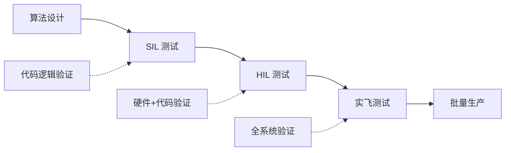
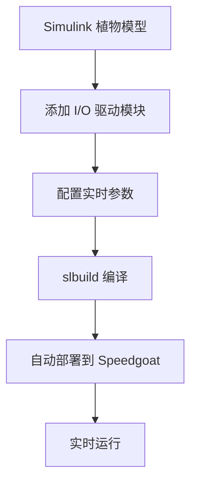

# HIL 硬件在环仿真

> 预计阅读：20 分钟 | 前置知识：SIL 仿真基础、嵌入式系统基础、PX4/ArduPilot 配置

---

## 1. HIL 概念与价值

### 1.1 什么是 HIL

硬件在环仿真（Hardware-in-the-Loop, HIL）是将**真实的飞控硬件**（如 Pixhawk）连接到**仿真环境**，让硬件"以为"自己在真实飞行。

```
┌─────────────────────────────────────────────────────────┐
│                                                         │
│  ┌──────────────┐   传感器信号   ┌──────────────────┐   │
│  │   Pixhawk     │ ←──────────── │  Simulink 植物模型 │   │
│  │   飞控硬件     │               │  (Speedgoat/PC)   │   │
│  │   (真实硬件)   │ ──────────→  │                   │   │
│  └──────────────┘   PWM 指令    └──────────────────┘   │
│                                                         │
└─────────────────────────────────────────────────────────┘
```

### 1.2 为什么 HIL 必不可少

SIL 测试验证了代码逻辑，但无法测试：

| 问题类型 | SIL 可测 | HIL 可测 | 说明 |
|---------|---------|---------|------|
| 算法逻辑 | 是 | 是 | 控制律正确性 |
| 定时精度 | 部分 | 是 | 实时执行抖动 |
| 硬件接口 | 否 | 是 | PWM、ADC、UART |
| 传感器驱动 | 否 | 是 | I2C/SPI 通信 |
| 中断处理 | 否 | 是 | 传感器数据到达时序 |
| 内存限制 | 否 | 是 | 嵌入式内存约束 |
| 功耗 | 否 | 是 | 实际运行功耗 |

### 1.3 HIL 在开发流程中的位置



---

## 2. HIL 系统搭建

### 2.1 硬件组件

| 组件 | 型号示例 | 功能 | 连接方式 |
|------|---------|------|---------|
| 飞控板 | Pixhawk 6X, Cube Orange | 运行飞控代码 | USB/UART |
| 实时目标机 | Speedgoat | 运行植物模型 | 以太网 |
| 电源 | 5V 3A 适配器 | 供电飞控 | USB/DC |
| 转接板 | PWM 分线板 | 信号连接 | 杜邦线 |
| 主机 PC | Windows/Linux | 监控和控制 | 以太网 |

### 2.2 信号连接图

```
Speedgoat                        Pixhawk
┌────────────┐                  ┌────────────┐
│            │   UART (IMU)     │            │
│ IMU 仿真   │─────────────────→│ IMU 驱动    │
│            │                  │            │
│ GPS 仿真   │─────────────────→│ GPS 驱动    │
│            │   UART (GPS)     │            │
│            │                  │            │
│ 气压计仿真  │─────────────────→│ 气压计驱动   │
│            │   I2C (Baro)     │            │
│            │                  │            │
│ PWM 采集   │←────────────────│ PWM 输出    │
│            │   PWM 信号       │            │
│            │                  │            │
└────────────┘                  └────────────┘
```

### 2.3 Simulink Real-Time 配置

```matlab
%% Speedgoat 目标机配置
tg = slrt('Speedgoat-Target');  % 连接目标机

% 加载模型
load(tg, 'uav_plant_model');

% 配置采样率
set_param('uav_plant_model', 'FixedStep', '0.001');

% 启动实时执行
start(tg);

%% 参数在线调整
setparam(tg, 'uav_plant_model/Wind', 'Gain', [3; 0; 0]);

%% 数据记录
logData = tg.LoggedData;
```

---

## 3. Simulink Real-Time 与 Speedgoat

### 3.1 Simulink Real-Time 概述

Simulink Real-Time（原 xPC Target）将 Simulink 模型编译为实时可执行文件，在 Speedgoat 硬件上确定性执行。

| 特性 | 规格 |
|------|------|
| 最小步长 | 10 μs |
| 抖动 | < 1 μs |
| I/O 支持 | 模拟/数字/PWM/UART/SPI/CAN/Ethernet |
| 通信 | TCP/IP, UDP, EtherCAT |
| 开发环境 | MATLAB/Simulink |

### 3.2 模型编译与部署



### 3.3 I/O 驱动配置

```matlab
%% 模拟输出（发送 IMU 数据给 Pixhawk）
% 使用 Speedgoat 模拟输出通道
% IMU X 轴加速度 → AO Channel 0
% IMU Y 轴加速度 → AO Channel 1
% IMU Z 轴加速度 → AO Channel 2

%% PWM 输入（接收 Pixhawk 电机指令）
% 使用 Speedgoat PWM 输入模块
% 电机 1 PWM → DI Channel 0
% 电机 2 PWM → DI Channel 1
% 电机 3 PWM → DI Channel 2
% 电机 4 PWM → DI Channel 3

%% UART 通信（GPS 数据）
% 使用 Speedgoat 串口模块
% GPS NMEA 消息 → COM1 TX
```

---

## 4. Pixhawk HIL 配置

### 4.1 PX4 HIL 参数设置

| 参数 | 值 | 说明 |
|------|-----|------|
| SYS_HITL | 1 | 启用 HIL 模式 |
| SENS_EN_IMU | 0 | 禁用真实 IMU |
| SENS_EN_MAG | 0 | 禁用真实磁力计 |
| SENS_EN_BARO | 0 | 禁用真实气压计 |
| GPS_1_CONFIG | 0 | 禁用真实 GPS |
| COM_RCL_EXCEPT | 4 | 忽略遥控器丢失 |

### 4.2 QGroundControl HIL 配置步骤

1. 连接 Pixhawk 到 QGroundControl
2. 进入 Vehicle Setup → Parameters
3. 搜索并设置上述参数
4. 重启飞控
5. 确认 HIL 模式指示

### 4.3 MAVLink HIL 消息

| MAVLink 消息 | 方向 | 内容 | 频率 |
|-------------|------|------|------|
| HIL_SENSOR | Simulink→PX4 | IMU+气压计数据 | 100Hz |
| HIL_GPS | Simulink→PX4 | GPS 位置和速度 | 10Hz |
| HIL_RC_INPUTS | Simulink→PX4 | 遥控器通道 | 50Hz |
| HIL_ACTUATOR | PX4→Simulink | 电机 PWM 指令 | 400Hz |

---

## 5. 传感器注入与故障注入

### 5.1 传感器注入

```matlab
%% 在 Simulink 中生成传感器数据
function sensor_data = generate_sensor_data(state, params)
    % state: [pos, vel, euler, omega]
    % params: 传感器参数

    % IMU 数据（含噪声和偏差）
    acc_true = state.acceleration + cross(state.omega, cross(state.omega, [0;0;0]));
    gyro_true = state.omega;

    sensor_data.imu.accel = acc_true + params.accel_bias + params.accel_noise * randn(3,1);
    sensor_data.imu.gyro = gyro_true + params.gyro_bias + params.gyro_noise * randn(3,1);

    % GPS 数据（含多径和噪声）
    sensor_data.gps.position = state.position + params.gps_noise * randn(3,1);
    sensor_data.gps.velocity = state.velocity + params.gps_vel_noise * randn(3,1);
    sensor_data.gps.fix = 3;  % 3D Fix

    % 气压计数据（含温度漂移）
    sensor_data.baro.altitude = -state.position(3) + params.baro_noise * randn();
    sensor_data.baro.temperature = 25 + 0.1 * randn();
end
```

### 5.2 故障注入测试

| 故障类型 | 注入方式 | 预期行为 | 测试目的 |
|---------|---------|---------|---------|
| GPS 丢失 | gps.fix = 0 | 切换到光流/视觉定位 | 容错导航 |
| IMU 偏差 | 添加恒定偏差 | EKF 检测并补偿 | 传感器校准 |
| 电机故障 | PWM 通道归零 | 安全降落/冗余控制 | 执行器容错 |
| 通信丢失 | 停止 MAVLink 心跳 | 触发 failsafe | 通信冗余 |
| 电池低压 | 电压信号降低 | 自动返航/降落 | 电源管理 |
| 磁力计异常 | 添加突变偏差 | 切换到 GPS 航向 | 航向容错 |

### 5.3 故障注入 Simulink 模型

```
                     ┌─────────────────────┐
  正常传感器数据 ──→  │     故障注入模块      │ ──→ Pixhawk
                     │                     │
  故障指令 ────────→  │ [开关] [偏差] [噪声]  │
  (来自测试脚本)      │                     │
                     └─────────────────────┘
```

---

## 6. HIL 测试场景

### 6.1 标准测试场景表

| 场景编号 | 场景描述 | 持续时间 | 通过标准 |
|---------|---------|---------|---------|
| HIL-001 | 基本悬停 | 60s | 位置误差 < 0.2m |
| HIL-002 | 航点飞行（4 点） | 120s | 全部到达 |
| HIL-003 | 圆形轨迹 | 60s | 跟踪误差 < 0.5m |
| HIL-004 | GPS 丢失 10s | 30s | 位置保持 < 2m |
| HIL-005 | 电机故障 | 30s | 安全降落 |
| HIL-006 | 强风扰动（10m/s） | 60s | 位置误差 < 1m |
| HIL-007 | 电池低压 | 60s | 自动返航 |
| HIL-008 | 全航点任务 | 300s | 任务完成 |
| HIL-009 | 连续故障（GPS+风） | 60s | 安全着陆 |
| HIL-010 | 极端姿态恢复 | 30s | 恢复到水平 |

### 6.2 测试自动化

```matlab
%% HIL 自动化测试脚本
function results = run_hil_tests()
    tg = slrt('Speedgoat-Target');
    px4 = mavlinkio('udpport', 14540);

    test_suite = {
        struct('name', 'hover', 'duration', 60, 'threshold', 0.2);
        struct('name', 'waypoint', 'duration', 120, 'threshold', 0.5);
        struct('name', 'gps_loss', 'duration', 30, 'threshold', 2.0);
    };

    results = cell(length(test_suite), 1);

    for i = 1:length(test_suite)
        fprintf('Running test: %s\n', test_suite{i}.name);

        % 重置仿真环境
        reset_simulation(tg, px4);

        % 运行测试
        [pos_log, time_log] = run_test(tg, px4, test_suite{i}.duration);

        % 分析结果
        results{i} = analyze_results(pos_log, time_log, test_suite{i}.threshold);
        fprintf('Result: %s\n', results{i}.status);
    end
end
```

---

## 7. SIL vs HIL vs 实飞对比

| 对比维度 | SIL | HIL | 实飞 |
|---------|-----|-----|------|
| 环境真实性 | 中 | 高 | 最高 |
| 风险 | 无 | 低 | 高 |
| 成本 | 低 | 中 | 高 |
| 可重复性 | 高 | 高 | 低 |
| 调试便利性 | 高 | 中 | 低 |
| 测试覆盖 | 逻辑 | 逻辑+硬件 | 全系统 |
| 天气影响 | 无 | 无 | 有 |
| 安全约束 | 无 | 有限 | 全部 |
| 典型测试时长 | 分钟级 | 小时级 | 天级 |
| 发现的问题 | 算法/代码 | 时序/接口/硬件 | 综合 |

---

## 8. 常见问题与解决

| 问题 | 现象 | 原因 | 解决方案 |
|------|------|------|---------|
| 飞控不响应 HIL 数据 | 红色 LED | HIL 模式未启用 | 检查 SYS_HITL 参数 |
| IMU 数据异常 | 无人机翻转 | 数据格式/单位错误 | 检查 MAVLink 消息定义 |
| GPS 无法定位 | 无 GPS 锁定 | 消息频率或内容错误 | 验证 HIL_GPS 消息 |
| PWM 读取失败 | 电机不动 | 接线或电平不匹配 | 检查 PWM 信号电平 |
| 通信中断 | 飞控失联 | UDP 端口冲突 | 更换端口或检查防火墙 |
| 时序不同步 | 振荡或不稳定 | 传感器数据延迟 | 调整数据发送频率 |

---

## 9. 参考资源

- **Speedgoat**：
  - Simulink Real-Time 文档
  - Speedgoat I/O 驱动库
- **PX4 官方**：
  - HIL Simulation 文档
  - jMAVSim HIL 配置
- **MATLAB 官方**：
  - Simulink Real-Time Getting Started
  - Speedgoat Hardware Support

---

## 思考题

**1. HIL 测试相比 SIL 测试能发现哪些额外的问题？请举例说明。**

<details><summary>参考答案</summary>

HIL 能发现的问题包括：（1）实时性问题：飞控硬件的中断响应时间可能导致传感器数据处理延迟，这在 SIL 中无法体现——例如 IMU 数据到达时飞控正在处理 GPS 数据，导致控制回路抖动；（2）硬件接口问题：PWM 信号的上升/下降时间、电平匹配、接地回路等；（3）内存碎片：长时间运行后嵌入式系统的内存碎片导致分配失败；（4）时钟漂移：飞控晶振精度不足导致定时累积误差；（5）电磁干扰：PWM 大电流信号对传感器 I2C 总线的干扰。这些问题在 SIL 中都无法复现，因为 SIL 不涉及真实硬件。

</details>

**2. 故障注入测试中，为什么要测试"GPS 丢失+强风"的组合故障？**

<details><summary>参考答案</summary>

实际飞行中故障往往不会单独发生。GPS 丢失+强风是典型的组合故障场景：GPS 丢失后，飞控可能切换到光流或视觉定位，但强风会导致无人机大幅偏移，光流传感器可能无法在快速运动中准确定位。这种组合故障暴露了：（1）故障切换逻辑的鲁棒性——是否能平滑切换；（2）降级模式的能力——在传感器受限时的保持能力；（3）安全裕度——最恶劣情况下的最大位置偏差。测试组合故障可以发现单独测试无法发现的级联失效问题。

</details>

**3. Simulink Real-Time 的最小步长为 10μs，但实际 UAV 仿真通常使用 1ms 步长。为什么要留这么大的裕度？**

<details><summary>参考答案</summary>

1ms 步长是 10μs 最小步长的 100 倍，裕度很大，原因：（1）植物模型复杂度：完整的六自由度模型加上气动、电机、传感器模型，1ms 已经需要相当的计算量；（2）I/O 开销：传感器数据的 DAQ 和 PWM 采集需要时间，会占用 CPU 时间片；（3）抖动裕度：实时系统需要保证最坏情况下也能在截止时间内完成计算，裕度越大越安全；（4）飞控采样率匹配：Pixhawk 的主要控制回路运行在 250-400Hz，1ms（1kHz）已足够；（5）通信开销：MAVLink 消息的打包/解包和网络传输也需要时间。

</details>

**4. 如何确保 HIL 仿真中传感器注入的数据与真实传感器行为一致？**

<details><summary>参考答案</summary>

确保一致性的方法：（1）查阅传感器数据手册，获取真实传感器的噪声密度、偏差、采样率等参数；（2）使用真实传感器数据进行校准——先用实飞数据提取传感器特性，再在 HIL 中复现；（3）包含真实的传感器效应：量化噪声、温漂、非线性、交叉耦合；（4）验证传感器数据包格式——MAVLink 消息的字段顺序和单位必须与飞控驱动期望的一致；（5）使用频域分析——比较真实传感器和仿真传感器的功率谱密度（PSD），确保噪声特性匹配。

</details>

**5. 在没有 Speedgoat 实时目标机的情况下，如何用普通 PC 搭建 HIL 系统？有什么局限？**

<details><summary>参考答案</summary>

可以用普通 PC + Simulink Desktop Real-Time（原 Real-Time Windows Target）搭建：（1）使用声卡或 USB 数据采集卡（如 NI DAQ）作为 I/O 接口；（2）通过 USB 转串口模块发送 MAVLink 传感器数据；（3）使用 GPIO 转换板读取 PWM 信号。局限：（1）实时性差——Windows 不是实时操作系统，抖动可能达到 1-10ms，而 Speedgoat 的抖动 < 1μs；（2）I/O 带宽有限——USB 延迟约 1ms，不适合高速 PWM 采集；（3）不能测试真正的硬件时序问题。因此，普通 PC HIL 适合初步验证连接和功能，但不能替代 Speedgoat 的严格实时 HIL。

</details>
