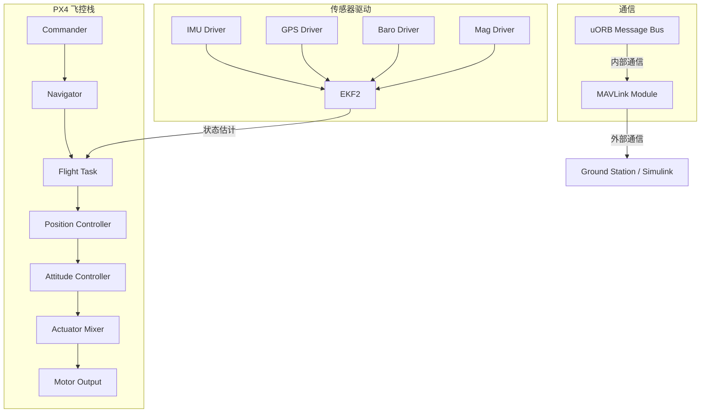
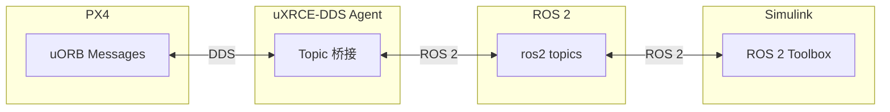
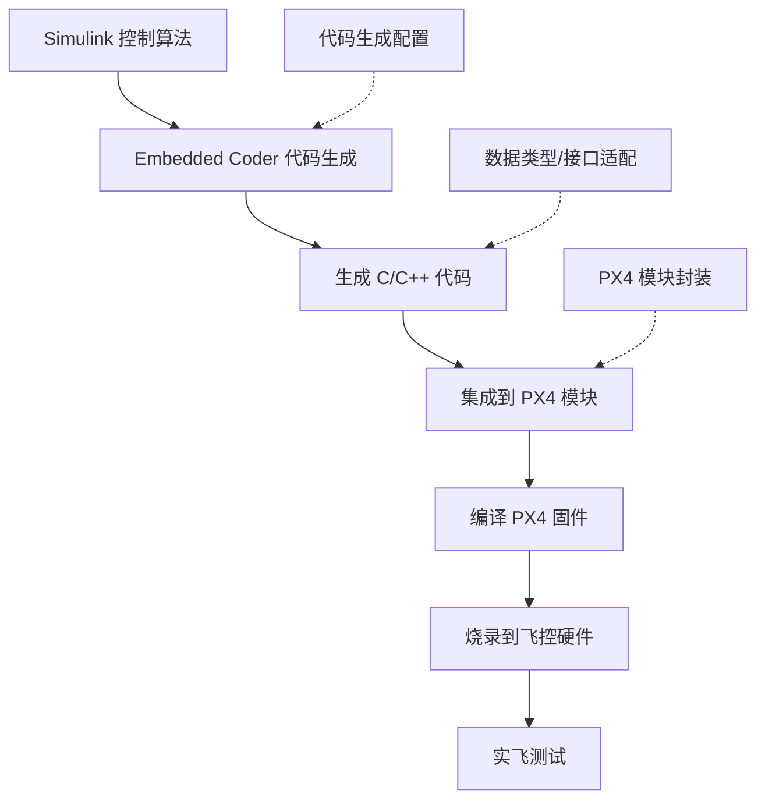

# PX4-Simulink 接口

> 预计阅读：22 分钟 | 前置知识：PX4 基础、MAVLink 协议、Simulink 建模、ROS 基础

---

## 1. PX4 自动驾驶仪概述

### 1.1 PX4 架构

PX4 是一个开源的无人机自动驾驶仪，采用模块化架构：



### 1.2 uORB 消息总线

PX4 内部使用 uORB（micro Object Request Broker）进行模块间通信：

| uORB 消息 | 发布者 | 订阅者 | 频率 |
|-----------|-------|-------|------|
| sensor_accel | IMU 驱动 | EKF2 | 1000Hz |
| vehicle_attitude | EKF2 | 姿态控制器 | 250Hz |
| vehicle_local_position | EKF2 | 位置控制器 | 100Hz |
| actuator_outputs | 混控器 | PWM 驱动 | 400Hz |
| vehicle_command | MAVLink | Commander | 事件触发 |

---

## 2. MAVLink 通信协议

### 2.1 MAVLink 概述

MAVLink（Micro Air Vehicle Link）是 PX4 与外部通信的主要协议：

| 特性 | 说明 |
|------|------|
| 版本 | MAVLink 2（当前主流） |
| 传输层 | UDP/TCP/Serial |
| 消息大小 | 最大 280 字节 |
| 消息ID | 0-16777215 |
| 系统ID | 1-255 |
| 组件ID | 1-255 |
| 序列号 | 0-255（丢包检测） |

### 2.2 MAVLink 消息结构

```
┌─────────────────────────────────────────────────────────┐
│                   MAVLink 2 帧格式                       │
├─────────┬─────────┬─────────┬────────┬───────┬─────────┤
│ STX     │ LEN     │ INCOMP  │ COMP   │ SEQ   │ SYSID   │
│ 0xFD    │ 1 byte  │ 1 byte  │ 1 byte │ 1 byte│ 1 byte  │
├─────────┼─────────┼─────────┼────────┼───────┼─────────┤
│ COMPID  │ MSGID (3 bytes)           │ PAYLOAD (0-255B)  │
│ 1 byte  │                           │                   │
├─────────┼────────────────────────────┼──────────────────┤
│ CHECKSUM (2 bytes)                    │ SIGN (13 bytes)  │
└─────────────────────────────────────────────────────────┘
```

### 2.3 常用 MAVLink 消息

| 消息名 | ID | 方向 | 用途 |
|--------|-----|------|------|
| HEARTBEAT | 0 | 双向 | 心跳检测 |
| ATTITUDE_QUATERNION | 31 | PX4→外 | 姿态四元数 |
| LOCAL_POSITION_NED | 32 | PX4→外 | 本地位置 |
| SET_POSITION_TARGET_LOCAL_NED | 84 | 外→PX4 | 位置指令 |
| SET_ATTITUDE_TARGET | 82 | 外→PX4 | 姿态指令 |
| COMMAND_LONG | 76 | 外→PX4 | 通用命令 |
| HIL_SENSOR | 107 | 外→PX4 | HIL 传感器数据 |
| HIL_GPS | 113 | 外→PX4 | HIL GPS 数据 |

---

## 3. Simulink MAVLink 模块

### 3.1 MATLAB MAVLink 工具

MATLAB 提供了 MAVLink 支持：

```matlab
%% 创建 MAVLink 连接
mavlinkConnection = mavlinkio('systemID', 255, 'componentID', 1);

% 打开 UDP 连接（连接 PX4 SITL）
connect(mavlinkConnection, 'UDP', 'LocalPort', 14540);

% 创建客户端
client = mavlinkclient(mavlinkConnection, 1, 1);  % 目标系统1，组件1
```

### 3.2 发送 MAVLink 消息

```matlab
%% 发送位置目标指令
% 创建消息结构
msg = mavlinkmessage(mavlinkConnection, 'SET_POSITION_TARGET_LOCAL_NED');

% 填充字段
msg.Payload.time_boot_ms = uint32(0);
msg.Payload.coordinate_frame = uint8(1);  % FRAME_LOCAL_NED
msg.Payload.type_mask = uint16(bin2dec('0000111111111000'));  % 仅使用位置
msg.Payload.x = single(5.0);   % 北向 5m
msg.Payload.y = single(0.0);   % 东向 0m
msg.Payload.z = single(-3.0);  % 向下 3m（NED 坐标系）
msg.Payload.vx = single(0);
msg.Payload.vy = single(0);
msg.Payload.vz = single(0);

% 发送消息
send(mavlinkConnection, client, msg);
```

### 3.3 接收 MAVLink 消息

```matlab
%% 订阅姿态消息
attSub = mavlinksubscriber(mavlinkConnection, client, ...
    'ATTITUDE_QUATERNION', 'BufferSize', 100);

% 回调函数方式接收
attSub.OnMessageReceived = @(msg) process_attitude(msg);

% 或者阻塞方式接收
msg = receive(attSub, 1);  % 超时 1 秒

% 提取数据
q = [msg.Payload.q1; msg.Payload.q2; msg.Payload.q3; msg.Payload.q4];
euler = quat2eul(q');
```

### 3.4 Simulink 中的 MAVLink 模块

```
┌─────────────────────────────────────────────────────────┐
│                    Simulink MAVLink 模型                  │
│                                                         │
│  [位置参考] ──→ [位置控制器] ──→ [MAVLink 发送模块]       │
│                     ↑                  │                 │
│                     │                  ↓                 │
│              [MAVLink 接收模块]    UDP 网络               │
│                     │                  ↑                 │
│              [传感器解析]              │                 │
│                                      ↓                 │
│                                 [PX4 SITL]              │
└─────────────────────────────────────────────────────────┘
```

---

## 4. PX4 ROS 2 接口与 Simulink

### 4.1 PX4-ROS 2 通信架构

PX4 通过 uXRCE-DDS（micro XRCE-DDS）桥接与 ROS 2 通信：



### 4.2 ROS 2 Toolbox for Simulink

```matlab
%% ROS 2 连接
% 初始化 ROS 2 节点
node = ros2node('simulink_controller');

% 创建订阅者（接收 PX4 状态）
attSub = ros2subscriber(node, '/fmu/out/vehicle_attitude', ...
    'px4_msgs/VehicleAttitude');

% 创建发布者（发送控制指令）
cmdPub = ros2publisher(node, '/fmu/in/offboard_control_mode', ...
    'px4_msgs/OffboardControlMode');

% 创建指令发布者
trajPub = ros2publisher(node, '/fmu/in/trajectory_setpoint', ...
    'px4_msgs/TrajectorySetpoint');
```

### 4.3 PX4 ROS 2 消息类型

| ROS 2 Topic | 消息类型 | 用途 |
|-------------|---------|------|
| /fmu/out/vehicle_attitude | VehicleAttitude | 姿态输出 |
| /fmu/out/vehicle_local_position | VehicleLocalPosition | 本地位置 |
| /fmu/in/offboard_control_mode | OffboardControlMode | 控制模式 |
| /fmu/in/trajectory_setpoint | TrajectorySetpoint | 轨迹指令 |
| /fmu/in/vehicle_command | VehicleCommand | 车辆命令 |

---

## 5. 自定义控制器部署：Simulink → PX4

### 5.1 部署工作流



### 5.2 代码生成配置

```matlab
%% 为 PX4 部署配置代码生成
% 设置目标为嵌入式
set_param(model, 'SystemTargetFile', 'ert.tlc');
set_param(model, 'TargetLang', 'C');
set_param(model, 'GenCodeOnly', 'on');

% 定点数支持
set_param(model, 'SupportNonFinite', 'off');

% 优化选项
set_param(model, 'InlineParams', 'on');
set_param(model, 'OptimizeBlockIOStorage', 'on');

% 生成代码
slbuild(model);
```

### 5.3 PX4 模块封装

```cpp
// custom_controller_module.cpp
#include <px4_platform_common/module.h>
#include <uORB/topics/vehicle_attitude.h>
#include <uORB/topics/actuator_motors.h>

class CustomController : public ModuleBase<CustomController>
{
public:
    // 从 Simulink 生成的控制器类
    CustomController_ModelClass _controller;

    void Run() override
    {
        // 订阅姿态
        int att_sub = orb_subscribe(ORB_ID(vehicle_attitude));

        // 发布电机指令
        actuator_motors_s motors{};
        orb_advert_t motors_pub = orb_advertise(ORB_ID(actuator_motors), &motors);

        while (!should_exit()) {
            // 读取姿态
            struct vehicle_attitude_s att;
            orb_copy(ORB_ID(vehicle_attitude), att_sub, &att);

            // 调用 Simulink 生成的控制器
            _controller.rtU.phi = att.roll;
            _controller.rtU.theta = att.pitch;
            _controller.rtU.psi = att.yaw;
            _controller.rtU.p = att.rollspeed;
            _controller.rtU.q = att.pitchspeed;
            _controller.rtU.r = att.yawspeed;

            _controller.step();

            // 发布电机指令
            motors.control[0] = _controller.rtY.motor1;
            motors.control[1] = _controller.rtY.motor2;
            motors.control[2] = _controller.rtY.motor3;
            motors.control[3] = _controller.rtY.motor4;

            orb_publish(ORB_ID(actuator_motors), motors_pub, &motors);

            px4_usleep(1000);  // 1ms 周期
        }
    }
};
```

---

## 6. 从 Simulink 发送指令到 PX4 SITL

### 6.1 完整示例：Offboard 模式位置控制

```matlab
%% 步骤 1：连接 PX4 SITL
mavlinkConn = mavlinkio('systemID', 255);
connect(mavlinkConn, 'UDP', 'LocalPort', 14540);
client = mavlinkclient(mavlinkConn, 1, 1);

%% 步骤 2：解锁并切换 Offboard 模式
% 发送心跳（PX4 需要持续心跳才接受指令）
heartbeat_timer = timer('ExecutionMode', 'fixedRate', ...
    'Period', 1, ...
    'TimerFcn', @(~,~) send_heartbeat(mavlinkConn, client));

% 切换到 Offboard 模式
cmd = mavlinkmessage(mavlinkConn, 'COMMAND_LONG');
cmd.Payload.command = uint16(176);  % MAV_CMD_DO_SET_MODE
cmd.Payload.param1 = single(1);    % base mode
cmd.Payload.param2 = single(6);    # custom mode: OFFBOARD
send(mavlinkConn, client, cmd);

% 解锁
cmd = mavlinkmessage(mavlinkConn, 'COMMAND_LONG');
cmd.Payload.command = uint16(400);  % MAV_CMD_COMPONENT_ARM_DISARM
cmd.Payload.param1 = single(1);    % arm
send(mavlinkConn, client, cmd);

%% 步骤 3：持续发送位置目标
for t = 0:0.05:30
    msg = mavlinkmessage(mavlinkConn, 'SET_POSITION_TARGET_LOCAL_NED');
    msg.Payload.type_mask = uint16(bin2dec('0000111111111000'));
    msg.Payload.x = single(0);
    msg.Payload.y = single(0);
    msg.Payload.z = single(-5);  % 悬停高度 5m
    send(mavlinkConn, client, msg);
    pause(0.05);
end
```

### 6.2 轨迹跟踪示例

```matlab
%% 圆形轨迹跟踪
radius = 5;     % 半径 5m
omega = 0.5;    % 角速度 0.5 rad/s
height = -3;    % 高度 3m

for t = 0:0.05:60
    % 计算期望位置
    x_ref = radius * cos(omega * t);
    y_ref = radius * sin(omega * t);
    z_ref = height;

    % 计算期望速度（前馈）
    vx_ref = -radius * omega * sin(omega * t);
    vy_ref = radius * omega * cos(omega * t);

    % 发送指令
    msg = mavlinkmessage(mavlinkConn, 'SET_POSITION_TARGET_LOCAL_NED');
    msg.Payload.type_mask = uint16(bin2dec('0000111111000000'));  % 位置+速度
    msg.Payload.x = single(x_ref);
    msg.Payload.y = single(y_ref);
    msg.Payload.z = single(z_ref);
    msg.Payload.vx = single(vx_ref);
    msg.Payload.vy = single(vy_ref);
    msg.Payload.vz = single(0);
    send(mavlinkConn, client, msg);

    pause(0.05);
end
```

---

## 7. 常见问题与调试

### 7.1 连接问题排查

| 问题 | 检查项 | 解决方案 |
|------|--------|---------|
| 无法连接 PX4 | UDP 端口 | 确认 PX4 输出端口为 14540 |
| 收不到消息 | MAVLink 版本 | 确认使用 MAVLink v2 |
| 心跳超时 | 心跳频率 | 确保 1Hz 心跳发送 |
| Offboard 拒绝 | 心跳+指令 | 先发心跳再发指令，至少 2 秒 |
| 位置不更新 | 坐标系 | NED 坐标，z 向下为正 |

### 7.2 调试工具

```matlab
%% 使用 QGroundControl 监控
% QGC 默认连接 UDP:14550
% 在 Simulink 中转发消息到 QGC

%% 使用 MAVLink Inspector
% 在 MATLAB 命令行中查看收到的消息
mavlinkConnection.MessageHistory

%% 使用 rostopic 监控（如果使用 MAVROS）
% rosrun mavros mavros_diag
% rostopic echo /mavros/state
```

---

## 8. 参考资源

- **GitHub 仓库**：
  - [MichaelSkadan/PX4-Autopilot-Simulink-Interface](https://github.com/MichaelSkadan/PX4-Autopilot-Simulink-Interface) — PX4 Simulink 接口
  - [PX4/PX4-Autopilot](https://github.com/PX4/PX4-Autopilot) — PX4 官方仓库
- **MAVLink 协议**：
  - [mavlink.io](https://mavlink.io) — MAVLink 消息定义
  - MAVLink 开发者指南
- **PX4 官方**：
  - PX4 Dev Guide: MAVLink Messaging
  - PX4 Dev Guide: ROS 2 Integration

---

## 思考题

**1. 为什么 PX4 在 Offboard 模式下需要持续接收心跳和指令才能保持该模式？如果停止发送会发生什么？**

<details><summary>参考答案</summary>

PX4 的安全设计要求外部控制器持续"证明"自己存在。如果在 Offboard 模式下停止发送心跳或指令超过超时时间（默认 0.5 秒），PX4 会自动切换到 failsafe 模式，通常是 Land（降落）或 Hold（悬停在最后已知位置）。这种设计确保了即使外部控制器（如 Simulink）崩溃或通信中断，无人机也不会失控。实际开发中，建议在 Simulink 中使用定时器以 1Hz 发送心跳，以 30-50Hz 发送控制指令，并监控连接状态。

</details>

**2. MAVLink 消息中的 type_mask 字段如何使用？为什么只使用位置而不用速度或加速度？**

<details><summary>参考答案</summary>

type_mask 是一个位掩码，每一位对应一个字段是否被忽略。例如 bit3=1 表示忽略 px，bit6=1 表示忽略 vx，bit9=1 表示忽略 afx。只使用位置而不用速度/加速度的原因：（1）PX4 内部的 Offboard 接口期望完整的目标状态，但在简单场景下只需要位置；（2）如果同时提供位置和速度，需要确保两者一致（速度应该是位置的导数），否则 PX4 可能产生不期望的行为；（3）使用 type_mask=0b0000111111111000 表示只使用位置，让 PX4 内部的轨迹生成器自行计算速度和加速度前馈。

</details>

**3. 在 Simulink 中使用 MAVLink 直接通信和通过 ROS 2 中转，各有什么优缺点？**

<details><summary>参考答案</summary>

直接 MAVLink：优点是延迟低、无额外依赖、调试直接；缺点是需要手动处理消息序列化/反序列化、没有类型安全、添加新消息需要手动更新代码。ROS 2 中转：优点是类型安全、有现成的工具链（rviz、rosbag）、模块化和可扩展性好；缺点是增加了一层通信延迟（约 1-5ms）、需要维护 ROS 2 节点、部署到嵌入式时需要额外的依赖。选择建议：SIL 阶段用 ROS 2 方便调试，HIL/实飞阶段如果对延迟敏感则用直接 MAVLink。

</details>

**4. 将 Simulink 生成的控制器代码集成到 PX4 时，需要注意哪些数据类型和接口问题？**

<details><summary>参考答案</summary>

主要问题：（1）坐标系：Simulink 通常使用 NED（北东地），但某些传感器驱动可能输出 ENU，需要转换；（2）数据类型：Simulink 默认 double，但 PX4 大量使用 float 以节省内存，需要在代码生成时设置 TargetLang 和数据类型映射；（3）四元数顺序：Simulink 可能使用 [w,x,y,z]，PX4 使用 [w,x,y,z] 或 [x,y,z,w]，需要确认；（4）时间基准：PX4 使用 boot time（微秒），Simulink 使用仿真时间，需要在接口层做映射；（5）函数签名：PX4 模块有特定的生命周期接口（init、Run、shutdown），需要封装 Simulink 生成的 step 函数。

</details>

**5. 如何在 PX4 SITL 中测试自定义的 Simulink 控制器，同时保留 PX4 的安全保护功能（如 failsafe）？**

<details><summary>参考答案</summary>

有两种方法：（1）Offboard 模式：让 PX4 保持原有的位置/姿态控制器，Simulink 通过 MAVLink 发送高层指令（如位置目标）。这样 PX4 的所有安全功能都保留，Simulink 只负责任务层逻辑。（2）替换内部控制器：将 Simulink 生成的代码替换 PX4 的姿态/位置控制器模块，但保留 Commander 和 Navigator 等安全相关模块。第二种方法需要修改 PX4 源码，但可以测试自定义控制器的性能。无论哪种方法，都建议保留 PX4 的 failsafe 配置（如低电压保护、RC 丢失保护），并在 SITL 中逐一测试这些保护功能。

</details>
