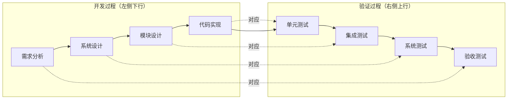
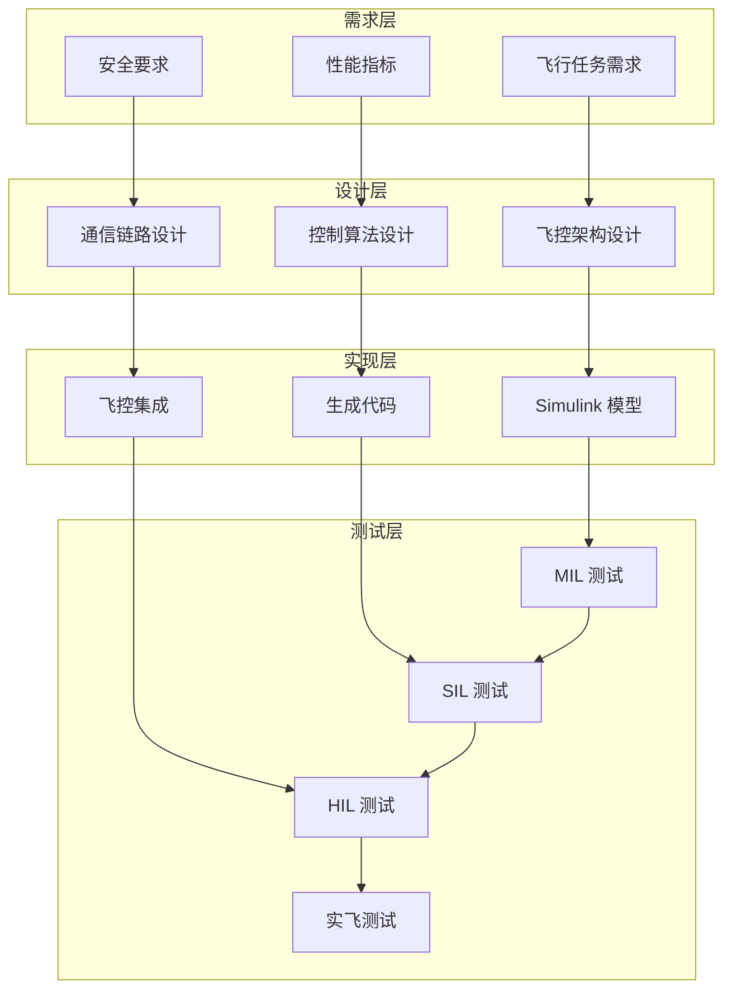
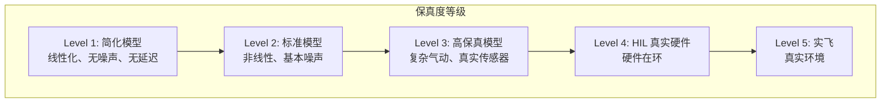
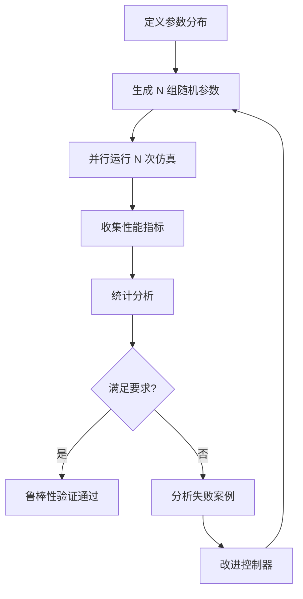
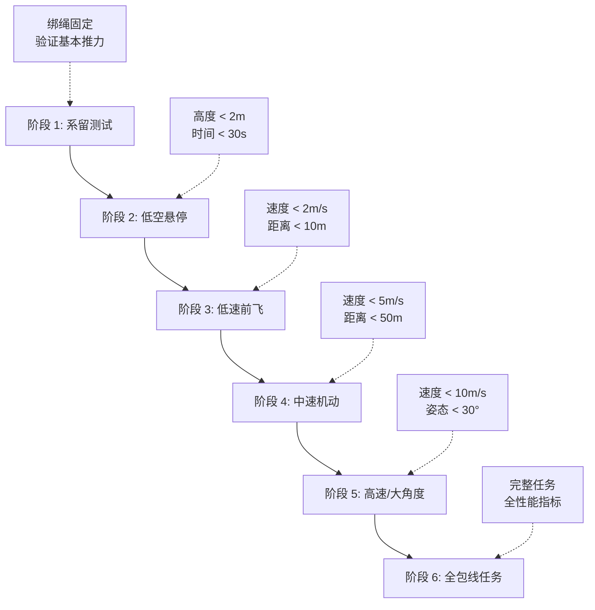
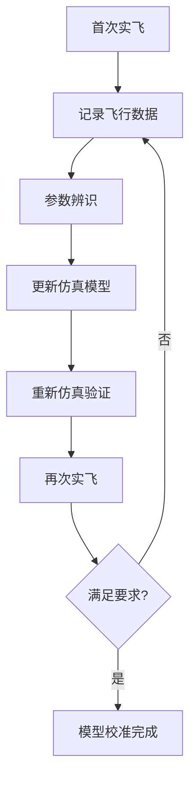

# 从仿真到实飞的验证流程

> 预计阅读：20 分钟 | 前置知识：SIL/HIL 仿真基础、飞行测试安全规范

---

## 1. V 模型与 UAV 开发

### 1.1 V 模型概述

V 模型是系统工程中经典的开发-验证模型，特别适合 UAV 这种安全关键系统：



### 1.2 UAV 开发 V 模型实例



---

## 2. 需求分析与指标定义

### 2.1 飞行性能指标

| 指标类别 | 具体指标 | 典型要求 | 验证方法 |
|---------|---------|---------|---------|
| 位置精度 | 悬停位置误差 | < 0.3m (GPS) | HIL + 实飞 |
| 位置精度 | 航点到达精度 | < 1m | SIL + 实飞 |
| 姿态精度 | 悬停姿态角 | < 2° | MIL + HIL |
| 动态性能 | 阶跃响应超调 | < 10% | MIL + SIL |
| 动态性能 | 调节时间 | < 3s | MIL + SIL |
| 航时 | 最大续航时间 | > 20min | 实飞 |
| 抗扰性 | 抗风能力 | > 8m/s | HIL + 实飞 |

### 2.2 安全要求

| 安全要求 | 描述 | 验证方法 |
|---------|------|---------|
| 失控保护 | 通信丢失后安全降落 | HIL 故障注入 |
| 低电压保护 | 电池电压低时自动返航 | HIL + 实飞 |
| 地理围栏 | 不超出指定区域 | SIL + 实飞 |
| 紧急停止 | 手动切断电机 | 实飞 |
| 传感器冗余 | 单传感器故障可继续 | HIL 故障注入 |

---

## 3. 仿真保真度层次

### 3.1 保真度分级



### 3.2 各层次适用场景

| 保真度 | 模型特点 | 适用阶段 | 使用场景 |
|--------|---------|---------|---------|
| Level 1 | 线性化、确定性 | 概念设计 | 控制律初步设计、稳定性分析 |
| Level 2 | 非线性、基本噪声 | 详细设计 | 控制器参数整定、功能验证 |
| Level 3 | 复杂气动、真实传感器 | 集成验证 | 算法性能评估、边界测试 |
| Level 4 | 真实硬件 | 系统验证 | 接口验证、时序测试、故障注入 |
| Level 5 | 真实环境 | 验收测试 | 全系统性能、环境适应性 |

### 3.3 保真度选择决策树

```
需要测试什么？
├── 控制算法逻辑 → Level 1-2 (MIL/SIL)
├── 传感器融合算法 → Level 2-3 (SIL with sensor models)
├── 硬件接口 → Level 4 (HIL)
├── 故障处理逻辑 → Level 4 (HIL with fault injection)
├── 环境适应性 → Level 5 (实飞)
└── 用户验收 → Level 5 (实飞)
```

---

## 4. Monte Carlo 仿真

### 4.1 为什么需要 Monte Carlo

单一仿真运行只能验证"标称"条件下的性能，无法评估系统在参数不确定性下的鲁棒性。Monte Carlo 仿真通过随机化参数来统计评估系统性能。

### 4.2 参数不确定性建模

| 参数 | 标称值 | 不确定性范围 | 分布类型 |
|------|-------|------------|---------|
| 质量 m | 1.5 kg | ±20% | 均匀分布 |
| 惯性矩 Ixx | 0.003 kg·m² | ±25% | 均匀分布 |
| 推力系数 Ct | 1.0e-5 | ±15% | 正态分布 |
| 空气密度 ρ | 1.225 kg/m³ | ±10% | 正态分布 |
| 初始位置 | [0,0,0] | ±1m | 均匀分布 |
| 初始风速 | [0,0,0] | [0-5] m/s | 威布尔分布 |
| 传感器噪声 | 标称值 | ×0.5-2.0 | 对数正态 |

### 4.3 Monte Carlo 仿真流程



### 4.4 MATLAB 实现

```matlab
%% Monte Carlo 仿真脚本
N = 500;  % 仿真次数

% 预分配结果
results = struct('position_error', zeros(N,1), ...
                 'max_overshoot', zeros(N,1), ...
                 'settling_time', zeros(N,1), ...
                 'success', false(N,1));

parfor i = 1:N
    % 随机化参数
    params.mass = 1.5 * (1 + 0.2*randn());
    params.inertia = [0.003 0.003 0.005] .* (1 + 0.25*randn(1,3));
    params.Ct = 1e-5 * (1 + 0.15*randn());
    params.wind = [5*rand() 5*randn() 0.5*randn()];

    % 运行仿真
    simOut = sim('uav_monte_carlo', ...
        'StopTime', '30', ...
        'SrcWorkspace', 'current');

    % 提取指标
    pos_error = simOut.logsout.get('position_error');
    results.position_error(i) = max(abs(pos_error.Values.Data(:)));
    results.max_overshoot(i) = compute_overshoot(pos_error);
    results.settling_time(i) = compute_settling_time(pos_error);
    results.success(i) = results.position_error(i) < 1.0;
end

% 统计分析
fprintf('成功率: %.1f%%\n', 100*mean(results.success));
fprintf('位置误差: %.2f ± %.2f m\n', ...
    mean(results.position_error), std(results.position_error));
fprintf('95%% 分位数: %.2f m\n', prctile(results.position_error, 95));
```

### 4.5 结果分析

```matlab
%% 绘制 Monte Carlo 结果直方图
figure;
subplot(2,2,1);
histogram(results.position_error, 30);
xlabel('位置误差 (m)');
ylabel('频次');
title('位置误差分布');

subplot(2,2,2);
histogram(results.max_overshoot, 30);
xlabel('超调量 (%)');
ylabel('频次');
title('超调量分布');

subplot(2,2,3);
scatter(results.position_error, results.max_overshoot, 10, results.success);
xlabel('位置误差 (m)');
ylabel('超调量 (%)');
title('误差 vs 超调（绿=成功，红=失败）');

subplot(2,2,4);
plot(results.settling_time, 'o');
xlabel('仿真编号');
ylabel('调节时间 (s)');
title('调节时间');
```

---

## 5. 飞行包线扩展策略

### 5.1 渐进式测试策略



### 5.2 各阶段通过标准

| 阶段 | 姿态范围 | 速度范围 | 高度范围 | 持续时间 | 通过标准 |
|------|---------|---------|---------|---------|---------|
| 系留 | ±5° | 0 | 固定 | 5min | 推力平衡 |
| 低空悬停 | ±5° | <0.5m/s | <2m | 30s | 误差<0.3m |
| 低速前飞 | ±10° | <2m/s | <5m | 1min | 稳定跟踪 |
| 中速机动 | ±15° | <5m/s | <20m | 2min | 误差<1m |
| 高速飞行 | ±25° | <10m/s | <50m | 3min | 误差<2m |
| 全包线 | ±30° | <15m/s | <100m | 5min | 任务完成 |

### 5.3 包线扩展检查清单

每进入下一阶段前必须确认：

- [ ] 当前阶段所有测试用例通过
- [ ] 无任何异常振动或噪声
- [ ] 电池温度在正常范围
- [ ] 所有传感器读数正常
- [ ] 通信链路稳定
- [ ] 安全区域确认（人员清场）
- [ ] 应急预案就绪
- [ ] 遥控器接管测试通过

---

## 6. 飞行后数据分析

### 6.1 数据记录

PX4 默认通过 SD 卡记录飞行日志（.ulg 格式），包含：

| 数据类型 | 内容 | 采样率 |
|---------|------|-------|
| 传感器原始数据 | IMU、GPS、气压计 | 100-1000Hz |
| 状态估计 | EKF 输出（位置、速度、姿态） | 100Hz |
| 控制指令 | 姿态/位置目标 | 50-250Hz |
| 执行器输出 | PWM 值 | 400Hz |
| 电池状态 | 电压、电流、温度 | 10Hz |

### 6.2 日志分析工具

```matlab
%% 使用 MATLAB 分析 PX4 日志
% 读取 ulg 文件
data = readtable('flight_log.csv');

% 提取关键信号
time = data.timestamp;
position = [data.x, data.y, data.z];
attitude = [data.roll, data.pitch, data.yaw];
motors = [data.motor1, data.motor2, data.motor3, data.motor4];

% 计算性能指标
hover_error = std(position(hover_idx, :));
max_tilt = max(abs(attitude(:, 1:2))) * 180/pi;
motor_range = max(motors) - min(motors);
```

### 6.3 仿真 vs 实飞对比

```matlab
%% 比较仿真和实飞数据
figure;
subplot(3,1,1);
plot(sim_time, sim_pos(:,3), 'b-', 'LineWidth', 1.5);
hold on;
plot(flight_time, flight_pos(:,3), 'r--', 'LineWidth', 1.5);
legend('仿真', '实飞');
ylabel('高度 (m)');
title('仿真 vs 实飞 对比');

subplot(3,1,2);
plot(sim_time, sim_att(:,1)*180/pi, 'b-', 'LineWidth', 1.5);
hold on;
plot(flight_time, flight_att(:,1)*180/pi, 'r--', 'LineWidth', 1.5);
legend('仿真', '实飞');
ylabel('滚转角 (°)');

subplot(3,1,3);
plot(sim_time, sim_motors(:,1), 'b-', 'LineWidth', 1.5);
hold on;
plot(flight_time, flight_motors(:,1), 'r--', 'LineWidth', 1.5);
legend('仿真', '实飞');
ylabel('电机 1 PWM');
xlabel('时间 (s)');
```

---

## 7. 仿真-实飞差距问题与解决

### 7.1 常见差距

| 差距类型 | 表现 | 根因 | 解决方案 |
|---------|------|------|---------|
| 模型参数偏差 | 响应速度不同 | 质量/惯量估计不准 | 系统辨识+模型更新 |
| 传感器噪声 | 控制器抖振 | 仿真噪声太小 | 用实测噪声参数 |
| 执行器延迟 | 电机响应慢 | 未建模电机惯性 | 添加电机延迟模型 |
| 气动效应 | 大机动不稳定 | 简化气动模型 | 升级气动模型 |
| GPS 多径 | 悬停漂移 | 室外环境未建模 | 添加 GPS 多径模型 |
| 振动 | IMU 数据异常 | 结构振动未建模 | 添加振动模型+滤波 |
| 地面效应 | 起降不平稳 | 近地面气动未建模 | 添加地面效应模型 |

### 7.2 系统辨识闭环



### 7.3 参数辨识方法

| 方法 | 适用参数 | 精度 | 复杂度 |
|------|---------|------|--------|
| 称量法 | 质量 | 高 | 低 |
| 摆锤法 | 惯性矩 | 中 | 中 |
| 推力台测试 | 推力系数 | 高 | 中 |
| 飞行数据辨识 | 气动参数 | 中 | 高 |
| 频率响应法 | 动态参数 | 高 | 中 |

---

## 8. 仿真就绪检查清单

### 8.1 仿真模型就绪

- [ ] 动力学模型包含所有主要力和力矩
- [ ] 传感器模型包含噪声、偏差和延迟
- [ ] 执行器模型包含饱和和响应延迟
- [ ] 环境模型包含风扰和大气变化
- [ ] 模型参数经过地面测试或文献校准

### 8.2 控制器就绪

- [ ] MIL 测试所有功能用例通过
- [ ] SIL 测试所有功能用例通过
- [ ] Monte Carlo 仿真成功率 > 95%
- [ ] 故障注入测试通过
- [ ] 代码生成后的 SIL 与 MIL 差异可接受

### 8.3 硬件就绪

- [ ] HIL 测试所有标准场景通过
- [ ] 飞控固件版本正确
- [ ] 传感器校准完成
- [ ] 电机方向和推力确认
- [ ] 遥控器失控保护配置正确
- [ ] 地理围栏配置正确
- [ ] 日志记录功能正常

### 8.4 环境就绪

- [ ] 飞行场地审批完成
- [ ] 天气条件满足要求（风速 < 5m/s，无雨）
- [ ] 安全区域已设置
- [ ] 人员培训完成
- [ ] 应急预案就绪
- [ ] 保险和法规合规确认

---

## 9. 参考资源

- **PX4 官方**：
  - PX4 Dev Guide: Flight Log Analysis
  - PX4 Dev Guide: Flight Testing
- **MATLAB 官方**：
  - UAV Toolbox 文档
  - Monte Carlo 仿真示例
- **安全标准**：
  - ASTM F3322 — Standard for Small UAS
  - ISO 21384 — UAV Safety

---

## 思考题

**1. V 模型中"需求分析"对应"验收测试"，这种对应关系在 UAV 开发中有什么实际意义？**

<details><summary>参考答案</summary>

这种对应关系确保了每个需求都有明确的验证方法。例如：需求"悬停位置误差 < 0.3m"直接对应验收测试"在无风条件下悬停 60 秒，测量位置误差"。实际意义：（1）防止需求遗漏——如果某个需求在验收测试中没有对应项，说明该需求未被验证；（2）明确验收标准——每个需求都有量化的通过/失败标准；（3）支持追溯——从需求到测试用例的完整追溯链，满足适航认证要求；（4）减少争议——客户需求和工程团队对"完成"的定义一致。

</details>

**2. Monte Carlo 仿真中，为什么 500 次运行通常被认为是最低要求？如何确定合适的运行次数？**

<details><summary>参考答案</summary>

500 次运行可以保证统计结果的可靠性：（1）根据中心极限定理，500 次采样的均值估计误差约为标准差的 1/√500 ≈ 4.5%；（2）对于 95% 成功率的系统，500 次运行中期望有 25 次失败，足够估计失败率；（3）如果成功率 >99%，需要更多运行（>1000 次）才能准确估计。确定合适运行次数的方法：（1）先运行 100 次，计算方差；（2）根据所需的置信区间宽度反推所需次数；（3）使用序贯分析——运行直到结果稳定（如连续 50 次成功）。

</details>

**3. 飞行包线扩展策略为什么要从系留测试开始？系留测试能发现哪些问题？**

<details><summary>参考答案</summary>

系留测试是最安全的初始测试方式，无人机通过绳索固定在地面。能发现的问题：（1）电机方向错误——绳索会显示推力不平衡导致的扭矩；（2）推力不足——无法离地说明推力/重量比不足；（3）严重振动——机械振动在系留时更明显，因为约束放大了共振；（4）控制器基本功能——PID 参数是否在合理范围，无人机是否试图"飞起来"；（5）通信链路——遥控器和地面站是否正常工作。系留测试的风险极低，即使控制器完全失效，无人机也不会飞走。

</details>

**4. 仿真-实飞差距中最难解决的是哪一类？为什么？**

<details><summary>参考答案</summary>

最难解决的是**气动效应差距**，原因：（1）气动力是非线性的，且随姿态角、速度、旋翼转速高度耦合，简单的线性模型无法准确描述；（2）旋翼-旋翼干扰（多旋翼）和旋翼-机身干扰难以用解析公式描述，需要 CFD 仿真或风洞测试；（3）地面效应、涡环状态等边界条件在飞行中出现但在仿真中常被忽略；（4）大气湍流和风场是随机过程，难以精确建模。解决方法：使用数据驱动方法（如神经网络）从飞行数据学习气动模型，或使用高保真 CFD 预计算气动数据库。

</details>

**5. 仿真就绪检查清单中"Monte Carlo 仿真成功率 > 95%"的标准是否合理？对于不同类型的 UAV 应如何调整？**

<details><summary>参考答案</summary>

95% 是一个合理的通用标准，但应根据 UAV 类型调整：（1）消费级无人机（航拍）：95% 可以接受，因为风险较低，可接受偶尔降落；（2）工业级无人机（巡检）：建议 99%，因为任务中断成本高；（3）载人 eVTOL：要求 >99.99%（失效概率 <10^-4/飞行小时），因为涉及人身安全；（4）军事无人机：根据任务关键性，可接受 90-95%。此外，成功率应结合失败后果评估——即使成功率 99%，如果失败意味着坠毁到人群，仍然不可接受。应使用风险矩阵综合评估概率和后果。

</details>
