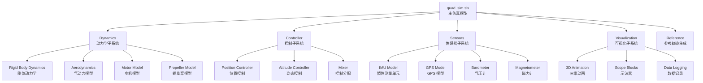
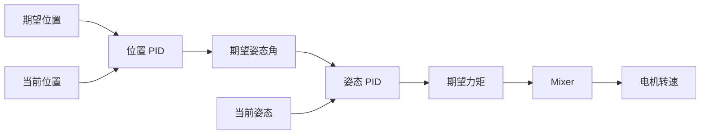
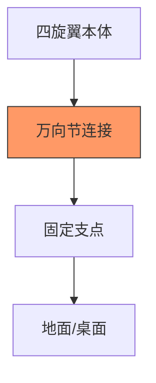
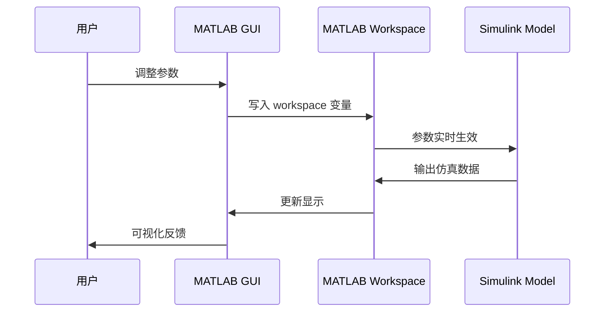

# Quad-Sim 深度解析：Drexel 大学四旋翼仿真包

> 预计阅读：20 分钟 | 前置知识：Simulink 基础操作、MATLAB 编程、四旋翼动力学基本概念

---

## 1. 项目概览

Quad-Sim 是由 Drexel University 的 David Chou (dch33) 开发并维护的开源四旋翼仿真包，在 GitHub 上获得了 **289 stars**。该项目旨在为学生和研究人员提供一个即用型（out-of-the-box）的四旋翼仿真平台，涵盖从动力学建模到控制、可视化的完整链路。

| 属性 | 详情 |
|------|------|
| 仓库地址 | `github.com/dch33/Quad-Sim` |
| Stars | 289 |
| 语言 | MATLAB / Simulink |
| 许可证 | MIT License |
| 适用人群 | 本科高年级 / 研究生入门 |
| MATLAB 版本 | R2018b 及以上（推荐 R2020b+） |
| 依赖工具箱 | Aerospace Blockset, Simulink 3D Animation（可选） |

---

## 2. 仓库结构树

```
Quad-Sim/
├── README.md                    # 项目说明文档
├── setup_quad_sim.m             # 一键环境配置脚本
├── quad_parameters.m            # 四旋翼物理参数定义
│
├── Models/                      # Simulink 模型目录
│   ├── quad_sim.slx             # 主仿真模型
│   ├── quad_control.slx         # 控制器模型
│   └── linearize_quad.slx       # 线性化模型
│
├── Libraries/                   # Simulink 自定义库
│   ├── quad_dynamics_lib.slx    # 动力学子系统库
│   ├── sensor_lib.slx           # 传感器模型库
│   └── animation_lib.slx        # 动画可视化库
│
├── Functions/                   # MATLAB 辅助函数
│   ├── euler2quat.m             # 欧拉角转四元数
│   ├── quat2euler.m             # 四元数转欧拉角
│   ├── rotation_matrix.m        # 旋转矩阵计算
│   └── plot_quad_state.m        # 状态绘图工具
│
├── GUI/                         # 图形用户界面
│   ├── quad_gui.fig             # GUI 布局文件
│   └── quad_gui.m               # GUI 回调函数
│
├── Data/                        # 仿真数据与日志
│   └── flight_data/             # 参考飞行数据
│
└── Test_Rig/                    # 测试台架设计
    ├── test_rig_params.m        # 台架参数
    └── test_rig_model.slx       # 台架仿真模型
```

---

## 3. 架构分析：Simulink 模型组织方式

### 3.1 模型层次结构

Quad-Sim 采用典型的 Simulink 分层建模架构，其核心模型 `quad_sim.slx` 的层次关系如下：



### 3.2 信号流设计

Quad-Sim 的信号流遵循 **自上而下** 的设计原则：

| 信号流阶段 | 输入 | 输出 | 模块 |
|-----------|------|------|------|
| 轨迹生成 | 用户设定点 | 期望位置/速度 | Reference Generator |
| 位置控制 | 期望位置, 当前位置 | 期望姿态角 + 推力 | Position Controller |
| 姿态控制 | 期望姿态角, 当前姿态 | 期望力矩 | Attitude Controller |
| 控制分配 | 期望力矩, 总推力 | 各电机转速 | Mixer |
| 动力学 | 电机转速 | 六自由度状态 | Dynamics |
| 传感器 | 真实状态 | 带噪声测量值 | Sensors |

---

## 4. 关键子系统详解

### 4.1 动力学子系统（Dynamics）

动力学子系统是整个仿真模型的核心，负责根据电机输入计算四旋翼的六自由度运动。

**建模方法：** Newton-Euler 方程

四旋翼的平移运动方程：

$$m\ddot{\mathbf{p}} = m\mathbf{g} + \mathbf{R} \cdot \mathbf{f}_{thrust} + \mathbf{f}_{drag}$$

旋转运动方程：

$$\mathbf{J} \dot{\boldsymbol{\omega}} = \boldsymbol{\tau} - \boldsymbol{\omega} \times (\mathbf{J} \boldsymbol{\omega}) + \boldsymbol{\tau}_{gyro}$$

其中各变量含义：

| 符号 | 含义 | 典型单位 |
|------|------|---------|
| $m$ | 四旋翼总质量 | kg |
| $\mathbf{p}$ | 机体位置向量 (NED) | m |
| $\mathbf{g}$ | 重力加速度向量 | m/s² |
| $\mathbf{R}$ | 机体系到惯性系旋转矩阵 | - |
| $\mathbf{f}_{thrust}$ | 四个螺旋桨总推力 | N |
| $\mathbf{J}$ | 转动惯量矩阵 | kg·m² |
| $\boldsymbol{\omega}$ | 机体角速度 | rad/s |
| $\boldsymbol{\tau}$ | 合力矩向量 | N·m |
| $\boldsymbol{\tau}_{gyro}$ | 陀螺力矩 | N·m |

**Simulink 实现特点：**

1. 使用 **MATLAB Function Block** 编写核心动力学方程
2. 状态向量包含 12 个状态：位置(3) + 姿态(3) + 速度(3) + 角速度(3)
3. 使用 Quaternion 描述姿态，避免万向锁（Gimbal Lock）
4. 通过 Bus Signal 组织复杂的多维信号

### 4.2 控制器子系统（Controller）

Quad-Sim 采用经典的 **级联 PID** 控制架构：



**位置控制器参数：**

| 参数 | 符号 | 典型值范围 | 说明 |
|------|------|-----------|------|
| 位置 P 增益 | $K_{p,pos}$ | 1.0 ~ 6.0 | 位置误差到速度指令映射 |
| 速度 P 增益 | $K_{p,vel}$ | 2.0 ~ 8.0 | 速度误差到加速度指令映射 |
| 速度 I 增益 | $K_{i,vel}$ | 0.1 ~ 1.0 | 消除稳态速度误差 |
| 速度 D 增益 | $K_{d,vel}$ | 0.0 ~ 0.5 | 阻尼速度振荡 |

**姿态控制器参数：**

| 参数 | 符号 | 典型值范围 | 说明 |
|------|------|-----------|------|
| 姿态 P 增益 | $K_{p,att}$ | 6.0 ~ 12.0 | 姿态误差到角速度指令映射 |
| 角速度 P 增益 | $K_{p,rate}$ | 0.01 ~ 0.02 | 角速度误差到力矩映射 |
| 角速度 I 增益 | $K_{i,rate}$ | 0.001 ~ 0.01 | 消除角速度稳态误差 |
| 角速度 D 增益 | $K_{d,rate}$ | 0.0003 ~ 0.003 | 阻尼角速度振荡 |

### 4.3 传感器子系统（Sensors）

传感器模型在真实状态上叠加噪声和偏差，模拟真实传感器特性：

| 传感器 | 输出量 | 噪声模型 | 更新率 |
|--------|--------|---------|--------|
| 加速度计 | 三轴加速度 | 白噪声 + 常值偏置 | 200 Hz |
| 陀螺仪 | 三轴角速率 | 白噪声 + 随机游走 | 200 Hz |
| 磁力计 | 三轴磁场 | 白噪声 + 硬铁/软铁干扰 | 50 Hz |
| 气压计 | 高度 | 白噪声 + 漂移 | 50 Hz |
| GPS | 位置、速度 | 白噪声 + 多径效应 | 10 Hz |

### 4.4 可视化子系统（Visualization）

Quad-Sim 提供两种可视化方式：

1. **Simulink 3D Animation（推荐）**：基于 VRML/X3D 的三维动画渲染
2. **Scope + Plot**：传统二维数据绘图

---

## 5. 参数配置系统

### 5.1 参数文件结构

Quad-Sim 的参数配置集中在 `quad_parameters.m` 文件中，采用结构体（struct）组织：

```matlab
% 典型参数结构
quad.mass = 0.468;           % 总质量 (kg)
quad.g = 9.81;               % 重力加速度 (m/s^2)
quad.l = 0.225;              % 机臂长度 (m)

% 转动惯量
quad.Jxx = 4.856e-3;         % (kg*m^2)
quad.Jyy = 4.856e-3;
quad.Jzz = 8.801e-3;
quad.J = diag([quad.Jxx quad.Jyy quad.Jzz]);

% 电机参数
quad.kt = 2.980e-6;          % 推力系数
quad.kd = 1.140e-7;          % 阻力系数
quad.km = quad.kd / quad.kt; % 力矩系数
quad.motor_min = 0;           % 最小转速 (rad/s)
quad.motor_max = 838;         % 最大转速 (rad/s)
```

### 5.2 参数调优建议

| 参数类别 | 调优优先级 | 建议方法 |
|---------|-----------|---------|
| 质量/惯量 | ★★★ | 称重 + 摆锤实验 |
| 电机/螺旋桨 | ★★★ | 台架推力测试 |
| PID 增益 | ★★☆ | Ziegler-Nichols + 手动微调 |
| 传感器噪声 | ★☆☆ | 数据手册 + 实测标定 |
| 气动系数 | ★☆☆ | CFD 仿真 / 经验公式 |

---

## 6. 测试台架设计（Test Rig）

Quad-Sim 内置了一个独特的 **物理测试台架** 模型，用于在受限环境下验证控制算法。

### 6.1 台架原理



测试台架允许四旋翼在 **单轴或双轴** 上自由旋转，限制了平移自由度，使得：
- 可以单独测试姿态控制器
- 降低安全风险（不会飞走）
- 简化调试过程

### 6.2 台架与自由飞行的差异

| 特性 | 测试台架 | 自由飞行 |
|------|---------|---------|
| 自由度 | 2~3（姿态） | 6（完整） |
| 平移运动 | 受限/禁止 | 自由 |
| 位置控制 | 不可用 | 可用 |
| 安全性 | 高 | 低（需防护网） |
| 调试效率 | 高 | 中 |
| 参数验证范围 | 姿态参数 | 全部参数 |

---

## 7. MATLAB GUI 控制界面

Quad-Sim 提供了一个 MATLAB App Designer / GUIDE 实现的图形界面，用于简化仿真操作。

### 7.1 GUI 功能模块

| 功能区 | 控件 | 作用 |
|--------|------|------|
| 仿真控制 | Start / Stop / Reset | 控制仿真生命周期 |
| 参数调整 | Slider / Edit Box | 实时调整 PID 参数 |
| 轨迹选择 | Dropdown | 选择预设轨迹类型 |
| 状态显示 | Gauge / LED | 实时显示关键状态 |
| 数据记录 | Checkbox | 启用/禁用数据日志 |
| 3D 视角 | Camera Controls | 调整三维观察角度 |

### 7.2 GUI 与 Simulink 接口



---

## 8. 运行与修改指南

### 8.1 快速开始

```matlab
% Step 1: 克隆仓库
% git clone https://github.com/dch33/Quad-Sim.git

% Step 2: 运行配置脚本
cd Quad-Sim
setup_quad_sim    % 自动添加路径、加载参数

% Step 3: 打开主模型
open('Models/quad_sim.slx')

% Step 4: 运行仿真
sim('quad_sim');  % 或点击 Simulink 中的 Run 按钮
```

### 8.2 常见修改场景

| 修改目标 | 涉及文件 | 难度 |
|---------|---------|------|
| 更换四旋翼参数 | `quad_parameters.m` | ★☆☆ |
| 调整 PID 增益 | 模型中 PID Block 参数 | ★☆☆ |
| 添加新传感器 | `sensor_lib.slx` + 参数文件 | ★★☆ |
| 更换控制算法 | `quad_control.slx` | ★★★ |
| 添加障碍物环境 | 主模型 + 可视化模块 | ★★☆ |
| 接入 ROS | 添加 ROS Toolbox 接口 | ★★★ |

### 8.3 注意事项

1. **MATLAB 版本兼容性**：R2018b 之前的版本可能不支持某些 Simulink 特性
2. **路径问题**：务必先运行 `setup_quad_sim.m`，否则函数调用会失败
3. **仿真步长**：默认固定步长 `0.001s`，修改后需验证数值稳定性
4. **3D Animation 工具箱**：如未安装，可注释掉可视化子系统中的 3D 模块

---

## 9. 学习要点总结

初学者可以从 Quad-Sim 中学到以下关键知识：

| 学习主题 | 具体内容 | 建议学习顺序 |
|---------|---------|-------------|
| Simulink 分层建模 | 子系统封装、Bus Signal、库引用 | 第 1 周 |
| 四旋翼动力学 | Newton-Euler 方程的 Simulink 实现 | 第 2 周 |
| PID 级联控制 | 位置-姿态-角速率三环控制 | 第 3 周 |
| 参数管理 | 结构体组织、脚本化配置 | 第 1 周 |
| 传感器建模 | 噪声模型、采样率、量化 | 第 4 周 |
| 测试台架设计 | 受限自由度测试方法 | 第 5 周 |
| GUI 开发 | GUIDE/App Designer 与 Simulink 接口 | 第 6 周 |

---

## 10. 局限性与扩展方向

### 10.1 当前局限性

| 局限性 | 说明 | 严重程度 |
|--------|------|---------|
| 气动模型简化 | 未考虑地面效应、螺旋桨间干扰 | 中 |
| 无风扰动模型 | 仿真环境无风 | 中 |
| 单机仿真 | 不支持多机编队 | 低 |
| 无 GPS/视觉融合 | 仅基础传感器模型 | 低 |
| 线性控制器 | 不支持非线性控制策略 | 中 |

### 10.2 推荐扩展方向

1. **添加风扰动模型**：实现 Dryden 或 Von Karman 风模型
2. **集成 EKF**：实现扩展卡尔曼滤波器进行状态估计
3. **非线性控制**：替换 PID 为滑模控制（SMC）或模型预测控制（MPC）
4. **多机仿真**：复制模型实例，添加通信模块
5. **ROS2 集成**：通过 ROS Toolbox 实现与 ROS2 生态的对接
6. **HIL 测试**：接入 Pixhawk 硬件在环测试

---

## 思考题

**1. Quad-Sim 为什么选择级联 PID 而不是单级 PID 控制？请从工程实践角度分析。**

<details><summary>参考答案</summary>

级联 PID（位置环-姿态环-角速率环）相比单级 PID 有以下优势：
1. **带宽分离**：角速率环带宽最高（~50Hz），姿态环次之（~20Hz），位置环最低（~5Hz），各环独立调节互不干扰
2. **鲁棒性**：内环（角速率）对模型不确定性更鲁棒，外环可以假设内环是理想的
3. **物理直观**：每个环对应一个物理量，便于理解和调试
4. **故障诊断**：可以根据哪一层出现振荡来定位问题
</details>

**2. 在 Quad-Sim 中，如果将动力学子系统中的四元数表示改为欧拉角表示，可能会引入什么问题？**

<details><summary>参考答案</summary>

主要问题是 **万向锁（Gimbal Lock）**：当俯仰角接近 ±90° 时，偏航角和滚转角的自由度退化为一个，导致：
1. 姿态表示出现奇异性，数值计算不稳定
2. 控制器输出不连续，可能产生突变
3. 无法正确描述大幅度机动（如翻滚动作）

此外，欧拉角的三角函数计算比四元数乘法计算量大，且需要额外的角度归一化处理。
</details>

**3. 请解释 Quad-Sim 中测试台架设计的工程意义，以及它与实际飞行测试的关系。**

<details><summary>参考答案</summary>

测试台架的工程意义：
1. **安全验证**：在受限环境下验证姿态控制器，避免"炸机"风险
2. **参数预标定**：在台架上调整角速率环和姿态环增益，减少自由飞行调试次数
3. **故障排查**：台架上观察到的问题（如电机不对称）更容易定位
4. **教学演示**：适合课堂现场展示，无需安全防护网

与实际飞行的关系：台架验证通过的参数可以直接用于自由飞行的位置环调试，形成"台架→悬停→航线→特技"的渐进式验证流程。
</details>

**4. 如果要为 Quad-Sim 添加风扰动模型，你会如何设计 Simulink 模块？画出模块间的信号流。**

<details><summary>参考答案</summary>

建议在动力学子系统之前添加一个 Wind Disturbance 模块：

```
[Reference] → [Controller] → [Wind Module] → [Dynamics] → [Sensors]
                                    ↑
                              [Wind Profile]
                              (Dryden/Von Karman)
```

Wind Module 的设计：
1. **输入**：机体位置、时间、风参数（风速均值、湍流强度、风向）
2. **处理**：根据高度计算湍流尺度，通过传递函数生成三轴风速分量
3. **输出**：将风速叠加到动力学子系统的气流输入端

关键实现点：
- 使用 Dryden 模型的传递函数在 Simulink 中用 Transfer Fcn Block 实现
- 风速分解到机体系和惯性系
- 添加风剪切和阵风分量
</details>

**5. Quad-Sim 的参数配置系统使用 MATLAB 结构体，这种设计有什么优缺点？对比其他参数管理方案。**

<details><summary>参考答案</summary>

**结构体方案的优点**：
- 简单直观，无需额外工具箱
- 与 MATLAB 工作空间无缝对接
- 便于脚本化批量仿真

**结构体方案的缺点**：
- 缺乏参数校验（类型、范围）
- 不支持层次化参数继承
- 多人协作时容易冲突

**替代方案对比**：

| 方案 | 优点 | 缺点 |
|------|------|------|
| MATLAB .mat 文件 | 持久化存储 | 不易版本控制 |
| YAML/JSON 配置 | 跨平台、易读 | 需要解析器 |
| Simulink Data Dictionary | 官方支持、类型安全 | 学习曲线陡 |
| m 脚本结构体 | 简单灵活 | 缺乏校验 |
</details>
