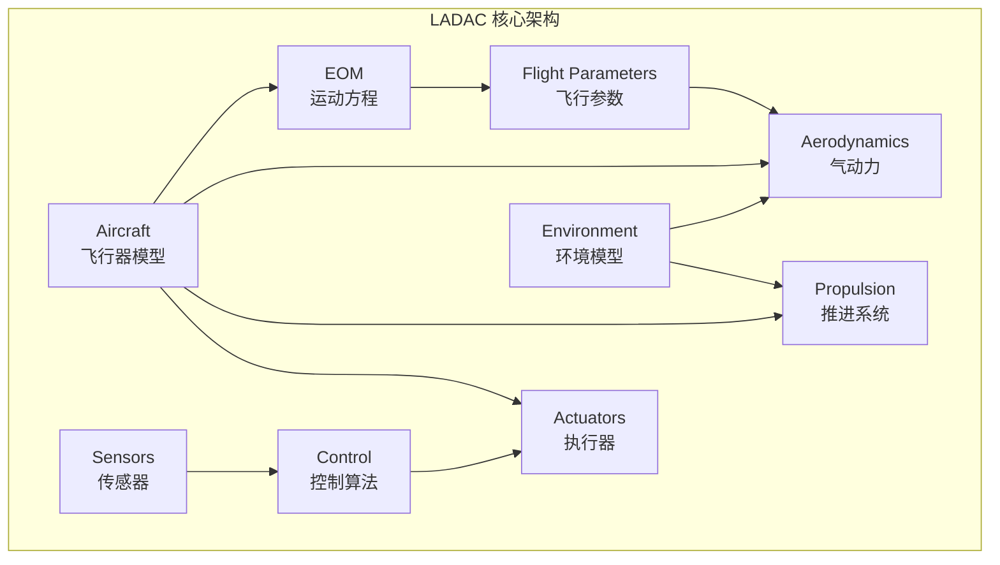
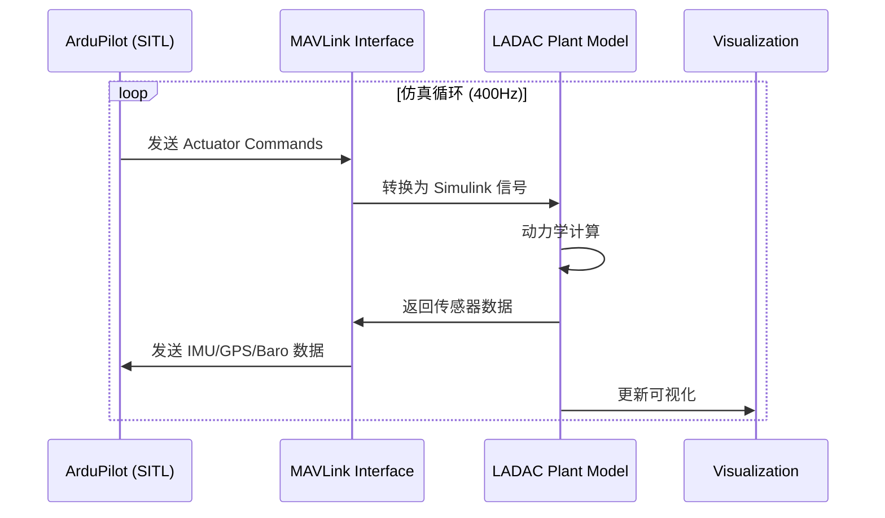
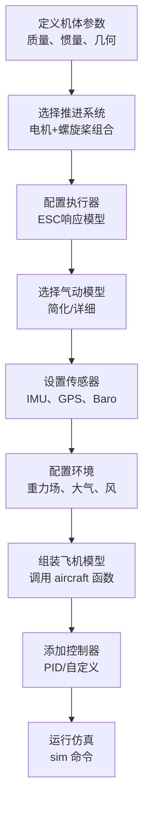
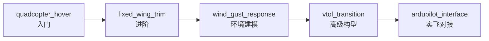

# LADAC 库架构与使用：飞行器动力学与控制库

> 预计阅读：25 分钟 | 前置知识：MATLAB/Simulink 基础、飞行力学概念、控制系统基础

---

## 1. 项目概览

LADAC（Library for Aircraft Dynamics And Control）是由德国航天中心（DLR）下属的 iff-gsc 团队开发的开源 MATLAB/Simulink 库，专注于飞行器动力学建模与控制算法开发。该项目在 GitHub 上获得了 **150 stars**，是学术界和工业界广泛使用的飞行仿真工具库。

| 属性 | 详情 |
|------|------|
| 仓库地址 | `github.com/iff-gsc/LADAC` |
| Stars | 150 |
| 开发机构 | DLR (German Aerospace Center), iff-gsc |
| 语言 | MATLAB / Simulink |
| 许可证 | GNU GPLv3 |
| 适用场景 | 飞行器设计、控制律开发、飞行仿真 |
| MATLAB 版本 | R2019b 及以上 |
| 特色 | 模块化架构、多构型支持、ArduPilot 集成 |

---

## 2. 模块分解总览

LADAC 采用高度模块化的架构设计，将飞行器仿真分解为独立的功能模块。以下是完整的模块分解表：

| 模块名称 | 目录 | 功能描述 | 主要函数/文件数 |
|---------|------|---------|---------------|
| **Actuators** | `actuators/` | 执行器模型（舵机、电机、ESC） | ~15 |
| **Aerodynamics** | `aerodynamics/` | 气动力/力矩计算（VLM、准稳态等） | ~40 |
| **Aircraft** | `aircraft/` | 完整飞行器模型（多旋翼、固定翼、VTOL） | ~20 |
| **Control** | `control/` | 控制算法库（PID、MPC、自适应等） | ~25 |
| **Environment** | `environment/` | 环境模型（大气、风、重力、磁场） | ~10 |
| **EOM** | `eom/` | 运动方程（六自由度方程求解器） | ~8 |
| **Flight Parameters** | `flight_parameters/` | 飞行参数计算（动压、迎角、侧滑角） | ~12 |
| **Propulsion** | `propulsion/` | 推进系统模型（螺旋桨、电机、电池） | ~18 |
| **Sensors** | `sensors/` | 传感器模型（IMU、GPS、气压计等） | ~10 |



---

## 3. 支持的飞行器构型

LADAC 的一大优势是支持多种飞行器构型，通过模块组合实现不同类型的飞行器建模：

### 3.1 构型支持矩阵

| 构型类型 | 支持状态 | 气动模型 | 推进模型 | 典型机型 |
|---------|---------|---------|---------|---------|
| 多旋翼 (Multicopter) | ★★★ 完整 | 简化/实验 | 螺旋桨+电机 | Quadcopter, Hexacopter |
| 固定翼 (Fixed-Wing) | ★★★ 完整 | VLM/条带理论 | 螺旋桨+电机/涡桨 | 通用固定翼 |
| 垂直起降 (VTOL) | ★★☆ 良好 | 混合模型 | 混合推进 | Tiltrotor, Tail-sitter |
| 直升机 (Helicopter) | ★☆☆ 基础 | 叶素理论 | 旋翼模型 | 传统直升机 |

### 3.2 多旋翼构型示例

LADAC 支持任意旋翼数量和布局的多旋翼配置：

```matlab
% 多旋翼构型定义示例
copter.num_rotors = 4;
copter.rotor_positions = [
    0.225,  0.225, 0;   % 旋翼 1 (前右)
   -0.225,  0.225, 0;   % 旋翼 2 (前左)
   -0.225, -0.225, 0;   % 旋翼 3 (后左)
    0.225, -0.225, 0;   % 旋翼 4 (后右)
];
copter.rotor_directions = [1, -1, 1, -1];  % 旋转方向
copter.rotor_tilt = [0, 0, 0, 0];          % 倾转角 (rad)
```

### 3.3 固定翼构型

固定翼模型包含：
- 机翼气动力（基于 VLM - Vortex Lattice Method）
- 尾翼气动力
- 机身阻力
- 起落架模型（可选）

---

## 4. ArduPilot 集成

LADAC 提供了与 ArduPilot 开源自动驾驶仪的深度集成，这是该项目的重要特色之一。

### 4.1 集成架构



### 4.2 集成方式

| 集成方式 | 实时性 | 复杂度 | 适用场景 |
|---------|--------|--------|---------|
| SITL (Software In The Loop) | 准实时 | 低 | 算法验证、快速迭代 |
| HITL (Hardware In The Loop) | 实时 | 中 | 硬件测试、接口验证 |
| 全仿真 (Pure Simulink) | 非实时 | 低 | 离线分析、论文研究 |

### 4.3 SITL 配置步骤

1. **启动 ArduPilot SITL**
```bash
# 在 ArduPilot 目录下
cd ArduCopter
../Tools/autotest/sim_vehicle.py --console --map
```

2. **配置 MATLAB 端**
```matlab
% 设置 MAVLink 通信参数
mavlink_host = '127.0.0.1';
mavlink_port = 14550;
mavlink_sysid = 1;
```

3. **运行联合仿真**
```matlab
% 打开 LADAC 的 ArduPilot 集成模型
open('aircraft/multicopter/arducopter_sim.slx');
sim('arducopter_sim');
```

---

## 5. 安装与配置

### 5.1 安装方法

```matlab
% 方法 1: Git 克隆
% git clone https://github.com/iff-gsc/LADAC.git

% 方法 2: 下载 ZIP 解压

% 安装步骤
cd LADAC
ladac_init  % 运行初始化脚本，自动添加所有子目录到 MATLAB path
```

### 5.2 验证安装

```matlab
% 运行示例测试
ladac_test  % 执行所有单元测试

% 检查版本
ladac_version  % 应显示当前版本号
```

### 5.3 依赖关系

| 依赖项 | 必需/可选 | 说明 |
|--------|----------|------|
| MATLAB R2019b+ | 必需 | 核心运行环境 |
| Simulink | 必需 | 模型仿真 |
| Aerospace Blockset | 推荐 | 坐标变换工具 |
| Aerospace Toolbox | 推荐 | 大气模型 |
| Robotics System Toolbox | 可选 | ROS 集成 |
| ArduPilot SITL | 可选 | 联合仿真 |

---

## 6. 使用示例：构建完整飞行器模型

### 6.1 示例：四旋翼模型搭建流程



### 6.2 关键代码示例

```matlab
%% LADAC 四旋翼模型构建示例

% 1. 加载基础参数
params = struct();
params.mass = 1.5;  % kg
params.J = diag([0.02, 0.02, 0.04]);  % 转动惯量

% 2. 配置推进系统
propulsion = propulsionMulticopterInit(...
    'motor_KV', 920, ...
    'prop_diameter', 10, ...  % inch
    'battery_cells', 4 ...
);

% 3. 配置气动力模型
aero = aeroMulticopterInit(...
    'model_type', 'simplified', ...  % 'simplified' 或 'detailed'
    'Cd', 0.3 ...  % 机体阻力系数
);

% 4. 组装完整模型
aircraft = aircraftMulticopterInit(params, propulsion, aero);

% 5. 运行仿真
sim_out = sim('multicopter_sim.slx');
```

### 6.3 仿真结果分析

```matlab
% 绘制姿态响应
figure;
subplot(3,1,1);
plot(sim_out.tout, sim_out.attitude(:,1));
xlabel('时间 (s)'); ylabel('滚转角 (rad)');
title('滚转角响应');

subplot(3,1,2);
plot(sim_out.tout, sim_out.attitude(:,2));
xlabel('时间 (s)'); ylabel('俯仰角 (rad)');
title('俯仰角响应');

subplot(3,1,3);
plot(sim_out.tout, sim_out.attitude(:,3));
xlabel('时间 (s)'); ylabel('偏航角 (rad)');
title('偏航角响应');
```

---

## 7. LADAC-Examples 项目

LADAC 官方配套的示例库 `LADAC-Examples`（46 stars）提供了丰富的使用案例：

### 7.1 示例列表

| 示例名称 | 难度 | 涉及模块 | 学习目标 |
|---------|------|---------|---------|
| `quadcopter_hover` | ★☆☆ | Aircraft, EOM, Control | 悬停控制基础 |
| `fixed_wing_trim` | ★★☆ | Aircraft, Aerodynamics | 配平计算 |
| `vtol_transition` | ★★★ | Aircraft, Control, Propulsion | VTOL 模式切换 |
| `wind_gust_response` | ★★☆ | Environment, EOM | 风扰动响应分析 |
| `parameter_sweep` | ★★☆ | 全模块 | 参数灵敏度分析 |
| `ardupilot_interface` | ★★★ | 全模块 + MAVLink | ArduPilot 联合仿真 |

### 7.2 学习路径推荐



---

## 8. 与 Aerospace Blockset 的对比

| 对比维度 | LADAC | Aerospace Blockset |
|---------|-------|-------------------|
| **费用** | 免费开源 (GPLv3) | 商业授权（需购买） |
| **代码可见性** | 完全开放 | 封装为库，不可修改 |
| **气动模型** | VLM、准稳态、实验数据 | 标准大气、基础气动 |
| **多构型支持** | 多旋翼/固定翼/VTOL | 通用六自由度 |
| **ArduPilot 集成** | 原生支持 | 需自行开发接口 |
| **文档质量** | 社区维护，持续改进 | MathWorks 官方文档 |
| **技术支持** | GitHub Issues | MathWorks 技术支持 |
| **适用场景** | 学术研究、原型开发 | 工程项目、快速建模 |
| **代码复用** | 高（函数库形式） | 中（Block 形式） |
| **版本兼容** | 需手动管理 | MathWorks 统一管理 |

---

## 9. 学习路径建议

### 9.1 初学者路径（4~6 周）

| 阶段 | 时间 | 内容 | 产出 |
|------|------|------|------|
| 第 1 阶段 | 第 1~2 周 | 安装配置、运行示例、理解模块结构 | 能独立运行示例 |
| 第 2 阶段 | 第 3~4 周 | 深入 EOM 和 Aerodynamics 模块 | 理解六自由度方程实现 |
| 第 3 阶段 | 第 5~6 周 | 尝试修改参数、替换控制算法 | 自定义飞行器模型 |

### 9.2 进阶路径（6~10 周）

| 阶段 | 时间 | 内容 | 产出 |
|------|------|------|------|
| 第 4 阶段 | 第 7~8 周 | ArduPilot SITL 联合仿真 | 联合仿真环境搭建 |
| 第 5 阶段 | 第 9~10 周 | VTOL 构型建模与控制 | 完整 VTOL 仿真 |

### 9.3 关键学习资源

| 资源类型 | 名称 | 说明 |
|---------|------|------|
| 论文 | LADAC 原始论文 | 理解设计哲学 |
| 源码 | `eom/` 目录 | 学习六自由度方程实现 |
| 示例 | LADAC-Examples | 动手实践 |
| 社区 | GitHub Issues | 问题解答 |
| 文档 | 函数头注释 | MATLAB help 命令查看 |

---

## 10. 高级功能

### 10.1 自定义气动模型接入

LADAC 支持用户自定义气动数据表（Look-up Table）接入：

```matlab
% 自定义气动数据格式
aero_data.alpha = (-10:1:25) * pi/180;  % 迎角范围
aero_data.beta = (-10:1:10) * pi/180;   % 侧滑角范围
aero_data.CL = ...;  % 升力系数矩阵
aero_data.CD = ...;  % 阻力系数矩阵
aero_data.Cm = ...;  % 俯仰力矩系数矩阵
```

### 10.2 实验数据融合

LADAC 可以将风洞实验数据或飞行测试数据整合到气动模型中，提高仿真精度。

### 10.3 代码生成支持

LADAC 的 MATLAB 函数支持通过 MATLAB Coder 生成 C/C++ 代码，便于部署到嵌入式系统。

---

## 思考题

**1. LADAC 采用模块化架构设计的主要优势是什么？这种设计对团队协作有什么帮助？**

<details><summary>参考答案</summary>

模块化架构的主要优势：
1. **可替换性**：每个模块（如气动模型、推进模型）可以独立替换，不影响其他模块
2. **可测试性**：每个模块可以独立进行单元测试
3. **代码复用**：同一模块可以被不同的飞行器构型复用
4. **并行开发**：团队成员可以同时开发不同模块

对团队协作的帮助：
- 减少代码冲突（不同成员修改不同模块）
- 降低学习成本（新成员只需了解自己负责的模块）
- 便于代码审查（每个模块的接口清晰明确）
</details>

**2. LADAC 的气动模型模块提供了 VLM（Vortex Lattice Method）和简化模型两种选择。在什么场景下应该选择哪种模型？**

<details><summary>参考答案</summary>

**选择 VLM（详细模型）的场景**：
- 固定翼飞行器的气动特性研究
- 需要精确计算升力分布和诱导阻力
- 翼型设计和优化
- 大迎角/侧滑角飞行分析

**选择简化模型的场景**：
- 多旋翼飞行器（气动效应相对简单）
- 实时仿真要求高（VLM 计算量大）
- 控制算法初步验证
- 参数灵敏度分析（需要大量仿真运行）

**混合使用建议**：在控制律开发初期使用简化模型快速迭代，在最终验证阶段切换到 VLM 确认性能。
</details>

**3. 请分析 LADAC 与 ArduPilot 集成时，SITL 和 HITL 两种方式的优缺点，并说明各自的适用场景。**

<details><summary>参考答案</summary>

**SITL（Software In The Loop）**：
- 优点：无需硬件、配置简单、可重复性好、便于调试
- 缺点：非实时、无法验证硬件接口
- 适用场景：算法开发初期、快速迭代、CI/CD 测试

**HITL（Hardware In The Loop）**：
- 优点：实时性好、可验证硬件接口、更接近真实飞行
- 缺点：需要硬件设备、配置复杂、调试困难
- 适用场景：硬件接口验证、实时性能测试、飞行前最终验证

**推荐工作流**：
1. SITL 验证控制算法基本功能
2. SITL 验证完整飞行任务
3. HITL 验证硬件接口和实时性能
4. 实际飞行测试
</details>

**4. 如果要为 LADAC 添加一个新的飞行器构型（例如倾转旋翼机），需要修改或新增哪些模块？**

<details><summary>参考答案</summary>

需要修改或新增的模块：

1. **Aircraft 模块**：新增 `aircraftTiltrotorInit.m` 初始化函数，定义倾转旋翼机特有的参数结构
2. **Propulsion 模块**：新增倾转旋翼推进模型，支持旋翼角度可变
3. **Aerodynamics 模块**：可能需要新增机翼气动模型（固定翼模式下）
4. **Actuators 模块**：新增倾转机构执行器模型
5. **EOM 模块**：可能需要修改运动方程以适应变构型
6. **Control 模块**：新增倾转旋翼机专用控制器

关键设计点：
- 倾转角度作为额外的状态变量
- 不同模式（直升机/固定翼）的气动模型切换逻辑
- 过渡模式下的混合气动模型
</details>

**5. LADAC 的代码生成（MATLAB Coder）功能对实际部署有什么意义？请分析从仿真到实飞的代码复用可能性。**

<details><summary>参考答案</summary>

代码生成的意义：
1. **仿真到实飞的代码复用**：仿真中验证的控制算法可以直接生成 C 代码部署到飞控硬件
2. **减少手工编码错误**：自动生成的代码与 MATLAB 源码行为一致
3. **加速开发周期**：无需手动将 MATLAB 算法翻译为 C/C++

代码复用的可行性分析：
- **高度可复用**：控制算法、状态估计器、传感器融合算法
- **部分可复用**：动力学模型（可用于 HIL 测试的被控对象模型）
- **不可复用**：可视化模块、GUI、数据分析脚本

注意事项：
- 生成的代码需要进行 SIL（Software In The Loop）测试
- 嵌入式目标平台的内存和计算限制需要评估
- 实时性约束可能需要对算法进行优化
</details>
