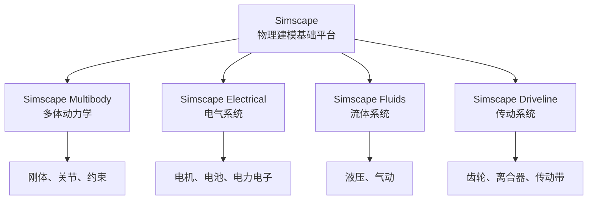
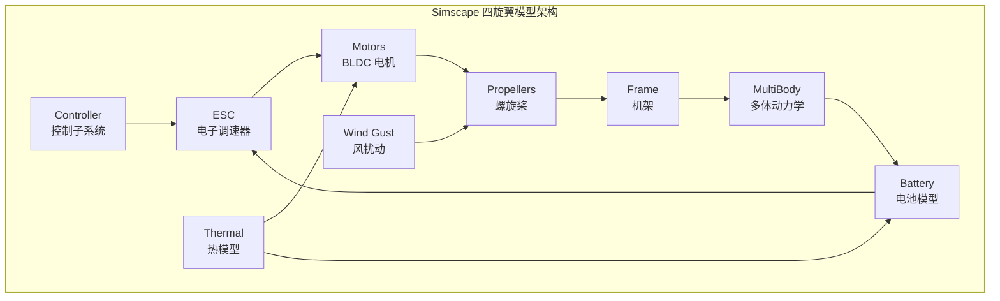
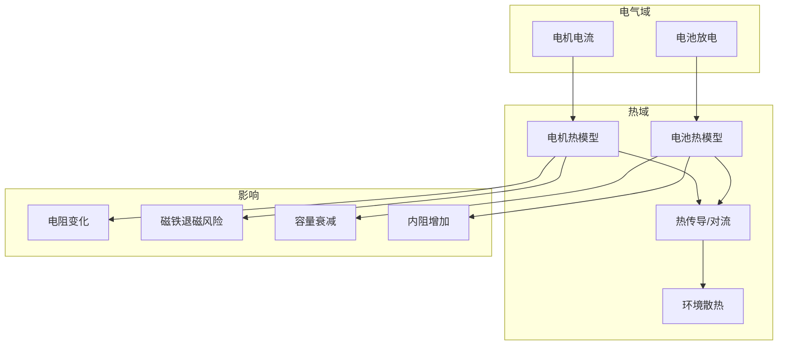

# MathWorks 官方 Simscape 四旋翼模型深度解析

> 预计阅读：22 分钟 | 前置知识：Simulink 基础、Simscape Multibody 入门、电机原理基础

---

## 1. 项目概览

MathWorks 官方维护的 `Quadcopter-Drone-Model-Simscape` 仓库是基于 **Simscape** 平台构建的高保真四旋翼无人机仿真模型，获得了 **119 stars**。与传统的信号流 Simulink 模型不同，该模型充分利用 Simscape 的 **物理建模** 能力，实现了基于物理原理的多域仿真。

| 属性 | 详情 |
|------|------|
| 仓库地址 | `github.com/mathworks/Quadcopter-Drone-Model-Simscape` |
| Stars | 119 |
| 维护者 | MathWorks 官方 |
| 许可证 | BSD License |
| MATLAB 版本 | R2022a 及以上（推荐 R2023b+） |
| 必需工具箱 | Simscape, Simscape Multibody, Simscape Electrical |
| 特色 | 多物理域耦合、CAD 几何导入、热建模 |

---

## 2. Simscape 平台基础

### 2.1 Simscape vs 传统 Simulink

| 对比维度 | 传统信号流 Simulink | Simscape 物理建模 |
|---------|-------------------|------------------|
| 建模方式 | 数学方程手动实现 | 物理元件拖拽连接 |
| 方程推导 | 用户手动推导 | 自动建立系统方程 |
| 因果关系 | 信号有方向（输入→输出） | 无因果（双向物理连接） |
| 多物理域 | 需要手动耦合 | 原生支持（机械、电气、液压等） |
| 学习曲线 | 较平缓 | 较陡峭 |
| 模型精度 | 取决于用户实现 | 物理原理保证 |
| 仿真速度 | 通常较快 | 可能较慢（方程更复杂） |

### 2.2 Simscape 产品族



---

## 3. 模型架构分析

### 3.1 总体架构



### 3.2 子系统清单

| 子系统 | Simscape 域 | 功能 | 复杂度 |
|--------|------------|------|--------|
| Frame (机架) | Multibody | 刚体几何、质量属性 | 中 |
| Joints (关节) | Multibody | 6-DOF 运动 | 低 |
| BLDC Motors | Electrical | 无刷直流电机模型 | 高 |
| ESC | Electrical | 电子调速器 PWM 控制 | 中 |
| Propellers | Multibody + Custom | 螺旋桨气动力 | 高 |
| Battery | Electrical | 锂电池放电特性 | 中 |
| Sensors | Signal | IMU/GPS 信号生成 | 低 |
| Wind | Signal | 风扰动模型 | 中 |
| Thermal | Thermal | 电机/电池热耦合 | 高 |

---

## 4. Simscape Multibody：机架与运动学

### 4.1 刚体建模

Simscape Multibody 使用 **Rigid Transform** 和 **Joint** 组件构建多体系统：

| 组件 | 功能 | 关键参数 |
|------|------|---------|
| `Solid` | 定义刚体 | 质量、惯量、几何 |
| `Rigid Transform` | 定义坐标系变换 | 平移、旋转 |
| `Revolute Joint` | 单轴旋转关节 | 旋转轴、初始条件 |
| `Prismatic Joint` | 单轴平移关节 | 平移轴、限制 |
| `6-DOF Joint` | 六自由度关节 | 完全自由运动 |
| `Weld Joint` | 焊接（固定连接） | 无自由度 |

### 4.2 四旋翼机架结构

```
机架结构示意：

        旋翼1(CW)         旋翼2(CCW)
            \               /
             \             /
              +-----------+
              |   机身    |
              +-----------+
             /             \
            /               \
        旋翼3(CCW)        旋翼4(CW)

坐标系定义：
- 机体坐标系 (Body Frame): 原点在质心，X轴指向前方
- 世界坐标系 (World Frame): NED 或 ENU
```

### 4.3 质量属性配置

| 属性 | 符号 | 典型值 | 单位 | 获取方式 |
|------|------|--------|------|---------|
| 总质量 | $m$ | 0.5 ~ 2.0 | kg | 称重 |
| 转动惯量 Ixx | $J_{xx}$ | 0.002 ~ 0.01 | kg·m² | 摆锤实验 |
| 转动惯量 Iyy | $J_{yy}$ | 0.002 ~ 0.01 | kg·m² | 摆锤实验 |
| 转动惯量 Izz | $J_{zz}$ | 0.004 ~ 0.02 | kg·m² | 摆锤实验 |
| 质心位置 | $\mathbf{r}_{cm}$ | (0, 0, 0) | m | CAD 计算 |

---

## 5. Simscape Electrical：电机与电源

### 5.1 BLDC 电机模型

Simscape Electrical 提供的 BLDC（Brushless DC Motor）模型包含：

| 子模型 | 功能 | 关键参数 |
|--------|------|---------|
| 电机本体 | 反电动势、电磁力矩 | KV 值、极对数 |
| 逆变器 | 三相桥式电路 | MOSFET 参数 |
| 控制器 | 换相逻辑 | Hall 传感器/无感 |
| 热端口 | 温度耦合 | 热阻、热容 |

**BLDC 电机关键方程：**

电气方程：
$$V_{bus} = R \cdot I + L \frac{dI}{dt} + K_e \cdot \omega$$

力矩方程：
$$\tau = K_t \cdot I - \tau_{friction}$$

其中：
| 符号 | 含义 | 典型单位 |
|------|------|---------|
| $V_{bus}$ | 母线电压 | V |
| $R$ | 相电阻 | Ω |
| $L$ | 相电感 | H |
| $K_e$ | 反电动势常数 | V·s/rad |
| $K_t$ | 力矩常数 | N·m/A |
| $\omega$ | 转子角速度 | rad/s |

### 5.2 ESC（电子调速器）模型


ESC 模型的关键特性：
- PWM 信号输入（标准 1000~2000μs 范围）
- 电流限制保护
- 电池电压补偿
- 启停逻辑

### 5.3 电池模型

| 参数 | 符号 | 典型值 | 说明 |
|------|------|--------|------|
| 标称电压 | $V_{nom}$ | 11.1~22.2 V | 3S~6S 锂电池 |
| 内阻 | $R_{int}$ | 5~50 mΩ | 影响电压降 |
| 容量 | $C$ | 1000~10000 mAh | 续航时间 |
| 截止电压 | $V_{cutoff}$ | 3.0~3.3 V/cell | 过放保护 |
| 放电曲线 | - | 非线性 | 取决于电池化学体系 |

---

## 6. 热建模集成

Simscape 模型的独特优势之一是支持 **热-电-机械** 多物理域耦合。

### 6.1 热耦合架构



### 6.2 热参数

| 参数 | 符号 | 典型值 | 说明 |
|------|------|--------|------|
| 电机热阻 | $R_{th,m}$ | 5~15 K/W | 电机到环境 |
| 电池热阻 | $R_{th,b}$ | 2~10 K/W | 电池到环境 |
| 电机热容 | $C_{th,m}$ | 50~200 J/K | 电机热惯性 |
| 电池热容 | $C_{th,b}$ | 100~500 J/K | 电池热惯性 |
| 环境温度 | $T_{amb}$ | 25 °C | 基准温度 |

---

## 7. CAD 几何导入（STEP 文件）

### 7.1 支持的 CAD 格式

| 格式 | 说明 | 推荐度 |
|------|------|--------|
| STEP (.step/.stp) | 行业标准，推荐使用 | ★★★ |
| STL (.stl) | 三角网格，精度较低 | ★★☆ |
| OBJ (.obj) | 通用 3D 格式 | ★☆☆ |
| VRML (.wrl) | 轻量级，适合可视化 | ★☆☆ |
| Parasolid (.x_t) | NX/SolidWorks 原生 | ★★★ |

### 7.2 STEP 导入流程


**导入步骤：**
1. 在 CAD 软件中导出 STEP 文件
2. 在 Simscape Multibody 中使用 `File Solid` 组件
3. 指定 STEP 文件路径
4. 设置材料密度，自动计算质量属性
5. 可选：手动调整惯量以匹配实测值

### 7.3 几何简化建议

| 部件 | 建议 | 原因 |
|------|------|------|
| 电机 | 简化为圆柱体 | 减少三角面数量 |
| 螺旋桨 | 保留详细几何 | 影响气动计算 |
| 机架 | 保留详细几何 | 影响碰撞检测 |
| 电子设备 | 简化为长方体 | 仅影响质量分布 |
| 线缆 | 忽略 | 质量影响小 |

---

## 8. 风扰动与气象集成

### 8.1 风模型类型

| 风模型 | 特点 | 适用场景 | 复杂度 |
|--------|------|---------|--------|
| 常值风 | 恒定风速和方向 | 基础测试 | ★☆☆ |
| 阶跃风 | 突然变化的风速 | 鲁棒性测试 | ★☆☆ |
| Dryden 模型 | 频域随机湍流 | 标准湍流仿真 | ★★☆ |
| Von Karman 模型 | 频域随机湍流 | 更真实的湍流 | ★★★ |
| CFD 数据导入 | 计算流体力学结果 | 复杂地形 | ★★★ |

### 8.2 Dryden 风模型参数

| 参数 | 符号 | 低空典型值 | 说明 |
|------|------|-----------|------|
| 风速均值 | $V_{wind}$ | 0~15 m/s | 平均风速 |
| 湍流强度 | $\sigma_u, \sigma_v, \sigma_w$ | 1~3 m/s | 三轴湍流标准差 |
| 湍流尺度 | $L_u, L_v, L_w$ | 50~200 m | 空间相关长度 |
| 风剪切指数 | $\alpha$ | 0.1~0.4 | 高度变化率 |

---

## 9. PID 控制实现

### 9.1 控制架构

该模型采用标准的 PID 级联控制：

| 控制环 | 输入 | 输出 | 典型带宽 |
|--------|------|------|---------|
| 位置环 | 期望位置 | 期望速度 | 1~3 Hz |
| 速度环 | 期望速度 | 期望姿态+推力 | 5~10 Hz |
| 姿态环 | 期望姿态 | 期望角速率 | 15~25 Hz |
| 角速率环 | 期望角速率 | 电机指令 | 50~100 Hz |

### 9.2 Simscape 中的 PID 实现

在 Simscape 环境中，PID 控制器通常作为信号域组件存在：

```
信号域（控制）  ←→  物理域（Simscape）
     ↑                    ↑
  PID Controller     BLDC Motor
     ↓                    ↓
  PWM 信号  →  电压输入  →  转速输出  →  力/力矩
```

---

## 10. 信号流模型 vs Simscape 模型对比

| 对比维度 | 信号流 Simulink | Simscape 物理建模 |
|---------|----------------|------------------|
| **建模效率** | 需要手动推导方程 | 拖拽物理元件 |
| **多物理域** | 手动耦合 | 原生支持 |
| **模型验证** | 需要对比文献 | 物理原理保证 |
| **仿真速度** | 较快 | 较慢（~2-5倍） |
| **模型复杂度** | 可控 | 自动增加 |
| **调试难度** | 信号追踪容易 | 物理连接追踪困难 |
| **代码生成** | 成熟 | 支持但需注意 |
| **学习门槛** | 中等 | 较高 |
| **适用场景** | 控制算法开发 | 系统级设计、硬件选型 |

---

## 11. 模型导航指南

### 11.1 快速上手步骤

```matlab
% 1. 克隆仓库
% git clone https://github.com/mathworks/Quadcopter-Drone-Model-Simscape.git

% 2. 打开工程
open('QuadcopterDrone.prj');  % 自动配置路径

% 3. 运行初始化脚本
init_quadcopter;  % 加载参数

% 4. 打开主模型
open_system('QuadcopterDroneModel');

% 5. 运行仿真
sim('QuadcopterDroneModel');
```

### 11.2 模型浏览器导航

| 导航级别 | 操作 | 查看内容 |
|---------|------|---------|
| Level 0 | 点击顶层 | 系统级框图 |
| Level 1 | 双击子系统 | 主要组件连接 |
| Level 2 | 再次双击 | 详细物理模型 |
| Level 3 | 继续深入 | 底层方程实现 |

### 11.3 常见修改场景

| 修改目标 | 位置 | 操作 |
|---------|------|------|
| 更换电机 | Motor 子系统 | 修改 BLDC 参数 |
| 更换螺旋桨 | Propeller 子系统 | 修改气动参数 |
| 修改机架几何 | Frame 子系统 | 导入新 STEP 文件 |
| 调整 PID | Controller 子系统 | 修改增益参数 |
| 添加传感器 | Sensor 子系统 | 添加新传感器模块 |
| 修改风环境 | Wind 子系统 | 选择风模型类型 |

---

## 思考题

**1. Simscape 物理建模和传统信号流 Simulink 建模各有什么优缺点？在什么情况下应该选择哪种方式？**

<details><summary>参考答案</summary>

**Simscape 优点**：
- 物理元件拖拽建模，无需手动推导方程
- 多物理域天然耦合（机械+电气+热）
- 模型自动保持物理一致性（能量守恒等）

**Simscape 缺点**：
- 仿真速度较慢（方程更复杂）
- 调试困难（信号追踪不直观）
- 学习曲线陡峭

**传统信号流优点**：
- 仿真速度快
- 调试直观（信号方向明确）
- 学习曲线平缓

**选择建议**：
- 控制算法开发 → 传统信号流
- 系统级设计、硬件选型 → Simscape
- 多物理域耦合分析 → Simscape
- 快速原型验证 → 传统信号流
</details>

**2. 为什么在 Simscape 模型中需要热建模？忽略热效应可能导致什么问题？**

<details><summary>参考答案</summary>

热建模的必要性：
1. **电机性能退化**：温度升高导致电阻增加、磁铁磁性下降，影响推力和效率
2. **电池容量衰减**：高温下电池内阻增加、实际可用容量减少
3. **安全风险**：过热可能导致电机烧毁、电池起火
4. **仿真精度**：忽略热效应会导致长时间飞行仿真结果不准确

忽略热效应的问题：
- 续航时间估计偏乐观
- 大推力机动时性能估计偏高
- 无法预测热相关的故障模式
- 无法进行热管理设计
</details>

**3. STEP 文件导入 Simscape Multibody 后，自动计算的质量属性可能与实际不符。请分析原因并提出解决方案。**

<details><summary>参考答案</summary>

**自动计算不准确的原因**：
1. **材料密度假设**：CAD 中的材料可能与实际使用的材料不同
2. **内部结构简化**：STEP 文件通常只包含外部几何，内部空腔、加强筋等未建模
3. **装配误差**：实际装配可能与 CAD 设计有偏差
4. **附加部件**：线缆、胶水、螺丝等小部件未在 CAD 中建模

**解决方案**：
1. 实测质量，手动调整密度参数使仿真质量匹配
2. 使用摆锤实验测量转动惯量，手动覆盖自动计算值
3. 将复杂部件拆分为多个 Solid，分别设置密度
4. 添加"补偿质量点"来修正质心位置
</details>

**4. 比较 Dryden 和 Von Karman 两种湍流模型的数学特性。在 Simulink 中实现它们分别需要什么模块？**

<details><summary>参考答案</summary>

**Dryden 模型**：
- 使用有理传递函数（rational transfer function）
- 可以直接用 Transfer Fcn 模块实现
- 频谱在高频段衰减为 $\omega^{-2}$
- 实现简单，计算效率高

**Von Karman 模型**：
- 使用非有理传递函数
- 需要用 Pade 近似或状态空间实现
- 频谱在高频段衰减为 $\omega^{-5/3}$
- 更符合实验观测，但实现复杂

**Simulink 实现模块**：
- Dryden：`Transfer Fcn` 模块 + 白噪声输入
- Von Karman：`State-Space` 模块（Pade 近似后）+ 白噪声输入

**选择建议**：
- 快速仿真、控制验证 → Dryden
- 高保真仿真、论文研究 → Von Karman
</details>

**5. 如果要在 Simscape 四旋翼模型中添加降落伞回收功能，需要新增哪些 Simscape 组件？如何建模降落伞的气动特性？**

<details><summary>参考答案</summary>

**需要新增的组件**：
1. **Prismatic Joint**：模拟降落伞绳的展开过程
2. **External Force and Torque**：施加降落伞气动力
3. **Simscape Signal Builder**：定义开伞时序逻辑

**降落伞气动建模**：
1. **阻力模型**：$F_D = \frac{1}{2} \rho V^2 C_D A$
   - $C_D$：阻力系数（通常 1.0~1.5）
   - $A$：降落伞面积
2. **稳定性模型**：俯仰/偏航阻尼力矩
3. **开伞过程**：从折叠到展开的面积变化曲线

**实现步骤**：
1. 在机体上添加降落伞连接点
2. 定义开伞触发条件（高度或手动指令）
3. 使用 External Force 施加气动阻力
4. 验证回收轨迹和着陆速度
</details>
