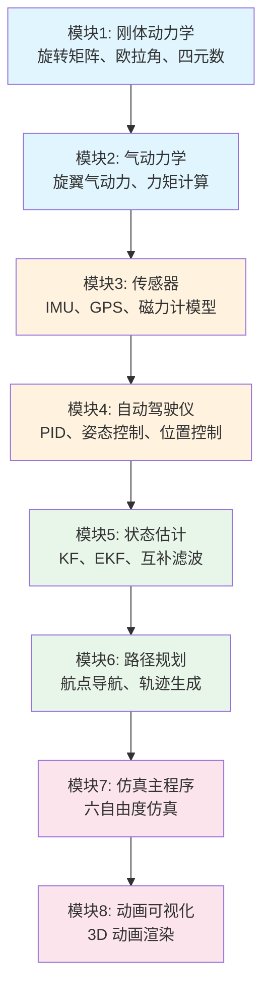

# Flight-Dynamics-and-Control-UAVs 深度解析

> 预计阅读：22 分钟 | 前置知识：飞行力学基础、MATLAB 编程、控制系统入门

---

## 1. 项目概览

`Flight-Dynamics-and-Control-UAVs` 是由 lamfur07 维护的综合性 UAV 飞行动力学与控制框架，在 GitHub 上获得了 **149 stars**。该项目以 **渐进式学习路径** 为设计理念，从刚体动力学基础到自动驾驶仪实现，覆盖了 UAV 飞行控制的完整知识体系。

| 属性 | 详情 |
|------|------|
| 仓库地址 | `github.com/lamfur07/Flight-Dynamics-and-Control-UAVs` |
| Stars | 149 |
| 语言 | MATLAB / Simulink |
| 许可证 | MIT License |
| 适用人群 | 研究生、UAV 控制工程师 |
| 特色 | 渐进式学习、完整知识链、动画可视化 |

---

## 2. 仓库结构分析

```
Flight-Dynamics-and-Control-UAVs/
├── README.md                          # 项目说明
├── docs/                              # 文档目录
│   ├── theory/                        # 理论推导文档
│   └── tutorials/                     # 教程指南
│
├── 01_RigidBody_Dynamics/             # 模块1: 刚体动力学
│   ├── rotation_matrices.m            # 旋转矩阵
│   ├── euler_kinematics.m             # 欧拉运动学
│   ├── quaternion_kinematics.m        # 四元数运动学
│   └── newton_euler_eom.m             # Newton-Euler 方程
│
├── 02_Aerodynamics/                   # 模块2: 气动力学
│   ├── blade_element_theory.m         # 叶素理论
│   ├── momentum_theory.m              # 动量理论
│   ├── rotor_aerodynamics.m           # 旋翼气动力
│   └── aerodynamic_coefficients.m     # 气动系数
│
├── 03_Sensors/                        # 模块3: 传感器
│   ├── imu_model.m                    # IMU 模型
│   ├── gps_model.m                    # GPS 模型
│   ├── magnetometer_model.m           # 磁力计模型
│   └── sensor_fusion.m               # 传感器融合
│
├── 04_Autopilot/                      # 模块4: 自动驾驶仪
│   ├── pid_controller.m               # PID 控制器
│   ├── attitude_controller.m          # 姿态控制
│   ├── position_controller.m          # 位置控制
│   └── control_allocation.m           # 控制分配
│
├── 05_StateEstimation/                # 模块5: 状态估计
│   ├── kalman_filter.m                # 卡尔曼滤波器
│   ├── extended_kf.m                  # 扩展卡尔曼滤波
│   ├── complementary_filter.m        # 互补滤波器
│   └── madgwick_filter.m             # Madgwick 滤波器
│
├── 06_PathPlanning/                   # 模块6: 路径规划
│   ├── waypoint_navigation.m          # 航点导航
│   ├── trajectory_generation.m        # 轨迹生成
│   └── obstacle_avoidance.m           # 避障算法
│
├── 07_Simulation/                     # 模块7: 仿真主程序
│   ├── main_simulation.m              # 主仿真脚本
│   ├── sim_parameters.m               # 仿真参数
│   └── run_scenarios.m                # 场景运行器
│
├── 08_Animation/                      # 模块8: 动画可视化
│   ├── uav_animation.m               # UAV 3D 动画
│   ├── plot_results.m                 # 结果绘图
│   └── animation_utils.m             # 动画工具函数
│
└── examples/                          # 示例场景
    ├── hover_test.m                   # 悬停测试
    ├── circle_tracking.m             # 圆形跟踪
    └── figure8_trajectory.m           # 8 字轨迹
```

---

## 3. 渐进式学习路径

该项目最大的特色是 **渐进式学习路径设计**，每个模块都建立在前一个模块的基础上：



### 学习模块时间建议

| 模块 | 建议时间 | 难度 | 核心产出 |
|------|---------|------|---------|
| 刚体动力学 | 1~2 周 | ★★☆ | 理解坐标系变换和运动学方程 |
| 气动力学 | 1~2 周 | ★★★ | 理解旋翼气动力/力矩产生机理 |
| 传感器 | 1 周 | ★★☆ | 理解传感器噪声特性 |
| 自动驾驶仪 | 2~3 周 | ★★★ | 能独立设计 PID 控制器 |
| 状态估计 | 2 周 | ★★★ | 理解滤波器原理和实现 |
| 路径规划 | 1 周 | ★★☆ | 实现基本航点跟踪 |
| 仿真主程序 | 1 周 | ★★☆ | 完整仿真运行 |
| 动画可视化 | 0.5 周 | ★☆☆ | 3D 结果展示 |

---

## 4. 核心知识点覆盖

### 4.1 刚体动力学模块

| 知识点 | 实现内容 | 关键函数 |
|--------|---------|---------|
| 旋转矩阵 | 3x3 正交矩阵、欧拉角到旋转矩阵 | `rotation_matrices.m` |
| 欧拉运动学 | 欧拉角变化率与角速度关系 | `euler_kinematics.m` |
| 四元数 | 四元数乘法、归一化、微分方程 | `quaternion_kinematics.m` |
| Newton-Euler | 六自由度方程的向量形式 | `newton_euler_eom.m` |

**核心方程实现：**

平移方程：
$$m\dot{\mathbf{v}} = \mathbf{f}_{gravity} + \mathbf{R}\mathbf{f}_{thrust} + \mathbf{f}_{aero}$$

旋转方程：
$$\mathbf{J}\dot{\boldsymbol{\omega}} = \boldsymbol{\tau}_{motor} + \boldsymbol{\tau}_{aero} - \boldsymbol{\omega} \times \mathbf{J}\boldsymbol{\omega}$$

### 4.2 气动力学模块

| 理论模型 | 功能 | 精度 | 计算量 |
|---------|------|------|--------|
| 动量理论 (Momentum Theory) | 旋翼推力/功率估算 | 低 | 低 |
| 叶素理论 (Blade Element Theory) | 沿桨叶积分 | 中 | 中 |
| 涡流理论 (Vortex Theory) | 尾迹建模 | 高 | 高 |

### 4.3 状态估计模块

| 滤波器类型 | 状态维度 | 计算量 | 适用场景 |
|-----------|---------|--------|---------|
| 互补滤波器 | 姿态(3) | ★☆☆ | 低端飞控 |
| Madgwick 滤波器 | 姿态四元数(4) | ★☆☆ | 实时姿态估计 |
| 卡尔曼滤波器 | 可配置 | ★★☆ | 线性系统 |
| 扩展卡尔曼滤波器 | 可配置 | ★★★ | 非线性系统 |

---

## 5. UAV 动画能力

### 5.1 动画功能

| 功能 | 说明 | 实现方式 |
|------|------|---------|
| 3D UAV 渲染 | 四旋翼三维模型 | MATLAB patch/surf |
| 轨迹显示 | 飞行路径可视化 | plot3 实时更新 |
| 坐标系显示 | 机体系/惯性系 | quiver3 |
| 传感器视场 | 相机/雷达视锥 | 透明锥体 |
| 多机显示 | 编队飞行 | 多实例渲染 |

### 5.2 动画性能优化

| 优化方法 | 效果 | 适用场景 |
|---------|------|---------|
| 降低刷新率 | 减少计算量 | 长时间仿真 |
| 简化几何 | 减少渲染开销 | 低性能机器 |
| 离线渲染 | 先仿真后动画 | 论文制作 |
| 视频导出 | MP4/AVI 输出 | 演示汇报 |

---

## 6. 与教学文档的互补关系

该项目与本教学文档系列形成了良好的互补：

| 教学文档章节 | 对应仓库模块 | 互补方式 |
|------------|-------------|---------|
| 01-基础概念 | 01_RigidBody_Dynamics | 文档讲理论，仓库看代码实现 |
| 02-动力学建模核心 | 02_Aerodynamics | 文档推导方程，仓库提供可运行代码 |
| 03-Simulink建模实战 | 07_Simulation | 文档讲 Simulink 技巧，仓库提供纯 MATLAB 实现 |
| 04-控制系统设计 | 04_Autopilot | 文档讲控制理论，仓库提供完整控制栈 |
| 05-状态估计与传感器 | 03_Sensors + 05_StateEstimation | 文档讲滤波理论，仓库提供多种滤波器实现 |
| 06-高级仿真专题 | 06_PathPlanning | 文档讲高级话题，仓库提供路径规划代码 |

### 学习建议


---

## 7. 典型示例场景

### 7.1 悬停测试（Hover Test）

| 参数 | 值 | 说明 |
|------|-----|------|
| 初始位置 | (0, 0, -5) m | 地面上方 5m |
| 目标位置 | (0, 0, -10) m | 悬停在 10m |
| 仿真时长 | 30 s | 观察收敛过程 |
| 风扰动 | 无 | 纯控制器性能测试 |

### 7.2 圆形跟踪（Circle Tracking）

| 参数 | 值 | 说明 |
|------|-----|------|
| 圆半径 | 5 m | 跟踪圆的半径 |
| 飞行速度 | 2 m/s | 沿圆周速度 |
| 高度 | 10 m | 恒定高度 |
| 仿真时长 | 60 s | 完成约 4 圈 |

### 7.3 8 字轨迹（Figure-8 Trajectory）

| 参数 | 值 | 说明 |
|------|-----|------|
| 轨迹类型 | Lissajous 曲线 | x=sin(t), y=sin(2t) |
| 尺度 | 5 m | 轨迹尺寸 |
| 高度 | 10 m | 恒定高度 |
| 仿真时长 | 60 s | 观察跟踪精度 |

---

## 8. 使用指南

### 8.1 快速开始

```matlab
% 1. 克隆仓库
% git clone https://github.com/lamfur07/Flight-Dynamics-and-Control-UAVs.git

% 2. 添加路径
addpath(genpath('Flight-Dynamics-and-Control-UAVs'));

% 3. 运行示例
hover_test;           % 悬停测试
% 或
circle_tracking;      % 圆形跟踪
% 或
figure8_trajectory;   % 8 字轨迹
```

### 8.2 自定义仿真

```matlab
% 1. 修改仿真参数
params = sim_parameters();
params.mass = 1.5;           % 修改质量
params.J = diag([0.02 0.02 0.04]);  % 修改惯量

% 2. 修改控制器参数
ctrl.Kp_pos = [2.0, 2.0, 3.0];   % 位置 P 增益
ctrl.Kd_pos = [1.5, 1.5, 2.0];   % 位置 D 增益
ctrl.Kp_att = [8.0, 8.0, 4.0];   % 姿态 P 增益

% 3. 运行仿真
sim_out = main_simulation(params, ctrl);

% 4. 查看结果
plot_results(sim_out);
uav_animation(sim_out);
```

---

## 9. 扩展建议

| 扩展方向 | 难度 | 建议工作量 | 预期收获 |
|---------|------|-----------|---------|
| 添加 Simulink 模型 | ★★☆ | 2~3 周 | 对比 MATLAB 脚本与 Simulink 的差异 |
| 集成 ROS2 接口 | ★★★ | 3~4 周 | 实现仿真到实飞的对接 |
| 添加视觉传感器 | ★★☆ | 2 周 | 扩展到视觉导航 |
| 多机编队仿真 | ★★★ | 4~5 周 | 学习分布式控制 |
| 强化学习控制 | ★★★ | 4~6 周 | 探索 AI 控制方法 |

---

## 思考题

**1. 该项目采用纯 MATLAB 脚本而非 Simulink 模型来实现仿真。请分析两种实现方式的优缺点。**

<details><summary>参考答案</summary>

**纯 MATLAB 脚本的优点**：
- 代码逻辑清晰，易于理解和调试
- 仿真速度快（无 Simulink 开销）
- 版本控制友好（纯文本文件）
- 不依赖 Simulink 许可证

**纯 MATLAB 脚本的缺点**：
- 需要手动实现数值积分
- 缺乏 Simulink 的可视化建模环境
- 难以实现硬件在环（HIL）测试
- 不支持 Simulink 的代码生成功能

**Simulink 模型的优点**：
- 图形化建模，直观易懂
- 内置求解器，数值稳定性好
- 支持代码生成和 HIL 测试
- 丰富的可视化工具

**选择建议**：
- 学术研究、快速原型 → 纯 MATLAB 脚本
- 工程开发、产品化 → Simulink 模型
</details>

**2. 该仓库的渐进式学习路径设计有什么教育学原理支撑？如何将这种设计应用到其他技术领域的学习中？**

<details><summary>参考答案</summary>

**教育学原理**：
1. **脚手架理论（Scaffolding）**：每个模块为下一个模块提供基础支撑
2. **最近发展区（ZPD）**：难度逐步提升，始终处于学习者的舒适区边缘
3. **建构主义（Constructivism）**：学习者通过动手实践构建知识
4. **螺旋式课程（Spiral Curriculum）**：核心概念在不同层次反复出现

**应用到其他领域**：
- 机器人学：从运动学→动力学→控制→感知→规划
- 机器学习：从线性回归→神经网络→深度学习→强化学习
- 嵌入式系统：从 GPIO→中断→通信→RTOS→系统设计
</details>

**3. 如果要将该项目的 MATLAB 脚本迁移到 Simulink 模型，需要进行哪些关键的架构决策？**

<details><summary>参考答案</summary>

**关键架构决策**：

1. **求解器选择**：
   - 固定步长 vs 可变步长
   - 推荐：ode4（固定步长）用于 HIL，ode45（可变步长）用于离线仿真

2. **模块划分**：
   - 每个 MATLAB 函数对应一个 Simulink 子系统
   - 使用 Simulink Function Block 封装现有函数

3. **信号组织**：
   - 使用 Bus Signal 组织多维信号
   - 定义 Simulink Bus 对象

4. **状态变量管理**：
   - 使用 Data Store Memory 共享状态
   - 或使用信号线传递所有状态

5. **采样时间**：
   - 不同子系统可能需要不同的采样率
   - 使用 Rate Transition 模块处理多速率
</details>

**4. 该仓库的状态估计模块提供了四种滤波器。请比较它们的性能特点，并说明各自的适用场景。**

<details><summary>参考答案</summary>

| 滤波器 | 精度 | 计算量 | 鲁棒性 | 适用场景 |
|--------|------|--------|--------|---------|
| 互补滤波器 | 低 | 极低 | 中 | 低端飞控、教学演示 |
| Madgwick | 中 | 低 | 中 | 实时姿态估计、可穿戴设备 |
| 卡尔曼滤波 | 高 | 中 | 高 | 线性系统、GPS/INS 融合 |
| 扩展卡尔曼 | 高 | 高 | 高 | 非线性系统、完整状态估计 |

**选择建议**：
- 资源受限的嵌入式系统 → 互补滤波器/Madgwick
- 通用四旋翼飞控 → EKF
- 高精度导航 → EKF + 多传感器融合
</details>
