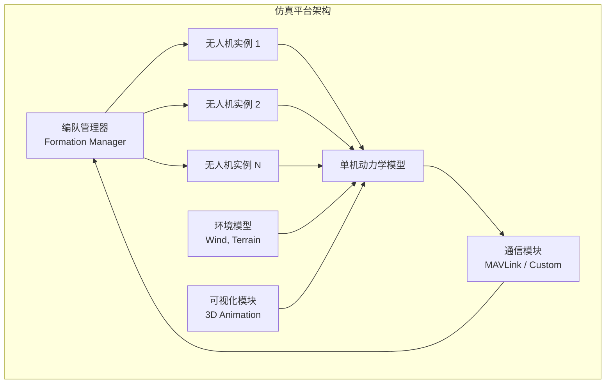
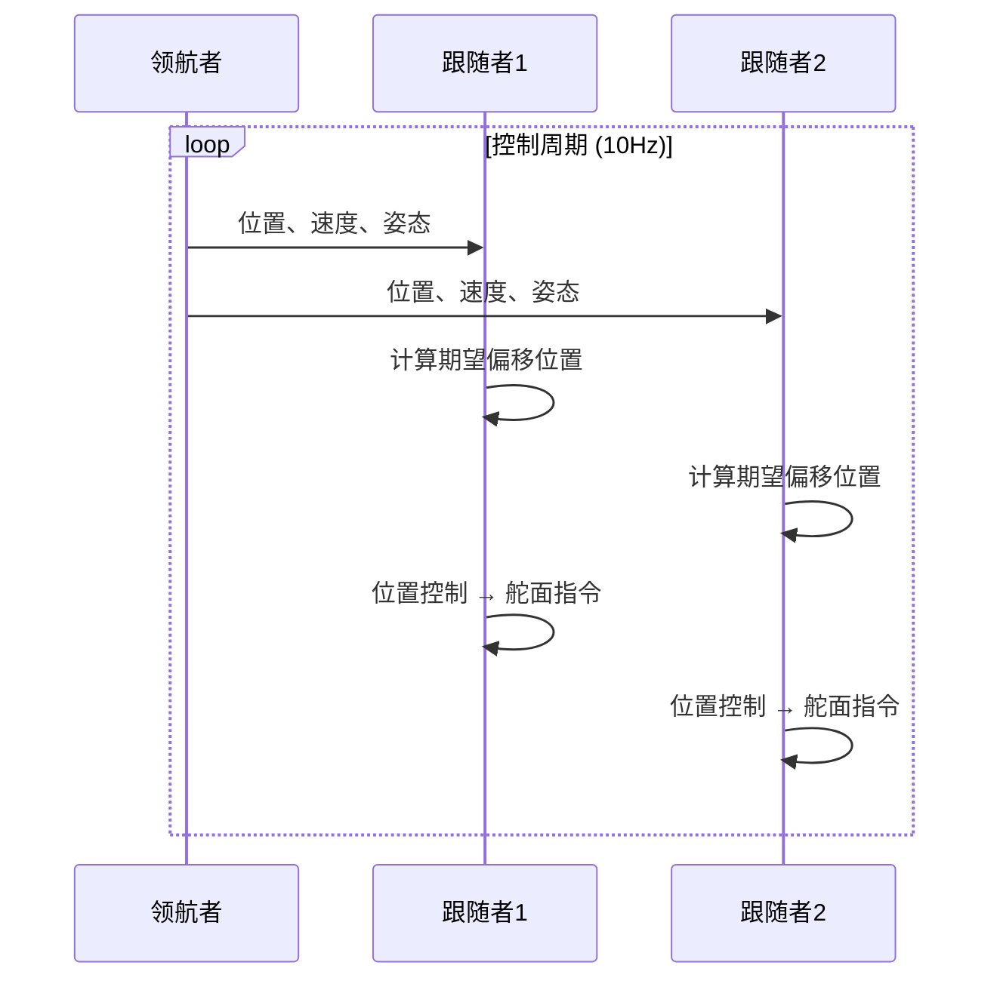

# 多机仿真平台与 PX4 集成

> 预计阅读：22 分钟 | 前置知识：Simulink 基础、PX4 飞控架构、MAVLink 协议基础

---

## 1. 项目概览

本章聚焦于 **多无人机仿真平台** 以及 **PX4 与 Simulink 的集成方案**。核心参考仓库为 `chengji253/Multiple-fixed-wing-UAVs-flight-simulation-platform`（320 stars），这是一个支持多固定翼无人机编队飞行的仿真平台。

| 属性 | 详情 |
|------|------|
| 主仓库 | `chengji253/Multiple-fixed-wing-UAVs-flight-simulation-platform` |
| Stars | 320 |
| 飞行器类型 | 固定翼 |
| 仿真规模 | 多机编队 |
| 语言 | MATLAB / Simulink |
| 特色 | 多机协调、可扩展架构、编队控制 |

---

## 2. 平台架构分析

### 2.1 系统架构

### 2.2 核心模块

| 模块 | 功能 | 关键技术 |
|------|------|---------|
| 飞行器实例 | 单机动力学、控制、传感器 | Simulink 模型复制 |
| 编队管理器 | 编队队形维护、任务分配 | 领航者-跟随者架构 |
| 通信模块 | 无人机间信息交换 | 延迟建模、丢包模拟 |
| 环境模型 | 风场、地形、障碍物 | 共享环境实例 |
| 可视化 | 多机三维动画 | 多实例渲染 |

### 2.3 可扩展性设计

| 扩展维度 | 当前支持 | 扩展方式 |
|---------|---------|---------|
| 无人机数量 | 3~10 架 | 模型实例化复制 |
| 飞行器类型 | 固定翼 | 添加多旋翼/VTOL 模型 |
| 通信拓扑 | 可配置 | 修改邻接矩阵 |
| 控制算法 | PID | 替换控制器模块 |
| 任务类型 | 编队飞行 | 添加任务规划模块 |

---

## 3. 固定翼无人机建模

### 3.1 固定翼 vs 多旋翼建模对比

| 对比维度 | 固定翼 | 多旋翼 |
|---------|--------|--------|
| 气动模型 | 复杂（升力面、舵面） | 相对简单（旋翼推力） |
| 自由度利用 | 6-DOF 全部 | 主要 4-DOF |
| 配平 | 需要配平计算 | 悬停即配平 |
| 控制输入 | 油门+升降舵+副翼+方向舵 | 各电机转速 |
| 飞行包线 | 有最小速度限制 | 可悬停 |
| 气动耦合 | 强耦合 | 弱耦合 |

### 3.2 固定翼动力学方程

六自由度运动方程：

$$\begin{cases}
m(\dot{u} + qw - rv) = X + mg_x \\
m(\dot{v} + ru - pw) = Y + mg_y \\
m(\dot{w} + pv - qu) = Z + mg_z
\end{cases}$$

$$\begin{cases}
I_x \dot{p} - (I_y - I_z)qr = L \\
I_y \dot{q} - (I_z - I_x)rp = M \\
I_z \dot{r} - (I_x - I_x)pq = N
\end{cases}$$

其中气动力/力矩：

| 符号 | 含义 | 计算方式 |
|------|------|---------|
| $X, Y, Z$ | 三轴气动力 | 风速、迎角、侧滑角函数 |
| $L, M, N$ | 三轴气动力矩 | 舵面偏转、角速率函数 |
| $u, v, w$ | 机体系速度分量 | 状态变量 |
| $p, q, r$ | 机体系角速率 | 状态变量 |

---

## 4. 编队控制策略

### 4.1 常见编队架构

| 架构 | 描述 | 优点 | 缺点 |
|------|------|------|------|
| 领航者-跟随者 | 一架领航，其余跟随 | 简单直观 | 领航者是单点故障 |
| 虚拟结构法 | 虚拟刚体结构 | 队形保持精确 | 灵活性差 |
| 行为法 | 每个个体独立决策 | 鲁棒性强 | 全局行为难以预测 |
| 一致性算法 | 分布式信息融合 | 去中心化 | 收敛速度慢 |

### 4.2 领航者-跟随者实现

---

## 5. PX4 集成方案

### 5.1 PX4-Simulink 集成仓库

| 仓库 | Stars | 集成方式 | 特色 |
|------|-------|---------|------|
| MichaelSkadan/PX4-Simulink | 39 | MAVLink 通信 | 入门友好 |
| optimAero/PX4-Simulink | 19 | Gazebo 中转 | 支持 HIL |

### 5.2 集成架构对比

```mermaid
graph TB
    subgraph 方案A: 直接 MAVLink 通信
        A1[PX4 SITL] <-->|MAVLink| B1[Simulink Plant]
        B1 --> C1[Simulink Visualization]
    end

    subgraph 方案B: Gazebo 中转
        A2[PX4 SITL] <-->|MAVLink| B2[Gazebo]
        B2 <-->|ROS Bridge| C2[Simulink]
        C2 --> D2[Simulink Visualization]
    end

    subgraph 方案C: 完全 Simulink
        A3[PX4 Controller Code] --> B3[Simulink SIL]
        B3 --> C3[Simulink Plant]
        C3 --> D3[Simulink Visualization]
    end
```

### 5.3 集成方案对比

| 方案 | 实时性 | 复杂度 | 精度 | 适用场景 |
|------|--------|--------|------|---------|
| 直接 MAVLink | 准实时 | 低 | 中 | 快速验证 |
| Gazebo 中转 | 实时 | 高 | 高 | 多传感器仿真 |
| 完全 Simulink | 非实时 | 中 | 可控 | 算法研究 |

---

## 6. SITL vs HIL 工作流对比

| 对比维度 | SITL (Software In The Loop) | HIL (Hardware In The Loop) |
|---------|---------------------------|---------------------------|
| **定义** | 飞控代码在计算机上运行 | 飞控硬件在环，被控对象是仿真 |
| **实时性** | 准实时（可慢可快） | 严格实时 |
| **硬件需求** | 无需飞控硬件 | 需要飞控板 + 接口设备 |
| **配置复杂度** | 低 | 高 |
| **调试便利性** | 高（可断点、单步） | 中（需要硬件调试工具） |
| **接口验证** | 无法验证硬件接口 | 完整硬件接口验证 |
| **传感器测试** | 仿真传感器数据 | 真实传感器（或模拟信号） |
| **典型用途** | 算法开发、快速迭代 | 硬件集成测试、飞前验证 |
| **仿真速度** | 可调（1x~10x） | 固定 1x |
| **成本** | 低 | 中~高 |

### 6.1 SITL 工作流程

### 6.2 HIL 工作流程

---

## 7. 构建多 UAV 仿真环境

### 7.1 环境搭建步骤

| 步骤 | 内容 | 工具 | 时间估计 |
|------|------|------|---------|
| 1 | 安装 PX4 开发环境 | PX4 Toolchain | 2~3 小时 |
| 2 | 编译 SITL 固件 | make 命令 | 30 分钟 |
| 3 | 配置 MATLAB/PX4 接口 | MAVLink Toolbox | 1 小时 |
| 4 | 搭建单机 Simulink 模型 | Simulink | 2~4 小时 |
| 5 | 复制多机实例 | 模型复制 | 1 小时 |
| 6 | 添加通信模块 | 自定义模块 | 2~3 小时 |
| 7 | 编队控制逻辑 | MATLAB Function | 4~6 小时 |
| 8 | 测试与调试 | 联合仿真 | 持续 |

### 7.2 多实例管理

| 管理方式 | 描述 | 优点 | 缺点 |
|---------|------|------|------|
| 模型复制 | 复制 Simulink 子系统 | 简单直接 | 参数修改繁琐 |
| 模型引用 | Model Reference | 独立编译、参数化 | 需要代码生成支持 |
| MATLAB Function | 用代码实现多机逻辑 | 灵活高效 | 可视化差 |
| Simulink Library | 创建参数化库 | 可复用性强 | 初始搭建复杂 |

### 7.3 通信建模

| 通信模型 | 描述 | 参数 |
|---------|------|------|
| 理想通信 | 无延迟、无丢包 | - |
| 固定延迟 | 恒定时间延迟 | 延迟时间 (ms) |
| 随机延迟 | 服从某种分布 | 均值、方差 |
| 丢包模型 | 按概率丢弃数据包 | 丢包率 (%) |
| 带宽限制 | 限制数据传输速率 | 带宽 (bps) |

---

## 8. 性能优化

### 8.1 多机仿真的性能瓶颈

| 瓶颈 | 原因 | 解决方案 |
|------|------|---------|
| 仿真速度 | 多个模型实例 | 并行计算、模型简化 |
| 内存占用 | 多个模型同时加载 | 模型引用、数据流优化 |
| 通信开销 | MAVLink 解析 | 批量处理、降低更新率 |
| 可视化渲染 | 多个 3D 模型 | 降低渲染质量、离线渲染 |

### 8.2 优化建议

| 优化策略 | 预期效果 | 实施难度 |
|---------|---------|---------|
| 使用 Model Reference | 减少编译时间 | ★★☆ |
| 并行仿真（parfor） | 线性加速比 | ★★☆ |
| 简化气动模型 | 仿真速度提升 2~5 倍 | ★☆☆ |
| 降低通信频率 | 减少 CPU 占用 | ★☆☆ |
| 使用 Accelerator 模式 | 仿真速度提升 2~10 倍 | ★☆☆ |

---

## 思考题

**1. 多机仿真平台中，编队管理器应该采用集中式还是分布式架构？请分析各自的优缺点。**

参考答案

**集中式架构**：
- 优点：全局信息可知，优化计算集中处理，队形控制精度高
- 缺点：单点故障风险，通信负担集中在管理器，扩展性差

**分布式架构**：
- 优点：无单点故障，扩展性好，通信负担分散
- 缺点：只有局部信息，全局最优难以保证，一致性收敛慢

**混合架构（推荐）**：
- 采用分层分布式：集群内分布式，集群间集中式
- 每个集群有局部领航者，全局有任务规划器
- 兼顾鲁棒性和全局优化能力

**2. 在 PX4-Simulink 集成中，为什么需要进行坐标系转换？常见的坐标系差异有哪些？**

参考答案

**坐标系差异**：
1. **PX4 使用 NED（北东地）坐标系**：Z 轴向下为正
2. **MATLAB/Simulink Aerospace Blockset 使用 NED**：与 PX4 一致
3. **某些 Simulink 模型使用 ENU（东北天）坐标系**：Z 轴向上为正
4. **四元数顺序**：PX4 使用 Hamilton 四元数 (w,x,y,z)，某些库使用 JPL 四元数 (x,y,z,w)

**需要转换的内容**：
- 位置向量的 Z 分量符号翻转
- 速度向量的 Z 分量符号翻转
- 四元数的顺序和符号
- 角速率的符号约定

**3. 如何评估多机仿真平台的可扩展性？当无人机数量从 5 增加到 50 时，系统可能面临什么挑战？**

参考答案

**可扩展性评估指标**：
1. 仿真时间复杂度：O(n) vs O(n²)
2. 内存占用增长率
3. 通信带宽需求
4. 编译时间增长率

**从 5 到 50 架的挑战**：
1. **计算量**：仿真时间可能从 1 分钟增加到 10+ 分钟
2. **内存**：可能超出 MATLAB 单进程内存限制
3. **通信**：MAVLink 带宽可能不足
4. **可视化**：50 个 3D 模型渲染可能卡顿
5. **调试**：问题定位变得极其困难

**解决方案**：
- 使用分布式仿真（多台计算机）
- 模型简化（减少状态维度）
- 分层仿真（只对关注的区域详细建模）
- 使用 GPU 加速可视化

**4. 对比 PX4 SITL 和 Gazebo 中转两种集成方案，各自的通信延迟和数据同步机制有什么不同？**

参考答案

**PX4 SITL 直接通信**：
- 通信延迟：取决于 MAVLink 库实现，通常 1~10ms
- 数据同步：基于 UDP 无连接通信，无严格同步
- 优点：延迟低，配置简单
- 缺点：无物理引擎，传感器模型需要自行实现

**Gazebo 中转**：
- 通信延迟：MAVLink + ROS 两层通信，通常 10~50ms
- 数据同步：Gazebo 使用 step-by-step 仿真，有明确的同步点
- 优点：高保真物理引擎，丰富的传感器插件
- 缺点：延迟高，配置复杂，需要维护多个进程

**同步机制差异**：
- SITL：异步通信，需要应用层实现同步逻辑
- Gazebo：锁步仿真（lockstep），仿真步长严格同步

