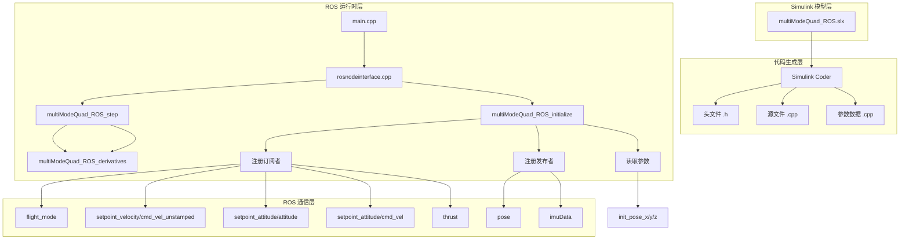
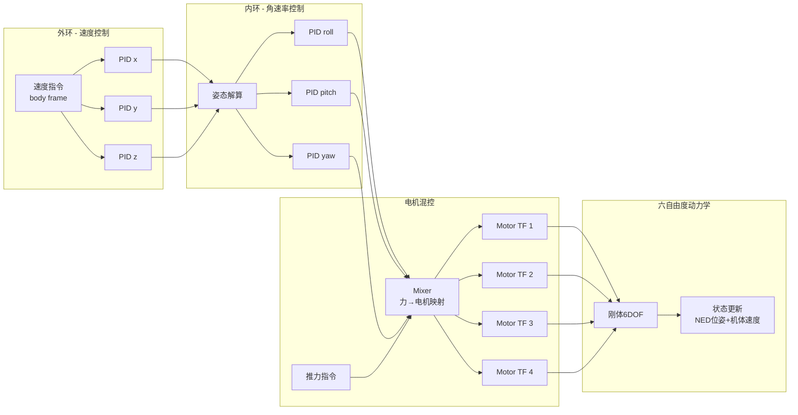

# multiModeQuad_ROS 深度解析：Simulink 生成的多模式四旋翼 ROS 节点

> 预计阅读：25 分钟 | 前置知识：Simulink / ROS 基础、四旋翼动力学、PID 控制

---

## 1. 项目概览

multiModeQuad_ROS 是由 JackHe（北京航空航天大学）开发的开源四旋翼仿真 ROS 包，基于 MATLAB/Simulink 模型通过 Simulink Coder 自动代码生成构建。该项目的核心特点是支持**多种控制模式**（速度/姿态/角速率/推力）和**多机扩展**。

| 属性 | 详情 |
|------|------|
| 仓库地址 | `github.com/JJJJJJJack/multiModeQuad_ROS` |
| Stars | 1 |
| 语言 | Simulink (.slx) + C++ (自动生成) |
| 许可证 | GPL-3.0 |
| 适用人群 | 中高级，需 Simulink + ROS 双基础 |
| MATLAB 版本 | R2024a |
| ROS 发行版 | Noetic (ROS1) |
| 生成工具 | Simulink Coder 24.1 / Embedded Coder |
| 求解器 | ODE4 (四阶龙格-库塔)，定步长 0.005s |
| 坐标系统 | NED (North-East-Down) |

### 与其他开源项目对比

| 对比维度 | Quad-Sim | multiModeQuad_ROS | ethzasl_quadrotor |
|---------|----------|-------------------|-------------------|
| 平台 | 纯 Simulink | Simulink → ROS | C++ / ROS |
| 代码来源 | 手写 MATLAB + Simulink | Simulink Coder 自动生成 | 手写 C++ |
| 多机支持 | 否 | 是（原生 NodeHandle("~")） | 否 |
| 控制模式 | 单一（轨迹跟踪） | 多种（速度/姿态/角速率/推力） | SE(3) 几何控制 |
| 与 ROS 集成度 | 低 | 高（完整 ROS 包） | 高 |
| 修改方式 | 改 .m + .slx | 改 .slx → 重新生成 | 改 C++ 源码 |

---

## 2. 仓库结构树

```
multiModeQuad_ROS/
├── CMakeLists.txt                   # ROS catkin 编译配置
├── package.xml                      # ROS 包描述文件
├── LICENSE                          # GPL-3.0
├── README.md                        # 项目说明
│
├── model/
│   └── multiModeQuad_ROS.slx        # ◀ 源模型（修改此文件，勿改 C++）
│
├── launch/
│   └── multi_quad_demo.launch       # 多机启动文件（quad_1, quad_2）
│
├── include/                         # 头文件（自动生成）
│   ├── multiModeQuad_ROS.h          # 模型主头文件（状态/输出/参数结构体）
│   ├── multiModeQuad_ROS_types.h    # ROS 总线消息类型定义
│   ├── multiModeQuad_ROS_private.h  # 私有函数声明
│   ├── rosnodeinterface.h           # ROS 节点接口类
│   ├── slros_initialize.h           # ROS 初始化声明
│   ├── slros_busmsg_conversion.h    # 总线消息转换
│   ├── slros_generic*.h             # ROS 通用工具
│   ├── rtwtypes.h / rt_*.h          # Simulink Coder 运行时
│   └── ...
│
└── src/                             # 源文件（自动生成）
    ├── multiModeQuad_ROS.cpp        # ◀ 核心：step() / initialize() / derivatives()
    ├── multiModeQuad_ROS_data.cpp   # 参数与初始值
    ├── main.cpp                     # 入口：创建并运行 ROS 节点
    ├── rosnodeinterface.cpp         # ROS-Simulink 桥接
    ├── slros_initialize.cpp         # 订阅/发布/参数注册
    ├── slros_busmsg_conversion.cpp  # SimStruct ↔ ROS 消息转换
    ├── ert_main.cpp                 # 嵌入式实时替代入口
    └── ...
```

---

## 3. 架构分析

### 3.1 系统架构总览



### 3.2 模型状态空间

| 状态变量 | 维度 | 物理含义 | 初始值 |
|---------|------|---------|--------|
| `xe, ye, ze` | 3 | NED 位置 (m) | 0, 0, 0 |
| `ub, vb, wb` | 3 | 机体速度 (m/s) | 0, 0, 0 |
| `p, q, r` | 3 | 机体角速率 (rad/s) | 0, 0, 0 |
| `phi, theta, psi` | 3 | 欧拉角 (rad) | 0, 0, 0 |
| TransferFcn 1-4 | 4 | 电机一阶惯性环节状态 | 0 |
| **合计** | **16** | **连续状态** | |

### 3.3 物理参数

| 参数 | 值 | 说明 |
|------|-----|------|
| 质量 | 2.0 kg | 四旋翼总质量 |
| 惯量矩阵 | diag(0.015, 0.015, 0.03) kg·m² | 绕各轴转动惯量 |
| 重力加速度 | 9.8 m/s² | NED 坐标系 |
| 悬停油门 | 3.13 | 对应悬停状态的推力值 |
| 电机时间常数 | 1/24.39 ≈ 0.041 s | 一阶传递函数 24.39/(s+24.39) |
| 求解器 | ODE4, 定步长 0.005s | 200Hz 更新率 |

### 3.4 控制架构

采用**级联 PID** 架构，外层速度控制在机体坐标系，内层角速率控制：



**PID 参数表：**

| 控制器 | P | I | D | N (滤波系数) | 输出限幅 |
|--------|---|---|---|-------------|---------|
| 速度 x | 10.0 | 0.02 | 0.01 | 100 | ±50 |
| 速度 y | 10.0 | 0.02 | 0.01 | 100 | ±50 |
| 速度 z (高度) | 3.0 | 0.2 | 2.0 | 100 | 无 |
| 角速率 roll | 0.3 | 0.01 | 0.05 | 300 | 无 |
| 角速率 pitch | 0.3 | 0.01 | 0.05 | 300 | 无 |
| 角速率 yaw | 0.6 | 0.01 | 0.05 | 300 | 无 |

### 3.5 ROS 接口

#### 订阅话题

| 话题 | 类型 | 说明 |
|------|------|------|
| `~/flight_mode` | std_msgs/Int16 | 飞行模式选择 |
| `~/setpoint_velocity/cmd_vel_unstamped` | geometry_msgs/Twist | 速度指令（机体坐标系） |
| `~/setpoint_attitude/attitude` | geometry_msgs/PoseStamped | 姿态指令（四元数） |
| `~/setpoint_attitude/cmd_vel` | geometry_msgs/TwistStamped | 角速率指令 |
| `~/thrust` | std_msgs/Float32 | 推力指令（覆盖模式） |

#### 发布话题

| 话题 | 类型 | 说明 |
|------|------|------|
| `~/pose` | geometry_msgs/PoseStamped | 位姿输出（NED，frame_id: "map"） |
| `~/imuData` | sensor_msgs/Imu | IMU 数据（含加速度/角速度/姿态） |

#### 参数

| 参数 | 类型 | 默认值 | 说明 |
|------|------|--------|------|
| `~init_pose_x` | double | 0.0 | 初始 x 位置 |
| `~init_pose_y` | double | 0.0 | 初始 y 位置 |
| `~init_pose_z` | double | 0.0 | 初始 z 位置 |

### 3.6 飞行模式

飞行模式通过 `~/flight_mode` 话题的整数值选择：

| 模式值 | 名称 | 描述 |
|--------|------|------|
| 0 | 速度控制模式 | 跟踪 `cmd_vel_unstamped` 的线速度/角速度指令（机体坐标系） |
| 1 | 角速率控制模式 | 跟踪 `setpoint_attitude/cmd_vel` 的角速率指令 |
| 2 | 姿态控制模式 | 跟踪 `setpoint_attitude/attitude` 的四元数姿态指令 |
| 其他 | — | 当前无映射，保持当前状态 |

---

## 4. Simulink 模型分析

### 4.1 模型层次结构（推测）

从自动生成的代码可以推断 Simulink 模型的顶层结构：

```
multiModeQuad_ROS.slx
├── <Root>
│   ├── Flight mode          ← 订阅 flight_mode 并选择控制模式
│   ├── Sub setpoint velocity  ← 速度指令输入
│   ├── Sub setpoint attitude  ← 姿态指令输入
│   ├── Sub setpoint rate      ← 角速率指令输入
│   ├── Sub thrust             ← 推力指令输入
│   │
│   ├── Attitude control      ← MATLAB Function / 级联 PID 控制律
│   │   ├── PID Velocity x/y/z
│   │   ├── PID Angular roll/pitch/yaw
│   │   └── Motor Transfer Fcn 1-4
│   │
│   ├── 6DOF (Euler Angles)  ← 六自由度刚体动力学
│   │   ├── Rigid Body Dynamics
│   │   ├── Euler Angle → Quaternion
│   │   └── Environment (gravity)
│   │
│   ├── Publish              ← 发布 pose (PoseStamped)
│   └── Publish1             ← 发布 imuData (Imu)
│
└── Aerospace Blockset 模块
    ├── 6DOF Euler Angles
    ├── Direction Cosine Matrix
    └── Quaternion Conversion
```

### 4.2 关键 Simulink 模块

从代码中识别出的模块路径：

| 路径 | 模块类型 | 说明 |
|------|---------|------|
| `<S20>/ub,vb,wb` | Integrator | 体轴系速度积分 |
| `<S20>/p,q,r` | Integrator | 角速率积分 |
| `<S20>/xe,ye,ze` | Integrator | NED 位置积分 |
| `<S36>/phi theta psi` | Integrator | 欧拉角积分 |
| `<S10>/Attitude control` | MATLAB Function | 核心控制律（MATLAB 代码） |
| `<S10>/Transfer Fcn 1-4` | Transfer Fcn | 电机动态 24.39/(s+24.39) |
| `<S10>/Hover throttle` | Constant | 悬停推力 = 3.13 |
| `<S10>/Gain` | Gain | 推力方向转换（-1，下轴正推力） |
| `<S10>/Saturation 1-7` | Saturation | 各通道输出限幅 |
| `<S3>/Flight mode` | Subsystem | 模式选择 |
| `<S10>/Switch/Switch1/Switch2` | Switch | 模式切换逻辑 |
| `<S22>/Merge` | Merge | 四元数初始值合并 |
| `<S56>/If1` | If Action | 四元数归一化检查 |

### 4.3 代码生成配置

| 配置项 | 值 |
|--------|-----|
| 系统目标文件 | ert.tlc (Embedded Real-Time) |
| 硬件实现 | Generic→Unspecified (32-bit) |
| 代码生成目标 | ROS 节点 |
| 求解器类型 | 固定步长 |
| 求解器 | ODE4 (四阶 Runge-Kutta) |
| 基础步长 | 0.005 s |
| 连续状态数 | 16 |
| 离散状态数 | 2 (NCSTATES=22，含连续+离散) |

---

## 5. 多机扩展设计

multiModeQuad_ROS 原生支持多机运行，这是其区别于其他 Simulink 生成 ROS 包的核心特性。

### 5.1 实现方式

关键修改位于 `slros_initialize.cpp`：

```cpp
// JJJJJJJack: Add "~" to enable multiple quad
SLROSNodePtr = new ros::NodeHandle("~");
```

使用 `NodeHandle("~")` 意味着所有话题和参数都变为**节点私有名称**（以 `~` 为前缀），这样每个四旋翼节点拥有独立的话题命名空间，不会互相冲突。

### 5.2 启动文件

`multi_quad_demo.launch` 启动两个四旋翼节点：

```xml
<launch>
  <node name="quad_1" pkg="multimodequad_ros" type="multimodequad_ros"
        respawn="true" output="screen">
    <param name="init_pose_x" value="1.0"/>
    <param name="init_pose_y" value="1.0"/>
    <param name="init_pose_z" value="0.0"/>
  </node>
  <node name="quad_2" pkg="multimodequad_ros" type="multimodequad_ros"
        respawn="true" output="screen">
    <param name="init_pose_x" value="2.0"/>
    <param name="init_pose_y" value="2.0"/>
    <param name="init_pose_z" value="0.0"/>
  </node>
</launch>
```

### 5.3 话题命名空间对比

单机（默认）vs 多机：

```
单机:
  /multiModeQuad_ROS/flight_mode
  /multiModeQuad_ROS/setpoint_velocity/cmd_vel_unstamped
  /multiModeQuad_ROS/pose

多机 (quad_1):
  /quad_1/flight_mode
  /quad_1/setpoint_velocity/cmd_vel_unstamped
  /quad_1/pose

多机 (quad_2):
  /quad_2/flight_mode
  /quad_2/setpoint_velocity/cmd_vel_unstamped
  /quad_2/pose
```

### 5.4 扩展至 N 架无人机

轻松扩展至任意数量无人机，只需在 launch 文件中添加节点：

```xml
<node name="quad_N" pkg="multimodequad_ros" type="multimodequad_ros"
      respawn="true" output="screen">
  <param name="init_pose_x" value="..."/>
  <param name="init_pose_y" value="..."/>
  <param name="init_pose_z" value="..."/>
</node>
```

---

## 6. 使用与复现

### 6.1 环境要求

| 依赖 | 版本 | 用途 |
|------|------|------|
| Ubuntu | 20.04 (推荐) | ROS Noetic 原生环境 |
| ROS | Noetic | ROS1 通信框架 |
| catkin | — | ROS 构建工具 |
| MATLAB/Simulink | R2024a+ | 修改模型（仅当需要修改时） |
| Simulink Coder | R2024a+ | 代码生成（仅当需要修改时） |
| ROS Toolbox | R2024a+ | ROS 接口模块（仅当需要修改时） |

### 6.2 ROS 编译

```bash
cd ~/catkin_ws/src
git clone https://github.com/JJJJJJJack/multiModeQuad_ROS.git
cd ~/catkin_ws
catkin_make
source devel/setup.bash
```

### 6.3 单机运行

```bash
roslaunch multimodequad_ros multi_quad_demo.launch
```

### 6.4 发送控制指令

```bash
# 切换到速度模式
rostopic pub /quad_1/flight_mode std_msgs/Int16 "data: 0" --once

# 发送速度指令（机体坐标系前飞）
rostopic pub /quad_1/setpoint_velocity/cmd_vel_unstamped geometry_msgs/Twist "
linear:
  x: 1.0
  y: 0.0
  z: 0.0
angular:
  x: 0.0
  y: 0.0
  z: 0.0" --rate 10

# 切换到姿态模式
rostopic pub /quad_1/flight_mode std_msgs/Int16 "data: 2" --once

# 发送姿态指令
rostopic pub /quad_1/setpoint_attitude/attitude geometry_msgs/PoseStamped "
header:
  frame_id: 'map'
pose:
  orientation:
    x: 0.0
    y: 0.0
    z: 0.0
    w: 1.0" --rate 10

# 查看位姿输出
rostopic echo /quad_1/pose
```

### 6.5 多机编队

```bash
# 启动两个四旋翼
roslaunch multimodequad_ros multi_quad_demo.launch

# 分别控制 quad_1 和 quad_2
rostopic pub /quad_1/setpoint_velocity/cmd_vel_unstamped ... --rate 10
rostopic pub /quad_2/setpoint_velocity/cmd_vel_unstamped ... --rate 10
```

### 6.6 修改模型并重新生成

```bash
# 1. 在 MATLAB 中打开模型
cd model/
matlab -r "open_system('multiModeQuad_ROS.slx')"

# 2. 修改模型后，使用 ROS Toolbox > ROS Network > Generate ROS Node
#    或使用命令：
slbuild('multiModeQuad_ROS');

# 3. 修改生成后的代码（如果需要多机支持）：
#    - slros_initialize.cpp: NodeHandle("~")
#    - slros_busmsg_conversion.cpp: frame_id = "map"
```

---

## 7. 学习要点

### 7.1 技术栈

| 领域 | 涉及技术 |
|------|---------|
| 动力学建模 | 6DOF 刚体动力学、欧拉角、NED 坐标系 |
| 控制理论 | 级联 PID、姿态解算、电机混控 |
| ROS 开发 | catkin 包、NodeHandle、话题/服务、launch 文件 |
| Simulink | 代码生成、嵌入式编码器、ROS Toolbox |
| C++ | ROS 节点接口、消息转换、多线程 |

### 7.2 可迁移技能

1. **Simulink → ROS 生成流水线** — 理解如何将 Simulink 模型一键生成 ROS 节点，是实现"模型驱动开发"的关键技能
2. **多机命名空间隔离** — 使用 `NodeHandle("~")` 实现节点私有命名空间，可应用于任何 ROS 多机系统
3. **级联 PID 工程调参** — 从参数值可反推工程经验：速度环 P 增益约为角速率环的 10-30 倍
4. **代码生成后修改模式** — 学习如何在自动生成代码中标记和保留"手动修改"部分（`JJJJJJJack` 标记法）

### 7.3 值得注意的设计选择

| 设计选择 | 说明 | 替代方案 |
|---------|------|---------|
| 欧拉角姿态表示 | 简单直观，但有万向锁问题 | 四元数（更鲁棒） |
| NED + 体轴系 | 航空航天标准，与 PX4/ArduPilot 一致 | ENU + 惯性系 |
| ODE4 定步长 | 适合实时仿真，但步长固定 | ODE45 变步长（更精确） |
| 电机一阶 TF | 简化电机动态 | 高阶模型（更精确） |

---

## 8. 与 Simulink-UAV-Dynamics-Sim 项目的融合

### 8.1 融合价值

| 维度 | 本项目的贡献 |
|------|-------------|
| Simulink → ROS 生成 | 补充了从 Simulink 模型到实际 ROS 节点的完整链路 |
| 多机扩展 | 提供了多四旋翼编队的 Simulink 实现参考 |
| 级联 PID 工程参数 | 提供了经过验证的 PID 参数初值 |
| 代码生成配置 | 展示了 ert.tlc + ROS Toolbox 的标准配置 |

### 8.2 ROS 节点生成流程集成

```
[Simulink模型] ──→ [Simulink Coder] ──→ [ROS Package] ──→ [catkin_make] ──→ [ROS Node]
       ↑                    ↑                    ↑
  本项目的建模技巧    代码生成配置        ROS 接口配置
  可融入 03-建模实战   可融入 06-PX4对接   可融入 11-PX4飞控
```

### 8.3 建议融合位置

| 章节 | 融合方式 |
|------|---------|
| 09-开源项目精读 | 本文本身即为开源项目精读内容 |
| 11-PX4飞控系统对接 | 补充"Simulink 生成 ROS 节点"小节 |
| 03-Simulink建模实战 | 参考其多模式切换架构改进建模教学 |

---

## 10. 迭代优化清单

本项目经过系统分析和优化，新增了以下内容（位于本地克隆 `E:\multiModeQuad_ROS`）：

### 10.1 新增文件

| 文件 | 位置 | 说明 |
|------|------|------|
| `quad_params.m` | `scripts/` | 统一参数初始化脚本（物理参数 + PID + 仿真设置） |
| `quad_trajectory.m` | `scripts/` | 5种参考轨迹生成器（悬停/圆形/8字/阶跃/螺旋） |
| `plot_quad_results.m` | `scripts/` | 6面板可视化工具（3D轨迹/位置/姿态/控制量/能量/电机） |
| `pid_tuning_guide.m` | `scripts/` | PID 整定指南 & Ziegler-Nichols 自动调参 |
| `analyze_bag.m` | `scripts/` | ROS bag 数据分析器（轨迹 + IMU 可视化） |
| `test_quad.sh` | `scripts/` | 一键测试脚本（编译→启动→控制→验证全流程） |
| `model_map.md` | `docs/` | 完整模型地图（SLX→C++ 映射 + 数据流 + Stateflow 图表） |
| `single_quad.launch` | `launch/` | 增强单机启动（可选 RVIZ） |
| `multi_quad.launch` | `launch/` | 多机启动（可配置数量） |
| `record_quad.launch` | `launch/` | 数据记录启动 |
| `quad_rviz.rviz` | `config/` | RVIZ 可视化配置 |

### 10.2 优化重点

| 优化方向 | 原项目 | 优化后 |
|---------|--------|--------|
| 参数可访问性 | 仅硬编码在 SLX 和 data.cpp 中 | `quad_params.m` 集中管理，可编程调参 |
| 仿真验证 | 仅 ROS 运行时验证 | 可纯 MATLAB 脚本仿真（无需 ROS） |
| 可视化 | 无 | 6图面板 + 3D轨迹 + RVIZ 实时可视化 |
| PID 整定 | 手动试错 | 提供 ZN 公式 + 系统化步骤指南 |
| 启动灵活性 | 仅固定双机 | 单机/多机/记录/RVIZ，全部可配置 |
| 数据记录 | 无 | rosbag 自动记录 + MATLAB 分析 |
| 文档完整性 | 仅 README | 模型地图 + 完整 Stateflow → C++ 映射 |

### 10.3 后续可迭代方向

1. **添加四元数姿态表示**：替换欧拉角，解决万向锁问题
2. **SE(3) 几何控制器**：替换级联 PID，提升大角度机动性能
3. **Gazebo 物理仿真集成**：将 SLX 模型与 Gazebo 环境对接
4. **PX4 SITL 联合仿真**：用 PX4 固件替换 Simulink 控制器
5. **强化学习训练**：将模型导出为 Gym 环境进行 RL 训练
6. **编队控制算法**：基于多机架构实现领航者-跟随者编队

## 11. 参考资源

- [Simulink Coder 文档](https://mathworks.com/help/rtw/)
- [ROS Wiki: NodeHandles](http://wiki.ros.org/roscpp/Overview/NodeHandles)
- [ROS Wiki: Catkin 工作空间](http://wiki.ros.org/catkin)
- [Aerospace Blockset 六自由度建模](https://mathworks.com/help/aeroblks/6dof-euler-angles.html)
- [级联 PID 控制设计](https://mathworks.com/help/control/ug/cascade-pid-control.html)

---

> **总结**：multiModeQuad_ROS 是一个典型的**模型驱动开发（Model-Based Design）** 范例。其核心价值不在于代码本身（自动生成的 C++ 代码可读性有限），而在于它完整展示了"Simulink 建模 → 代码生成 → ROS 集成 → 多机部署"的全流程。对学习 Simulink → ROS 流水线和多机仿真架构有极高的参考价值。
