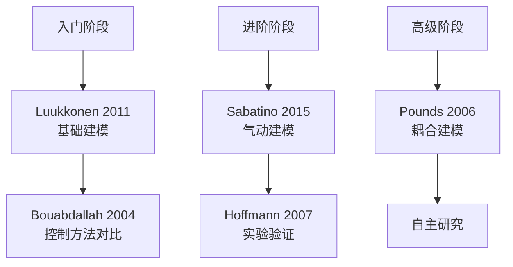

# 动力学建模经典论文导读

> 预计阅读：18 分钟 | 前置知识：线性代数、经典力学基础、飞行力学基本概念

---

## 1. 导读说明

本章精选了四旋翼 UAV 动力学建模领域的 **5 篇经典论文**，这些论文构成了该领域的理论基石。每篇论文以 **论文卡片** 格式呈现，便于快速了解核心内容。

### 论文选择标准

| 标准 | 说明 |
|------|------|
| 引用次数 | 高被引论文（Google Scholar > 100 次） |
| 影响力 | 被后续研究广泛引用和扩展 |
| 可读性 | 适合入门学习 |
| 实践价值 | 理论结果可直接用于 Simulink 实现 |

---

## 2. 论文一：Modelling and Control of Quadcopter

### 论文卡片

| 属性 | 内容 |
|------|------|
| **标题** | Modelling and Control of Quadcopter |
| **作者** | Teppo Luukkonen |
| **年份** | 2011 |
| **机构** | Aalto University, Finland |
| **类型** | 学期项目报告 |
| **引用次数** | 2000+ (Google Scholar) |
| **推荐等级** | ★★★ 必读 |

> 📄 DOI: [待补充]

### 核心贡献

1. **完整的 Newton-Euler 建模推导**：从第一性原理出发，逐步推导四旋翼六自由度方程
2. **两种姿态表示方法**：欧拉角和旋转矩阵的完整推导
3. **线性化方法**：在悬停点进行小扰动线性化，得到可用于控制器设计的状态空间模型
4. **PID 控制器设计**：基于线性化模型设计 PID 控制器

### 关键方程

**Newton 方程（惯性系）：**

$$m\ddot{\mathbf{x}} = \begin{bmatrix} 0 \\ 0 \\ -mg \end{bmatrix} + \mathbf{R} \begin{bmatrix} 0 \\ 0 \\ \sum_{i=1}^{4} F_i \end{bmatrix}$$

**Euler 方程（机体系）：**

$$\mathbf{J}\dot{\boldsymbol{\omega}} = \boldsymbol{\tau} - \boldsymbol{\omega} \times (\mathbf{J}\boldsymbol{\omega})$$

**线性化状态空间模型（悬停点）：**

$$\dot{\mathbf{x}} = \mathbf{A}\mathbf{x} + \mathbf{B}\mathbf{u}$$

其中状态向量 $\mathbf{x} = [x, y, z, \phi, \theta, \psi, \dot{x}, \dot{y}, \dot{z}, p, q, r]^T$

### Simulink 实现要点

| 论文内容 | Simulink 实现 |
|---------|--------------|
| Newton-Euler 方程 | MATLAB Function Block |
| 旋转矩阵 | 自定义函数库 |
| 线性化 | `linmod` 命令或 Linear Analysis Tool |
| PID 控制 | PID Controller Block |

---

## 3. 论文二：Quadrotor Dynamics — KTH Master Thesis

### 论文卡片

| 属性 | 内容 |
|------|------|
| **标题** | Quadrotor Dynamics |
| **作者** | Francesco Sabatino |
| **年份** | 2015 |
| **机构** | KTH Royal Institute of Technology, Sweden |
| **类型** | 硕士论文 |
| **引用次数** | 300+ |
| **推荐等级** | ★★★ 必读 |

> 📄 DOI: [待补充]

### 核心贡献

1. **详细的螺旋桨气动模型**：包含叶素理论和动量理论的结合
2. **地面效应建模**：悬停时地面对气动力的影响
3. **实验验证**：通过实际飞行数据验证模型精度
4. **参数辨识方法**：从飞行数据中辨识模型参数

### 关键方程

**螺旋桨推力模型：**

$$F_i = C_T \rho n_i^2 D^4$$

**螺旋桨力矩模型：**

$$Q_i = C_Q \rho n_i^2 D^5$$

**地面效应修正：**

$$F_{IGE} = F_{OGE} \cdot \frac{1}{1 - (R/4h)^2}$$

其中：
| 符号 | 含义 |
|------|------|
| $C_T$ | 推力系数 |
| $C_Q$ | 力矩系数 |
| $\rho$ | 空气密度 |
| $n_i$ | 转速 (rev/s) |
| $D$ | 螺旋桨直径 |
| $R$ | 螺旋桨半径 |
| $h$ | 离地高度 |

### Simulink 实现要点

| 论文内容 | Simulink 实现 |
|---------|--------------|
| 螺旋桨推力 | Look-up Table 或 MATLAB Function |
| 地面效应 | 条件判断 + 修正系数 |
| 参数辨识 | System Identification Toolbox |
| 实验数据导入 | From Workspace Block |

---

## 4. 论文三：Modelling and Control of a Large Quadrotor Robot

### 论文卡片

| 属性 | 内容 |
|------|------|
| **标题** | Modelling and Control of a Large Quadrotor Robot |
| **作者** | Pounds, P.; Mahony, R.; Corke, P. |
| **年份** | 2006 |
| **机构** | Australian National University |
| **会议** | IEEE International Conference on Robotics and Automation (ICRA) |
| **引用次数** | 500+ |
| **推荐等级** | ★★☆ 推荐阅读 |

> 📄 DOI: [待补充]

### 核心贡献

1. **大型四旋翼建模**：针对载荷能力更强的大型四旋翼平台
2. **耦合效应分析**：详细分析了旋翼间的气动耦合
3. **LQR 控制器设计**：基于线性二次调节器的控制方案
4. **实验平台搭建**：完整的硬件平台设计文档

### 关键方程

**耦合动力学模型：**

$$\begin{bmatrix} \dot{\mathbf{v}} \\ \dot{\boldsymbol{\omega}} \end{bmatrix} = \begin{bmatrix} \frac{1}{m}\mathbf{R}\mathbf{f} + \mathbf{g} \\ \mathbf{J}^{-1}(\boldsymbol{\tau} - \boldsymbol{\omega} \times \mathbf{J}\boldsymbol{\omega}) \end{bmatrix}$$

**LQR 代价函数：**

$$J = \int_0^{\infty} (\mathbf{x}^T \mathbf{Q} \mathbf{x} + \mathbf{u}^T \mathbf{R} \mathbf{u}) dt$$

### Simulink 实现要点

| 论文内容 | Simulink 实现 |
|---------|--------------|
| 耦合动力学 | 完整非线性模型 |
| LQR 控制 | `lqr()` 函数 + State-Space Block |
| 权重矩阵选择 | 参数扫描脚本 |

---

## 5. 论文四：Quadrotor Helicopter Flight Dynamics and Control

### 论文卡片

| 属性 | 内容 |
|------|------|
| **标题** | Quadrotor Helicopter Flight Dynamics and Control |
| **作者** | Hoffmann, G.; Huang, H.; Waslander, S.; Tomlin, C. |
| **年份** | 2007 |
| **机构** | Stanford University / Princeton University |
| **会议** | AIAA Guidance, Navigation and Control Conference |
| **引用次数** | 800+ |
| **推荐等级** | ★★☆ 推荐阅读 |

> 📄 DOI: [待补充]

### 核心贡献

1. **精确气动参数测量**：通过风洞实验获得螺旋桨气动数据
2. **涡环状态分析**：分析了四旋翼在下降飞行中的涡环状态
3. **气动干扰建模**：旋翼间的气动干扰效应
4. **飞行包线分析**：确定了安全飞行的边界条件

### 关键方程

**考虑旋翼干扰的推力模型：**

$$F_i = f(\omega_i, V_{\infty}, \alpha_i)$$

其中 $V_{\infty}$ 是来流速度，$\alpha_i$ 是第 $i$ 个旋翼的局部迎角。

**涡环状态判据：**

$$\frac{v_i}{V_{ind}} < -0.5 \quad \text{且} \quad \frac{|V_{\infty}|}{V_{ind}} < 1.0$$

### Simulink 实现要点

| 论文内容 | Simulink 实现 |
|---------|--------------|
| 风洞数据 | Look-up Table (2D) |
| 涡环状态 | Stateflow 状态机 |
| 飞行包线 | 饱和限制模块 |

---

## 6. 论文五：PID vs LQ Control Techniques Applied to an Indoor Micro Quadrotor

### 论文卡片

| 属性 | 内容 |
|------|------|
| **标题** | PID vs LQ Control Techniques Applied to an Indoor Micro Quadrotor |
| **作者** | Bouabdallah, S.; Noth, A.; Siegwart, R. |
| **年份** | 2004 |
| **机构** | ETH Zurich, Autonomous Systems Lab |
| **会议** | IEEE/RSJ International Conference on Intelligent Robots and Systems (IROS) |
| **引用次数** | 1000+ |
| **推荐等级** | ★★★ 必读 |

> 📄 DOI: [待补充]

### 核心贡献

1. **经典对比研究**：首次系统对比 PID 和 LQR 在四旋翼控制中的表现
2. **实验验证**：在实际微型四旋翼上验证两种方法
3. **性能指标定义**：定义了用于控制器比较的量化指标
4. **实现细节**：提供了完整的控制器实现细节

### 关键方程

**PID 控制器：**

$$u(t) = K_p e(t) + K_i \int_0^t e(\tau) d\tau + K_d \dot{e}(t)$$

**LQR 控制器：**

$$\mathbf{K} = \mathbf{R}^{-1} \mathbf{B}^T \mathbf{P}$$

其中 $\mathbf{P}$ 满足代数 Riccati 方程：

$$\mathbf{A}^T \mathbf{P} + \mathbf{P} \mathbf{A} - \mathbf{P} \mathbf{B} \mathbf{R}^{-1} \mathbf{B}^T \mathbf{P} + \mathbf{Q} = 0$$

### PID vs LQR 对比

| 对比维度 | PID | LQR |
|---------|-----|-----|
| 设计方法 | 经验调参 | 最优控制理论 |
| 模型依赖 | 不依赖精确模型 | 需要精确线性模型 |
| 鲁棒性 | 对模型不确定性鲁棒 | 对模型精度敏感 |
| 多变量处理 | 需要解耦设计 | 天然处理多变量 |
| 实现复杂度 | 低 | 中 |
| 性能优化 | 局部最优 | 全局最优（在代价函数意义下） |
| 工程实践 | 广泛使用 | 学术研究较多 |

### Simulink 实现要点

| 论文内容 | Simulink 实现 |
|---------|--------------|
| PID 控制 | PID Controller Block |
| LQR 控制 | `lqr()` + State-Space Block |
| 性能对比 | 多仿真运行 + MATLAB 绘图 |
| 参数调优 | Control System Designer App |

---

## 7. 补充经典论文

### 论文六：Minimum Snap Trajectory Generation and Control

#### 论文卡片

| 属性 | 内容 |
|------|------|
| **标题** | Minimum Snap Trajectory Generation and Control for Quadrotors |
| **作者** | Mellinger, D.; Kumar, V. |
| **年份** | 2011 |
| **机构** | University of Pennsylvania |
| **会议** | IEEE International Conference on Robotics and Automation (ICRA) |
| **引用次数** | 3000+ (Google Scholar) |
| **推荐等级** | ★★★ 必读 |

> 📄 DOI: [Minimum Snap Trajectory Generation and Control for Quadrotors](https://doi.org/10.1109/ICRA.2011.5980409)

#### 核心贡献

1. **最小 Snap 轨迹生成**：通过最小化位置的四阶导数（snap）生成平滑轨迹
2. **多项式轨迹参数化**：使用分段多项式表示轨迹，保证连续性
3. **凸优化求解**：将轨迹优化转化为二次规划（QP）问题，高效求解
4. **实验验证**：在四旋翼上实现精确的高速轨迹跟踪

#### 关键方程

**最小 Snap 代价函数：**

$$J = \int_0^T \left\| \frac{d^4 \mathbf{p}}{dt^4} \right\|^2 dt$$

其中 $\mathbf{p}$ 是位置向量，$T$ 是轨迹总时间。

**分段多项式轨迹（每段）：**

$$\mathbf{p}_i(t) = \sum_{k=0}^{N} \mathbf{a}_{i,k} \, t^k, \quad t \in [t_i, t_{i+1}]$$

**QP 优化形式：**

$$\min_{\mathbf{a}} \; \mathbf{a}^T \mathbf{H} \mathbf{a} \quad \text{s.t.} \quad \mathbf{A}_{eq} \mathbf{a} = \mathbf{b}_{eq}$$

其中 $\mathbf{H}$ 是由 snap 导数构成的 Hessian 矩阵，$\mathbf{A}_{eq} \mathbf{a} = \mathbf{b}_{eq}$ 包含起点/终点边界条件和各段连续性约束（位置、速度、加速度、jerk 连续）。

---

### 论文七：Geometric Tracking Control on SE(3)

#### 论文卡片

| 属性 | 内容 |
|------|------|
| **标题** | Geometric Tracking Control of a Quadrotor UAV on SE(3) |
| **作者** | Lee, T.; Leok, M.; McClamroch, N. H. |
| **年份** | 2010 |
| **机构** | University of Michigan |
| **期刊** | IEEE Transactions on Automatic Control |
| **引用次数** | 2500+ (Google Scholar) |
| **推荐等级** | ★★★ 必读 |

> 📄 DOI: [Geometric Tracking Control of a Quadrotor UAV on SE(3)](https://doi.org/10.1109/TAC.2010.2057951)

#### 核心贡献

1. **SE(3) 上的几何控制**：直接在李群 SE(3) 上设计控制器，避免欧拉角奇异值
2. **全局稳定性证明**：提供几乎全局渐近稳定性证明（排除测度零的姿态翻转情况）
3. **无奇异姿态表示**：使用旋转矩阵而非欧拉角，避免万向锁问题
4. **实验验证**：在实际四旋翼平台上验证控制性能

#### 关键方程

**姿态跟踪误差：**

$$e_R = \frac{1}{2} \left( R_d^T R - R^T R_d \right)^\vee$$

**角速度跟踪误差：**

$$e_\Omega = \Omega - R^T R_d \, \Omega_d$$

其中 $R$ 是实际姿态（旋转矩阵），$R_d$ 是期望姿态，$\Omega$ 是实际角速度，$\Omega_d$ 是期望角速度，$(\cdot)^\vee$ 是从 $\mathfrak{so}(3)$ 到 $\mathbb{R}^3$ 的映射。

**控制力矩：**

$$M = -k_R \, e_R - k_\Omega \, e_\Omega + \Omega \times J\Omega - J\!\left(\hat{\Omega} R^T R_d \Omega_d - R^T R_d \dot{\Omega}_d\right)$$

其中 $k_R, k_\Omega > 0$ 是对称正定增益矩阵，$J$ 是转动惯量矩阵。

**控制推力：**

$$f = -k_x \, e_x - k_v \, e_v + m g \mathbf{e}_3 + m \ddot{\mathbf{x}}_d$$

其中 $e_x = \mathbf{x} - \mathbf{x}_d$，$e_v = \dot{\mathbf{x}} - \dot{\mathbf{x}}_d$。

---

## 8. 论文阅读路线图

### 推荐阅读顺序

| 阶段 | 论文 | 时间 | 重点 |
|------|------|------|------|
| 第 1 周 | Luukkonen 2011 | 3~4 小时 | 理解建模方法 |
| 第 2 周 | Bouabdallah 2004 | 3~4 小时 | 理解控制方法 |
| 第 3 周 | Sabatino 2015 | 4~5 小时 | 理解气动模型 |
| 第 4 周 | Hoffmann 2007 | 3~4 小时 | 理解实验方法 |
| 第 5 周 | Pounds 2006 | 3~4 小时 | 理解耦合效应 |

---

## 思考题

**1. Luukkonen 的论文为什么能获得 2000+ 的高引用？它对后续研究有什么奠基性意义？**

参考答案

Luukkonen 论文高引用的原因：
1. **完整性**：从第一性原理出发，提供了完整的建模推导过程
2. **可读性**：语言清晰，适合入门学习
3. **实用性**：直接提供了可用于实现的方程
4. **时机**：2011 年正值四旋翼研究兴起，满足了大量研究者的学习需求

奠基性意义：
- 建立了四旋翼建模的标准框架
- 提供了线性化方法，为后续控制研究奠定基础
- 成为后续论文的必引参考文献

**2. Bouabdallah 的 PID vs LQR 对比研究对工程实践有什么指导意义？在什么情况下应该选择哪种方法？**

参考答案

**选择 PID 的场景**：
- 模型参数不确定或难以精确获取
- 需要快速部署和调试
- 计算资源有限（嵌入式系统）
- 工程团队经验以 PID 为主

**选择 LQR 的场景**：
- 模型参数已精确辨识
- 需要最优性能指标
- 多变量耦合严重
- 学术研究需要理论保证

**实际工程建议**：
- 先用 PID 快速验证基本功能
- 在模型参数辨识完成后，尝试 LQR 提升性能
- 可以将 LQR 作为内环、PID 作为外环的混合方案

**3. Hoffmann 论文中提到的涡环状态对四旋翼安全飞行有什么影响？如何在仿真中模拟这种状态？**

参考答案

**涡环状态的影响**：
1. 推力大幅下降（可能超过 50%）
2. 推力剧烈波动，导致姿态不稳
3. 控制器难以维持稳定
4. 可能导致坠机

**Simulink 仿真中的模拟方法**：
1. 使用 Look-up Table 根据下降速度和风速查表
2. 在涡环状态下增加推力噪声
3. 使用 Stateflow 检测涡环状态并触发保护逻辑
4. 参考 Hoffmann 的风洞数据建立气动模型

**工程规避策略**：
- 限制下降速度（< 0.5 m/s）
- 避免在无风环境下垂直下降
- 在控制器中添加涡环检测和保护

**4. 比较 Luukkonen 和 Sabatino 两篇论文中的螺旋桨气动建模方法。各自的精度和计算复杂度如何？**

参考答案

**Luukkonen 方法**：
- 使用简单的线性推力模型：$F = k_t \omega^2$
- 精度：低（忽略气动细节）
- 计算复杂度：极低（一次乘法）
- 适用场景：控制算法开发、快速仿真

**Sabatino 方法**：
- 使用叶素理论 + 动量理论的组合
- 精度：中~高（考虑桨叶几何和气动特性）
- 计算复杂度：中（需要积分计算）
- 适用场景：气动分析、性能评估

**选择建议**：
- 控制器开发初期 → Luukkonen 简化模型
- 性能验证阶段 → Sabatino 详细模型
- 实时仿真 → Luukkonen
- 离线分析 → Sabatino

