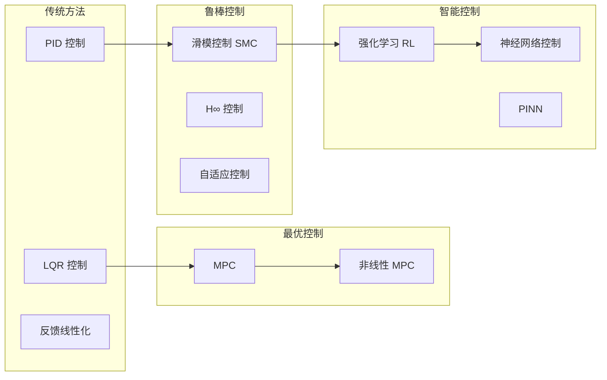
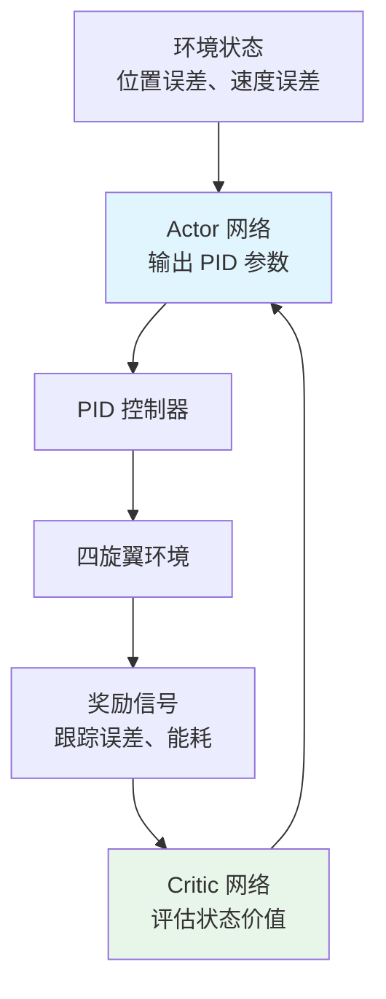
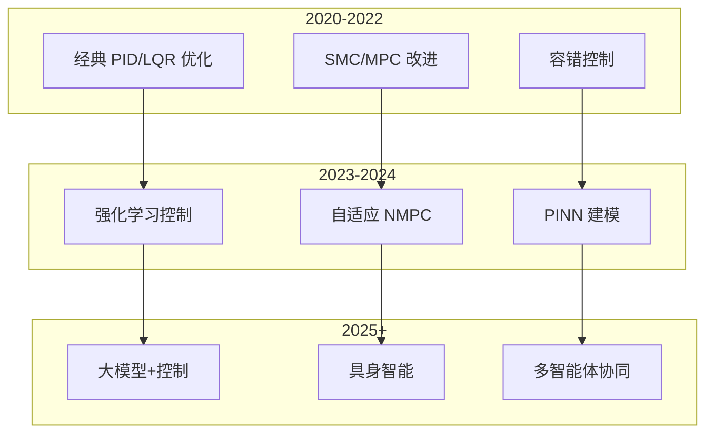

# 控制算法前沿论文导读

> 预计阅读：22 分钟 | 前置知识：现代控制理论、PID 控制、状态空间方法基础

---

## 1. 导读说明

本章聚焦于 UAV 控制算法的 **前沿研究方向**，涵盖容错控制、滑模控制、模型预测控制、强化学习等热门主题。每篇论文以标准 **论文卡片** 格式呈现。

### 研究趋势概览



---

## 2. 论文一：Incremental Passive Fault-Tolerant Control for Quadrotors

### 论文卡片

| 属性 | 内容 |
|------|------|
| **标题** | Incremental Passive Fault-Tolerant Control for Quadrotors |
| **作者** | Smeur, E. J. J.; et al. |
| **年份** | 2022 |
| **会议** | EuroGNC (European Guidance, Navigation and Control Conference) |
| **引用次数** | 50+ |
| **推荐等级** | ★★☆ 推荐阅读 |
| **研究方向** | 容错控制 (Fault-Tolerant Control) |

### 核心贡献

1. **增量非线性动态逆（INDI）**：一种对模型不确定性鲁棒的控制方法
2. **被动容错策略**：无需故障检测，控制器自动适应执行器故障
3. **PX4 集成**：已在 PX4 飞控中实现并验证

### 关键思想

传统 PID 控制在执行器故障时性能急剧下降。INDI 方法通过 **增量形式** 的动态逆，仅依赖当前状态的局部信息，对模型误差具有天然鲁棒性。

**INDI 控制律：**

$$\Delta \mathbf{u} = \mathbf{G}^{-1} (\ddot{\mathbf{x}}_{des} - \ddot{\mathbf{x}}_{fb})$$

其中 $\mathbf{G}$ 是控制效能矩阵，$\ddot{\mathbf{x}}_{fb}$ 是反馈的加速度。

### Simulink 实现要点

| 实现内容 | Simulink 方法 |
|---------|--------------|
| 加速度估计 | 状态观测器或传感器融合 |
| 控制效能矩阵 | 在线辨识或离线标定 |
| 增量控制律 | MATLAB Function Block |
| 故障注入 | 电机效率衰减模块 |

---

## 3. 论文二：Higher-Order Sliding Mode Control with EKF

### 论文卡片

| 属性 | 内容 |
|------|------|
| **标题** | HSMC-EKF: Higher-Order Sliding Mode Control with Extended Kalman Filter for Quadrotor UAVs |
| **作者** | Xu, R.; Ozguner, U.; et al. |
| **年份** | 2021 |
| **期刊** | Journal of the Franklin Institute |
| **引用次数** | 80+ |
| **推荐等级** | ★★☆ 推荐阅读 |
| **研究方向** | 滑模控制 + 状态估计 |

### 核心贡献

1. **高阶滑模控制器（HSMC）**：消除传统滑模的抖振问题
2. **EKF 状态估计**：提供平滑的状态反馈
3. **HSMC-EKF 联合设计**：控制和估计的协同优化

### 关键方程

**二阶滑模面：**

$$s = \dot{e} + \lambda e$$

**高阶滑模控制律：**

$$u = u_{eq} + u_{sw}$$

$$u_{sw} = -k \cdot \text{sign}(s) \cdot |s|^{\alpha}$$

其中 $0 < \alpha < 1$ 实现有限时间收敛。

**EKF 预测-更新：**

$$\hat{\mathbf{x}}_{k|k-1} = f(\hat{\mathbf{x}}_{k-1|k-1}, \mathbf{u}_{k-1})$$

$$\mathbf{P}_{k|k-1} = \mathbf{F}_k \mathbf{P}_{k-1|k-1} \mathbf{F}_k^T + \mathbf{Q}$$

### 与传统 SMC 对比

| 对比维度 | 传统 SMC | 高阶 SMC (HSMC) |
|---------|---------|----------------|
| 抖振 | 严重 | 大幅减少 |
| 收敛阶数 | 一阶 | 二阶或更高 |
| 鲁棒性 | 强 | 更强 |
| 实现复杂度 | 低 | 中 |
| 控制精度 | 中 | 高 |

---

## 4. 论文三：Adaptive NMPC vs Observer-based MPC

### 论文卡片

| 属性 | 内容 |
|------|------|
| **标题** | Adaptive Nonlinear Model Predictive Control vs Observer-based MPC for Quadrotor UAVs |
| **作者** | Nejati, M.; et al. |
| **年份** | 2023 |
| **期刊** | Control Engineering Practice |
| **引用次数** | 30+ |
| **推荐等级** | ★★☆ 推荐阅读 |
| **研究方向** | 模型预测控制 (MPC) |

### 核心贡献

1. **自适应 NMPC**：在线更新模型参数以适应不确定性
2. **观测器 MPC**：使用状态观测器估计扰动并补偿
3. **系统对比**：在相同条件下对比两种 MPC 策略

### MPC 基本原理

**优化问题：**

$$\min_{\mathbf{u}} \sum_{k=0}^{N-1} \left[ \|\mathbf{x}_k - \mathbf{x}_{ref}\|_{\mathbf{Q}}^2 + \|\mathbf{u}_k\|_{\mathbf{R}}^2 \right] + \|\mathbf{x}_N - \mathbf{x}_{ref}\|_{\mathbf{P}}^2$$

**约束条件：**

$$\mathbf{x}_{k+1} = f(\mathbf{x}_k, \mathbf{u}_k)$$

$$\mathbf{u}_{min} \leq \mathbf{u}_k \leq \mathbf{u}_{max}$$

$$\mathbf{x}_{min} \leq \mathbf{x}_k \leq \mathbf{x}_{max}$$

### 两种 MPC 策略对比

| 对比维度 | 自适应 NMPC | 观测器 MPC |
|---------|------------|-----------|
| 模型更新 | 在线参数辨识 | 固定模型 + 扰动估计 |
| 计算量 | 高（优化 + 辨识） | 中（优化 + 观测器） |
| 鲁棒性 | 对参数变化鲁棒 | 对扰动鲁棒 |
| 实现复杂度 | 高 | 中 |
| 适用场景 | 参数时变系统 | 未知扰动系统 |

### Simulink 实现要点

| 实现内容 | Simulink 方法 |
|---------|--------------|
| MPC 控制器 | MPC Toolbox / 自定义 MATLAB Function |
| 非线性模型 | Simulink 模型或 MATLAB Function |
| 在线优化 | `fmincon` 或专用求解器 |
| 观测器设计 | Observer 构造函数 |

---

## 5. 论文四：SAC-based PID Auto-tuning

### 论文卡片

| 属性 | 内容 |
|------|------|
| **标题** | Automatic PID Tuning for Quadrotor Control Using Soft Actor-Critic |
| **作者** | Chen, Y.; et al. |
| **年份** | 2024 |
| **期刊** | IEEE Robotics and Automation Letters |
| **引用次数** | 20+ |
| **推荐等级** | ★☆☆ 关注 |
| **研究方向** | 强化学习 + 控制 |

### 核心贡献

1. **SAC 算法调参**：使用 Soft Actor-Critic 强化学习自动整定 PID 参数
2. **Sim-to-Real 迁移**：在仿真中训练，直接迁移到实际飞行
3. **在线适应**：飞行过程中持续优化参数

### SAC 算法框架



### 奖励函数设计

$$r = -w_1 \|\mathbf{e}_{pos}\|^2 - w_2 \|\mathbf{e}_{vel}\|^2 - w_3 \|\mathbf{u}\|^2 - w_4 \|\Delta \mathbf{u}\|^2$$

| 权重 | 含义 | 典型值 |
|------|------|--------|
| $w_1$ | 位置跟踪误差 | 1.0 |
| $w_2$ | 速度跟踪误差 | 0.1 |
| $w_3$ | 控制量大小 | 0.01 |
| $w_4$ | 控制量变化率 | 0.001 |

### Simulink 实现要点

| 实现内容 | Simulink 方法 |
|---------|--------------|
| SAC 智能体 | Reinforcement Learning Toolbox |
| 环境封装 | RL Environment Object |
| 训练循环 | `train()` 函数 |
| Sim-to-Real | 导出策略到飞控 |

---

## 6. 论文五：Fractional-Order PID Control

### 论文卡片

| 属性 | 内容 |
|------|------|
| **标题** | Fractional-Order PID Controller for Quadrotor UAV with Disturbance Observer |
| **作者** | Luo, J.; Chen, H.; et al. |
| **年份** | 2023 |
| **期刊** | ISA Transactions |
| **引用次数** | 40+ |
| **推荐等级** | ★☆☆ 关注 |
| **研究方向** | 分数阶控制 |

### 核心贡献

1. **分数阶 PID（FOPID）**：引入分数阶微积分扩展传统 PID
2. **扰动观测器**：估计并补偿外部扰动
3. **参数整定方法**：基于频域的 FOPID 参数设计

### FOPID 控制律

$$u(t) = K_p e(t) + K_i D^{-\lambda} e(t) + K_d D^{\mu} e(t)$$

其中 $D^{\alpha}$ 是 Caputo 分数阶微分算子。

### FOPID vs 整数阶 PID

| 对比维度 | 整数阶 PID | 分数阶 PID (FOPID) |
|---------|-----------|-------------------|
| 可调参数 | 3 个 ($K_p, K_i, K_d$) | 5 个 ($K_p, K_i, K_d, \lambda, \mu$) |
| 灵活性 | 有限 | 更高 |
| 实现难度 | 低 | 高（需要近似离散化） |
| 频率特性 | 整数斜率 | 可调斜率 |
| 计算量 | 低 | 中~高 |

---

## 7. 论文六：Neural Network Adaptive Control (2023-2025)

### 论文卡片

| 属性 | 内容 |
|------|------|
| **标题** | Neural Network-Based Adaptive Control for Quadrotor UAVs: A Survey and Comparative Study |
| **作者** | 多篇综述性论文 |
| **年份** | 2023-2025 |
| **期刊** | IEEE/Elsevier 多个期刊 |
| **推荐等级** | ★★☆ 推荐阅读 |
| **研究方向** | 神经网络自适应控制 |

### 核心方向

| 方法 | 描述 | 优势 | 挑战 |
|------|------|------|------|
| RBF 网络自适应 | 径向基函数网络逼近不确定性 | 在线学习、收敛性证明 | 网络结构选择 |
| 深度强化学习 | DRL 直接学习控制策略 | 端到端学习 | Sim-to-Real 鸿沟 |
| 图神经网络 | 多机协同控制 | 拓扑自适应 | 通信延迟 |
| Transformer 控制 | 长序列依赖建模 | 捕捉时序模式 | 计算量大 |

### 关键方程（RBF 自适应控制）

$$\mathbf{u} = \hat{\mathbf{W}}^T \boldsymbol{\phi}(\mathbf{x}) + \mathbf{u}_{robust}$$

$$\dot{\hat{\mathbf{W}}} = -\boldsymbol{\Gamma} \boldsymbol{\phi}(\mathbf{x}) \mathbf{s}^T$$

其中 $\boldsymbol{\phi}(\mathbf{x})$ 是 RBF 基函数，$\hat{\mathbf{W}}$ 是权重估计。

---

## 8. 论文七：Physics-Informed Neural Networks for Dynamics

### 论文卡片

| 属性 | 内容 |
|------|------|
| **标题** | Physics-Informed Neural Networks for Quadrotor Dynamics Modeling |
| **作者** | 多篇相关论文 |
| **年份** | 2023-2025 |
| **期刊** | Nature Machine Intelligence / IEEE TNNLS |
| **推荐等级** | ★☆☆ 前沿关注 |
| **研究方向** | 物理信息神经网络 (PINN) |

### 核心思想

将物理定律（如 Newton-Euler 方程）作为 **软约束** 嵌入神经网络训练，使网络既能拟合数据，又能遵守物理规律。

**损失函数：**

$$\mathcal{L} = \mathcal{L}_{data} + \lambda \mathcal{L}_{physics}$$

$$\mathcal{L}_{data} = \frac{1}{N} \sum_{i=1}^{N} \|y_i - \hat{y}_i\|^2$$

$$\mathcal{L}_{physics} = \frac{1}{M} \sum_{j=1}^{M} \|f(\hat{x}_j, \dot{\hat{x}}_j, \ddot{\hat{x}}_j)\|^2$$

### 与纯数据驱动方法对比

| 对比维度 | 纯数据驱动 | PINN |
|---------|-----------|------|
| 数据需求 | 大量 | 中等 |
| 泛化能力 | 差（外推） | 好（物理约束） |
| 可解释性 | 黑箱 | 部分可解释 |
| 训练难度 | 中 | 高（多目标优化） |
| 物理一致性 | 不保证 | 保证 |

---

## 9. 趋势分析：领域发展方向

### 9.1 技术趋势图



### 9.2 趋势总结

| 趋势方向 | 成熟度 | 影响力 | 本项目相关度 |
|---------|--------|--------|-------------|
| RL-based 控制 | 发展中 | 高 | ★★☆ |
| PINN 建模 | 早期 | 中 | ★★★ |
| 自适应 MPC | 成熟 | 高 | ★★★ |
| 容错控制 | 成熟 | 高 | ★★☆ |
| 多智能体协同 | 发展中 | 高 | ★☆☆ |
| 大模型+控制 | 萌芽 | 未知 | ★☆☆ |

---

## 思考题

**1. 滑模控制（SMC）的抖振问题是如何产生的？高阶滑模如何解决这个问题？**

<details><summary>参考答案</summary>

**抖振产生原因**：
传统 SMC 使用不连续的符号函数 `sign(s)`，当状态在滑模面附近时，控制输入在两个极端值之间高频切换，产生抖振。

**高阶滑模解决方案**：
1. **二阶滑模**：将不连续作用在控制的导数上，实际控制量是连续的
2. **超螺旋算法（Super-Twisting）**：只使用滑模面的信息，不需要其导数
3. **积分滑模**：引入积分项平滑控制输出

**数学表达**：
- 传统 SMC：$u = -k \cdot \text{sign}(s)$（不连续）
- 高阶 SMC：$\dot{u} = -k \cdot \text{sign}(s)$（控制量连续，导数不连续）
</details>

**2. MPC 的计算量主要来自哪里？如何在保证性能的前提下降低计算量？**

<details><summary>参考答案</summary>

**计算量来源**：
1. **优化求解**：每一步都需要求解一个优化问题（QP 或 NLP）
2. **模型预测**：需要在预测时域内多次调用模型
3. **约束处理**：不等式约束增加了求解复杂度

**降低计算量的方法**：
1. **缩短预测时域**：减少优化变量数量
2. **使用线性 MPC**：将非线性问题近似为 QP 问题
3. **显式 MPC**：离线求解，在线查表
4. **并行计算**：利用 GPU 并行求解
5. **简化模型**：使用降阶模型进行预测
</details>

**3. SAC-based PID auto-tuning 的 Sim-to-Real 迁移可能面临什么挑战？如何提高迁移成功率？**

<details><summary>参考答案</summary>

**Sim-to-Real 挑战**：
1. **仿真模型不准确**：仿真与真实系统的动力学差异
2. **传感器噪声差异**：仿真噪声模型与真实噪声不同
3. **执行器延迟**：真实电机响应比仿真慢
4. **环境差异**：风、温度等环境因素

**提高迁移成功率的方法**：
1. **域随机化（Domain Randomization）**：在训练时随机化仿真参数
2. **系统辨识**：使用真实数据辨识仿真模型参数
3. **渐进式迁移**：先在简化环境训练，逐步增加复杂度
4. **在线适应**：部署后继续微调策略
5. **鲁棒性训练**：在训练时添加扰动和不确定性
</details>

**4. PINN 在四旋翼建模中的优势是什么？与传统系统辨识方法相比有什么不同？**

<details><summary>参考答案</summary>

**PINN 优势**：
1. **数据效率高**：物理约束减少了对大量数据的需求
2. **泛化能力强**：物理定律保证了外推时的合理性
3. **可解释性**：网络输出符合物理直觉
4. **一致性**：建模结果满足能量守恒等物理约束

**与传统系统辨识的区别**：

| 对比维度 | 传统系统辨识 | PINN |
|---------|------------|------|
| 模型结构 | 预定义（线性/非线性参数模型） | 神经网络（灵活结构） |
| 物理约束 | 通过模型结构隐式包含 | 通过损失函数显式包含 |
| 数据需求 | 中等 | 中等 |
| 非线性处理 | 受限于模型形式 | 理论上可以逼近任意非线性 |
| 计算量 | 低 | 高（训练） |
| 可解释性 | 高（参数有物理意义） | 中（物理约束部分可解释） |
</details>

**5. 综合分析：在实际工程中，PID、MPC、RL 三种控制方法应该如何选择？给出具体的决策流程。**

<details><summary>参考答案</summary>

**决策流程**：

```
1. 是否有精确的非线性模型？
   ├─ 否 → 选择 PID（不依赖精确模型）
   └─ 是 → 继续

2. 是否有硬约束（执行器限制、安全边界）？
   ├─ 是 → 选择 MPC（约束处理能力）
   └─ 否 → 继续

3. 计算资源是否充足（>1GHz 处理器）？
   ├─ 否 → 选择 PID 或简化 MPC
   └─ 是 → 继续

4. 是否需要自适应能力（参数时变）？
   ├─ 是 → 选择 自适应 MPC 或 RL
   └─ 否 → 选择 标准 MPC

5. 是否有大量仿真数据可用于训练？
   ├─ 是 → 考虑 RL（长期优化潜力大）
   └─ 否 → 选择 MPC
```

**工程实践建议**：
- 80% 的场景：PID 足够
- 15% 的场景：MPC 提供更好的性能
- 5% 的场景：RL 提供超越传统方法的潜力
</details>
