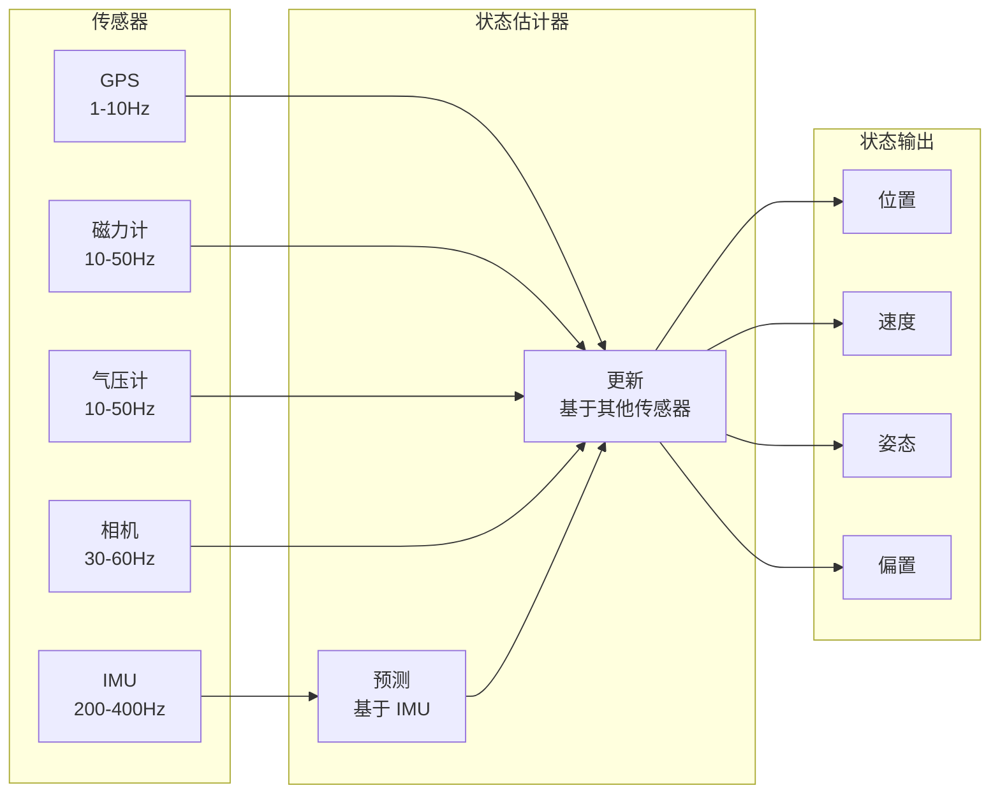
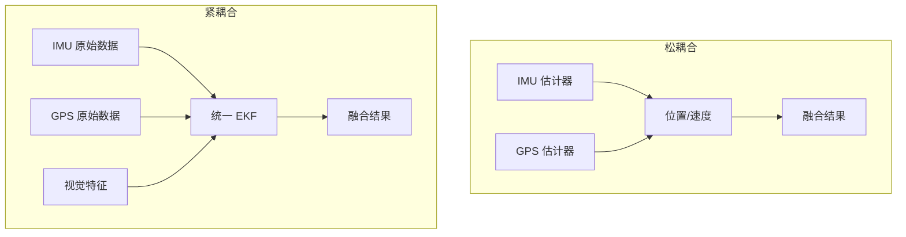
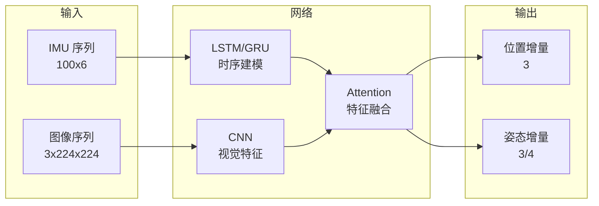
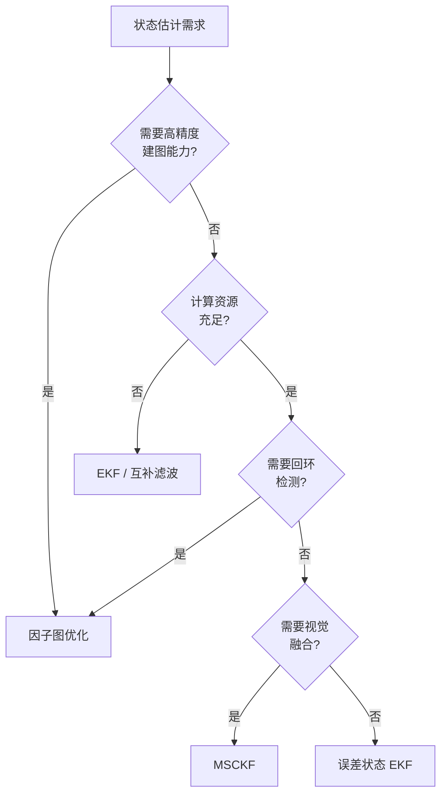

# 状态估计前沿论文导读

> 预计阅读：18 分钟 | 前置知识：概率论基础、卡尔曼滤波原理、传感器特性

---

## 1. 导读说明

状态估计是 UAV 自主飞行的核心技术之一。本章精选了 **5 篇** 覆盖不同估计方法的前沿论文，从经典 EKF 到深度学习方法，呈现该领域的发展脉络。

### 状态估计问题定义

| 要素 | 说明 |
|------|------|
| **状态向量** | 位置、速度、姿态、角速率、传感器偏置 |
| **观测量** | IMU（加速度、角速率）、GPS（位置、速度）、磁力计（磁场方向）、气压计（高度） |
| **核心挑战** | 非线性动力学、传感器噪声、多速率采样、计算资源限制 |



---

## 2. 论文一：EKF for Quadrotor State Estimation

### 论文卡片

| 属性 | 内容 |
|------|------|
| **标题** | Extended Kalman Filter for Quadrotor State Estimation |
| **作者** | 经典参考文献，多位作者有相关工作 |
| **代表论文** | Chong Shen, et al. "A Comparative Study of EKF-based Estimators for Quadrotor UAVs" |
| **年份** | 2011-2015 |
| **期刊** | Journal of Intelligent & Robotic Systems |
| **引用次数** | 500+（相关论文合计） |
| **推荐等级** | ★★★ 必读 |
| **研究方向** | 扩展卡尔曼滤波 (EKF) |

> 📄 DOI: [待补充]

### 核心贡献

1. **误差状态 EKF**：使用误差状态（而非全状态）进行滤波，减少线性化误差
2. **多传感器融合**：统一处理 IMU、GPS、磁力计、气压计
3. **偏置估计**：在线估计传感器偏置
4. **实现细节**：提供了完整的实现指南

### EKF 算法流程

```mermaid
graph TD
    A[IMU 数据到达] --> B[预测步骤]
    B --> C[状态传播<br/>x̂ = f(x, u)]
    C --> D[协方差传播<br/>P = FPF' + Q]
    D --> E{其他传感器<br/>数据到达?}
    E -->|否| A
    E -->|是| F[计算卡尔曼增益<br/>K = PH' / (HPH' + R)]
    F --> G[状态更新<br/>x̂ = x̂ + K(z - h(x̂))]
    G --> H[协方差更新<br/>P = (I - KH)P]
    H --> A
```

### EKF 核心方程

**预测步骤（Prediction）：**

$$\hat{\mathbf{x}}_{k|k-1} = f(\hat{\mathbf{x}}_{k-1|k-1}, \, \mathbf{u}_{k-1})$$

$$\mathbf{P}_{k|k-1} = \mathbf{F}_k \, \mathbf{P}_{k-1|k-1} \, \mathbf{F}_k^T + \mathbf{Q}_k$$

其中 $\mathbf{F}_k = \frac{\partial f}{\partial \mathbf{x}}\bigg|_{\hat{\mathbf{x}}_{k-1|k-1}}$ 是状态转移函数的雅可比矩阵，$\mathbf{Q}_k$ 是过程噪声协方差。

**更新步骤（Update）：**

$$\mathbf{K}_k = \mathbf{P}_{k|k-1} \, \mathbf{H}_k^T \left( \mathbf{H}_k \, \mathbf{P}_{k|k-1} \, \mathbf{H}_k^T + \mathbf{R}_k \right)^{-1}$$

$$\hat{\mathbf{x}}_{k|k} = \hat{\mathbf{x}}_{k|k-1} + \mathbf{K}_k \left( \mathbf{z}_k - h(\hat{\mathbf{x}}_{k|k-1}) \right)$$

$$\mathbf{P}_{k|k} = \left( \mathbf{I} - \mathbf{K}_k \, \mathbf{H}_k \right) \mathbf{P}_{k|k-1}$$

其中 $\mathbf{H}_k = \frac{\partial h}{\partial \mathbf{x}}\bigg|_{\hat{\mathbf{x}}_{k|k-1}}$ 是观测函数的雅可比矩阵，$\mathbf{R}_k$ 是观测噪声协方差，$\mathbf{K}_k$ 是卡尔曼增益。

### 误差状态 EKF 状态向量

$$\delta \mathbf{x} = [\delta \mathbf{p}, \delta \mathbf{v}, \delta \boldsymbol{\theta}, \mathbf{b}_a, \mathbf{b}_g]^T$$

| 状态分量 | 维度 | 含义 | 估计目的 |
|---------|------|------|---------|
| $\delta \mathbf{p}$ | 3 | 位置误差 | 位置校正 |
| $\delta \mathbf{v}$ | 3 | 速度误差 | 速度校正 |
| $\delta \boldsymbol{\theta}$ | 3 | 姿态误差（旋转向量） | 姿态校正 |
| $\mathbf{b}_a$ | 3 | 加速度计偏置 | 消除常值偏置 |
| $\mathbf{b}_g$ | 3 | 陀螺仪偏置 | 消除常值偏置 |

### Simulink 实现要点

| 实现内容 | Simulink 方法 |
|---------|--------------|
| 状态传播 | MATLAB Function Block |
| 协方差传播 | Matrix Multiply Block |
| 卡尔曼增益 | MATLAB Function（矩阵求逆） |
| 多速率处理 | Rate Transition Block |
| 数据缓冲 | Delay Block + 触发逻辑 |

---

## 3. 论文二：MSCKF for Visual-Inertial Navigation

### 论文卡片

| 属性 | 内容 |
|------|------|
| **标题** | Multi-State Constraint Kalman Filter for Visual-Inertial Navigation |
| **作者** | Mourikis, A. I.; Roumeliotis, S. I. |
| **年份** | 2007（原始），2021（ICCAS 应用） |
| **会议** | ICCAS 2021（应用版本） |
| **引用次数** | 1500+（原始论文） |
| **推荐等级** | ★★☆ 推荐阅读 |
| **研究方向** | 视觉惯性导航 (VINS) |

> 📄 DOI: [A Multi-State Constraint Kalman Filter for Vision-Aided Inertial Navigation](https://doi.org/10.1109/TRO.2007.903806)

### 核心贡献

1. **MSCKF 算法**：一种高效的视觉惯性融合方法
2. **多状态约束**：利用多个相机位姿的几何约束
3. **计算效率**：比滤波-优化方法快一个数量级
4. **实时性能**：适合嵌入式平台部署

### MSCKF 原理

**传统 EKF-VINS 的问题**：
- 特征点作为状态量，状态维度随特征数量增长
- 计算复杂度随特征数量平方增长

**MSCKF 的解决方案**：
- 不将特征点作为状态量
- 利用特征观测构建多状态约束
- 状态量仅包含多个相机位姿 + IMU 偏置

**状态向量：**

$$\mathbf{x} = [\mathbf{x}_{IMU}, \mathbf{x}_{cam_1}, \mathbf{x}_{cam_2}, ..., \mathbf{x}_{cam_N}]^T$$

其中每个相机状态包含位置和姿态。

### 计算复杂度对比

| 方法 | 状态维度 | 时间复杂度 | 适用场景 |
|------|---------|-----------|---------|
| 标准 EKF | $15 + 3N_f$ | $O(N_f^2)$ | 少量特征 |
| MSCKF | $15 + 6N_c$ | $O(N_c \cdot N_f)$ | 大量特征 |
| 优化方法 | 可变 | $O(N_f \cdot N_c)$ | 离线/准实时 |

其中 $N_f$ 是特征数量，$N_c$ 是相机帧数。

---

## 4. 论文三：Multi-Sensor Fusion Approaches

### 论文卡片

| 属性 | 内容 |
|------|------|
| **标题** | Multi-Sensor Fusion for Robust UAV State Estimation: A Comparative Study |
| **作者** | 多篇综述性论文 |
| **年份** | 2020-2024 |
| **期刊** | Sensors / Remote Sensing |
| **引用次数** | 200+（相关论文合计） |
| **推荐等级** | ★★☆ 推荐阅读 |
| **研究方向** | 多传感器融合 |

> 📄 DOI: [待补充]

### 融合架构

| 架构 | 描述 | 优点 | 缺点 |
|------|------|------|------|
| 松耦合 | 各传感器独立估计后融合 | 简单、模块化 | 信息损失 |
| 紧耦合 | 原始测量直接融合 | 精度高 | 复杂度高 |
| 深耦合 | 算法层面深度交互 | 最优性能 | 实现困难 |

### 融合策略对比



### 传感器特性对比

| 传感器 | 更新率 | 精度 | 漂移 | 室内/室外 |
|--------|--------|------|------|----------|
| IMU | 200-1000 Hz | 低（有偏置） | 有 | 室内外 |
| GPS | 1-10 Hz | 中~高 | 无 | 仅室外 |
| 磁力计 | 10-100 Hz | 低 | 无 | 室内外 |
| 气压计 | 10-50 Hz | 中 | 有 | 室内外 |
| 光流相机 | 30-120 Hz | 中 | 无 | 室内外 |
| 深度相机 | 30-60 Hz | 高（近距离） | 无 | 仅室内 |
| LiDAR | 10-100 Hz | 高 | 无 | 室内外 |

---

## 5. 论文四：Deep Learning for State Estimation

### 论文卡片

| 属性 | 内容 |
|------|------|
| **标题** | Deep Learning Approaches for UAV State Estimation |
| **代表论文** | "VINet: Visual-Inertial Odometry as a Sequence-to-Sequence Learning Problem" (2017) |
| **年份** | 2017-2025 |
| **期刊** | IEEE TRO / ICRA / IROS |
| **引用次数** | 1000+（VINet 单篇） |
| **推荐等级** | ★☆☆ 前沿关注 |
| **研究方向** | 深度学习状态估计 |

> 📄 DOI: [VINet: Visual-Inertial Odometry as a Sequence-to-Sequence Learning Problem](https://doi.org/10.1609/aaai.v31i1.10946)

### 深度学习方法分类

| 方法 | 描述 | 优势 | 挑战 |
|------|------|------|------|
| 端到端学习 | 直接从传感器到状态 | 无需手工特征 | 泛化能力差 |
| 混合方法 | DL + 传统滤波器 | 兼顾两者优点 | 设计复杂 |
| 学习增强 | 用 DL 改进传统方法 | 保持可解释性 | 需要大量数据 |
| 自监督学习 | 利用几何约束 | 减少标注需求 | 训练不稳定 |

### 典型网络架构



### 与传统方法对比

| 对比维度 | 传统滤波器 | 深度学习 |
|---------|-----------|---------|
| 训练数据 | 不需要 | 大量 |
| 实时性 | 好 | 中~好 |
| 泛化能力 | 中 | 差（域依赖） |
| 可解释性 | 高 | 低 |
| 精度 | 中~高 | 高（在分布内） |
| 鲁棒性 | 中 | 差（对抗样本） |
| 部署平台 | 任意 | 需要 GPU/NPU |

---

## 6. 论文五：Factor Graph Optimization for UAV State Estimation

### 论文卡片

| 属性 | 内容 |
|------|------|
| **标题** | Factor Graph Optimization for UAV State Estimation: A Tutorial |
| **代表论文** | "iSAM2: Incremental Smoothing and Mapping Using the Bayes Tree" (2012) |
| **年份** | 2012-2024 |
| **期刊** | IJRR / IEEE TRO |
| **引用次数** | 2000+（iSAM2 单篇） |
| **推荐等级** | ★★☆ 推荐阅读 |
| **研究方向** | 图优化 (Factor Graph) |

> 📄 DOI: [iSAM2: Incremental Smoothing and Mapping Using the Bayes Tree](https://doi.org/10.1177/0278364912446031)

### 核心概念

**因子图（Factor Graph）** 是一种概率图模型，将状态估计问题转化为 **非线性最小二乘优化** 问题。

**因子图结构：**

$$\min_{\mathbf{x}} \sum_{i} \|\mathbf{r}_i(\mathbf{x})\|_{\Sigma_i}^2$$

其中 $\mathbf{r}_i$ 是第 $i$ 个因子的残差，$\Sigma_i$ 是对应的协方差矩阵。

### 因子类型

| 因子类型 | 连接变量 | 残差含义 |
|---------|---------|---------|
| IMU 预积分因子 | $\mathbf{x}_k, \mathbf{x}_{k+1}$ | IMU 测量与状态一致性 |
| GPS 因子 | $\mathbf{x}_k$ | GPS 位置与状态一致性 |
| 视觉重投影因子 | $\mathbf{x}_k, \mathbf{l}_j$ | 特征点投影误差 |
| 磁力计因子 | $\mathbf{x}_k$ | 航向角约束 |
| 气压计因子 | $\mathbf{x}_k$ | 高度约束 |
| 回环因子 | $\mathbf{x}_i, \mathbf{x}_j$ | 回环检测约束 |

### 滤波 vs 优化

| 对比维度 | EKF（滤波） | 因子图（优化） |
|---------|------------|--------------|
| 时域 | 仅当前时刻 | 多时刻联合 |
| 线性化 | 每步线性化 | 迭代重线性化 |
| 计算量 | 固定 | 随时间增长 |
| 精度 | 中 | 高 |
| 回环检测 | 不支持 | 原生支持 |
| 适用场景 | 实时控制 | 高精度建图 |

### Simulink 实现要点

| 实现内容 | Simulink 方法 |
|---------|--------------|
| 因子图构建 | MATLAB Function + GTSAM |
| IMU 预积分 | 自定义 MATLAB 函数 |
| 非线性优化 | GTSAM 库调用 |
| 实时性保证 | 关键帧选择策略 |

---

## 7. 状态估计方法选择指南

### 方法选择决策树



### 方法对比总表

| 方法 | 精度 | 计算量 | 实现复杂度 | 适用场景 |
|------|------|--------|-----------|---------|
| 互补滤波 | ★☆☆ | ★☆☆ | ★☆☆ | 低端飞控、姿态估计 |
| Madgwick | ★★☆ | ★☆☆ | ★☆☆ | 实时姿态估计 |
| EKF | ★★☆ | ★★☆ | ★★☆ | 通用状态估计 |
| MSCKF | ★★★ | ★★☆ | ★★★ | 视觉惯性融合 |
| 因子图 | ★★★ | ★★★ | ★★★ | 高精度建图 |
| 深度学习 | ★★★ | ★★★ | ★★★ | 特定场景（有数据） |

---

## 思考题

**1. 为什么误差状态 EKF 比全状态 EKF 更适合四旋翼姿态估计？请从线性化误差角度分析。**

<details><summary>参考答案</summary>

**误差状态 EKF 的优势**：

1. **线性化误差更小**：
   - 全状态 EKF 对旋转矩阵进行线性化，当姿态变化大时线性化误差大
   - 误差状态 EKF 对小量误差进行线性化，线性化误差天然更小

2. **状态空间更友好**：
   - 姿态误差使用 3 维旋转向量（而非 4 维四元数或 9 维旋转矩阵）
   - 避免了四元数归一化问题

3. **数值稳定性**：
   - 误差量级小，数值精度更高
   - 协方差矩阵条件数更好

**具体例子**：
- 全状态：线性化 $\sin(\theta)$ 在 $\theta = 45°$ 时误差约 10%
- 误差状态：线性化 $\sin(\delta\theta)$ 在 $\delta\theta = 1°$ 时误差约 0.005%
</details>

**2. MSCKF 相比标准 EKF-VINS 的计算优势是如何实现的？代价是什么？**

<details><summary>参考答案</summary>

**计算优势的实现**：
1. **不估计特征点**：标准 EKF-VINS 将特征点作为状态，MSCKF 不这样做
2. **多状态约束**：利用特征点在多个相机帧中的观测构建约束
3. **零空间投影**：通过投影消除特征点相关的信息，只保留对位姿的约束

**代价**：
1. **信息损失**：零空间投影可能丢失部分信息
2. **短期记忆**：只能利用最近 N 帧的信息（滑动窗口）
3. **无法建图**：不维护特征点地图
4. **特征管理复杂**：需要跟踪特征的生命周期

**量化对比**（100 个特征，10 帧窗口）：
- 标准 EKF：状态维度 315，复杂度 O(315²) ≈ 100K
- MSCKF：状态维度 75，复杂度 O(75 × 100) ≈ 7.5K
</details>

**3. 深度学习状态估计方法的泛化能力差主要体现在哪些方面？如何改善？**

<details><summary>参考答案</summary>

**泛化能力差的体现**：
1. **环境变化**：训练在室内，部署到室外性能下降
2. **光照变化**：强光/弱光/逆光条件
3. **运动模式**：训练用匀速，部署时快速机动
4. **传感器退化**：训练时理想数据，部署时有遮挡/模糊

**改善方法**：
1. **数据增强**：旋转、缩放、光照变换、噪声添加
2. **域适应（Domain Adaptation）**：对齐训练和部署域的分布
3. **自监督学习**：利用几何约束减少对标注的依赖
4. **混合方法**：DL 特征提取 + 传统滤波器
5. **持续学习**：部署后持续更新网络
</details>

**4. 因子图优化中的 IMU 预积分是什么？为什么需要预积分？**

<details><summary>参考答案</summary>

**IMU 预积分（Preintegration）的定义**：
将两帧之间的 IMU 测量积分成一个相对运动增量，避免在优化时重复积分。

**为什么需要预积分**：
1. **计算效率**：优化时每次迭代都会改变状态估计，如果每次都重新积分 IMU 数据，计算量巨大
2. **预积分增量**与初始状态解耦：$\Delta \mathbf{R}, \Delta \mathbf{v}, \Delta \mathbf{p}$ 只依赖 IMU 测量，不依赖初始状态
3. **便于构建因子**：预积分增量可以直接作为因子图中的边

**数学表达**：
$$\Delta \mathbf{R}_{ij} = \prod_{k=i}^{j-1} \text{Exp}((\boldsymbol{\omega}_k - \mathbf{b}_g) \Delta t)$$
$$\Delta \mathbf{v}_{ij} = \sum_{k=i}^{j-1} \Delta \mathbf{R}_{ik} (\mathbf{a}_k - \mathbf{b}_a) \Delta t$$
$$\Delta \mathbf{p}_{ij} = \sum_{k=i}^{j-1} \left[ \Delta \mathbf{v}_{ik} \Delta t + \frac{1}{2} \Delta \mathbf{R}_{ik} (\mathbf{a}_k - \mathbf{b}_a) \Delta t^2 \right]$$
</details>

**5. 在 Simulink 中实现多传感器融合时，如何处理不同传感器的更新率差异？**

<details><summary>参考答案</summary>

**传感器更新率差异**：
- IMU：200-1000 Hz（最快）
- GPS：1-10 Hz（最慢）
- 磁力计/气压计：10-50 Hz（中等）

**处理方法**：

1. **Rate Transition Block**：
   - Simulink 内置模块，处理不同采样率子系统间的数据传递
   - 自动处理数据对齐和缓冲

2. **触发子系统（Triggered Subsystem）**：
   - 每当慢传感器数据到达时触发一次更新
   - 使用边沿触发（rising/falling edge）

3. **状态机设计**：
   - IMU 数据到达：执行预测步骤
   - GPS 数据到达：执行 GPS 更新步骤
   - 磁力计数据到达：执行磁力计更新步骤

4. **数据缓冲**：
   - 使用 Delay Block 缓存最近的传感器数据
   - 使用 Memory Block 存储状态

**实现建议**：
- 将 IMU 预测放在最快的采样率
- 各传感器更新放在各自的采样率
- 使用 Simulink 的多速率仿真功能
</details>
