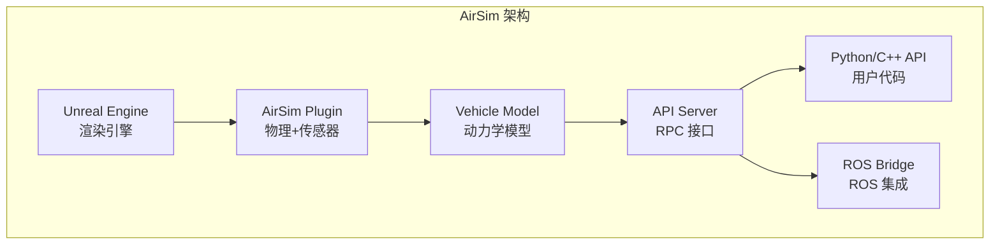
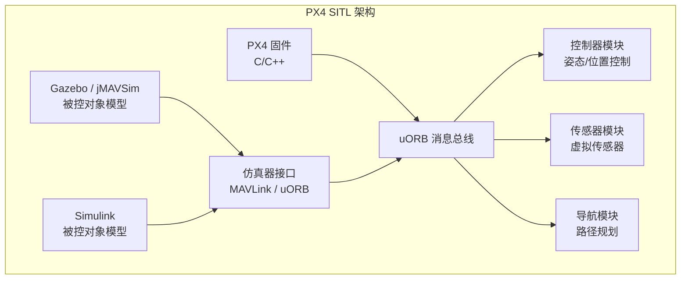
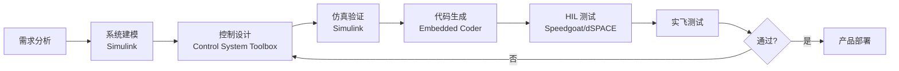
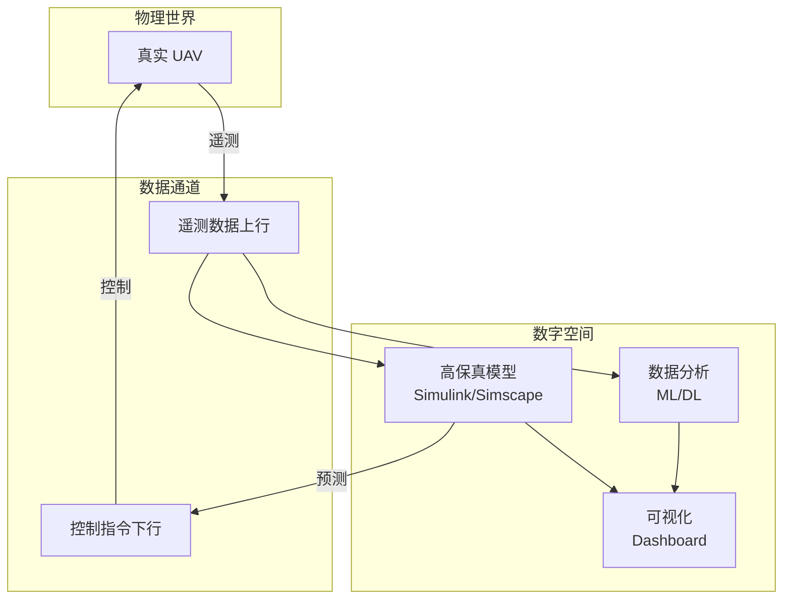
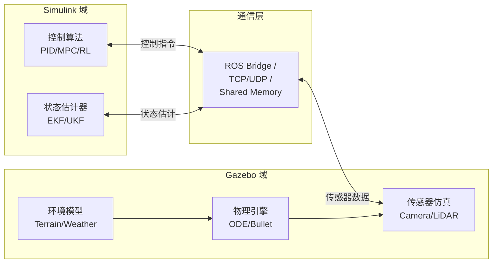
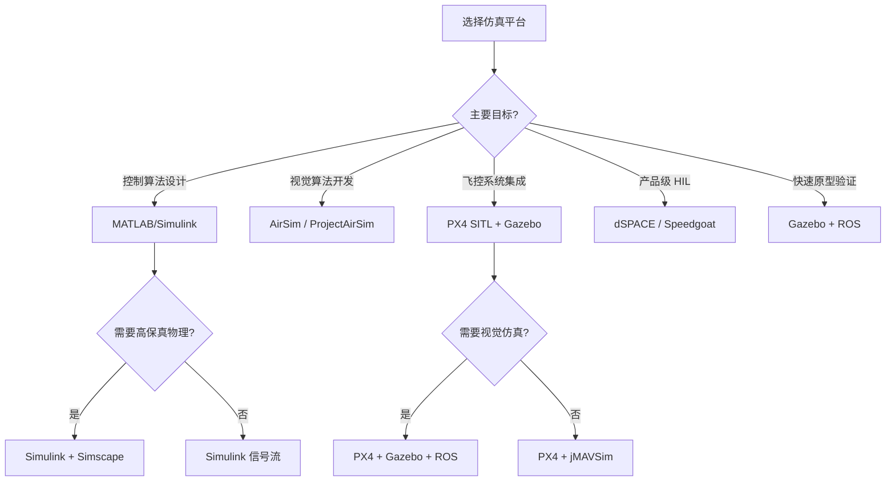

# 仿真平台与工具论文导读

> 预计阅读：18 分钟 | 前置知识：仿真基础概念、UAV 系统架构、软件工程基础

---

## 1. 导读说明

仿真平台是 UAV 研发的重要基础设施。本章精选了 **5 篇** 关于 UAV 仿真平台和工具的代表性论文/项目，涵盖商业平台、开源框架和新兴技术方向。

### 仿真平台分类

| 类别 | 代表平台 | 特点 |
|------|---------|------|
| 物理引擎仿真 | Gazebo, AirSim | 高保真物理、传感器仿真 |
| 数学仿真 | MATLAB/Simulink | 控制算法开发、系统建模 |
| 半实物仿真 | dSPACE, Speedgoat | HIL 测试、实时验证 |
| 数字孪生 | 自定义平台 | 虚实映射、预测维护 |
| 联合仿真 | Simulink+Gazebo | 多平台协同 |

---

## 2. 论文一：AirSim / ProjectAirSim

### 论文卡片

| 属性 | 内容 |
|------|------|
| **标题** | AirSim: High-Fidelity Visual and Physical Simulation for Autonomous Vehicles |
| **作者** | Shah, S.; et al. (Microsoft Research) |
| **年份** | 2018（原始），2022（ProjectAirSim） |
| **会议** | Field and Service Robotics (FSR) |
| **引用次数** | 1500+ |
| **推荐等级** | ★★★ 必读 |
| **平台状态** | AirSim 已停止维护，ProjectAirSim 为商业替代 |

### 核心贡献

1. **高保真视觉仿真**：基于 Unreal Engine 的照片级渲染
2. **物理引擎集成**：支持多种物理引擎（PhysX、FastPhysics）
3. **传感器仿真**：相机、LiDAR、IMU、GPS、磁力计
4. **跨平台 API**：Python、C++、ROS 接口
5. **开源社区**：广泛的研究应用基础

### AirSim 架构



### 传感器仿真能力

| 传感器 | 仿真特性 | 精度等级 |
|--------|---------|---------|
| 单目相机 | 分辨率可配、畸变模型、曝光模拟 | ★★★ |
| 双目相机 | 基线可配、同步触发 | ★★★ |
| 深度相机 | 精确深度图、噪声模型 | ★★★ |
| LiDAR | 多线激光、点云生成 | ★★☆ |
| IMU | 噪声+偏置+温度漂移 | ★★☆ |
| GPS | 位置噪声、多径效应 | ★★☆ |
| 磁力计 | 硬铁/软铁干扰 | ★★☆ |
| 气压计 | 高度噪声、温度补偿 | ★★☆ |

### 与 Simulink 的集成方式

| 集成方式 | 描述 | 适用场景 |
|---------|------|---------|
| API 调用 | MATLAB 通过 REST API 调用 AirSim | 算法验证 |
| ROS Bridge | Simulink ↔ ROS ↔ AirSim | 完整系统仿真 |
| 联合仿真 | Simulink 控制 + AirSim 被控对象 | 高保真仿真 |
| 数据回放 | AirSim 采集数据 → MATLAB 分析 | 离线分析 |

### ProjectAirSim 演变

| 对比维度 | AirSim (开源) | ProjectAirSim (商业) |
|---------|--------------|---------------------|
| 维护状态 | 已停止 (2022) | 活跃 |
| 渲染引擎 | Unreal Engine 4 | Unreal Engine 5 |
| 物理精度 | 中 | 高 |
| 支持平台 | 有限 | 更多飞行器类型 |
| 技术支持 | 社区 | Microsoft 官方 |
| 费用 | 免费 | 商业授权 |

---

## 3. 论文二：PX4 SITL Architecture

### 论文卡片

| 属性 | 内容 |
|------|------|
| **标题** | PX4 Autopilot: An Open-Source Framework for Robotics |
| **作者** | Meier, L.; et al. (ETH Zurich / PX4 Community) |
| **年份** | 2015-2024 |
| **引用次数** | 2000+（相关论文合计） |
| **推荐等级** | ★★★ 必读 |
| **平台状态** | 持续活跃开发 |

### PX4 SITL 架构



### SITL 工作模式

| 模式 | 被控对象 | 启动命令 | 适用场景 |
|------|---------|---------|---------|
| Gazebo | Gazebo 物理引擎 | `make px4_sitl gazebo` | 多传感器仿真 |
| jMAVSim | Java 多旋翼模型 | `make px4_sitl jmavsim` | 快速测试 |
| AirSim | AirSim 物理引擎 | `make px4_sitl airsim` | 高保真视觉 |
| Simulink | Simulink 模型 | 自定义配置 | 控制算法研究 |
| 实机 | 真实飞行器 | `make px4_fmu-v5` | 实飞测试 |

### MAVLink 通信协议

| 消息类型 | 方向 | 频率 | 内容 |
|---------|------|------|------|
| `HIL_ACTUATOR_CONTROLS` | PX4 → Sim | 400 Hz | 电机 PWM 指令 |
| `HIL_SENSOR` | Sim → PX4 | 200 Hz | IMU 数据 |
| `HIL_GPS` | Sim → PX4 | 10 Hz | GPS 数据 |
| `HIL_STATE_QUATERNION` | Sim → PX4 | 50 Hz | 真实状态（调试用） |
| `ATTITUDE_TARGET` | PX4 → GCS | 50 Hz | 期望姿态 |

---

## 4. 论文三：MATLAB/Simulink for UAV Design

### 论文卡片

| 属性 | 内容 |
|------|------|
| **标题** | Model-Based Design of UAV Systems Using MATLAB and Simulink |
| **作者** | MathWorks 应用工程团队 |
| **年份** | 2018-2024 |
| **来源** | MathWorks 白皮书、技术文档 |
| **引用次数** | 500+（相关文档合计） |
| **推荐等级** | ★★☆ 推荐阅读 |
| **平台状态** | 持续更新 |

### MATLAB/Simulink UAV 设计工作流



### 关键工具箱

| 工具箱 | 功能 | UAV 应用 |
|--------|------|---------|
| Aerospace Blockset | 飞行动力学模块 | 六自由度模型 |
| Aerospace Toolbox | 大气、坐标变换 | 环境模型 |
| Simulink 3D Animation | 三维可视化 | 飞行动画 |
| Control System Toolbox | 控制器设计 | PID/LQR/H∞ |
| System Identification Toolbox | 系统辨识 | 模型参数标定 |
| Embedded Coder | 代码生成 | 飞控固件 |
| Simulink Coder | Simulink 代码生成 | 快速原型 |
| ROS Toolbox | ROS 接口 | ROS 集成 |
| UAV Toolbox | UAV 专用工具 | 航点、轨迹 |

### UAV Toolbox 功能

| 功能 | 描述 | 优势 |
|------|------|------|
| 航点规划 | 可视化航点编辑 | 直观易用 |
| 轨迹生成 | 多种轨迹类型 | 丰富选择 |
| 场景构建 | 3D 场景编辑 | 快速搭建 |
| 传感器仿真 | 相机、LiDAR | 开箱即用 |
| 日志分析 | ULG 日志解析 | 与 PX4 兼容 |

---

## 5. 论文四：Digital Twin for UAV

### 论文卡片

| 属性 | 内容 |
|------|------|
| **标题** | Digital Twin Framework for UAV Predictive Maintenance and Performance Optimization |
| **作者** | 多篇相关论文 |
| **年份** | 2021-2024 |
| **期刊** | IEEE Access / Drones Journal |
| **引用次数** | 200+（相关论文合计） |
| **推荐等级** | ★☆☆ 前沿关注 |
| **研究方向** | 数字孪生 (Digital Twin) |

### 数字孪生定义

数字孪生是物理实体的 **虚拟镜像**，通过实时数据同步实现：
- **监控**：实时状态可视化
- **诊断**：异常检测和根因分析
- **预测**：性能退化预测
- **优化**：参数在线优化

### UAV 数字孪生架构



### 数字孪生应用

| 应用场景 | 描述 | 技术要求 |
|---------|------|---------|
| 实时监控 | 飞行状态实时可视化 | 低延迟通信 |
| 故障预测 | 电机/电池退化预测 | 机器学习模型 |
| 性能优化 | 在线参数调优 | 优化算法 |
| 任务预演 | 飞行前仿真验证 | 高保真模型 |
| 事后分析 | 飞行日志深度分析 | 数据分析工具 |

### 数字孪生成熟度等级

| 等级 | 名称 | 描述 | 技术需求 |
|------|------|------|---------|
| Level 0 | 数字镜像 | 仅数据可视化 | 基础通信 |
| Level 1 | 数字模型 | 含物理模型 | Simulink 模型 |
| Level 2 | 数字孪生 | 实时数据同步 | 实时通信+模型 |
| Level 3 | 智能孪生 | 含 AI 预测 | ML 模型 |
| Level 4 | 自主孪生 | 自主决策 | 强化学习 |

---

## 6. 论文五：Co-Simulation Frameworks (Simulink+Gazebo)

### 论文卡片

| 属性 | 内容 |
|------|------|
| **标题** | Co-Simulation Framework for UAV Development: Integrating MATLAB/Simulink with Gazebo |
| **作者** | 多篇相关论文 |
| **年份** | 2019-2024 |
| **期刊** | IEEE Robotics and Automation Magazine |
| **引用次数** | 150+（相关论文合计） |
| **推荐等级** | ★★☆ 推荐阅读 |
| **研究方向** | 联合仿真 (Co-Simulation) |

### 联合仿真架构



### 联合仿真通信方式

| 通信方式 | 延迟 | 带宽 | 复杂度 | 适用场景 |
|---------|------|------|--------|---------|
| ROS Topic | 中 | 高 | 低 | ROS 生态内 |
| MAVLink | 低 | 低 | 中 | PX4 集成 |
| TCP/UDP Socket | 低~中 | 高 | 中 | 自定义协议 |
| Shared Memory | 极低 | 极高 | 高 | 同机高速通信 |
| Simulink ROS Block | 中 | 中 | 低 | Simulink 原生 |

### 同步机制

| 同步方式 | 描述 | 精度 | 适用场景 |
|---------|------|------|---------|
| 时间同步 | 使用统一时钟 | 中 | 松耦合仿真 |
| 步进同步 | 每步等待确认 | 高 | 紧耦合仿真 |
| 事件同步 | 基于事件触发 | 高 | 异步系统 |
| 锁步仿真 | 严格同步步长 | 最高 | HIL 测试 |

### Simulink+Gazebo 集成步骤

| 步骤 | 操作 | 工具 |
|------|------|------|
| 1 | 安装 Gazebo 和 ROS | apt / rosdep |
| 2 | 配置 MATLAB ROS Toolbox | MATLAB Preferences |
| 3 | 建立 ROS 连接 | `rosinit` |
| 4 | 创建 Simulink ROS 模型 | ROS Toolbox Blocks |
| 5 | 定义消息类型 | `rosmsg` |
| 6 | 运行联合仿真 | Simulink + Gazebo |
| 7 | 数据同步分析 | MATLAB 脚本 |

---

## 7. 仿真平台对比总表

| 对比维度 | MATLAB/Simulink | Gazebo | AirSim | PX4 SITL | dSPACE |
|---------|----------------|--------|--------|----------|--------|
| **开发机构** | MathWorks | Open Robotics | Microsoft | PX4 Community | dSPACE GmbH |
| **费用** | 商业 | 开源 | 开源(已停) | 开源 | 商业 |
| **物理精度** | ★★★ | ★★★ | ★★★ | ★★☆ | ★★★ |
| **视觉保真** | ★☆☆ | ★★☆ | ★★★ | ★☆☆ | ★☆☆ |
| **传感器仿真** | ★★☆ | ★★★ | ★★★ | ★★☆ | ★★☆ |
| **控制设计** | ★★★ | ★☆☆ | ★☆☆ | ★☆☆ | ★★★ |
| **代码生成** | ★★★ | ★☆☆ | ★☆☆ | ★★☆ | ★★★ |
| **HIL 支持** | ★★★ | ★☆☆ | ★☆☆ | ★★☆ | ★★★ |
| **ROS 集成** | ★★☆ | ★★★ | ★★☆ | ★★★ | ★★☆ |
| **学习曲线** | 中 | 陡 | 中 | 中 | 陡 |
| **社区活跃度** | 高 | 高 | 低(已停) | 高 | 中 |
| **适用阶段** | 设计/验证 | 集成测试 | 视觉算法 | 飞控开发 | 产品验证 |

### 平台选择决策流程



---

## 思考题

**1. AirSim 已停止开源维护，转向 ProjectAirSim 商业化。这对 UAV 仿真研究社区有什么影响？研究者应该如何应对？**

<details><summary>参考答案</summary>

**影响**：
1. **短期**：现有 AirSim 用户可以继续使用已克隆的代码，但无法获得更新
2. **中期**：新研究项目可能转向 Gazebo 或其他替代方案
3. **长期**：开源社区可能 fork 并维护 AirSim，或发展替代项目

**应对策略**：
1. **多平台策略**：不要依赖单一平台，保持代码的可移植性
2. **关注替代方案**：Gazebo (Ignition)、NVIDIA Isaac Sim、Webots
3. **标准化接口**：使用 ROS 等标准接口，减少平台耦合
4. **社区参与**：参与开源替代项目的开发
5. **商业评估**：评估 ProjectAirSim 的商业授权是否值得投资
</details>

**2. 比较 MATLAB/Simulink 和 Gazebo 在 UAV 仿真中的定位差异。一个完整的 UAV 开发流程应该如何组合使用这两个平台？**

<details><summary>参考答案</summary>

**定位差异**：
- MATLAB/Simulink：**设计阶段**工具，擅长控制算法设计、系统建模、代码生成
- Gazebo：**集成测试阶段**工具，擅长物理仿真、传感器仿真、多系统集成

**组合使用流程**：

```
阶段 1 (概念设计)：MATLAB/Simulink
  - 建立飞行器数学模型
  - 设计控制算法
  - 快速迭代验证

阶段 2 (详细设计)：MATLAB/Simulink + Simscape
  - 高保真物理建模
  - 传感器建模
  - 代码生成

阶段 3 (集成测试)：PX4 SITL + Gazebo
  - 飞控固件集成
  - 多传感器融合测试
  - 环境交互测试

阶段 4 (HIL 验证)：PX4 硬件 + Simulink 被控对象
  - 硬件接口验证
  - 实时性能测试

阶段 5 (实飞测试)：真机
  - 最终验证
```
</details>

**3. 数字孪生技术在 UAV 领域的应用前景如何？从 Level 0 到 Level 4 的进阶需要克服哪些技术挑战？**

<details><summary>参考答案</summary>

**应用前景**：
1. **预测性维护**：通过数字孪生预测电机、电池退化，避免空中故障
2. **任务优化**：在数字孪生中预演任务，优化飞行参数
3. **编队管理**：多机数字孪生协同，实现智能编队
4. **培训模拟**：高保真数字孪生用于飞手培训

**技术挑战**：

| 等级 | 挑战 |
|------|------|
| Level 0→1 | 高保真模型建模、参数标定 |
| Level 1→2 | 实时数据同步、低延迟通信 |
| Level 2→3 | AI 模型训练、数据质量保证 |
| Level 3→4 | 自主决策安全性、可解释性 |

**关键挑战**：
1. **模型保真度 vs 计算效率**：高保真模型计算量大，难以实时运行
2. **数据传输延迟**：5G/卫星通信的延迟可能影响实时性
3. **模型校准**：物理模型与真实系统的偏差需要持续校准
4. **安全认证**：自主决策需要满足航空安全标准
</details>

**4. 在 Simulink+Gazebo 联合仿真中，如何确保两个平台的仿真时间同步？不同步会导致什么问题？**

<details><summary>参考答案</summary>

**时间同步方法**：
1. **ROS Time**：使用 ROS 的时钟服务，Gazebo 发布 `/clock` 话题
2. **锁步仿真（Lockstep）**：Gazebo 等待 Simulink 完成当前步后才进入下一步
3. **外部时钟**：使用 NTP 或 PTP 协议同步两台计算机的系统时钟
4. **消息时间戳**：在每个消息中携带时间戳，Simulink 端进行时间对齐

**不同步导致的问题**：
1. **因果关系错误**：控制指令可能在传感器数据之前到达
2. **振荡发散**：控制器收到延迟的状态信息，可能导致不稳定
3. **性能评估失真**：跟踪误差、响应时间等指标不准确
4. **调试困难**：日志中的时间关系混乱，难以定位问题

**最佳实践**：
- 尽量在同一台计算机上运行两个平台
- 使用锁步仿真确保严格同步
- 在消息中始终携带时间戳
- 记录两个平台的日志用于事后同步分析
</details>
