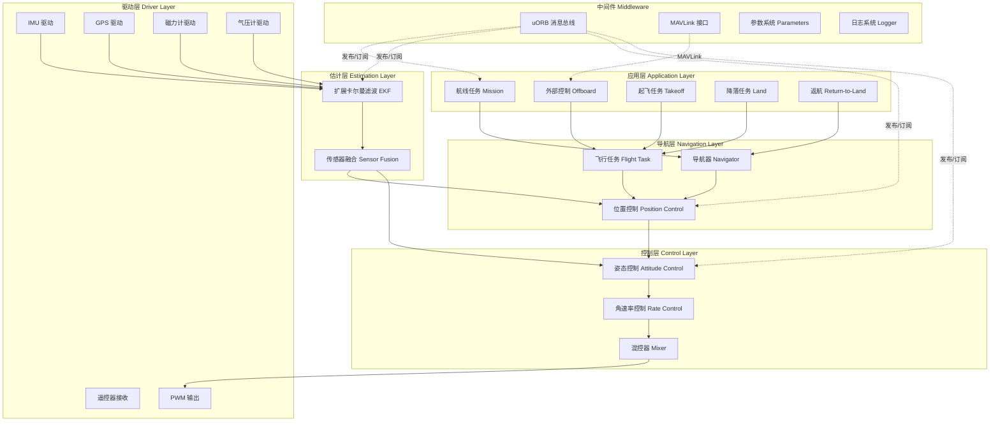
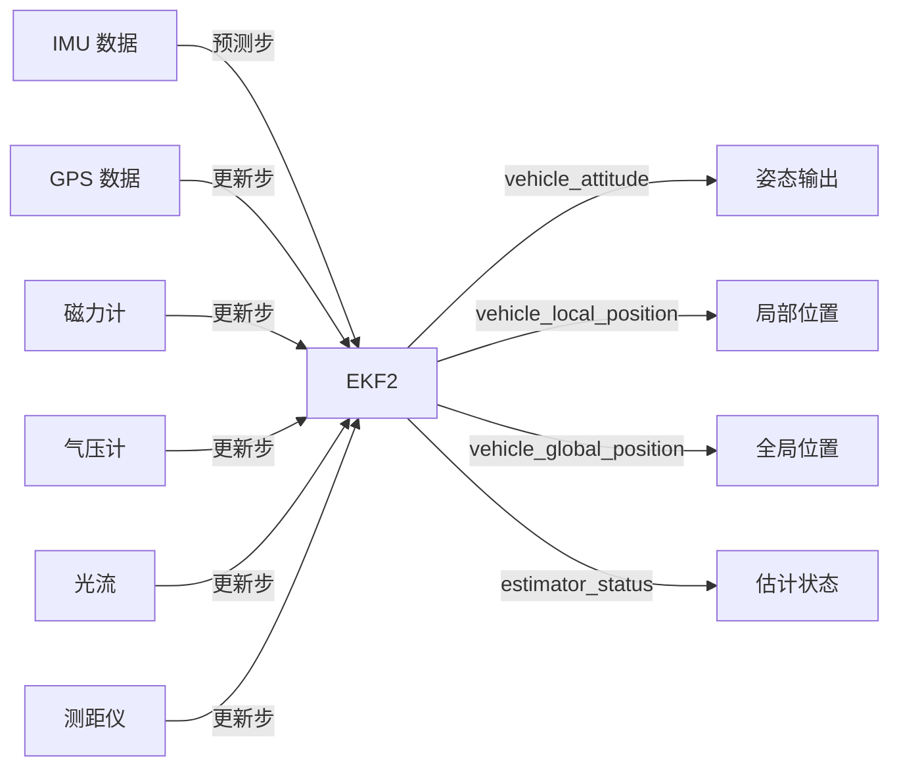
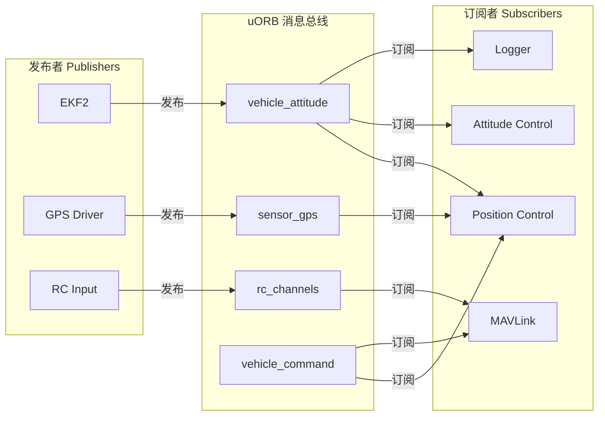
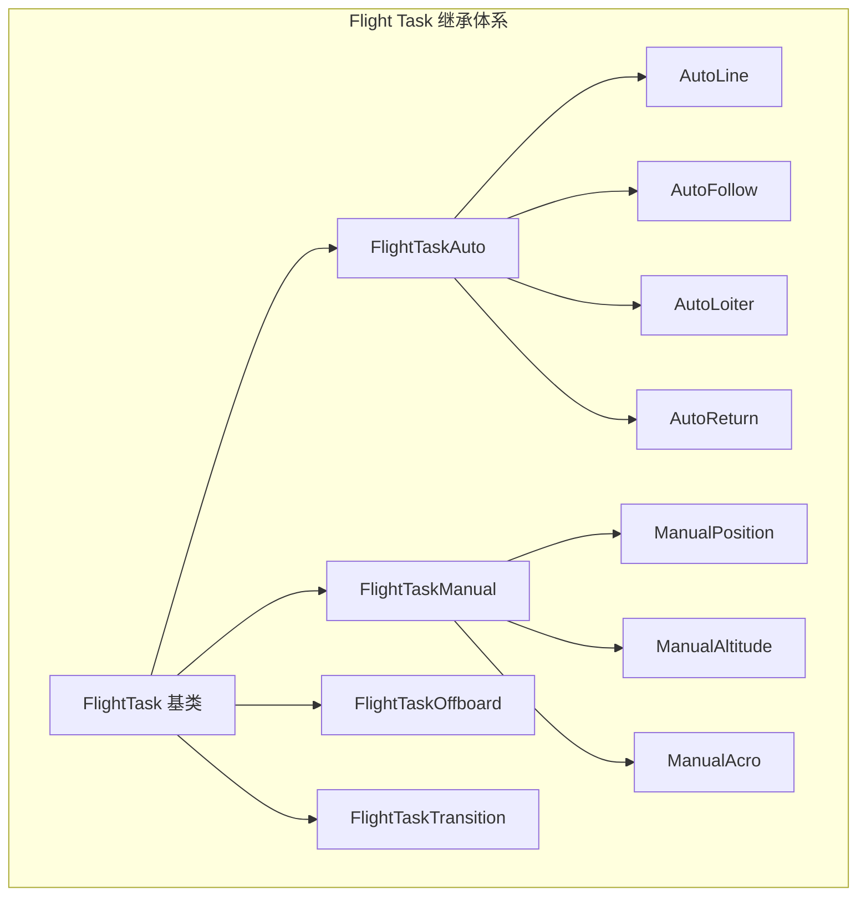

# PX4 架构与模块概览

> 预计阅读：25 分钟 | 前置知识：无人机基本概念、嵌入式系统基础、C/C++ 基本语法

---

## 1. PX4 自驾仪简介

PX4 是一款开源的无人机自驾仪软件，由 Dronecode 基金会维护，广泛应用于多旋翼、固定翼、VTOL（垂直起降）等平台。其设计目标是提供一个**模块化、可扩展、可移植**的飞行控制框架，支持从仿真（SITL）到实飞（real flight）的无缝切换。

PX4 的核心优势：

| 特性 | 说明 |
|------|------|
| 模块化架构 | 各功能模块独立运行，通过消息总线通信 |
| 跨平台支持 | 支持 NuttX、Linux、macOS、Windows |
| 丰富的仿真支持 | SITL、HITL、与 Gazebo、jMAVSim 等集成 |
| 标准化接口 | MAVLink 协议支持，兼容 QGroundControl |
| 活跃的社区 | Dronecode 生态，大量开源参考项目 |

---

## 2. 整体架构总览

PX4 采用**分层架构**，从底层硬件抽象到顶层任务规划，各层职责明确。



---

## 3. 核心模块详解

### 3.1 传感器模块 (Sensors)

传感器模块负责采集原始传感器数据并发布到 uORB 总线。

```
┌─────────────────────────────────────────────────────┐
│                   Sensors Module                     │
│                                                     │
│  ┌─────────┐  ┌─────────┐  ┌─────────┐            │
│  │  IMU    │  │  GPS    │  │ 磁力计  │            │
│  │Accel+Gyro│ │Position │  │ Heading │            │
│  └────┬────┘  └────┬────┘  └────┬────┘            │
│       │            │            │                   │
│       ▼            ▼            ▼                   │
│  ┌──────────────────────────────────┐              │
│  │      Sensor Calibration         │              │
│  │   (偏置补偿、旋转补偿、缩放)     │              │
│  └────────────────┬─────────────────┘              │
│                   │                                 │
│                   ▼                                 │
│  ┌──────────────────────────────────┐              │
│  │    uORB: sensor_combined        │              │
│  │    uORB: sensor_gps             │              │
│  │    uORB: sensor_mag             │              │
│  └──────────────────────────────────┘              │
└─────────────────────────────────────────────────────┘
```

关键传感器及其 uORB 话题：

| 传感器 | uORB Topic | 数据频率 | 说明 |
|--------|-----------|:--------:|------|
| IMU (加速度计+陀螺仪) | `sensor_combined` | 250-800 Hz | 三轴加速度与角速率 |
| GPS | `sensor_gps` | 5-10 Hz | 位置、速度、卫星数 |
| 磁力计 | `sensor_mag` | 50-100 Hz | 三轴磁场强度 |
| 气压计 | `sensor_baro` | 50-100 Hz | 气压高度 |
| 光流 | `optical_flow` | 20-50 Hz | 地面相对速度 |
| 测距仪 | `distance_sensor` | 20-50 Hz | 离地高度 |
| 遥控器 | `rc_channels` | 50 Hz | 操控杆输入 |

### 3.2 EKF 模块 (ekf2)

EKF2 是 PX4 的核心状态估计器，基于扩展卡尔曼滤波融合多传感器数据。

**状态向量（24 维）：**

| 状态 | 维度 | 说明 |
|------|:----:|------|
| 位置 (Position) | 3 | NED 坐标系 |
| 速度 (Velocity) | 3 | NED 坐标系 |
| 姿态四元数 (Quaternion) | 4 | 机体→NED 旋转 |
| 陀螺仪偏置 (Gyro Bias) | 3 | 三轴零偏估计 |
| 加速度计偏置 (Accel Bias) | 3 | 三轴零偏估计 |
| 地磁场 (Magnetometer) | 3 | NED 坐标系 |
| 风速 (Wind) | 2 | 水平风速估计 |
| 磁力计偏置 (Mag Bias) | 3 | 三轴零偏估计 |



### 3.3 位置控制模块 (mc_pos_control)

位置控制模块将期望位置/速度转换为期望姿态和推力。

**控制流程：**

```
期望位置 ──→ 位置环 PID ──→ 期望速度 ──→ 速度环 PID ──→ 期望加速度
                                                              │
                                                              ▼
                                          期望推力 + 期望姿态角
```

关键 uORB 话题：

| 方向 | Topic | 说明 |
|------|-------|------|
| 输入 | `trajectory_setpoint` | 期望位置/速度/加速度 |
| 输入 | `vehicle_local_position` | EKF 估计的局部位置 |
| 输出 | `vehicle_attitude_setpoint` | 期望姿态 |
| 输出 | `vehicle_thrust_setpoint` | 期望推力 |

### 3.4 姿态控制模块 (mc_att_control)

姿态控制模块将期望姿态转换为期望角速率，再由角速率控制器生成力矩指令。

```
期望姿态 ──→ 姿态误差 ──→ 期望角速率 ──→ 角速率 PID ──→ 期望力矩
                                                             │
                                                             ▼
                                                    vehicle_torque_setpoint
```

### 3.5 混控器 (Mixer)

混控器将力矩和推力指令分配到各个电机。

**四旋翼 X 构型混控矩阵：**

```
        电机布局 (X 构型)
          M1 (逆时针)     M2 (顺时针)
               ╲           ╱
                ╲    ^    ╱
                 ╲   |   ╱
                  ╲  |  ╱
                   ╲ | ╱
                    ╲|╱
          ──────────[+]──────────
                    ╱|╲
                   ╱ | ╲
                  ╱  |  ╲
                 ╱   |   ╲
                ╱    v    ╲
          M4 (顺时针)     M3 (逆时针)

混控矩阵 (简化)：
┌      ┐   ┌                            ┐   ┌      ┐
│ M1   │   │ 1  -1   1   1 │   │ thrust │
│ M2   │ = │ 1   1  -1   1 │ × │ roll   │
│ M3   │   │ 1  -1  -1  -1 │   │ pitch  │
│ M4   │   │ 1   1   1  -1 │   │ yaw    │
└      ┘   └                            ┘   └      ┘
```

PX4 1.14+ 使用 **Dynamic Control Allocation** 替代传统混控器，支持更灵活的多旋翼/VTOL 构型。

### 3.6 输出驱动模块

输出驱动将混控结果转换为硬件 PWM/DShot 信号。

| 输出协议 | 频率范围 | 特点 |
|---------|:--------:|------|
| PWM | 50-490 Hz | 传统电调协议 |
| DShot 150/300/600 | 150-600 kbit/s | 数字协议，双向通信 |
| UAVCAN | 1 Mbit/s | CAN 总线，支持 ESC 反馈 |
| PWM Capture | - | 用于测量输入信号 |

---

## 4. uORB 消息系统

### 4.1 发布-订阅模式

uORB (micro Object Request Broker) 是 PX4 的核心消息传递机制，采用**发布-订阅（Publish-Subscribe）**模式。



**uORB 核心特点：**

- **异步通信**：发布者和订阅者无需同步
- **多订阅者**：一个话题可被多个模块订阅
- **零拷贝**：通过指针传递减少内存拷贝
- **实时性**：支持优先级调度，满足实时要求
- **类型安全**：消息结构在编译时定义

### 4.2 关键 uORB 话题列表

| 分类 | Topic 名称 | 说明 | 频率 |
|------|-----------|------|:----:|
| **传感器** | `sensor_combined` | 融合后的 IMU 数据 | 250 Hz |
| | `sensor_gps` | GPS 原始数据 | 5 Hz |
| | `sensor_mag` | 磁力计数据 | 50 Hz |
| **估计** | `vehicle_attitude` | 姿态四元数 + 角速率 | 250 Hz |
| | `vehicle_local_position` | 局部位置与速度 | 50 Hz |
| | `vehicle_global_position` | 经纬度与高度 | 10 Hz |
| **控制** | `vehicle_attitude_setpoint` | 期望姿态 | 250 Hz |
| | `vehicle_rates_setpoint` | 期望角速率 | 250 Hz |
| | `vehicle_thrust_setpoint` | 期望推力 | 250 Hz |
| | `vehicle_torque_setpoint` | 期望力矩 | 250 Hz |
| **任务** | `trajectory_setpoint` | 轨迹设定点 | 50 Hz |
| | `vehicle_command` | 车辆命令 | 事件触发 |
| | `vehicle_status` | 飞行状态 | 10 Hz |
| **输出** | `actuator_motors` | 电机输出指令 | 400 Hz |
| | `actuator_servos` | 舵机输出指令 | 50 Hz |

### 4.3 代码示例：发布与订阅

```c
/* 订阅示例 */
#include <uORB/uORB.h>
#include <uORB/topics/vehicle_attitude.h>

int att_sub = orb_subscribe(ORB_ID(vehicle_attitude));
struct vehicle_attitude_s att;

// 在循环中检查更新
bool updated;
orb_check(att_sub, &updated);
if (updated) {
    orb_copy(ORB_ID(vehicle_attitude), att_sub, &att);
    // 使用 att.q[0..3] 四元数
}

/* 发布示例 */
#include <uORB/topics/vehicle_command.h>

struct vehicle_command_s cmd = {};
cmd.command = vehicle_command_s::VEHICLE_CMD_NAV_TAKEOFF;
cmd.param7 = 10.0f;  // 起飞高度 10m

int cmd_pub = orb_advertise(ORB_ID(vehicle_command), &cmd);
orb_publish(ORB_ID(vehicle_command), cmd_pub, &cmd);
```

---

## 5. 飞行任务架构 (Flight Task)

Flight Task 是 PX4 1.8+ 引入的模块化飞行任务框架，将不同的飞行模式封装为独立的任务类。



| 飞行任务 | 说明 | 输入来源 |
|---------|------|---------|
| `FlightTaskManualPosition` | 手动位置模式 | 遥控器摇杆 → 期望速度 |
| `FlightTaskManualAltitude` | 手动定高模式 | 遥控器 → 期望姿态 + 高度保持 |
| `FlightTaskManualAcro` | 手动特技模式 | 遥控器 → 期望角速率 |
| `FlightTaskAuto` | 自动模式 | Navigator → 航点轨迹 |
| `FlightTaskOffboard` | 外部控制模式 | MAVLink/ROS → 设定点 |
| `FlightTaskTransition` | VTOL 过渡 | 固定翼/多旋翼切换 |

---

## 6. NuttX 实时操作系统

PX4 默认运行在 **NuttX** RTOS（Real-Time Operating System）之上，这是一个轻量级的类 POSIX 实时操作系统。

### 6.1 NuttX 核心特性

| 特性 | 说明 |
|------|------|
| POSIX 兼容 | 支持标准 POSIX API (open, read, write, ioctl) |
| 优先级调度 | 基于优先级的抢占式调度 |
| 实时性 | 硬实时支持，中断延迟 < 1 μs |
| 内存保护 | 支持 MPU/MMU 内存保护 |
| 文件系统 | 支持 ROMFS、FAT、NFS 等 |
| 网络协议栈 | TCP/IP、UDP |

### 6.2 PX4 任务调度

```
┌─────────────────────────────────────────────────┐
│              NuttX Scheduler                     │
│                                                  │
│  高优先级 ┌──────────────────────────────────┐  │
│           │ FMU (飞行管理单元)                │  │
│           │ - 传感器采样 @ 1kHz              │  │
│           │ - EKF 更新 @ 250Hz              │  │
│           │ - 控制器 @ 250Hz                │  │
│           │ - 混控+输出 @ 400Hz             │  │
│           └──────────────────────────────────┘  │
│                                                  │
│  中优先级 ┌──────────────────────────────────┐  │
│           │ Navigator, Commander             │  │
│           │ - 航点管理 @ 10Hz               │  │
│           │ - 状态机 @ 10Hz                 │  │
│           └──────────────────────────────────┘  │
│                                                  │
│  低优先级 ┌──────────────────────────────────┐  │
│           │ MAVLink, Logger, Parameters      │  │
│           │ - 通信 @ 按需                    │  │
│           │ - 日志 @ 按需                    │  │
│           └──────────────────────────────────┘  │
└─────────────────────────────────────────────────┘
```

---

## 7. PX4 源码结构

### 7.1 目录结构

```
PX4-Autopilot/
├── src/
│   ├── modules/           # 核心功能模块
│   │   ├── ekf2/          # EKF2 状态估计
│   │   ├── mc_pos_control/# 多旋翼位置控制
│   │   ├── mc_att_control/# 多旋翼姿态控制
│   │   ├── navigator/     # 导航器
│   │   ├── commander/     # 飞行状态机
│   │   ├── mavlink/       # MAVLink 通信
│   │   ├── logger/        # 飞行日志
│   │   ├── sensors/       # 传感器驱动封装
│   │   └── ...            # 更多模块
│   │
│   ├── lib/               # 共享库
│   │   ├── mathlib/       # 数学工具库
│   │   ├── matrix/        # 矩阵运算库
│   │   ├── controllib/    # 控制算法库
│   │   ├── flight_tasks/  # 飞行任务库
│   │   ├── mixer/         # 混控器库
│   │   └── ...            # 更多库
│   │
│   ├── include/           # 公共头文件
│   │   └── px4_platform_common/
│   │
│   └── platforms/         # 平台抽象层
│       ├── nuttx/         # NuttX 平台
│       ├── posix/         # POSIX (Linux/macOS)
│       └── qurt/          # Qualcomm QuRT
│
├── boards/                # 硬件板级支持
│   ├── px4/               # Pixhawk 系列
│   ├── holybro/           # Holybro 系列
│   └── ...
│
├── platforms/             # NuttX 内核配置
├── msg/                   # uORB 消息定义 (.msg)
├── ROMFS/                 # 启动脚本
│   └── px4fmu_common/
│       └── init.d/        # 机架定义、启动脚本
│
├── cmake/                 # CMake 构建配置
├── Tools/                 # 开发工具脚本
└── CMakeLists.txt         # 顶层构建文件
```

### 7.2 关键子目录说明

| 目录 | 功能 | 典型文件 |
|------|------|---------|
| `src/modules/` | 独立功能模块，每个模块是一个独立任务 | `module.yaml`, `CMakeLists.txt`, `*.cpp` |
| `src/lib/` | 可复用的算法库 | 头文件 + 源文件 |
| `msg/` | uORB 消息定义 | `vehicle_attitude.msg`, `sensor_gps.msg` |
| `boards/` | 硬件板级配置 | Kconfig, default.px4board |
| `ROMFS/` | 启动脚本与机架定义 | `rcS`, `mixer/` |

### 7.3 构建系统

PX4 使用 **CMake + Kconfig** 构建系统：

```bash
# 配置 Pixhawk 6X 硬件目标
make px4_fmu-v6x_default

# 配置 SITL 仿真目标（Gazebo 经典版）
make px4_sitl_default gazebo-classic

# 配置 SITL 仿真目标（Gazebo Harmonic）
make px4_sitl gz_x500

# 清理构建
make clean
```

---

## 8. PX4 vs ArduPilot 架构对比

| 对比维度 | PX4 | ArduPilot |
|---------|-----|-----------|
| **操作系统** | NuttX (默认), Linux | ChibiOS (默认), Linux, NuttX |
| **消息系统** | uORB (发布-订阅) | 内部消息总线 + HAL 抽象 |
| **代码语言** | C/C++ (严格 C++17) | C/C++ (C++11/14) |
| **构建系统** | CMake + Kconfig | WAF (Python-based) |
| **混控方式** | Dynamic Control Allocation (1.14+) | 传统混控矩阵 + Lua 脚本 |
| **状态估计** | EKF2 (内置, 高度优化) | EKF2/EKF3 (内置) |
| **仿真支持** | Gazebo Classic/Harmonic, jMAVSim | Gazebo Classic/Harmonic, SITL |
| **地面站** | QGroundControl (主推) | Mission Planner, QGroundControl |
| **MAVLink 版本** | MAVLink 2 | MAVLink 1/2 |
| **ROS 集成** | PX4 ROS 2 Bridge (原生支持) | mavros (MAVLink 桥接) |
| **代码规模** | ~200k 行 | ~500k 行 |
| **许可证** | BSD-3-Clause | GPLv3 |
| **适合场景** | 研究、原型开发、ROS2 集成 | 快速原型、社区支持、多功能 |
| **学习曲线** | 较陡（模块化设计需理解架构） | 相对平缓（单体式，容易上手） |

**选择建议：**
- 如果你使用 **ROS 2** 且需要深度定制，优先选 PX4
- 如果你需要快速出飞且偏好**成熟社区支持**，优先选 ArduPilot
- 对于 **Simulink 集成**，PX4 的模块化架构和 ROS 2 支持使其更灵活

---

## 9. 参考资源

### 9.1 官方文档

- [PX4 官方文档](https://docs.px4.io/main/en/)
- [PX4 开发者指南](https://dev.px4.io/main/en/)
- [PX4 GitHub 仓库](https://github.com/PX4/PX4-Autopilot)

### 9.2 Simulink 集成参考

| 仓库 | 说明 |
|------|------|
| [MichaelSkadan/PX4-Autopilot-Simulink-Interface](https://github.com/MichaelSkadan/PX4-Autopilot-Simulink-Interface) | PX4 与 Simulink 接口集成的完整示例 |
| [optimAero/optimAeroPX4SIL](https://github.com/optimAero/optimAeroPX4SIL) | PX4 SITL 优化工具，含 Simulink 联合仿真 |

### 9.3 推荐阅读

- PX4 Architecture Overview: https://docs.px4.io/main/en/concept/flight_stack.html
- uORB Messaging: https://dev.px4.io/main/en/middleware/uorb.html
- EKF2 Tuning Guide: https://docs.px4.io/main/en/advanced_config/tuning_the_ecl_ekf.html

---

## 思考题

**1. 请描述 PX4 从传感器数据采集到电机输出的完整控制链路，涉及哪些核心模块？**

<details><summary>参考答案</summary>

完整控制链路如下：

1. **传感器模块 (Sensors)** 采集 IMU、GPS、磁力计等原始数据，发布 `sensor_combined`、`sensor_gps` 等话题
2. **EKF2 模块** 订阅传感器数据，进行状态估计，发布 `vehicle_attitude`、`vehicle_local_position`、`vehicle_global_position`
3. **位置控制模块 (mc_pos_control)** 订阅位置估计和期望位置，计算期望姿态和推力，发布 `vehicle_attitude_setpoint`
4. **姿态控制模块 (mc_att_control)** 订阅期望姿态和当前姿态，计算期望角速率，再通过角速率 PID 生成力矩指令，发布 `vehicle_torque_setpoint` 和 `vehicle_thrust_setpoint`
5. **混控器 (Mixer/Dynamic Control Allocation)** 将力矩和推力分配到各电机
6. **输出驱动** 将混控结果转换为 PWM/DShot 信号输出到 ESC

</details>

**2. uORB 消息系统与 ROS 的 Topic 机制有何异同？**

<details><summary>参考答案</summary>

**相同点：**
- 都采用发布-订阅模式
- 支持多对多通信（一个话题可有多个发布者和订阅者）
- 异步通信，发布者和订阅者解耦

**不同点：**
- uORB 运行在嵌入式 RTOS 上，ROS Topic 运行在 Linux 等通用 OS 上
- uORB 支持零拷贝（通过共享内存指针），ROS 有序列化/反序列化开销
- uORB 消息是编译时定义的 C 结构体，ROS 消息是 `.msg` 文件生成的
- uORB 有优先级调度支持，满足硬实时要求；ROS 2 使用 DDS 但实时性不如 uORB
- uORB 仅支持进程内通信（NuttX 上），ROS 支持跨进程/跨机器通信

</details>

**3. PX4 的 EKF2 状态向量包含哪些主要状态？为什么需要估计陀螺仪和加速度计的偏置？**

<details><summary>参考答案</summary>

EKF2 状态向量（24维）包含：位置(3)、速度(3)、姿态四元数(4)、陀螺仪偏置(3)、加速度计偏置(3)、地磁场(3)、风速(2)、磁力计偏置(3)。

估计传感器偏置的原因：
- MEMS 陀螺仪和加速度计存在**温度漂移**和**随机游走**，偏置随时间和温度变化
- 如果不估计并补偿偏置，积分后的位置和姿态误差会迅速累积
- EKF 通过融合 GPS、磁力计等绝对观测量，可以在滤波过程中**在线估计**传感器偏置
- 估计出的偏置可用于校准传感器，提高长期精度

</details>

**4. 为什么 PX4 从传统混控器迁移到 Dynamic Control Allocation？这种变化带来了什么优势？**

<details><summary>参考答案</summary>

传统混控器使用固定的混控矩阵，仅适用于特定构型（如四旋翼、六旋翼）。Dynamic Control Allocation 的优势：

- **灵活性**：支持任意推进器布局和构型，无需为每种构型编写专用混控器
- **VTOL 支持**：可以动态处理多旋翼/固定翼过渡期间的控制分配
- **优化分配**：使用优化算法在满足力矩约束的前提下最小化总功耗
- **故障容错**：当某个执行器失效时，可以动态重新分配控制量
- **可扩展性**：添加新构型只需配置文件，无需修改代码

</details>

**5. 如果要在 PX4 中添加一个新的传感器驱动，需要涉及哪些代码修改？**

<details><summary>参考答案</summary>

添加新传感器驱动通常需要：

1. **定义 uORB 消息**：在 `msg/` 目录下创建新的 `.msg` 文件（如 `sensor_custom.msg`）
2. **编写驱动模块**：在 `src/modules/` 或 `src/drivers/` 下创建新模块
   - `CMakeLists.txt`：构建配置
   - `module.yaml`：模块元数据
   - 主文件：实现 `ModuleBase`，初始化 I2C/SPI/UART，周期性读取数据
3. **发布 uORB 消息**：在驱动中初始化 uORB 发布者，周期性发布传感器数据
4. **注册模块**：在板级配置中添加模块到构建列表
5. **修改 EKF2 或传感器融合模块**：订阅新的传感器话题并集成到状态估计中
6. **添加参数**：如果需要配置参数，在 Kconfig 或 `module.yaml` 中定义

</details>
