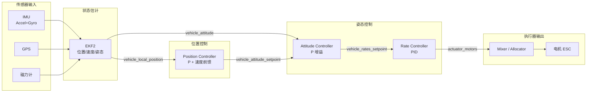
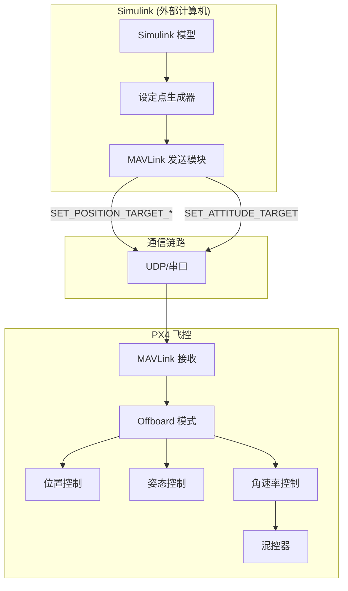
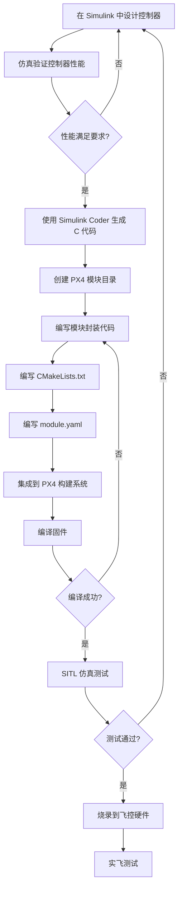
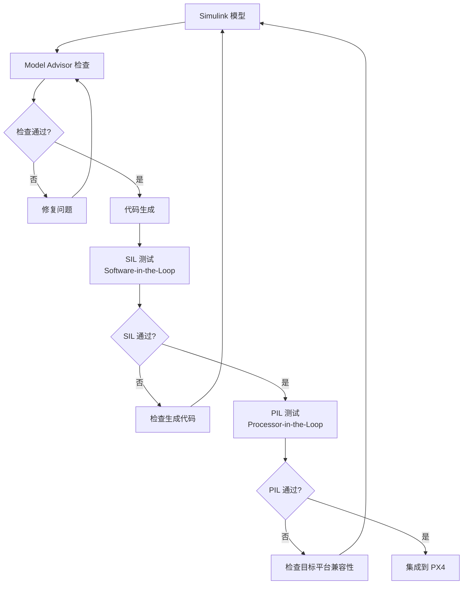
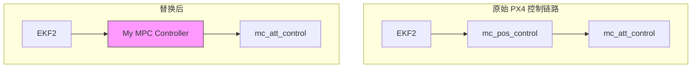

# 从 Simulink 到 PX4 控制链路

> 预计阅读：25 分钟 | 前置知识：PX4 架构基础、Simulink 建模、控制理论基础

---

## 1. 控制链路总览

PX4 的控制链路是一条**级联反馈控制回路**，从传感器输入到电机输出，每一级都有明确的职责和接口。理解这条链路是将 Simulink 模型与 PX4 对接的基础。



### 1.1 各级控制器带宽

| 控制环 | 典型带宽 | 执行频率 | 输入 | 输出 |
|--------|:--------:|:--------:|------|------|
| 位置环 | 1-2 Hz | 50 Hz | 期望位置/速度 | 期望姿态+推力 |
| 姿态环 | 5-10 Hz | 250 Hz | 期望姿态 | 期望角速率 |
| 角速率环 | 30-50 Hz | 250-400 Hz | 期望角速率 | 期望力矩 |
| 混控+输出 | - | 400 Hz | 力矩+推力 | PWM/DShot |

---

## 2. Simulink 模型与 PX4 模块的映射关系

### 2.1 功能映射

Simulink 模型中的各个子系统可以直接映射到 PX4 的对应模块：

| Simulink 子系统 | PX4 模块 | uORB 话题 |
|----------------|---------|-----------|
| 传感器模型 | `sensors` | `sensor_combined` |
| 状态估计器 | `ekf2` | `vehicle_attitude`, `vehicle_local_position` |
| 位置控制器 | `mc_pos_control` | `vehicle_attitude_setpoint` |
| 姿态控制器 | `mc_att_control` | `vehicle_rates_setpoint` |
| 角速率控制器 | `mc_att_control` | `vehicle_torque_setpoint`, `vehicle_thrust_setpoint` |
| 混控器 | `control_allocator` | `actuator_motors` |
| 电机模型 | 输出驱动 | PWM/DShot 信号 |

### 2.2 数据流映射图

```
┌─────────────────────────────────────────────────────────────────────┐
│                        Simulink 模型                                │
│                                                                     │
│  ┌──────────┐   ┌──────────┐   ┌──────────┐   ┌──────────┐        │
│  │ 飞动力学  │──→│ 传感器   │──→│ 状态估计  │──→│ 位置控制  │        │
│  │ 模型     │   │ 模型     │   │ EKF      │   │          │        │
│  └──────────┘   └──────────┘   └──────────┘   └─────┬────┘        │
│                                                      │              │
│                                                      ▼              │
│  ┌──────────┐   ┌──────────┐   ┌──────────┐   ┌──────────┐        │
│  │ 电机模型  │←──│ 混控器   │←──│ 角速率控制│←──│ 姿态控制  │        │
│  │          │   │          │   │          │   │          │        │
│  └──────────┘   └──────────┘   └──────────┘   └──────────┘        │
└─────────────────────────────────────────────────────────────────────┘
         ↕               ↕               ↕               ↕
┌─────────────────────────────────────────────────────────────────────┐
│                         PX4 固件                                     │
│                                                                     │
│  ┌──────────┐   ┌──────────┐   ┌──────────┐   ┌──────────┐        │
│  │ Drivers  │──→│  ekf2    │──→│pos_control│──→│att_control│        │
│  │          │   │          │   │          │   │          │        │
│  └──────────┘   └──────────┘   └──────────┘   └─────┬────┘        │
│                                                      │              │
│  ┌──────────┐   ┌──────────┐                         ▼              │
│  │ Output   │←──│  Mixer   │←───────────── torque/thrust setpoint  │
│  │ Drivers  │   │          │                                       │
│  └──────────┘   └──────────┘                                       │
└─────────────────────────────────────────────────────────────────────┘
```

---

## 3. Offboard 模式：从 Simulink 发送设定点

### 3.1 Offboard 模式概述

Offboard 模式允许外部计算机（运行 Simulink）通过 MAVLink 向 PX4 发送控制设定点，PX4 仅执行底层控制。



### 3.2 MAVLink 设定点消息

| MAVLink 消息 | 控制级别 | 包含数据 | 适用场景 |
|-------------|---------|---------|---------|
| `SET_POSITION_TARGET_LOCAL_NED` | 位置/速度/加速度 | 位置、速度、加速度、偏航 | 航点跟踪、轨迹跟踪 |
| `SET_POSITION_TARGET_GLOBAL_INT` | 全局位置 | 经纬度、高度、速度 | GPS 导航 |
| `SET_ATTITUDE_TARGET` | 姿态/推力 | 四元数、角速率、推力 | 姿态控制 |
| `SET_ACTUATOR_CONTROL_TARGET` | 直接执行器 | 8 通道归一化控制量 | 最底层控制 |

### 3.3 Offboard 模式工作流程

```
Simulink 端                                   PX4 端
───────────                                   ──────
    │                                             │
    │  1. 发送心跳 (HEARTBEAT, 1Hz)              │
    │ ─────────────────────────────────────────→  │
    │                                             │
    │  2. 发送设定点 (连续, ≥2Hz)                 │
    │ ─────────────────────────────────────────→  │
    │      SET_POSITION_TARGET_LOCAL_NED          │
    │                                             │
    │  3. 切换到 Offboard 模式                    │
    │ ─────────────────────────────────────────→  │
    │      MAV_CMD_NAV_GUIDED_ENABLE             │
    │      或 SET_MODE (OFFBOARD)                │
    │                                             │
    │  4. 持续发送设定点 (保持模式)               │
    │ ─────────────────────────────────────────→  │
    │      若 0.5s 无设定点 → 自动退出 Offboard   │
    │                                             │
    │  5. (可选) 发送解锁命令                     │
    │ ─────────────────────────────────────────→  │
    │      MAV_CMD_COMPONENT_ARM_DISARM          │
    │                                             │
```

### 3.4 Simulink 中实现 Offboard 通信

**使用 UAV Toolbox：**

```matlab
% 创建 MAVLink 连接
mavlinkConnection = mavlinkio('Pixhawk', 'SystemID', 1, 'ComponentID', 1);

% 配置 UDP 端口（SITL 默认端口）
% 发送端口: 14550, 接收端口: 14557
mavlinkConnection = mavlinkio('UDP', 'LocalPort', 14557, 'RemotePort', 14550);

% 创建位置设定点消息
msg = mavlinkmsg('SET_POSITION_TARGET_LOCAL_NED');
msg.time_boot_ms = uint32(posixtime(datetime('now')) * 1000);
msg.coordinate_frame = uint8(1);  % MAV_FRAME_LOCAL_NED
msg.type_mask = uint16(0b0000110111111000);  % 仅使用位置
msg.x = 0;    % 北向位置 (m)
msg.y = 0;    % 东向位置 (m)
msg.z = -10;  % 向下位置 (m, NED 坐标系)

% 发送消息
sendmsg(mavlinkConnection, msg);
```

**使用 Simulink MAVLink 块：**

```matlab
% 在 Simulink 中使用 UAV Toolbox 的 MAVLink 块
% 1. 添加 "MAVLink Send" 块
% 2. 配置消息类型为 SET_POSITION_TARGET_LOCAL_NED
% 3. 连接位置/速度输入端口
% 4. 设置发送频率 ≥ 2Hz
```

---

## 4. 自定义控制器部署工作流

### 4.1 部署流程概览



### 4.2 步骤详解

#### 步骤 1：Simulink 控制器设计

在 Simulink 中设计控制器时，需要注意以下约束：

```
┌─────────────────────────────────────────────────────┐
│              Simulink 控制器模型                      │
│                                                     │
│  输入端口:                                          │
│  ├── Current State (状态反馈)                       │
│  │   ├── position [x, y, z]    (double)            │
│  │   ├── velocity [vx, vy, vz] (double)            │
│  │   ├── attitude [q0,q1,q2,q3] (double)           │
│  │   └── angular_rate [p, q, r] (double)           │
│  ├── Setpoint (期望值)                              │
│  │   ├── desired_position [x, y, z]                │
│  │   └── desired_heading (yaw)                     │
│  └── dt (采样时间)                                  │
│                                                     │
│  输出端口:                                          │
│  ├── Thrust [0, 1]     (归一化推力)                 │
│  ├── Roll (rad)        (期望滚转角)                 │
│  ├── Pitch (rad)       (期望俯仰角)                 │
│  └── Yaw Rate (rad/s)  (期望偏航角速率)             │
│                                                     │
│  约束:                                              │
│  ├── 不使用动态内存分配 (malloc/new)                │
│  ├── 不使用 C++ 标准库 I/O                          │
│  ├── 浮点运算优先 (避免双精度除非必要)              │
│  └── 固定步长求解器 (如 ODE1, 固定步长 0.004s)     │
└─────────────────────────────────────────────────────┘
```

#### 步骤 2：代码生成配置

```matlab
% Simulink Coder 配置
% 打开 Model Settings → Code Generation

% 1. 选择系统目标文件
set_param(model, 'SystemTargetFile', 'ert.tlc');  % Embedded Coder

% 2. 语言设置
set_param(model, 'TargetLang', 'C');  % 生成 C 代码

% 3. 代码生成优化
set_param(model, 'InlineParams', 'on');       % 内联参数
set_param(model, 'OptimizeBlockIOStorage', 'on');  % 优化 I/O 存储
set_param(model, 'ExpressionFolding', 'on');  % 表达式折叠

% 4. 数据类型设置
set_param(model, 'SupportNonFinite', 'off');  % 禁用 NaN/Inf

% 5. 生成代码
slbuild(model);
```

#### 步骤 3：创建 PX4 模块

```bash
# 在 PX4-Autopilot 源码中创建新模块
mkdir -p src/modules/my_custom_controller

# 模块目录结构
src/modules/my_custom_controller/
├── CMakeLists.txt
├── MyCustomController.cpp
├── MyCustomController.hpp
├── MyCustomController_params.c
└── module.yaml
```

#### 步骤 4：模块封装代码

```cpp
// MyCustomController.hpp
#pragma once

#include <px4_platform_common/module.h>
#include <px4_platform_common/module_params.h>
#include <uORB/Subscription.hpp>
#include <uORB/Publication.hpp>
#include <uORB/topics/vehicle_local_position.h>
#include <uORB/topics/vehicle_attitude.h>
#include <uORB/topics/vehicle_attitude_setpoint.h>
#include <drivers/drv_hrt.h>

// 包含 Simulink 生成的头文件
extern "C" {
#include "my_controller.h"  // Simulink 生成的控制器头文件
}

class MyCustomController : public ModuleBase<MyCustomController>, public ModuleParams
{
public:
    MyCustomController(int instance = 0);
    ~MyCustomController() override = default;

    static int task_spawn(int argc, char *argv[]);
    static MyCustomController *instantiate(int argc, char *argv[], int instance);
    static int custom_command(int argc, char *argv[]);
    static int print_usage(const char *reason = nullptr);

    void run();

private:
    // Simulink 模型数据结构
    my_controller_ModelData rtData;  // Simulink 生成的数据结构

    // uORB 订阅
    uORB::Subscription _local_pos_sub{ORB_ID(vehicle_local_position)};
    uORB::Subscription _att_sub{ORB_ID(vehicle_attitude)};

    // uORB 发布
    uORB::Publication<vehicle_attitude_setpoint_s> _att_sp_pub{ORB_ID(vehicle_attitude_setpoint)};

    // 参数
    DEFINE_PARAMETERS(
        (ParamFloat<px4::params::MY_CTRL_GAIN>) _param_gain,
        (ParamFloat<px4::params::MY_CTRL_RATE>) _param_rate
    )

    hrt_abstime _last_run{0};
    float _dt{0.004f};  // 250 Hz
};
```

```cpp
// MyCustomController.cpp
#include "MyCustomController.hpp"

MyCustomController::MyCustomController(int instance) : ModuleParams(nullptr)
{
    // 初始化 Simulink 模型
    my_controller_initialize(&rtData);
}

int MyCustomController::task_spawn(int argc, char *argv[])
{
    int instance = 0;
    // 解析实例参数...

    MyCustomController *ctrl = instantiate(argc, argv, instance);
    if (!ctrl) {
        PX4_ERR("instance failed");
        return -1;
    }
    _object.store(ctrl);
    _task_id = task_id_is_work_queue;
    ctrl->run();
    return 0;
}

void MyCustomController::run()
{
    // 设置运行频率 250Hz
    using namespace time_literals;
    ScheduleOnInterval(4_ms);  // 250 Hz

    while (!should_exit()) {
        // 等待调度唤醒
        WaitForSchedule();

        hrt_abstime now = hrt_absolute_time();
        _dt = (now - _last_run) / 1e6f;
        _last_run = now;

        // 读取状态反馈
        vehicle_local_position_s local_pos;
        vehicle_attitude_s att;

        if (_local_pos_sub.update(&local_pos) && _att_sub.update(&att)) {
            // 填充 Simulink 模型输入
            rtData.input.position[0] = local_pos.x;
            rtData.input.position[1] = local_pos.y;
            rtData.input.position[2] = local_pos.z;
            rtData.input.velocity[0] = local_pos.vx;
            rtData.input.velocity[1] = local_pos.vy;
            rtData.input.velocity[2] = local_pos.vz;
            rtData.input.quaternion[0] = att.q[0];
            rtData.input.quaternion[1] = att.q[1];
            rtData.input.quaternion[2] = att.q[2];
            rtData.input.quaternion[3] = att.q[3];
            rtData.input.dt = _dt;

            // 调用 Simulink 生成的控制器
            my_controller_step(&rtData);

            // 发布控制输出
            vehicle_attitude_setpoint_s att_sp{};
            att_sp.timestamp = now;
            att_sp.roll_body = rtData.output.roll;
            att_sp.pitch_body = rtData.output.pitch;
            att_sp.yaw_body = rtData.output.yaw;
            att_sp.thrust_body[2] = -rtData.output.thrust;  // NED: 推力向下为负

            _att_sp_pub.publish(att_sp);
        }
    }
}

// 模块注册入口
extern "C" __EXPORT int my_custom_controller_main(int argc, char *argv[])
{
    return MyCustomController::main(argc, argv);
}
```

#### 步骤 5：CMakeLists.txt

```cmake
px4_add_module(
    MODULE modules__my_custom_controller
    MAIN my_custom_controller
    SRCS
        MyCustomController.cpp
        # Simulink 生成的源文件
        my_controller.c
    INCLUDES
        ${CMAKE_CURRENT_SOURCE_DIR}
    DEPENDS
        uORB
        px4_platform_common
    )
```

#### 步骤 6：module.yaml

```yaml
module_name: My Custom Controller
serial_number:
  required: false
parameters:
  - group: MY_CTRL
    definitions:
      MY_CTRL_GAIN:
        description: "Controller proportional gain"
        type: float
        default: 1.0
        min: 0.0
        max: 10.0
      MY_CTRL_RATE:
        description: "Controller update rate (Hz)"
        type: float
        default: 250.0
        min: 50.0
        max: 400.0
```

---

## 5. Simulink Coder 与 Embedded Coder

### 5.1 工具箱选择

| 工具箱 | 适用场景 | 特点 |
|--------|---------|------|
| **Simulink Coder** | 基本代码生成 | 生成通用 C/C++ 代码 |
| **Embedded Coder** | 嵌入式优化 | 生成高度优化的代码，支持 MISRA-C |
| **PX4 Support Package** | PX4 专用集成 | MathWorks 官方 PX4 支持包 |

### 5.2 代码生成注意事项

**数据类型兼容性：**

```
Simulink 数据类型          C 数据类型              PX4 标准
─────────────────         ─────────────          ──────────
double          ───→      double                 慎用 (计算量大)
single          ───→      float                  推荐 (PX4 标准)
int32           ───→      int32_t                ✓
uint32          ───→      uint32_t               ✓
boolean         ───→      bool                   ✓
```

**避免的 Simulink 特性：**

| 特性 | 原因 | 替代方案 |
|------|------|---------|
| 变步长求解器 | PX4 使用固定步长 | 选择 ODE1/ODE4 固定步长 |
| 变维度信号 | 嵌入式不支持 | 使用固定大小数组 |
| MATLAB Function 块中的 `eval` | 不支持代码生成 | 使用数学运算 |
| 字符串操作 | 嵌入式资源受限 | 使用枚举或常量 |
| Simulink Bus 对象 | 生成代码结构复杂 | 使用简单结构体 |

### 5.3 代码生成验证流程



---

## 6. 完整集成案例：自定义位置控制器

### 6.1 场景描述

设计一个基于 MPC（Model Predictive Control）的位置控制器，替代 PX4 默认的 PID 位置控制器，实现更平滑的轨迹跟踪。

### 6.2 Simulink 模型结构

```
┌─────────────────────────────────────────────────────────┐
│              MPC Position Controller Model                │
│                                                          │
│  ┌────────┐     ┌──────────────┐     ┌──────────┐      │
│  │ Current │────→│   State      │────→│   MPC    │      │
│  │ Position│     │   Error      │     │ Solver   │      │
│  └────────┘     └──────────────┘     └────┬─────┘      │
│                                            │             │
│  ┌────────┐     ┌──────────────┐          │             │
│  │Desired │────→│   Setpoint   │──────────┘             │
│  │Position│     │   Generator  │                         │
│  └────────┘     └──────────────┘                         │
│                                                          │
│  输出:                                                   │
│  ├── desired_attitude [roll, pitch, yaw]                │
│  └── desired_thrust [0-1]                               │
└─────────────────────────────────────────────────────────┘
```

### 6.3 集成步骤摘要

```
1. Simulink 设计 MPC 控制器
   └── 使用 MPC Toolbox，定义预测模型和约束

2. 仿真验证
   └── 与 PX4 位置控制器对比轨迹跟踪性能

3. 代码生成
   └── Simulink Coder → ert.tlc → 生成 C 代码

4. 创建 PX4 模块
   └── src/modules/mpc_pos_control/

5. 集成测试 (SITL)
   └── make px4_sitl_default gazebo-classic
   └── QGroundControl 切换到 Offboard 模式

6. 部署到硬件
   └── make px4_fmu-v6x_default upload
```

---

## 7. Simulink 模型参考设计

### 7.1 MichaelSkadan/PX4-Autopilot-Simulink-Interface

该仓库提供了 PX4 与 Simulink 接口的完整示例，核心文件：

```
PX4-Autopilot-Simulink-Interface/
├── simulink_models/
│   ├── px4_interface.slx          # 主接口模型
│   ├── attitude_controller.slx    # 姿态控制器
│   └── position_controller.slx    # 位置控制器
├── scripts/
│   ├── setup_px4_connection.m     # PX4 连接设置
│   └── run_sitl.m                 # SITL 启动脚本
└── docs/
    └── integration_guide.md
```

**使用方法：**

```matlab
% 1. 克隆仓库
% git clone https://github.com/MichaelSkadan/PX4-Autopilot-Simulink-Interface.git

% 2. 启动 PX4 SITL
% cd PX4-Autopilot && make px4_sitl_default gazebo-classic

% 3. 打开 Simulink 模型
open_system('px4_interface.slx')

% 4. 运行仿真，观察 MAVLink 通信
```

### 7.2 optimAero/optimAeroPX4SIL

该仓库专注于 PX4 SITL 优化，提供更高效的 Simulink-PX4 联合仿真方案。

```
optimAeroPX4SIL/
├── models/
│   ├── plant_model.slx           # 被控对象模型
│   ├── controller.slx            # 控制器模型
│   └── visualization.slx         # 可视化模型
├── src/
│   ├── mavlink_interface.cpp     # MAVLink 接口
│   └── udp_bridge.cpp            # UDP 桥接
└── config/
    ├── px4_params.yaml           # PX4 参数配置
    └── sim_config.yaml           # 仿真配置
```

---

## 8. 控制器替换策略

### 8.1 替换级别选择

| 替换级别 | 替换内容 | 复杂度 | 适用场景 |
|---------|---------|:------:|---------|
| **Level 1** | 仅替换 Offboard 设定点 | 低 | 快速验证轨迹规划 |
| **Level 2** | 替换位置控制器 | 中 | 自定义路径跟踪算法 |
| **Level 3** | 替换姿态控制器 | 中 | 自定义姿态控制律 |
| **Level 4** | 替换角速率控制器 | 高 | 底层控制优化 |
| **Level 5** | 替换整个控制栈 | 很高 | 全自研飞控算法 |

### 8.2 Level 2 替换示例（位置控制器）



**关键接口：**

```cpp
// 输入接口 (订阅)
vehicle_local_position  → 当前位置/速度
vehicle_attitude        → 当前姿态
trajectory_setpoint     → 期望轨迹

// 输出接口 (发布)
vehicle_attitude_setpoint → 期望姿态 + 推力
```

---

## 9. 通信延迟与带宽分析

### 9.1 MAVLink 通信延迟

| 环节 | 典型延迟 | 说明 |
|------|:--------:|------|
| Simulink 模型计算 | 1-5 ms | 取决于模型复杂度 |
| MAVLink 编码 | < 1 ms | 消息序列化 |
| UDP 传输 | 0.1-1 ms | 本地环回 |
| PX4 MAVLink 解析 | < 1 ms | 消息反序列化 |
| uORB 发布 | < 0.1 ms | 共享内存 |
| **总计** | **2-8 ms** | **SITL 环境** |

### 9.2 带宽需求

| 消息类型 | 大小 (bytes) | 频率 | 带宽 |
|---------|:------------:|:----:|:----:|
| SET_POSITION_TARGET_LOCAL_NED | 53 | 50 Hz | 2.65 KB/s |
| SET_ATTITUDE_TARGET | 39 | 250 Hz | 9.75 KB/s |
| HEARTBEAT | 9 | 1 Hz | 9 B/s |
| LOCAL_POSITION_NED (反馈) | 28 | 50 Hz | 1.4 KB/s |

---

## 思考题

**1. 描述 PX4 级联控制架构中位置环、姿态环、角速率环各自的功能和带宽关系。为什么需要这种级联结构？**

<details><summary>参考答案</summary>

- **位置环** (1-2 Hz 带宽，50 Hz 执行频率)：接收期望位置，通过 P 控制器 + 速度前馈计算期望速度，再转换为期望姿态角和推力
- **姿态环** (5-10 Hz 带宽，250 Hz 执行频率)：接收期望姿态，通过 P 增益计算期望角速率
- **角速率环** (30-50 Hz 带宽，250-400 Hz 执行频率)：接收期望角速率，通过 PID 控制器计算期望力矩

级联结构的原因：
- **分离关注点**：每个环路处理不同时间尺度的动态
- **稳定性**：内环带宽远高于外环，保证内环快速跟踪外环输出
- **调试便利**：可以独立调整各环参数
- **鲁棒性**：内环抑制高频扰动，外环处理低频参考跟踪

</details>

**2. Offboard 模式下，如果 Simulink 停止发送设定点超过 0.5 秒，PX4 会如何响应？这种设计有什么安全考虑？**

<details><summary>参考答案</summary>

PX4 会在 0.5 秒超时后**自动退出 Offboard 模式**，切换到安全模式（通常悬停或降落）。

安全考虑：
- **通信中断保护**：无线链路可能不稳定，超时机制防止飞机失控
- **故障降级**：自动切换到自主模式，避免完全失去控制
- **着陆优先**：在无法维持 Offboard 控制时，选择安全着陆
- **心跳检测**：与 MAVLink 心跳机制配合，全面监控链路状态

建议：Simulink 端应以 ≥ 2Hz 的频率持续发送设定点，并实现链路监控和重连机制。

</details>

**3. 将 Simulink 控制器代码集成到 PX4 时，为什么建议使用 float 而非 double？**

<details><summary>参考答案</summary>

- **计算效率**：PX4 飞控硬件（如 STM32H7）的 FPU 原生支持单精度浮点，double 运算需要软件模拟，速度慢 5-10 倍
- **内存占用**：float 占 4 字节，double 占 8 字节，嵌入式系统内存有限
- **精度够用**：飞控控制量的物理精度（如角度 0.01 度、位置 1cm）远低于 float 的 7 位有效数字
- **PX4 标准**：PX4 内部默认使用 float，保持一致性可避免隐式类型转换
- **带宽**：MAVLink 和 uORB 消息使用 float，避免不必要的精度转换

</details>

**4. 比较 Level 1（Offboard 设定点）和 Level 2（替换位置控制器）两种集成方式的优缺点。**

<details><summary>参考答案</summary>

**Level 1 (Offboard 设定点)：**
- 优点：无需修改 PX4 固件，实现简单，开发周期短
- 优点：通过 MAVLink 通信，调试方便
- 缺点：增加通信延迟（2-8ms），可能影响控制性能
- 缺点：依赖通信链路稳定性，需要实现超时保护

**Level 2 (替换位置控制器)：**
- 优点：运行在飞控硬件上，无通信延迟
- 优点：可直接访问 EKF 状态，精度更高
- 缺点：需要修改 PX4 固件，开发周期长
- 缺点：需要理解 PX4 模块系统，调试更复杂
- 缺点：固件升级时需要重新移植

选择建议：原型验证阶段用 Level 1，性能优化阶段用 Level 2。

</details>

**5. 在 Simulink Coder 代码生成时，"固定步长求解器"为什么是必须的？**

<details><summary>参考答案</summary>

- **实时性要求**：PX4 以固定频率（250Hz）运行控制环，每个周期必须在截止时间内完成
- **确定性**：固定步长保证每次计算的执行时间可预测，避免变步长导致的时序抖动
- **代码生成兼容**：Simulink Coder 的嵌入式代码生成要求固定步长，变步长求解器生成的代码不适合实时系统
- **与 PX4 调度对齐**：PX4 使用定时器调度（ScheduleOnInterval），控制器必须在固定间隔内完成
- **数值稳定性**：固定步长便于分析和保证控制器的数值稳定性

</details>
