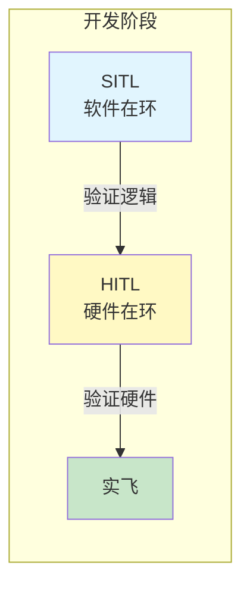
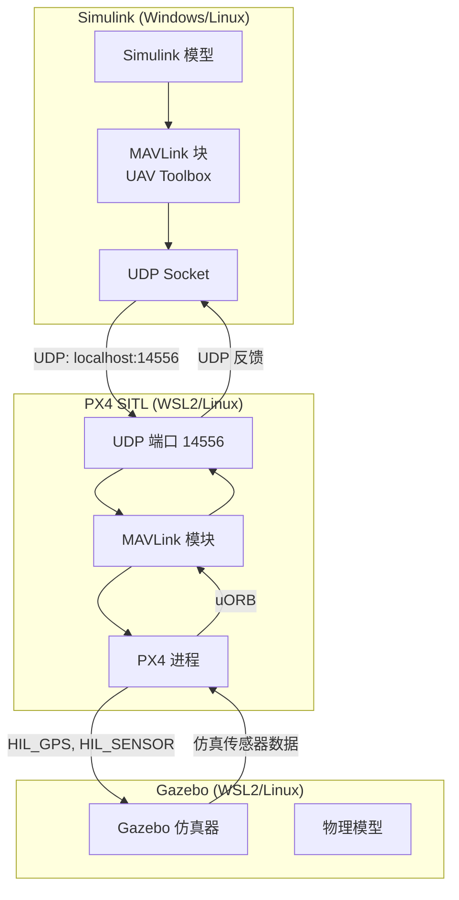
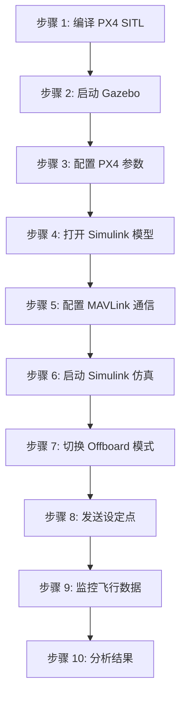

# PX4 SITL 联合仿真

> 预计阅读：22 分钟 | 前置知识：PX4 架构基础、Simulink 基本操作、UDP 网络通信概念

---

## 1. 仿真在环概述

PX4 支持多种仿真模式，从纯软件仿真到硬件在环，覆盖开发全流程。



### 1.1 SITL vs HITL vs 实飞对比

| 对比维度 | SITL | HITL | 实飞 |
|---------|------|------|------|
| **运行环境** | PC 上的 PX4 进程 | 真实飞控硬件 | 真实飞控 + 真机 |
| **传感器数据** | 仿真器生成 | 仿真器注入硬件 | 真实传感器 |
| **物理模型** | Gazebo/jMAVSim | Gazebo + 真实硬件 | 真实物理 |
| **通信方式** | UDP/TCP (本地) | USB/串口 | 无线链路 |
| **延迟** | 1-5 ms | 5-20 ms | 20-100 ms |
| **风险** | 无 | 无 | 有坠机风险 |
| **调试便利性** | 最方便 (GDB 直接调试) | 较方便 (可断点) | 最难 |
| **计算资源** | PC CPU/GPU | PC + 飞控 CPU | 飞控 CPU |
| **适用阶段** | 算法开发、逻辑验证 | 硬件集成测试 | 最终验证 |
| **PX4 配置** | `px4_sitl_default` | `px4_fmu-v6x_default` + HITL 参数 | 标准飞控参数 |

---

## 2. PX4 SITL 环境搭建

### 2.1 系统要求

| 组件 | 最低要求 | 推荐配置 |
|------|---------|---------|
| 操作系统 | Ubuntu 20.04 / Windows WSL2 | Ubuntu 22.04 |
| CPU | 4 核 | 8 核 |
| 内存 | 8 GB | 16 GB |
| GPU | 集成显卡 (Gazebo Classic) | 独立显卡 (Gazebo Harmonic) |
| 磁盘 | 10 GB 可用空间 | 20 GB SSD |
| MATLAB | R2023b | R2024a+ |

### 2.2 安装步骤

```bash
# 1. 克隆 PX4 仓库
git clone https://github.com/PX4/PX4-Autopilot.git --recursive
cd PX4-Autopilot

# 2. 安装依赖 (Ubuntu)
bash Tools/setup/ubuntu.sh

# 3. 安装 Gazebo Classic (默认)
# 已包含在 ubuntu.sh 中

# 4. (可选) 安装 Gazebo Harmonic
# 参考 https://docs.px4.io/main/en/dev_setup/gazebo_ubuntu.html

# 5. 首次编译 SITL
make px4_sitl_default

# 6. 启动 SITL + Gazebo Classic
make px4_sitl_default gazebo-classic

# 7. (或) 启动 SITL + Gazebo Harmonic
make px4_sitl gz_x500
```

### 2.3 Windows WSL2 环境配置

```bash
# 1. 安装 WSL2 (PowerShell 管理员)
wsl --install -d Ubuntu-22.04

# 2. 在 WSL2 中安装依赖
sudo apt update && sudo apt install -y git cmake ninja-build \
    gperf ccache dfu-util device-portal-frontend \
    libgstreamer1.0-dev libgstreamer-plugins-base1.0-dev \
    gstreamer1.0-plugins-bad gstreamer1.0-plugins-base \
    gstreamer1.0-plugins-good gstreamer1.0-plugins-ugly \
    python3-pip

# 3. 安装 Python 依赖
pip3 install --user pyros-genmsg empy==3.3.4 jsonschema pyyaml

# 4. 克隆并编译 PX4
git clone https://github.com/PX4/PX4-Autopilot.git --recursive
cd PX4-Autopilot
bash Tools/setup/ubuntu.sh
make px4_sitl_default gazebo-classic

# 5. Windows 端访问 Gazebo GUI
# 需要安装 VcXsrv 或使用 WSLg (Windows 11)
```

### 2.4 启动选项一览

```bash
# 不同机型的 SITL 启动命令
make px4_sitl_default gazebo-classic              # 默认四旋翼
make px4_sitl_default gazebo-classic_iris         # Iris 四旋翼
make px4_sitl_default gazebo-classic_plane        # 固定翼
make px4_sitl_default gazebo-classic_vtol         # VTOL

# Gazebo Harmonic (新版)
make px4_sitl gz_x500                             # X500 四旋翼
make px4_sitl gz_rc_cessna                        # Cessna 固定翼

# jMAVSim (轻量级仿真器)
make px4_sitl_default jmavsim                     # jMAVSim 四旋翼
```

---

## 3. Simulink 与 PX4 SITL 通信

### 3.1 通信架构



### 3.2 端口配置

| 端口 | 用途 | 默认值 |
|------|------|:------:|
| 14550 | QGroundControl 连接 | UDP |
| 14556 | SITL MAVLink API (Simulink) | UDP |
| 14557 | SITL MAVLink API (备用) | UDP |
| 14580 | SITL Offboard 接口 | UDP |
| 4560 | SITL <-> Gazebo HIL 接口 | UDP |

### 3.3 Simulink MAVLink 配置

**使用 UAV Toolbox：**

```matlab
%% 方法 1: 使用 MAVLink 块 (推荐)
% 在 Simulink 模型中:
% 1. 添加 "MAVLink Send" 块
%    - 连接类型: UDP
%    - 远程地址: 127.0.0.1
%    - 远程端口: 14556
%    - 本地端口: 14557
%
% 2. 添加 "MAVLink Receive" 块
%    - 相同的 UDP 配置
%    - 过滤消息类型: HEARTBEAT, LOCAL_POSITION_NED 等
%
% 3. 添加 "MAVLink Message Decode" 块
%    - 解码接收到的消息为 Simulink 信号

%% 方法 2: 使用 MATLAB System 块
% 创建自定义 System 对象处理 MAVLink 通信
```

**MATLAB 脚本方式：**

```matlab
% 创建 UDP 连接
u = udpport("datagram", "LocalPort", 14557, "RemotePort", 14556);

% 构造 MAVLink SET_POSITION_TARGET_LOCAL_NED 消息
% MAVLink 2 帧格式
msg_id = 84;  % SET_POSITION_TARGET_LOCAL_NED
sysid = 255;  % GCS 系统 ID
compid = 190; % GCS 组件 ID

% ... 消息编码 ...

% 发送
write(u, msg_bytes, "127.0.0.1", 14556);
```

### 3.4 连接测试脚本

```matlab
%% 测试 PX4 SITL 连接
% 确保 PX4 SITL 已启动

% 1. 创建 MAVLink 连接
mavlinkClient = mavlinkclient('SystemID', 255, 'ComponentID', 190);
mavlinkIO = mavlinkio('UDP', 'LocalPort', 14557, 'RemotePort', 14556);
connect(mavlinkIO, mavlinkClient);

% 2. 等待心跳
disp('等待 PX4 心跳...');
timeout = 10;  % 10 秒超时
t0 = tic;
while toc(t0) < timeout
    msg = readmsg(mavlinkIO, 'MessageIDs', 0);  % HEARTBEAT
    if ~isempty(msg)
        disp('收到心跳! PX4 连接成功.');
        disp(msg);
        break;
    end
    pause(0.1);
end

% 3. 请求数据流
% 发送 REQUEST_DATA_STREAM 消息请求位置数据
requestMsg = mavlinkmsg('REQUEST_DATA_STREAM');
requestMsg.target_system = 1;
requestMsg.target_component = 1;
requestMsg.req_stream_id = uint8(1);  % MAV_DATA_STREAM_ALL
requestMsg.req_message_rate = uint16(10);  % 10 Hz
sendmsg(mavlinkIO, requestMsg);
```

---

## 4. 完整 SITL 联合仿真工作流

### 4.1 工作流总览



### 4.2 详细步骤

#### 步骤 1：编译 PX4 SITL

```bash
cd PX4-Autopilot

# 清理旧构建
make clean

# 编译 SITL 目标 (Gazebo Classic)
make px4_sitl_default gazebo-classic

# 首次编译约需 10-15 分钟
# 后续增量编译约 1-2 分钟
```

#### 步骤 2：启动 Gazebo 仿真器

```bash
# PX4 启动脚本会自动启动 Gazebo
# 或手动启动:
make px4_sitl_default gazebo-classic_iris

# 验证 Gazebo 中的无人机模型
# - 检查四旋翼模型是否正确加载
# - 检查地面站连接指示灯
```

#### 步骤 3：配置 PX4 参数

```bash
# 通过 PX4 控制台 (nsh) 设置参数
# 或通过 QGroundControl 设置

# 关键参数:
param set MAV_SYS_ID 1                    # 系统 ID
param set COM_RC_IN_MODE 4                # 禁用遥控器 (SITL 不需要)
param set EKF2_HGT_MODE 1                 # 气压计高度
param set EKF2_GPS_CHECK 0                # 禁用 GPS 检查 (SITL)
param set NAV_DLL_ACT 0                   # 禁用数据链丢失动作
param set NAV_RCL_ACT 0                   # 禁用遥控器丢失动作
```

#### 步骤 4：打开 Simulink 模型

```matlab
% 在 MATLAB 中打开 Simulink 模型
open_system('my_sitl_model.slx')

% 模型应包含:
% - MAVLink Send/Receive 块
% - 设定点生成逻辑
% - 数据可视化 (Scope, Dashboard)
```

#### 步骤 5：配置 MAVLink 通信

在 Simulink 模型中配置 MAVLink 连接参数：

```
┌─────────────────────────────────────────────────────┐
│              MAVLink 通信配置                         │
│                                                     │
│  MAVLink Send 块:                                   │
│  ├── 连接类型: UDP                                  │
│  ├── 远程地址: 127.0.0.1                           │
│  ├── 远程端口: 14556                               │
│  └── 本地端口: 14557                               │
│                                                     │
│  MAVLink Receive 块:                                │
│  ├── 连接类型: UDP                                  │
│  ├── 远程地址: 127.0.0.1                           │
│  ├── 远程端口: 14556                               │
│  └── 本地端口: 14557                               │
│                                                     │
│  消息过滤:                                          │
│  ├── 接收: HEARTBEAT, LOCAL_POSITION_NED,          │
│  │        ATTITUDE_QUATERNION                       │
│  └── 发送: SET_POSITION_TARGET_LOCAL_NED,          │
│            COMMAND_LONG                             │
└─────────────────────────────────────────────────────┘
```

#### 步骤 6：启动仿真

```matlab
% 设置仿真时间
set_param(model, 'StopTime', '60');  % 仿真 60 秒

% 启动仿真
sim(model);
```

#### 步骤 7-10：运行与监控

```
Simulink 模型运行逻辑:

t = 0-2s:   发送心跳，建立连接
t = 2-3s:   发送解锁命令 (ARM)
t = 3-5s:   发送起飞命令 (TAKEOFF, 高度 5m)
t = 5-50s:  切换 Offboard 模式，发送轨迹设定点
            ├── 圆形轨迹
            ├── 8 字形轨迹
            └── 自定义航点
t = 50-55s: 发送降落命令 (LAND)
t = 55-60s: 发送锁定命令 (DISARM)
```

---

## 5. Simulink SITL 模型示例

### 5.1 模型结构

```
┌──────────────────────────────────────────────────────────────┐
│                    SITL 联合仿真模型                           │
│                                                              │
│  ┌─────────────────────────────────────────────────────┐    │
│  │                设定点生成器                           │    │
│  │                                                     │    │
│  │  Clock ──→ Trajectory Generator ──→ [x,y,z,yaw]    │    │
│  │           (圆形/8字/自定义轨迹)                       │    │
│  └────────────────────────┬────────────────────────────┘    │
│                           │                                  │
│  ┌────────────────────────▼────────────────────────────┐    │
│  │              MAVLink 编码器                           │    │
│  │                                                     │    │
│  │  [x,y,z,yaw] ──→ SET_POSITION_TARGET_LOCAL_NED     │    │
│  │                 type_mask: 使用位置 + 偏航           │    │
│  └────────────────────────┬────────────────────────────┘    │
│                           │                                  │
│  ┌────────────────────────▼────────────────────────────┐    │
│  │              UDP 发送                                │    │
│  │  → 127.0.0.1:14556                                  │    │
│  └─────────────────────────────────────────────────────┘    │
│                                                              │
│  ┌─────────────────────────────────────────────────────┐    │
│  │              UDP 接收                                │    │
│  │  ← 127.0.0.1:14556                                  │    │
│  └────────────────────────┬────────────────────────────┘    │
│                           │                                  │
│  ┌────────────────────────▼────────────────────────────┐    │
│  │              MAVLink 解码器                           │    │
│  │                                                     │    │
│  │  LOCAL_POSITION_NED → [pos_x, pos_y, pos_z]        │    │
│  │  ATTITUDE_QUATERNION → [q0, q1, q2, q3]            │    │
│  └────────────────────────┬────────────────────────────┘    │
│                           │                                  │
│  ┌────────────────────────▼────────────────────────────┐    │
│  │              数据可视化                               │    │
│  │  Scope: 位置跟踪、姿态、推力                         │    │
│  │  3D Animation: 飞行轨迹动画                         │    │
│  └─────────────────────────────────────────────────────┘    │
└──────────────────────────────────────────────────────────────┘
```

### 5.2 轨迹生成器示例

```matlab
% 圆形轨迹生成器 (MATLAB Function 块)
function [x, y, z, yaw] = circular_trajectory(t, radius, height, omega)
    % t: 当前时间 (s)
    % radius: 圆半径 (m)
    % height: 飞行高度 (m, NED 坐标系下为负值)
    % omega: 角速度 (rad/s)

    x = radius * cos(omega * t);
    y = radius * sin(omega * t);
    z = -height;  % NED: 向下为正
    yaw = omega * t + pi/2;  % 偏航方向跟随运动方向
end
```

---

## 6. HITL 仿真模式

### 6.1 HITL 概述

Hardware-In-The-Loop (HITL) 使用真实飞控硬件运行 PX4 固件，但传感器数据来自仿真器。

```mermaid
graph TB
    subgraph "PC (地面站)"
        GCS[QGroundControl]
        GZ[Gazebo 仿真器]
        SIM[Simulink (可选)]
    end

    subgraph "飞控硬件"
        HW[Pixhawk 飞控]
        PX4_FW[PX4 固件]
    end

    GZ -->|HIL_SENSOR 数据| HW
    HW -->|HIL_ACTUATOR| GZ
    GCS -->|MAVLink| HW
    SIM -->|MAVLink (可选)| HW
```

### 6.2 HITL 配置步骤

```
1. 固件配置:
   └── 烧录标准固件 (非 SITL 版本)
   └── 设置参数: SYS_HITL=1 (启用 HITL 模式)

2. 物理连接:
   └── Pixhawk USB 连接到 PC
   └── QGroundControl 通过 USB 串口连接

3. 仿真器配置:
   └── Gazebo 使用 HIL 插件
   └── 传感器数据通过 MAVLink HIL_SENSOR 消息注入

4. Simulink 连接 (可选):
   └── 通过 QGroundControl 的 UDP 转发连接
   └── 或直接通过第二个串口连接
```

### 6.3 HITL 关键参数

| 参数 | 值 | 说明 |
|------|:--:|------|
| `SYS_HITL` | 1 | 启用 HITL 模式 |
| `SIM_GZ_EN` | 1 | 启用 Gazebo 仿真接口 |
| `EKF2_HGT_MODE` | 1 | 使用气压计高度 |
| `EKF2_GPS_CHECK` | 0 | 禁用 GPS 检查 |
| `COM_RC_IN_MODE` | 4 | 禁用遥控器 |

---

## 7. 常见问题排查

### 7.1 连接问题

| 问题 | 可能原因 | 解决方案 |
|------|---------|---------|
| Simulink 无法连接 PX4 | 端口配置错误 | 检查 UDP 端口 14556/14557 |
| | PX4 SITL 未启动 | 确认 PX4 进程正在运行 |
| | 防火墙阻止 | 添加防火墙例外规则 |
| | WSL2 网络隔离 | 使用 `localhost` 或 WSL2 IP |
| 收不到心跳 | 系统 ID 不匹配 | 设置 MAV_SYS_ID=1 |
| | 消息过滤 | 检查 MAVLink 消息 ID 过滤 |
| 数据延迟大 | 仿真帧率低 | 降低 Gazebo 渲染质量 |

### 7.2 仿真问题

| 问题 | 可能原因 | 解决方案 |
|------|---------|---------|
| 飞机不响应 Offboard 命令 | 未切换到 Offboard 模式 | 先发送设定点再切换模式 |
| | 设定点频率太低 | 确保 ≥ 2Hz |
| | 未解锁 (ARM) | 发送解锁命令 |
| 飞机漂移严重 | GPS 数据异常 | 检查 EKF2 参数 |
| | 传感器噪声过大 | 调整仿真器噪声参数 |
| 模型爆炸/发散 | 控制器参数过大 | 减小 PID 增益 |
| | 采样时间不匹配 | 检查 Simulink 求解器步长 |

### 7.3 性能优化

```
优化建议:

1. 降低 Gazebo 渲染质量
   export GZ_SIM_RESOURCE_PATH=...
   gz sim -s --headless-rendering  # 无头模式

2. 调整仿真步长
   Gazebo: max_step_size = 0.001 (1kHz)
   Simulink: 固定步长 = 0.004 (250Hz)

3. 减少 MAVLink 消息频率
   仅请求必要的数据流

4. 使用 jMAVSim 替代 Gazebo (更轻量)
   make px4_sitl_default jmavsim

5. 多核优化
   export PX4_SIM_STOPTIME=0  # 无时间限制
   taskset -c 0-3 make px4_sitl_default  # 绑定 CPU 核心
```

---

## 8. 仿真数据记录与分析

### 8.1 PX4 日志

PX4 SITL 自动记录 `.ulg` 日志文件，位于：

```bash
# 日志目录
PX4-Autopilot/build/px4_sitl_default/rootfs/fs/microsd/log/

# 使用 pyulog 解析
pip install pyulog
ulog_info log.ulg
ulog_export_csv.ulg -m attitude -o attitude.csv
```

### 8.2 Simulink 数据记录

```matlab
% 使用 To Workspace 块记录数据
% 或使用 Simulink Data Inspector

% 记录 MAVLink 接收数据
logsout = sim(model, 'SaveOutput', 'on');

% 提取位置数据
pos_x = logsout.get('position_x').Values.Data;
pos_y = logsout.get('position_y').Values.Data;
pos_z = logsout.get('position_z').Values.Data;

% 绘制 3D 轨迹
figure;
plot3(pos_x, pos_y, -pos_z, 'b-', 'LineWidth', 2);
xlabel('X (m)'); ylabel('Y (m)'); zlabel('Z (m)');
title('SITL 飞行轨迹');
grid on; axis equal;
```

### 8.3 对比分析

```matlab
% 对比期望轨迹与实际轨迹
figure;

subplot(3,1,1);
plot(t, desired_x, 'r--', t, actual_x, 'b-');
xlabel('时间 (s)'); ylabel('X (m)');
legend('期望', '实际');
title('X 轴位置跟踪');

subplot(3,1,2);
plot(t, desired_y, 'r--', t, actual_y, 'b-');
xlabel('时间 (s)'); ylabel('Y (m)');
legend('期望', '实际');
title('Y 轴位置跟踪');

subplot(3,1,3);
plot(t, desired_z, 'r--', t, actual_z, 'b-');
xlabel('时间 (s)'); ylabel('Z (m)');
legend('期望', '实际');
title('Z 轴位置跟踪');
```

---

## 思考题

**1. SITL 和 HITL 的核心区别是什么？在什么开发阶段应该使用哪种方式？**

<details><summary>参考答案</summary>

核心区别：
- **SITL**：PX4 以软件进程运行在 PC 上，传感器数据完全由仿真器生成，不涉及真实硬件
- **HITL**：PX4 运行在真实飞控硬件上，但传感器数据由仿真器通过 MAVLink 注入

使用阶段：
- **SITL** 适用于：算法开发初期、逻辑验证、快速迭代、CI/CD 自动测试
- **HITL** 适用于：硬件接口验证、传感器驱动测试、时序验证、部署前最终检查
- 通常流程：先 SITL 验证算法 → 再 HITL 验证硬件集成 → 最后实飞验证

</details>

**2. 为什么 Offboard 模式需要先发送设定点再切换模式，而不是先切换模式再发送设定点？**

<details><summary>参考答案</summary>

PX4 的安全机制设计：
- PX4 在切换到 Offboard 模式时会检查是否已有有效的设定点数据流
- 如果先切换模式，PX4 检测不到设定点，会立即退出 Offboard 模式或触发安全保护
- 正确顺序：先以 ≥ 2Hz 频率发送设定点 → 等待 PX4 识别到数据流 → 再切换 Offboard 模式
- 这种设计确保了模式切换时控制器有有效的参考输入，避免失控

</details>

**3. 在 WSL2 环境中运行 PX4 SITL，Simulink 在 Windows 中运行，如何解决网络通信问题？**

<details><summary>参考答案</summary>

WSL2 网络通信解决方案：

1. **localhost 转发** (Windows 11 + WSLg)：WSL2 默认将 localhost 流量转发到 Windows，可以直接使用 127.0.0.1
2. **WSL2 IP 地址**：在 WSL2 中运行 `hostname -I` 获取 IP，在 Simulink 中使用该 IP
3. **端口转发**：使用 `netsh` 配置 Windows 端口转发规则
4. **防火墙规则**：确保 Windows 防火墙允许 WSL2 的 UDP 端口通信
5. **替代方案**：在 WSL2 中运行 MATLAB/Simulink（通过 WSLg GUI 支持）

</details>

**4. 如何验证 SITL 联合仿真中 Simulink 控制器的性能是否优于 PX4 默认控制器？**

<details><summary>参考答案</summary>

验证步骤：

1. **定义评估指标**：位置跟踪误差(RMSE)、响应时间、超调量、稳态误差、控制能量
2. **设计对比实验**：相同轨迹（圆形、8字、阶跃响应），分别用默认控制器和自定义控制器
3. **记录飞行数据**：使用 PX4 .ulg 日志和 Simulink logsout
4. **定量对比**：
   - 计算各指标的数值对比表
   - 绘制跟踪误差随时间变化曲线
   - 分析不同飞行条件下的鲁棒性
5. **统计分析**：多次运行取平均值，评估可靠性

</details>

**5. jMAVSim 和 Gazebo 作为 SITL 仿真器各有什么优缺点？**

<details><summary>参考答案</summary>

**jMAVSim：**
- 优点：轻量级、启动快（秒级）、资源占用少、适合快速测试
- 优点：无需安装额外依赖、跨平台支持好
- 缺点：物理模型简单（无气动力）、渲染质量低
- 缺点：不支持复杂环境（障碍物、风场）

**Gazebo (Classic/Harmonic)：**
- 优点：物理引擎精确（支持气动力、接触力）、渲染质量高
- 优点：支持复杂环境、传感器仿真（相机、激光雷达）
- 优点：社区插件丰富、支持多种机型
- 缺点：资源占用大、启动慢（分钟级）、安装配置复杂

选择建议：快速逻辑验证用 jMAVSim，需要精确物理模型用 Gazebo。

</details>
