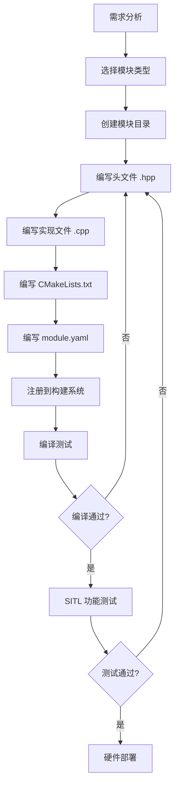

# 自定义 PX4 模块开发

> 预计阅读：22 分钟 | 前置知识：PX4 架构基础、C/C++ 编程、CMake 构建系统、uORB 消息机制

---

## 1. 模块开发概述

PX4 的模块化架构允许开发者添加自定义模块来扩展功能。每个模块是一个独立的任务，通过 uORB 消息总线与其他模块通信。

### 1.1 何时需要自定义模块

| 场景 | 方案 | 复杂度 |
|------|------|:------:|
| 发送自定义 MAVLink 消息 | 修改 mavlink 模块 | 低 |
| 添加新传感器驱动 | 新建驱动模块 | 中 |
| 实现自定义控制算法 | 新建控制器模块 | 中 |
| 添加自定义飞行任务 | 新建 Flight Task | 中 |
| 集成 Simulink 生成的控制器 | 新建模块 + 代码集成 | 中 |
| 修改混控逻辑 | 修改 control_allocator | 高 |

### 1.2 模块开发工作流



---

## 2. 模块基本结构

### 2.1 目录结构

```
src/modules/my_module/
├── CMakeLists.txt          # 构建配置
├── MyModule.cpp            # 主实现文件
├── MyModule.hpp            # 头文件
├── MyModule_params.c       # 参数定义
└── module.yaml             # 模块元数据
```

### 2.2 模块框架代码

```cpp
// MyModule.hpp
#pragma once

#include <px4_platform_common/module.h>
#include <px4_platform_common/module_params.h>
#include <px4_platform_common/px4_work_queue/ScheduledWorkItem.hpp>
#include <uORB/Subscription.hpp>
#include <uORB/Publication.hpp>
#include <uORB/topics/vehicle_local_position.h>
#include <uORB/topics/vehicle_attitude.h>

using namespace time_literals;

class MyModule : public ModuleBase<MyModule>, public ModuleParams,
                 public ScheduledWorkItem
{
public:
    MyModule();
    ~MyModule() override = default;

    /** @brief ModuleBase 接口: 任务入口 */
    static int task_spawn(int argc, char *argv[]);

    /** @brief ModuleBase 接口: 实例化 */
    static MyModule *instantiate(int argc, char *argv[], int instance);

    /** @brief ModuleBase 接口: 自定义命令 */
    static int custom_command(int argc, char *argv[]);

    /** @brief ModuleBase 接口: 用法说明 */
    static int print_usage(const char *reason = nullptr);

    /** @brief 主运行循环 */
    void Run() override;

private:
    // uORB 订阅
    uORB::Subscription _local_pos_sub{ORB_ID(vehicle_local_position)};
    uORB::Subscription _att_sub{ORB_ID(vehicle_attitude)};

    // uORB 发布 (根据需要添加)
    // uORB::PublicationMyMsg_s> _my_pub{ORB_ID(my_topic)};

    // 参数
    DEFINE_PARAMETERS(
        (ParamFloat<px4::params::MY_MOD_GAIN>) _param_gain,
        (ParamInt<px4::params::MY_MOD_RATE>) _param_rate
    )

    // 内部状态
    hrt_abstime _last_run{0};
    float _accumulated_value{0.f};
};
```

```cpp
// MyModule.cpp
#include "MyModule.hpp"

#include <px4_platform_common/getopt.h>
#include <px4_platform_common/log.h>
#include <px4_platform_common/posix.h>

MyModule::MyModule() :
    ModuleParams(nullptr),
    ScheduledWorkItem(MODULE_NAME, px4::wq_configurations::lp_default)
{
}

int MyModule::task_spawn(int argc, char *argv[])
{
    int instance = 0;

    // 解析命令行参数
    int ch;
    int myoptind = 1;
    const char *myoptarg = nullptr;

    while ((ch = px4_getopt(argc, argv, "i:", &myoptind, &myoptarg)) != EOF) {
        switch (ch) {
        case 'i':
            instance = atoi(myoptarg);
            break;
        }
    }

    MyModule *instance_ptr = instantiate(argc, argv, instance);

    if (!instance_ptr) {
        PX4_ERR("alloc failed");
        return -1;
    }

    _object.store(instance_ptr);
    _task_id = task_id_is_work_queue;

    instance_ptr->ScheduleOnInterval(1000_us / _param_rate.get());  // 可配置频率

    return PX4_OK;
}

MyModule *MyModule::instantiate(int argc, char *argv[], int instance)
{
    MyModule *obj = new MyModule();

    if (!obj) {
        PX4_ERR("alloc failed");
        return nullptr;
    }

    _object.store(obj);
    obj->ScheduleNow();
    return obj;
}

void MyModule::Run()
{
    if (should_exit()) {
        ScheduleClear();
        exit_and_cleanup();
        return;
    }

    // 读取位置数据
    vehicle_local_position_s local_pos;

    if (_local_pos_sub.update(&local_pos)) {
        // 处理数据
        _accumulated_value += local_pos.vz * _param_gain.get();

        PX4_DEBUG("Alt: %.2f m, Vz: %.2f m/s, Accum: %.2f",
                  (double)-local_pos.z, (double)local_pos.vz,
                  (double)_accumulated_value);
    }
}

int MyModule::custom_command(int argc, char *argv[])
{
    return print_usage("unknown command");
}

int MyModule::print_usage(const char *reason)
{
    if (reason) {
        PX4_WARN("%s\n", reason);
    }

    PRINT_MODULE_DESCRIPTION(
        R"DESCR_STR(
### Description
My custom module for PX4.

### Examples
$ my_module start
$ my_module stop
)DESCR_STR");

    PRINT_MODULE_USAGE_NAME("my_module", "template");
    PRINT_MODULE_USAGE_COMMAND("start");
    PRINT_MODULE_USAGE_PARAM_INT('i', 0, 0, 1, "Instance", true);
    PRINT_MODULE_USAGE_DEFAULT_COMMANDS();

    return 0;
}

extern "C" __EXPORT int my_module_main(int argc, char *argv[])
{
    return MyModule::main(argc, argv);
}
```

### 2.3 CMakeLists.txt

```cmake
px4_add_module(
    MODULE modules__my_module
    MAIN my_module
    SRCS
        MyModule.cpp
    INCLUDES
        ${CMAKE_CURRENT_SOURCE_DIR}
    DEPENDS
        uORB
        px4_platform_common
        px4_work_queue
)
```

### 2.4 module.yaml

```yaml
module_name: My Custom Module

parameters:
    - group: MY_MOD
      definitions:
          MY_MOD_GAIN:
              description: "Processing gain"
              type: float
              default: 1.0
              min: 0.0
              max: 100.0
          MY_MOD_RATE:
              description: "Update rate (Hz)"
              type: int32
              default: 100
              min: 10
              max: 1000
```

---

## 3. uORB 订阅与发布

### 3.1 订阅模式

```cpp
// 头文件中声明订阅
uORB::Subscription _sub{ORB_ID(vehicle_local_position)};

// Run() 中检查更新
void MyModule::Run()
{
    vehicle_local_position_s data;

    // 方式 1: 检查是否有更新
    if (_sub.updated()) {
        _sub.copy(&data);
        // 处理 data
    }

    // 方式 2: 直接尝试读取 (推荐)
    if (_sub.update(&data)) {
        // data 已更新，处理数据
    }
}
```

### 3.2 多话题订阅

```cpp
class MyModule : public ModuleBase<MyModule>, public ModuleParams,
                 public ScheduledWorkItem
{
private:
    // 声明多个订阅
    uORB::Subscription _local_pos_sub{ORB_ID(vehicle_local_position)};
    uORB::Subscription _att_sub{ORB_ID(vehicle_attitude)};
    uORB::Subscription _gps_sub{ORB_ID(vehicle_gps_position)};
    uORB::Subscription _battery_sub{ORB_ID(battery_status)};
    uORB::Subscription _cmd_sub{ORB_ID(vehicle_command)};
};

void MyModule::Run()
{
    vehicle_local_position_s local_pos;
    vehicle_attitude_s att;
    vehicle_gps_position_s gps;

    // 每个话题独立检查更新
    if (_local_pos_sub.update(&local_pos)) {
        // 处理位置数据
    }

    if (_att_sub.update(&att)) {
        // 处理姿态数据
    }

    if (_gps_sub.update(&gps)) {
        // 处理 GPS 数据
    }
}
```

### 3.3 发布自定义消息

**步骤 1：定义消息文件**

```
# msg/MyCustomMsg.msg
uint64 timestamp          # 时间戳
float32 value_a           # 自定义值 A
float32 value_b           # 自定义值 B
float32[3] vector_c       # 三维向量 C
uint8 status              # 状态标志
```

**步骤 2：注册消息**

```cmake
# msg/CMakeLists.txt 中添加
set(msg_files
    # ... 现有消息 ...
    MyCustomMsg.msg
)
```

**步骤 3：在模块中发布**

```cpp
#include <uORB/Publication.hpp>
#include <uORB/topics/my_custom_msg.h>

class MyModule : ...
{
private:
    uORB::Publication<my_custom_msg_s> _my_msg_pub{ORB_ID(my_custom_msg)};
};

void MyModule::Run()
{
    my_custom_msg_s msg{};
    msg.timestamp = hrt_absolute_time();
    msg.value_a = 3.14f;
    msg.value_b = 2.72f;
    msg.vector_c[0] = 1.0f;
    msg.vector_c[1] = 0.0f;
    msg.vector_c[2] = 0.0f;
    msg.status = 1;

    _my_msg_pub.publish(msg);
}
```

---

## 4. 添加自定义飞行任务 (Flight Task)

### 4.1 Flight Task 架构

```
src/lib/flight_tasks/
├── FlightTask.hpp              # 基类
├── FlightTask.cpp
├── tasks/
│   ├── FlightTaskAuto.hpp
│   ├── FlightTaskManualPosition.hpp
│   ├── FlightTaskOffboard.hpp
│   └── ...
└── CMakeLists.txt
```

### 4.2 创建自定义 Flight Task

```cpp
// tasks/FlightTaskMyCustom/FlightTaskMyCustom.hpp
#pragma once

#include "FlightTask.h"

class FlightTaskMyCustom : public FlightTask
{
public:
    FlightTaskMyCustom() = default;
    virtual ~FlightTaskMyCustom() = default;

    bool activate(const trajectory_setpoint_s &last_setpoint) override;
    bool update() override;

private:
    // 自定义内部状态
    matrix::Vector3f _target_position{};
    float _target_yaw{0.f};

    // 自定义方法
    void computeTargetPosition();
    matrix::Vector3f computeVelocityCommand();
};
```

```cpp
// tasks/FlightTaskMyCustom/FlightTaskMyCustom.cpp
#include "FlightTaskMyCustom.hpp"

bool FlightTaskMyCustom::activate(const trajectory_setpoint_s &last_setpoint)
{
    // 任务激活时调用一次
    bool ret = FlightTask::activate(last_setpoint);

    // 初始化目标位置为当前位置
    _target_position = _position;

    return ret;
}

bool FlightTaskMyCustom::update()
{
    // 每个控制周期调用
    // 1. 更新目标位置
    computeTargetPosition();

    // 2. 计算速度指令
    _velocity_setpoint = computeVelocityCommand();

    // 3. 设定推力 (交给位置控制器)
    _yaw_setpoint = _target_yaw;

    return true;
}

void FlightTaskMyCustom::computeTargetPosition()
{
    // 自定义目标计算逻辑
    // 例如: 跟踪圆形轨迹
    const float radius = 5.0f;
    const float omega = 0.3f;
    const float t = hrt_absolute_time() / 1e6f;

    _target_position(0) = radius * cosf(omega * t);
    _target_position(1) = radius * sinf(omega * t);
    _target_position(2) = -5.0f;  // 5m 高度 (NED)
    _target_yaw = omega * t;
}

matrix::Vector3f FlightTaskMyCustom::computeVelocityCommand()
{
    // P 控制: 速度 = Kp * 位置误差
    const float Kp = 0.5f;
    matrix::Vector3f pos_error = _target_position - _position;
    return pos_error * Kp;
}
```

### 4.3 注册 Flight Task

```cmake
# src/lib/flight_tasks/CMakeLists.txt 中添加
list(APPEND flight_tasks_all
    FlightTaskMyCustom
)

# 创建子目录的 CMakeLists.txt
# tasks/FlightTaskMyCustom/CMakeLists.txt
add_library(FlightTaskMyCustom
    FlightTaskMyCustom.cpp
)
target_link_libraries(FlightTaskMyCustom PUBLIC FlightTask)
```

```cpp
// tasks/FlightTasks.hpp 中注册
#include "tasks/FlightTaskMyCustom/FlightTaskMyCustom.hpp"

// 在 flight_task_selection.cpp 中添加映射
case MyCustom:
    _task = new (&_task_union.MyCustom) FlightTaskMyCustom();
    break;
```

---

## 5. 添加自定义混控器

PX4 1.14+ 使用 Dynamic Control Allocation。自定义混控通过配置文件实现。

### 5.1 混控器配置文件

```
# ROMFS/px4fmu_common/mixers/my_custom_airframe.main.mix
# 自定义四旋翼混控器配置

# 电机 1: 前左 (逆时针)
M: 4
O:      10000  10000  10000  10000
S: 0 0  10000  10000      0 -10000  10000
S: 0 1  10000  10000      0 -10000  10000
S: 0 2  10000  10000      0 -10000  10000
S: 0 3  10000  10000      0 -10000  10000
```

### 5.2 Dynamic Control Allocation 配置

PX4 1.14+ 使用 YAML 配置控制分配：

```yaml
# 例如: 六旋翼配置
actuator_output:
  - type: "MOTORS"
    group: 0
    count: 6

control_allocation:
  - type: "MULTIROTOR"
    geometry:
      rotors:
        - position: [0.15, 0.0, 0.0]   # 电机 1 位置 (m)
          axis: [0.0, 0.0, -1.0]         # 推力方向
          direction: 1                     # 旋转方向 (1=CW, -1=CCW)
        - position: [-0.15, 0.0, 0.0]
          axis: [0.0, 0.0, -1.0]
          direction: -1
        # ... 更多电机
```

---

## 6. 编译与烧录

### 6.1 编译自定义固件

```bash
# SITL 编译测试
make px4_sitl_default

# 硬件目标编译 (以 Pixhawk 6X 为例)
make px4_fmu-v6x_default

# 查看所有可用目标
make list_config_targets

# 仅编译特定模块 (增量编译)
make px4_sitl_default modules__my_module
```

### 6.2 烧录到飞控

```bash
# USB 烧录
make px4_fmu-v6x_default upload

# 无线烧录 (需要先配置 WiFi)
# 使用 QGroundControl 固件更新功能
```

### 6.3 启动自定义模块

```bash
# 在 PX4 控制台 (nsh) 中手动启动
my_module start

# 带参数启动
my_module start -i 0

# 停止模块
my_module stop

# 查看模块状态
my_module status
```

**自动启动：** 在启动脚本中添加

```bash
# ROMFS/px4fmu_common/init.d/rc.my_module
#!/bin/sh

my_module start
```

---

## 7. 调试方法

### 7.1 GDB 调试 (SITL)

```bash
# 启动 GDB 调试
make px4_sitl_default gazebo-classic none

# 在另一个终端连接 GDB
gdb build/px4_sitl_default/bin/px4

# 设置断点
(gdb) break MyModule::Run
(gdb) continue

# 查看变量
(gdb) print _accumulated_value
(gdb) print local_pos
```

**VSCode 调试配置：**

```json
{
    "version": "0.2.0",
    "configurations": [
        {
            "name": "PX4 SITL Debug",
            "type": "cppdbg",
            "request": "launch",
            "program": "${workspaceFolder}/build/px4_sitl_default/bin/px4",
            "args": ["-d", "${workspaceFolder}/build/px4_sitl_default/etc"],
            "stopAtEntry": false,
            "cwd": "${workspaceFolder}",
            "environment": [],
            "externalConsole": false,
            "MIMode": "gdb",
            "setupCommands": [
                {
                    "description": "Enable pretty-printing",
                    "text": "-enable-pretty-printing",
                    "ignoreFailures": true
                }
            ]
        }
    ]
}
```

### 7.2 串口控制台调试

```bash
# 硬件调试: 通过串口连接 NuttShell (nsh)
# Pixhawk 调试串口 (通常是 TELEM1 或专用调试口)

# 使用 screen 连接
screen /dev/ttyACM0 57600

# 使用 minicom 连接
minicom -D /dev/ttyACM0 -b 57600

# 常用 nsh 命令
nsh> my_module start          # 启动模块
nsh> my_module status         # 查看状态
nsh> uorb top                 # 查看所有 uORB 话题
nsh> uorb top -a vehicle_attitude  # 查看特定话题频率
nsh> top                      # 查看任务 CPU 占用
nsh> free                     # 查看内存使用
nsh> param show MY_MOD_GAIN   # 查看参数值
nsh> param set MY_MOD_GAIN 2.0  # 设置参数值
```

### 7.3 日志分析

```bash
# PX4 日志系统
# 日志格式: ulog (.ulg)
# 日志位置: /fs/microsd/log/

# 使用 pyulog 分析
pip install pyulog

# 查看日志信息
ulog_info log.ulg

# 导出特定话题
ulog_export_csv.ulg -m vehicle_local_position -o pos.csv
ulog_export_csv.ulg -m my_custom_msg -o custom.csv

# 使用 Flight Review 在线分析
# 上传 .ulg 到 https://logs.px4.io/
```

### 7.4 常用调试输出

```cpp
// PX4 日志宏
PX4_DEBUG("调试信息: %.2f", value);      // 仅调试构建
PX4_INFO("信息: 模块已启动");               // 信息级别
PX4_WARN("警告: 值超出范围 %.2f", value);  // 警告级别
PX4_ERR("错误: 初始化失败");               // 错误级别

// 条件调试输出
if (_debug_enabled) {
    PX4_INFO("pos: [%.2f, %.2f, %.2f]",
             (double)pos.x, (double)pos.y, (double)pos.z);
}
```

---

## 8. 修改现有模块 vs 创建新模块

| 对比维度 | 修改现有模块 | 创建新模块 |
|---------|------------|-----------|
| **开发速度** | 快 (直接改代码) | 中 (需搭建框架) |
| **代码侵入性** | 高 (影响原有功能) | 低 (完全独立) |
| **升级维护** | 困难 (合并冲突) | 容易 (独立模块) |
| **测试复杂度** | 需回归测试 | 仅测试新模块 |
| **代码复用** | 不可复用 | 可独立复用 |
| **适用场景** | 小改动、Bug 修复 | 新功能、自定义算法 |

**建议：** 除非是简单的参数调整或 Bug 修复，优先选择创建新模块。

---

## 9. Simulink 代码集成最佳实践

### 9.1 目录组织

```
src/modules/simulink_controller/
├── CMakeLists.txt
├── SimulinkController.cpp      # PX4 模块封装
├── SimulinkController.hpp
├── SimulinkController_params.c
├── module.yaml
├── generated/                  # Simulink 生成的代码
│   ├── rt_model.h
│   ├── controller.c
│   ├── controller.h
│   ├── controller_data.c
│   └── rtwtypes.h
└── README.md
```

### 9.2 隔离生成代码

```cpp
// SimulinkController.hpp 中使用 extern "C" 隔离
extern "C" {
#include "generated/rt_model.h"
#include "generated/controller.h"
}

class SimulinkController : public ModuleBase<SimulinkController>, ...
{
private:
    // Simulink 模型实例
    RT_MODEL_controller_T _rtModel;
    P_controller_T _params;
    ExtU_controller_T _inputs;
    ExtY_controller_T _outputs;
};
```

### 9.3 构建配置

```cmake
px4_add_module(
    MODULE modules__simulink_controller
    MAIN simulink_controller
    SRCS
        SimulinkController.cpp
        generated/controller.c
        generated/controller_data.c
    INCLUDES
        ${CMAKE_CURRENT_SOURCE_DIR}
        ${CMAKE_CURRENT_SOURCE_DIR}/generated
    DEPENDS
        uORB
        px4_platform_common
    COMPILE_FLAGS
        -Wno-unused-parameter  # Simulink 生成代码可能有未使用参数
)
```

---

## 思考题

**1. 解释 ModuleBase 和 ScheduledWorkItem 在 PX4 模块中的作用和区别。**

<details><summary>参考答案</summary>

- **ModuleBase**：提供模块的生命周期管理接口，包括 `task_spawn`（启动）、`instantiate`（实例化）、`custom_command`（自定义命令）、`print_usage`（帮助信息）。它是模块的入口框架，处理命令行解析和任务创建。

- **ScheduledWorkItem**：提供工作队列调度接口，使模块可以周期性地在工作队列上执行 `Run()` 方法。它负责定时调度，支持 `ScheduleOnInterval`（固定间隔）和 `ScheduleNow`（立即执行）。

区别：ModuleBase 处理模块的"外壳"（启动、停止、命令），ScheduledWorkItem 处理模块的"内核"（周期性任务执行）。一个模块通常同时继承两者。

</details>

**2. 为什么建议在新模块中使用 `uORB::Subscription::update()` 而不是 `orb_copy()`？**

<details><summary>参考答案</summary>

`update()` 是现代 C++ 风格的封装，优势包括：
- 自动检查更新状态，无需手动调用 `orb_check`
- RAII 风格，订阅生命周期自动管理
- 类型安全，编译时检查消息类型
- 代码更简洁，减少样板代码
- 与 PX4 现代代码风格一致

`orb_copy()` 是旧式 C API，虽然仍可用，但推荐使用新的 C++ 封装。

</details>

**3. 如何在不修改 PX4 主代码库的情况下测试自定义模块？**

<details><summary>参考答案</summary>

方法：
1. **外部模块目录**：在 PX4-Autopilot 外部创建模块，通过 CMake 的 `EXTERNAL_MODULES` 变量引入
2. **uavcan_module 模式**：参考外部模块模板，使用 `add_subdirectory` 引入
3. **SITL 环境隔离**：使用独立的 SITL 构建目录测试
4. **Git 分支管理**：在功能分支上开发，测试通过后合并

这样可以避免污染主代码库，便于维护和升级。

</details>

**4. 调试 PX4 模块时，PX4_INFO 和 PX4_DEBUG 的输出在哪里可以看到？**

<details><summary>参考答案</summary>

- **SITL**：输出到 PX4 进程的终端 (stdout/stderr)，即运行 `make px4_sitl_default` 的终端窗口
- **硬件**：输出到 NuttShell 控制台，通过调试串口 (如 TELEM2) 连接查看
- **MAVLink**：可以通过 MAVLink `STATUSTEXT` 消息发送到 QGroundControl 的消息面板
- **日志**：PX4_INFO 级别以上的消息会记录到 .ulg 日志文件中
- **PX4_DEBUG**：仅在调试构建中输出，默认构建不包含（需要 `PX4_DEBUG=1` 编译）

</details>

**5. 在集成 Simulink 生成的代码时，如何处理生成代码中的全局变量和静态变量？**

<details><summary>参考答案</summary>

Simulink 生成的代码可能包含全局/静态变量（如状态变量），处理方法：

1. **封装到结构体**：将全局变量封装到模型数据结构中（RT_MODEL），每个实例独立
2. **避免多实例**：如果生成代码使用全局变量，限制模块只能有一个实例
3. **重命名冲突**：使用编译选项 `-D` 重命名可能冲突的全局符号
4. **检查生成配置**：在 Simulink Coder 中选择 "Reusable function" 选项，生成可重入代码
5. **extern 隔离**：在头文件中用 `extern "C"` 包裹，防止 C++ 名称修饰问题

</details>
