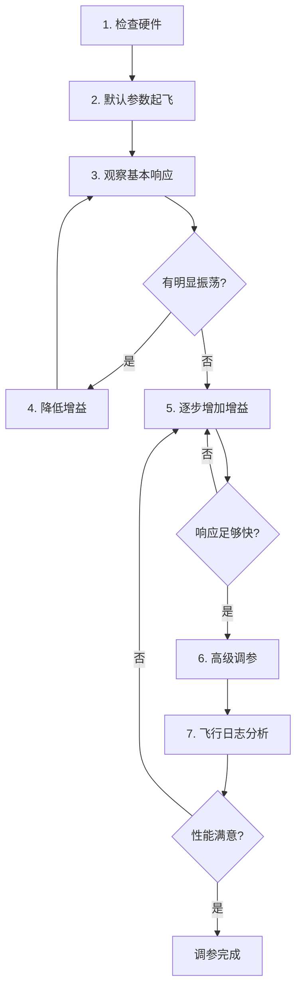

# PX4 日志分析与调参

> 预计阅读：20 分钟 | 前置知识：PX4 架构基础、控制理论基础、PID 参数整定概念

---

## 1. PX4 日志系统概述

PX4 使用 **ulog** 格式记录飞行日志，这是一种高效的二进制日志格式，记录了所有 uORB 话题的数据。

### 1.1 ulog 格式特点

| 特性 | 说明 |
|------|------|
| 二进制格式 | 紧凑存储，减少 SD 卡写入带宽需求 |
| 自描述 | 包含消息定义，无需外部 schema 文件 |
| 高效压缩 | 使用 LZ4 压缩，减少存储空间 |
| 多话题记录 | 同时记录所有订阅的 uORB 话题 |
| 时间戳精度 | 微秒级精度，支持精确时序分析 |

### 1.2 日志存储位置

```
SD 卡日志目录:
/fs/microsd/log/
├── 2024-01-15/
│   ├── 10_30_00.ulg    # 按时间命名
│   ├── 10_45_00.ulg
│   └── ...
└── 2024-01-16/
    └── ...
```

### 1.3 日志配置参数

| 参数 | 说明 | 默认值 |
|------|------|:------:|
| `SDLOG_PROFILE` | 日志记录配置 | 3 (默认) |
| `SDLOG_MODE` | 日志记录模式 | 0 (按命令) |
| `SDLOG_DIRS_MAX` | 最大日志目录数 | 0 (无限) |
| `SDLOG_MISSION` | 是否记录任务日志 | 1 (是) |
| `SDLOG_BOOT_LOG` | 是否记录启动日志 | 0 (否) |

**日志配置位掩码 (SDLOG_PROFILE)：**

```
位 0: 默认传感器 (默认启用)
位 1: 估计器 (EKF) 重放数据
位 2: 传感器全速记录
位 3: 姿态控制器
位 4: 位置控制器
位 5: 性能分析
位 6: 电池监控
位 7: 电机输出
位 8: 遥控器输入
```

---

## 2. Flight Review 在线分析

### 2.1 使用方法

[Flight Review](https://logs.px4.io/) 是 PX4 官方的在线日志分析工具。

```
使用流程:

1. 获取日志文件
   ├── SD 卡取出 .ulg 文件
   ├── QGroundControl 导出日志
   └── MAVLink FTP 下载

2. 上传到 Flight Review
   ├── 打开 https://logs.px4.io/
   ├── 点击 "Upload a log"
   └── 选择 .ulg 文件

3. 分析报告
   ├── 自动生成交互式图表
   ├── 标记异常事件
   └── 提供调参建议
```

### 2.2 Flight Review 报告内容

Flight Review 自动分析以下内容：

| 分析项 | 说明 | 关键指标 |
|--------|------|---------|
| 姿态跟踪 | 期望 vs 实际姿态 | 角度误差 < 5° |
| 位置跟踪 | 期望 vs 实际位置 | 位置误差 < 1m |
| 振荡检测 | 高频振动分析 | 振动等级 |
| 电池状态 | 电压、电流、温度 | 电压降 < 0.5V/cell |
| GPS 质量 | 卫星数、HDOP、精度 | HDOP < 2.0 |
| EKF 健康 | 估计器状态、创新值 | 创新值在合理范围 |
| CPU 负载 | 主控制器 CPU 使用率 | < 80% |
| 内存使用 | 堆内存使用 | < 80% |

---

## 3. 关键日志话题分析

### 3.1 姿态日志 (vehicle_attitude)

```
关键字段:
├── q[0..3]           # 姿态四元数 [w, x, y, z]
├── rollspeed          # 滚转角速率 (rad/s)
├── pitchspeed         # 俯仰角速率 (rad/s)
└── yawspeed           # 偏航角速率 (rad/s)

关联话题:
├── vehicle_attitude_setpoint  # 期望姿态
├── vehicle_rates_setpoint     # 期望角速率
└── actuator_controls          # 控制输出
```

**分析方法：**

```python
import pyulog
import numpy as np
import matplotlib.pyplot as plt

# 加载日志
ulog = pyulog.ULog('flight.ulg')

# 提取姿态数据
att = ulog.get_dataset('vehicle_attitude')
att_sp = ulog.get_dataset('vehicle_attitude_setpoint')

# 转换四元数到欧拉角
def quat_to_euler(q):
    roll = np.arctan2(2*(q[0]*q[1] + q[2]*q[3]),
                       1 - 2*(q[1]**2 + q[2]**2))
    pitch = np.arcsin(2*(q[0]*q[2] - q[3]*q[1]))
    yaw = np.arctan2(2*(q[0]*q[3] + q[1]*q[2]),
                      1 - 2*(q[2]**2 + q[3]**2))
    return np.degrees(roll), np.degrees(pitch), np.degrees(yaw)

# 绘制姿态跟踪
fig, axes = plt.subplots(3, 1, figsize=(12, 8))

for i, (name, color) in enumerate(zip(['Roll', 'Pitch', 'Yaw'], ['r', 'g', 'b'])):
    axes[i].plot(att.data['timestamp'], att_roll, color, label='实际')
    axes[i].plot(att_sp.data['timestamp'], sp_roll, color+'--', label='期望')
    axes[i].set_ylabel(f'{name} (°)')
    axes[i].legend()
    axes[i].grid(True)

plt.xlabel('时间 (s)')
plt.title('姿态跟踪分析')
plt.show()
```

### 3.2 位置日志 (vehicle_local_position)

```
关键字段:
├── x, y, z           # NED 局部位置 (m)
├── vx, vy, vz        # NED 速度 (m/s)
├── ax, ay, az        # NED 加速度 (m/s²)
├── eph               # 水平位置精度 (m)
├── epv               # 垂直位置精度 (m)
└── evh               # 水平速度精度 (m/s)
```

### 3.3 电机输出日志 (actuator_motors)

```
关键字段:
├── control[0..3]     # 归一化电机控制量 [0, 1]
└── timestamp         # 时间戳

分析要点:
├── 电机是否饱和 (接近 1.0)
├── 电机分配是否均匀
├── 是否有电机故障 (输出为 0)
└── 电机响应延迟
```

### 3.4 传感器日志 (sensor_combined)

```
关键字段:
├── gyro_rad[0..2]        # 陀螺仪 (rad/s)
├── accelerometer_m_s2[0..2]  # 加速度计 (m/s²)
├── magnetometer_ga[0..2]     # 磁力计 (Ga)
└── baro_alt_meter            # 气压高度 (m)

分析要点:
├── 振动水平 (加速度计高频分量)
├── 传感器噪声 (标准差)
├── 传感器偏置 (均值)
└── 数据丢失 (时间戳间隔)
```

### 3.5 EKF 状态日志 (estimator_status)

```
关键字段:
├── innovation[0..5]      # EKF 创新值 (观测 - 预测)
├── innovation_test_ratio # 创新值测试比率
├── gps_check_fail_flags  # GPS 检查失败标志
├── solution_status_flags # 解状态标志
└── covariances[0..23]    # 状态协方差
```

---

## 4. PID 调参工作流

### 4.1 调参原则



### 4.2 多旋翼 PID 参数

**角速率控制器 (最内环)：**

| 参数 | 说明 | 默认值 | 调参范围 |
|------|------|:------:|:--------:|
| `MC_ROLLRATE_P` | 滚转角速率 P 增益 | 0.15 | 0.05-0.3 |
| `MC_ROLLRATE_I` | 滚转角速率 I 增益 | 0.2 | 0.05-0.5 |
| `MC_ROLLRATE_D` | 滚转角速率 D 增益 | 0.003 | 0.001-0.01 |
| `MC_PITCHRATE_P` | 俯仰角速率 P 增益 | 0.15 | 0.05-0.3 |
| `MC_PITCHRATE_I` | 俯仰角速率 I 增益 | 0.2 | 0.05-0.5 |
| `MC_PITCHRATE_D` | 俯仰角速率 D 增益 | 0.003 | 0.001-0.01 |
| `MC_YAWRATE_P` | 偏航角速率 P 增益 | 0.2 | 0.1-0.5 |
| `MC_YAWRATE_I` | 偏航角速率 I 增益 | 0.1 | 0.02-0.3 |

**姿态控制器 (外环)：**

| 参数 | 说明 | 默认值 | 调参范围 |
|------|------|:------:|:--------:|
| `MC_ROLL_P` | 滚转姿态 P 增益 | 6.5 | 3-12 |
| `MC_PITCH_P` | 俯仰姿态 P 增益 | 6.5 | 3-12 |
| `MC_YAW_P` | 偏航姿态 P 增益 | 2.8 | 1-5 |

**位置控制器：**

| 参数 | 说明 | 默认值 | 调参范围 |
|------|------|:------:|:--------:|
| `MPC_XY_P` | 水平位置 P 增益 | 0.8 | 0.5-1.5 |
| `MPC_Z_P` | 垂直位置 P 增益 | 1.0 | 0.5-2.0 |
| `MPC_XY_VEL_P_ACC` | 水平速度 P 增益 | 1.8 | 0.5-4.0 |
| `MPC_Z_VEL_P_ACC` | 垂直速度 P 增益 | 4.0 | 2-8 |

### 4.3 调参步骤详解

**Step 1: 检查硬件**

```
检查清单:
├── 螺旋桨安装正确 (CW/CCW 位置)
├── 电机转向正确
├── 飞控安装方向正确 (参数: SENS_BOARD_ROT)
├── 重心在几何中心附近
├── ESC 校准完成
└── 遥控器校准完成
```

**Step 2: 默认参数起飞**

```bash
# 恢复默认参数 (QGroundControl 或 nsh)
param set-default MC_ROLLRATE_P 0.15
# 或加载整套默认参数
param load /etc/init.d/px4/default_params.x500
```

**Step 3: 角速率环调参**

```
角速率环调参方法:

1. 将姿态 P 增益降低 (MC_ROLL_P=3.0)
2. 仅调整角速率 P 增益
3. 缓慢增加 MC_ROLLRATE_P
   ├── 观察角速率跟踪响应
   ├── 响应太慢: 增大 P
   └── 出现高频振荡: 减小 P

4. 添加 D 增益抑制超调
   ├── MC_ROLLRATE_D 从小值开始 (0.001)
   └── 逐步增加直到超调可接受

5. 添加 I 增益消除稳态误差
   ├── MC_ROLLRATE_I 从小值开始 (0.05)
   └── 逐步增加直到稳态误差消除
```

**Step 4: 姿态环调参**

```
姿态环调参方法:

1. 确保角速率环已调好
2. 增加 MC_ROLL_P (从 3.0 到 6.5)
3. 观察姿态跟踪响应
   ├── 跟踪太慢: 增大 P
   └── 振荡: 减小 P

4. 对俯仰和偏航重复上述步骤
```

---

## 5. EKF 日志分析

### 5.1 EKF 健康指标

| 指标 | 正常范围 | 异常表现 |
|------|---------|---------|
| 位置创新值 | < 0.5 m | > 1.0 m (传感器异常) |
| 速度创新值 | < 0.5 m/s | > 1.0 m/s (GPS 异常) |
| 姿态创新值 | < 0.1 rad | > 0.3 rad (磁力计异常) |
| innovation_test_ratio | < 1.0 | > 1.0 (创新值过大) |
| GPS 检查标志 | 0 (通过) | 非 0 (GPS 质量差) |

### 5.2 EKF 创新值分析

```python
# EKF 创新值分析
import pyulog

ulog = pyulog.ULog('flight.ulg')
est = ulog.get_dataset('estimator_status')

# 提取创新值
innovations = est.data['innovation']
test_ratios = est.data['innovation_test_ratio']

# 检查创新值
for i, (name, threshold) in enumerate(zip(
    ['pos_x', 'pos_y', 'pos_z', 'vel_x', 'vel_y', 'vel_z'],
    [0.5, 0.5, 0.5, 0.5, 0.5, 0.5]
)):
    innov = innovations[:, i] if innovations.ndim > 1 else innovations
    max_innov = np.max(np.abs(innov))
    if max_innov > threshold:
        print(f"警告: {name} 创新值过大 ({max_innov:.3f} > {threshold})")

# 检查测试比率
max_ratio = np.max(test_ratios)
if max_ratio > 1.0:
    print(f"警告: EKF 创新值测试比率过大 ({max_ratio:.2f})")
```

### 5.3 常见 EKF 问题

| 问题 | 日志特征 | 可能原因 | 解决方案 |
|------|---------|---------|---------|
| 位置漂移 | 创新值持续偏大 | GPS 信号差 | 检查 GPS 天线、开阔场地 |
| 高度跳变 | Z 轴创新值突变 | 气压计受风影响 | 调整 EKF2_HGT_MODE |
| 偏航不准 | 偏航创新值异常 | 磁力计干扰 | 重新校准、远离电流源 |
| 速度估计差 | 速度创新值大 | IMU 噪声大 | 检查减振、降低 EKF2_ACC_NOISE |

---

## 6. 常见问题诊断

### 6.1 振荡诊断

```
振荡类型识别:

高频振荡 (>50 Hz):
├── 特征: 陀螺仪数据有明显高频分量
├── 原因: 机械振动、螺旋桨不平衡
└── 解决: 检查减振球、平衡螺旋桨

中频振荡 (10-50 Hz):
├── 特征: 角速率跟踪有振荡
├── 原因: 角速率 PID 增益过高
└── 解决: 降低 MC_ROLLRATE_P/D

低频振荡 (<10 Hz):
├── 特征: 姿态或位置跟踪有振荡
├── 原因: 姿态 P 增益过高
└── 解决: 降低 MC_ROLL_P
```

### 6.2 电池相关问题

```
电池问题诊断:

电压骤降:
├── 满油门时电压下降 > 1V/cell
├── 原因: 电池内阻高、放电倍率不足
└── 解决: 更换高质量电池

电压恢复慢:
├── 减小油门后电压恢复慢
├── 原因: 电池老化、容量不足
└── 解决: 更换新电池

电流异常:
├── 电流值远高于预期
├── 原因: 螺旋桨尺寸不匹配、电机故障
└── 解决: 检查螺旋桨和电机匹配
```

### 6.3 GPS 问题

```
GPS 质量诊断:

卫星数不足 (< 6 颗):
├── 检查 GPS 天线安装位置
├── 确保天线朝上、无遮挡
└── 等待 GPS 初始化完成

HDOP 过高 (> 2.0):
├── GPS 信号质量差
├── 避免在建筑物密集区域飞行
└── 使用 RTK GPS 提高精度

GPS 漂移:
├── 位置跳变、轨迹不连续
├── 检查多路径效应
└── 使用双频 GPS 或 RTK
```

---

## 7. 参数调优工具

### 7.1 QGroundControl 参数界面

```
QGroundControl 参数调整步骤:

1. 连接飞控
   └── USB 或数传连接

2. 进入参数页面
   └── Vehicle Setup → Parameters

3. 搜索参数
   └── 输入参数名称或关键字

4. 修改参数值
   ├── 查看参数说明
   ├── 查看默认值和范围
   └── 修改后点击 "Save"

5. 参数生效
   ├── 部分参数立即生效
   └── 部分参数需要重启飞控

6. 参数备份
   └── 导出参数文件 (.params)
```

### 7.2 自动化调参脚本

```python
#!/usr/bin/env python3
"""
PX4 参数自动调整脚本
使用 pyulog 分析日志，自动建议参数调整
"""

import pyulog
import numpy as np

def analyze_attitude_tracking(logfile):
    """分析姿态跟踪性能"""
    ulog = pyulog.ULog(logfile)

    att = ulog.get_dataset('vehicle_attitude')
    att_sp = ulog.get_dataset('vehicle_attitude_setpoint')

    # 计算跟踪误差
    # (简化实现，实际需要四元数到欧拉角转换)
    roll_error = np.std(att.data['rollspeed'] - att_sp.data['roll_body'])
    pitch_error = np.std(att.data['pitchspeed'] - att_sp.data['pitch_body'])

    return {
        'roll_rmse': roll_error,
        'pitch_rmse': pitch_error,
        'roll_oscillation': detect_oscillation(att.data['rollspeed']),
        'pitch_oscillation': detect_oscillation(att.data['pitchspeed']),
    }

def detect_oscillation(signal, fs=250):
    """检测信号中的振荡"""
    from scipy import signal as sig
    freqs, psd = sig.welch(signal, fs=fs, nperseg=1024)

    # 检查高频能量
    high_freq_mask = freqs > 30  # > 30 Hz
    high_freq_energy = np.sum(psd[high_freq_mask])
    total_energy = np.sum(psd)

    return high_freq_energy / total_energy if total_energy > 0 else 0

def suggest_parameters(analysis):
    """根据分析结果建议参数调整"""
    suggestions = []

    if analysis['roll_oscillation'] > 0.3:
        suggestions.append({
            'param': 'MC_ROLLRATE_D',
            'action': 'decrease',
            'reason': '高频振荡，减小角速率 D 增益'
        })

    if analysis['roll_rmse'] > 0.1:
        suggestions.append({
            'param': 'MC_ROLLRATE_P',
            'action': 'increase',
            'reason': '跟踪误差大，增加角速率 P 增益'
        })

    return suggestions

if __name__ == '__main__':
    import sys
    logfile = sys.argv[1]

    print(f"分析日志: {logfile}")
    analysis = analyze_attitude_tracking(logfile)

    print(f"\n姿态跟踪分析:")
    print(f"  Roll RMSE: {analysis['roll_rmse']:.4f} rad/s")
    print(f"  Pitch RMSE: {analysis['pitch_rmse']:.4f} rad/s")
    print(f"  Roll 振荡指数: {analysis['roll_oscillation']:.2%}")
    print(f"  Pitch 振荡指数: {analysis['pitch_oscillation']:.2%}")

    suggestions = suggest_parameters(analysis)
    if suggestions:
        print(f"\n参数调整建议:")
        for s in suggestions:
            print(f"  {s['param']}: {s['action']} - {s['reason']}")
    else:
        print("\n当前参数表现良好，无需调整。")
```

---

## 8. 日志分析工具生态

### 8.1 工具一览

| 工具 | 类型 | 说明 | 链接 |
|------|------|------|------|
| Flight Review | Web | 在线分析，交互式图表 | logs.px4.io |
| pyulog | Python | 日志解析库，可编程分析 | pip install pyulog |
| PlotJuggler | 桌面 | 实时数据可视化 | plotjuggler.io |
| QGroundControl | 桌面 | 实时参数调整 | qgroundcontrol.com |
| pyFlightAnalysis | Python | 3D 飞行轨迹回放 | pip install pyFlightAnalysis |
| ulog_tools | CLI | 命令行日志工具 | GitHub: PX4 |

### 8.2 pyulog 常用命令

```bash
# 查看日志信息
ulog_info flight.ulg

# 导出 CSV
ulog_export_csv.ulg -m vehicle_local_position -o pos.csv

# 查找特定话题
ulog_messages flight.ulg | grep "vehicle_attitude"

# 查看参数变化
ulog_params flight.ulg

# 查看日志大小
ulog_info --verbose flight.ulg
```

### 8.3 PlotJuggler 实时分析

```bash
# 安装 PlotJuggler
sudo apt install ros-humble-plotjuggler-ros

# 或使用 pip
pip install plotjuggler

# 加载 ulog 文件
plotjuggler --load flight.ulg
```

---

## 思考题

**1. 解释 ulog 日志中"创新值 (innovation)"的含义，以及如何通过创新值判断 EKF 的健康状态。**

<details><summary>参考答案</summary>

创新值 (innovation) 是 EKF 中观测值与预测值的差：innovation = z_measured - h(x_predicted)。

EKF 健康判断：
- **创新值均值应接近 0**：如果均值持续偏离 0，说明系统存在偏置未被正确估计
- **创新值方差应稳定**：方差突变说明传感器数据质量突变
- **创新值测试比率 (test ratio) 应 < 1.0**：test ratio = innovation² / (S * R)，其中 S 是新息协方差，R 是观测噪声。> 1.0 说明观测异常
- **创新值应在 3σ 范围内**：偶尔超出正常，持续超出说明传感器故障或模型不匹配

通过分析创新值可以诊断：GPS 异常、磁力计干扰、气压计受风影响、视觉里程计退化等问题。

</details>

**2. 如何通过日志判断多旋翼是否存在机械振动问题？**

<details><summary>参考答案</summary>

机械振动诊断方法：

1. **检查加速度计数据频谱**：对 accelerometer_m_s2 进行 FFT 分析，正常应在 < 30Hz 有主峰，如果在 50-200Hz 范围有明显能量，说明存在机械振动

2. **振动等级指标**：PX4 会计算振动等级 (vibration metric)，正常范围 < 1.5 m/s²，> 3.0 m/s² 说明振动严重

3. **加速度计标准差**：计算三轴加速度的标准差，正常 < 1.0 m/s²

4. **EKF 表现**：严重振动会导致 EKF 创新值增大、位置/速度估计不稳定

解决方案：检查减振球、平衡螺旋桨、检查电机轴承、使用飞控减振安装座。

</details>

**3. 调参时为什么建议先调角速率环，再调姿态环，最后调位置环？**

<details><summary>参考答案</summary>

级联控制的调参顺序遵循"由内到外"原则：

1. **角速率环是最内环**：它直接控制电机，带宽最高 (30-50Hz)，必须先保证其性能，外环才有稳定的基础

2. **姿态环依赖角速率环**：姿态环输出期望角速率，需要角速率环能快速准确地跟踪。如果角速率环不稳定，姿态环无法正常工作

3. **位置环依赖姿态环**：位置环输出期望姿态，需要姿态环能快速跟踪。如果姿态环不稳定，位置控制也无法稳定

4. **内环带宽应远高于外环**：确保内环对外环来说近似"透明"，简化外环调参

如果同时调整所有参数，将无法定位问题来源，调试效率极低。

</details>

**4. 如何使用 pyulog 脚本自动化分析多个飞行日志，比较不同参数配置的性能？**

<details><summary>参考答案</summary>

自动化分析流程：

1. **批量日志加载**：遍历日志目录，使用 pyulog.ULog() 加载每个日志文件
2. **提取关键指标**：对每个日志计算 RMSE（位置/姿态跟踪误差）、振荡指数、最大偏差等
3. **记录参数配置**：从日志中提取当时的参数值 (ulog.get_dataset('parameter_update'))
4. **生成对比表格**：将不同参数配置对应的性能指标汇总
5. **统计分析**：计算每种配置的平均值和标准差
6. **可视化**：绘制参数-性能关系图，使用 Plotly/Matplotlib

可以用 pandas DataFrame 组织数据，方便排序和筛选最佳配置。

</details>

**5. 解释 SDLOG_PROFILE 参数的位掩码含义，如何配置以记录最完整的飞行数据？**

<details><summary>参考答案</summary>

SDLOG_PROFILE 使用位掩码控制记录哪些数据：

```
位 0 (值 1):  默认传感器 + 基本飞行数据
位 1 (值 2):  EKF 重放数据 (用于 EKF 调试)
位 2 (值 4):  全速传感器记录 (IMU 1kHz)
位 3 (值 8):  姿态控制器详细数据
位 4 (值 16): 位置控制器详细数据
位 5 (值 32): 性能分析数据 (CPU、调度)
位 6 (值 64): 电池监控详细数据
位 7 (值 128): 电机输出详细数据
位 8 (值 256): 遥控器输入详细数据
```

最完整配置：1+2+4+8+16+32+64+128+256 = 511

```bash
param set SDLOG_PROFILE 511
```

注意：全速记录 (位 2) 会产生大量数据，仅在调试时启用。

</details>
