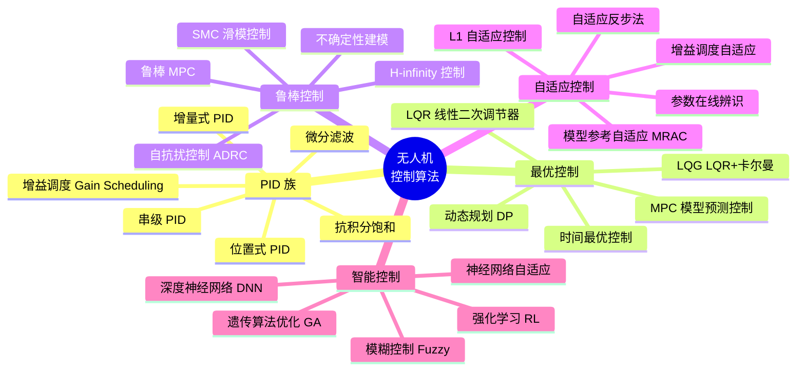
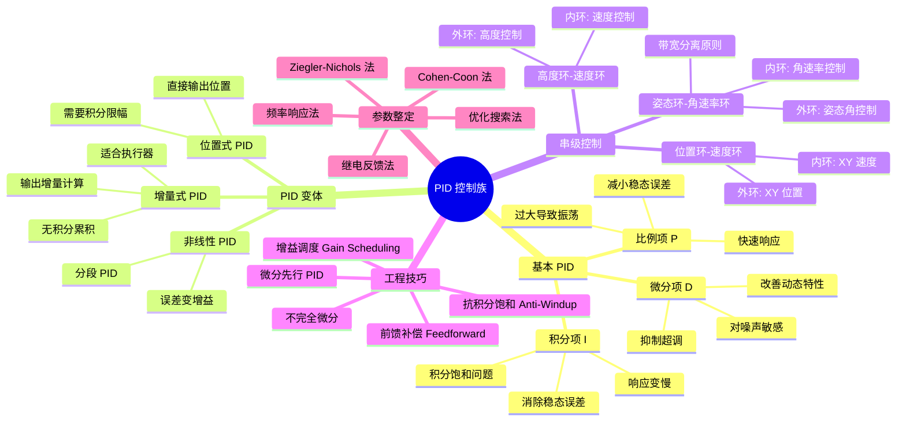
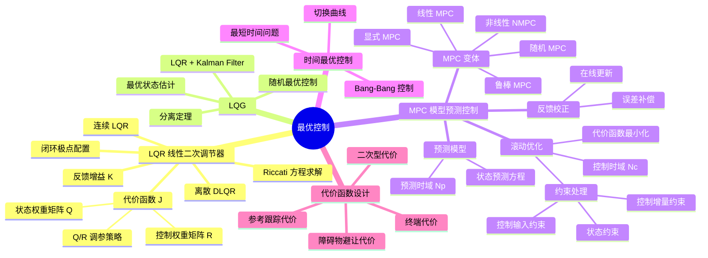
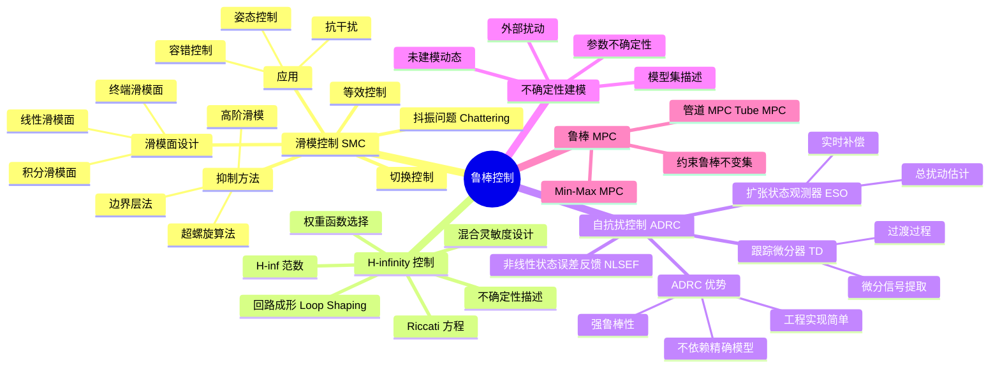
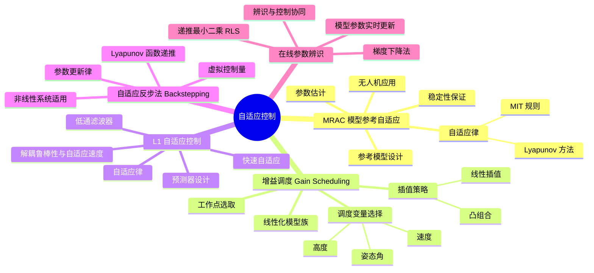
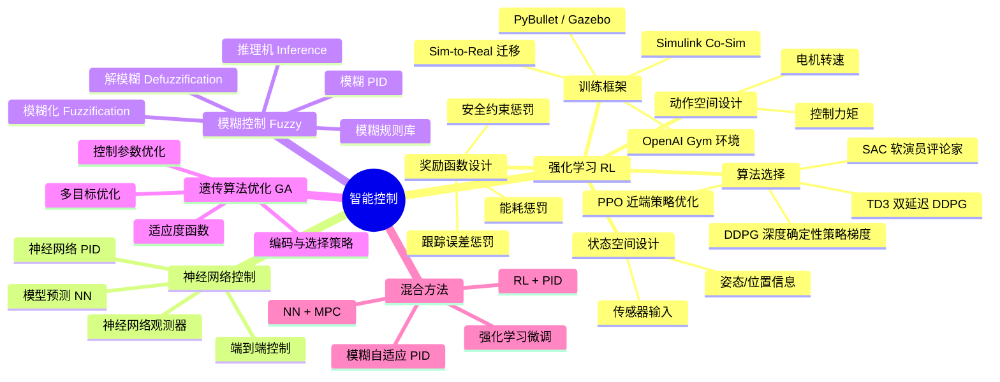
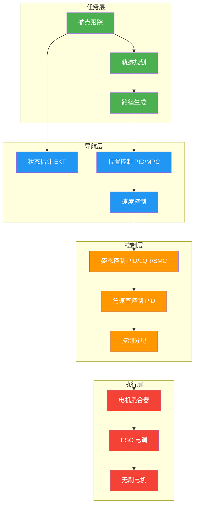

# 控制算法全景图

> 本文档以思维导图形式全面梳理无人机飞行控制算法体系，从经典 PID 到前沿强化学习，覆盖五大控制范式。

---

## 控制算法全景总览

---

## 分支一：PID 族

---

## 分支二：最优控制

---

## 分支三：鲁棒控制

---

## 分支四：自适应控制

---

## 分支五：智能控制

---

## 控制算法对比总表

| 算法 | 复杂度 | 鲁棒性 | 实时性 | 模型依赖 | 调参难度 | 适用场景 |
|------|--------|--------|--------|----------|----------|----------|
| PID | 低 | 中 | 极好 | 低 | 中 | 通用基础控制 |
| LQR | 中 | 中 | 好 | 高 | 中 | 线性化模型 |
| MPC | 高 | 中高 | 中 | 高 | 高 | 约束优化 |
| SMC | 中 | 高 | 好 | 中 | 中 | 抗干扰/容错 |
| ADRC | 中 | 高 | 好 | 低 | 中 | 不确定系统 |
| MRAC | 中高 | 高 | 好 | 中 | 高 | 参数变化 |
| RL | 极高 | 中高 | 好 | 低 | 极高 | 复杂非线性 |

---

## 控制架构层级

