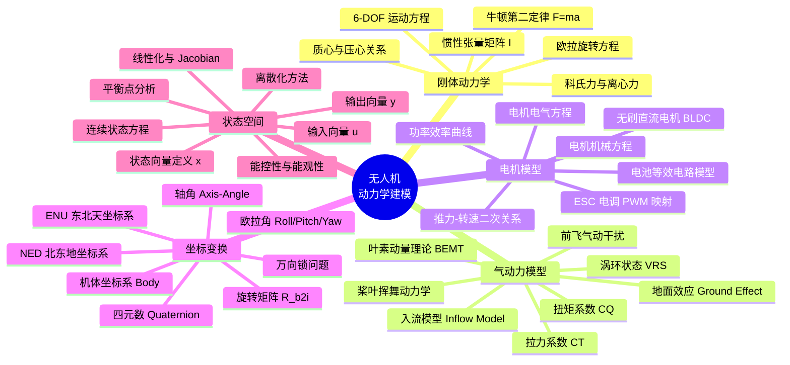
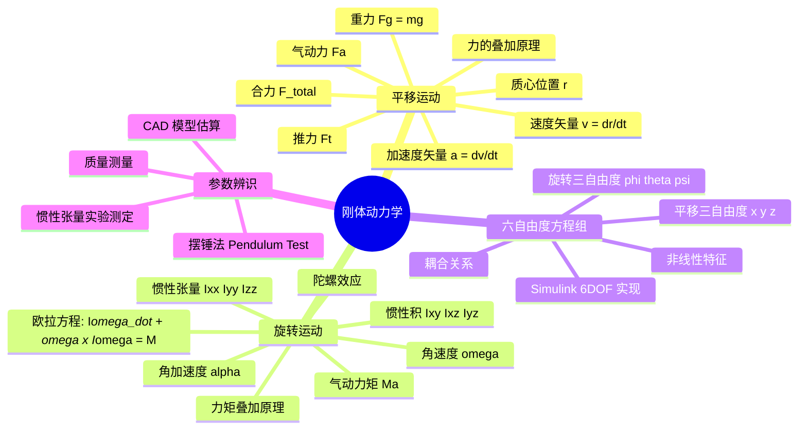
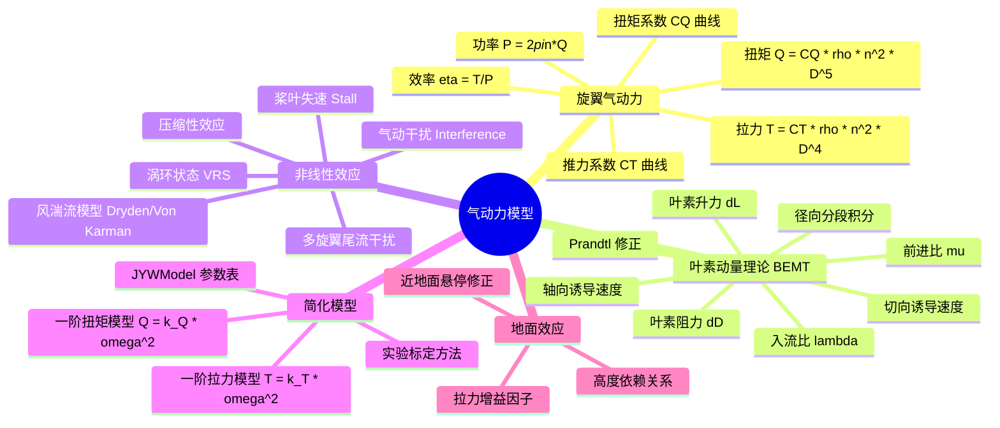
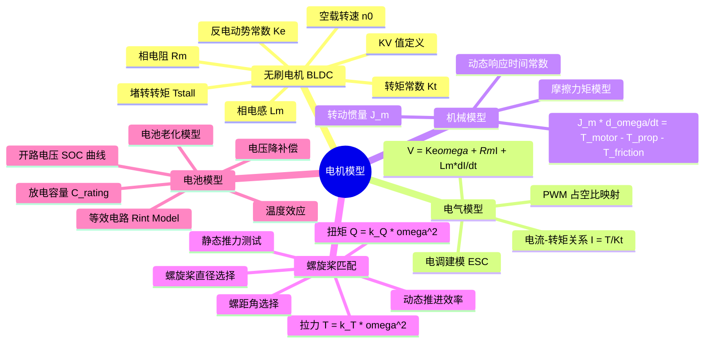
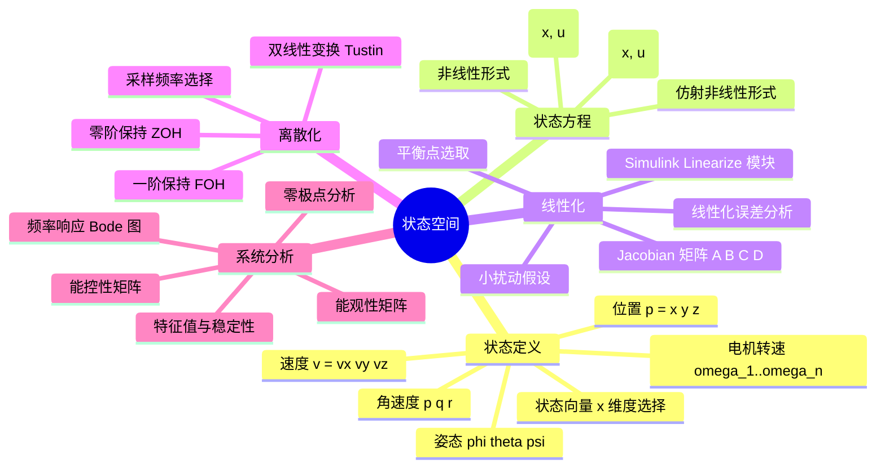
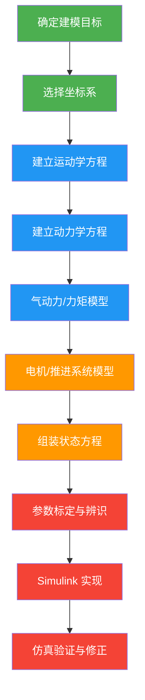

# 动力学建模知识树

> 本文档以思维导图形式梳理无人机动力学建模的核心知识体系，涵盖刚体动力学、气动力模型、电机模型、坐标变换和状态空间五大分支。

---

## 总览：动力学建模知识树



---

## 分支一：刚体动力学



---

## 分支二：气动力模型



---

## 分支三：电机模型



---

## 分支四：坐标变换

```mermaid
mindmap
  root((坐标变换))
    坐标系定义
      机体坐标系 Body Frame
        原点: 质心
        x轴: 机头方向
        y轴: 右翼方向
        z轴: 下方
      地理坐标系
        NED 北东地
        ENU 东北天
        地心坐标系 ECEF
      惯性参考系
    旋转表示
      旋转矩阵 R
        正交性 R^T = R^-1
        行列式 det R = 1
        SO(3) 群
      欧拉角
        Roll phi 滚转
        Pitch theta 俯航
        Yaw psi 偏航
        旋转顺序 ZYX
        万向锁 Gimbal Lock
      四元数 q = [w x y z]
        单位四元数约束
        乘法运算
        共轭与逆
        球面线性插值 SLERP
      轴角表示
        旋转轴 n
        旋转角 theta
        Rodrigues 公式
    变换链
      Body -> NED 转换
      NED -> ENU 转换
      多级变换组合
      Simulink 实现
```

---

## 分支五：状态空间



---

## 建模流程总结



## 常用公式速查

| 物理量 | 公式 | 说明 |
|--------|------|------|
| 拉力 | $T = C_T \rho n^2 D^4$ | CT为推力系数，n为转速，D为直径 |
| 扭矩 | $Q = C_Q \rho n^2 D^5$ | CQ为扭矩系数 |
| 简化拉力 | $T = k_T \omega^2$ | k_T 由实验标定 |
| 简化扭矩 | $Q = k_Q \omega^2$ | k_Q 由实验标定 |
| 欧拉方程 | $I\dot{\omega} + \omega \times I\omega = M$ | 刚体旋转动力学 |
| 四元数导数 | $\dot{q} = \frac{1}{2} q \otimes \omega_q$ | 姿态运动学 |
| 电池电压 | $V = V_{oc}(SOC) - I \cdot R_{int}$ | 等效电路模型 |
