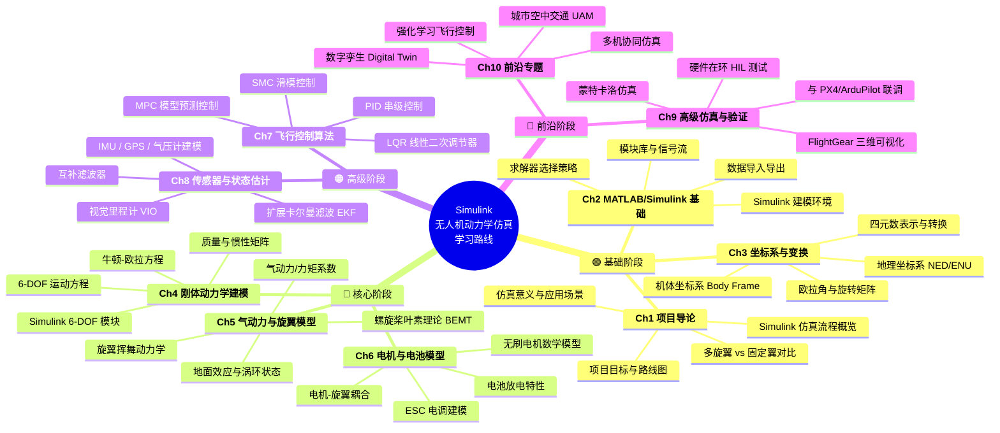
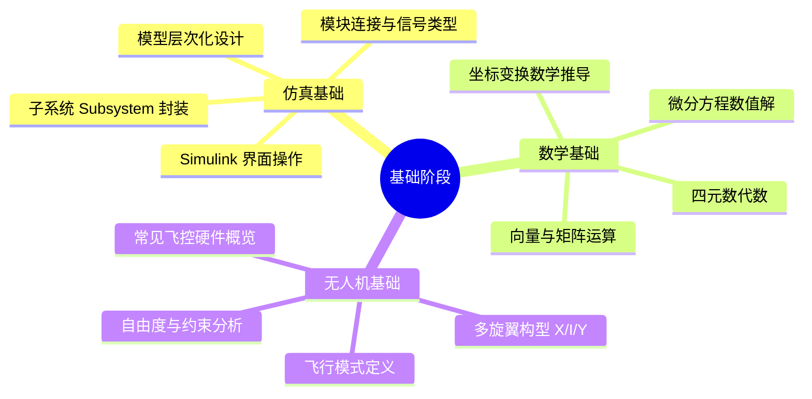
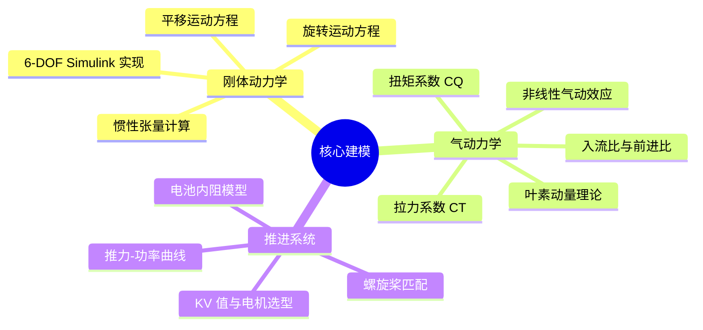
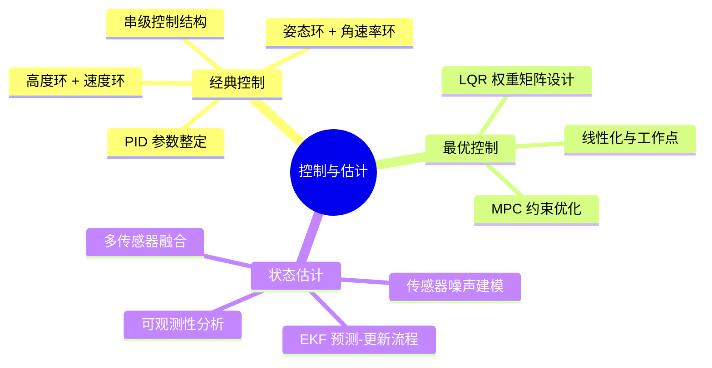
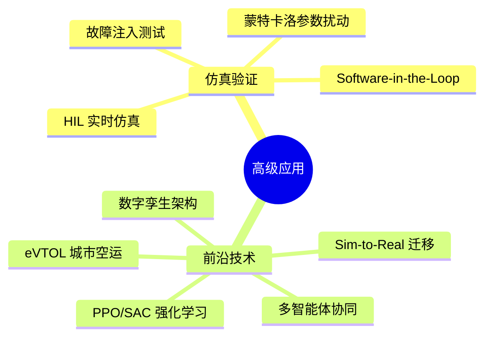
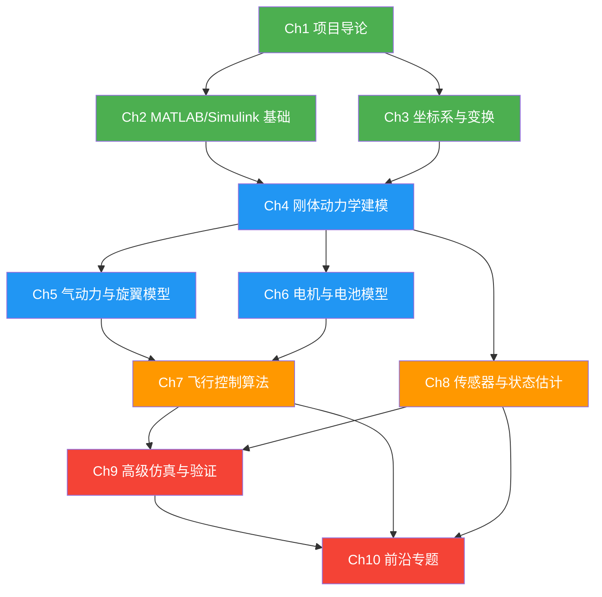

# 学习路线思维导图

> 本文档展示 Simulink 无人机动力学仿真项目的完整学习路径，覆盖 10 个章节。
> 颜色编码：**绿色 = 基础** | **蓝色 = 核心** | **橙色 = 高级** | **红色 = 前沿**

---

## 全局学习路线图

---

## 分阶段详细路线

### 第一阶段：基础入门（第 1-3 章）

### 第二阶段：核心建模（第 4-6 章）

### 第三阶段：控制与估计（第 7-8 章）

### 第四阶段：高级应用（第 9-10 章）

---

## 学习时间建议

| 阶段 | 章节 | 建议时长 | 前置要求 |
|------|------|----------|----------|
| 基础 | Ch1-3 | 2-3 周 | MATLAB 入门 |
| 核心 | Ch4-6 | 3-4 周 | 基础阶段完成 |
| 高级 | Ch7-8 | 3-4 周 | 核心阶段完成 |
| 前沿 | Ch9-10 | 2-3 周 | 高级阶段完成 |

> **总计约 10-14 周**，每周投入 10-15 小时即可完成全部学习。

---

## 技能树依赖关系

