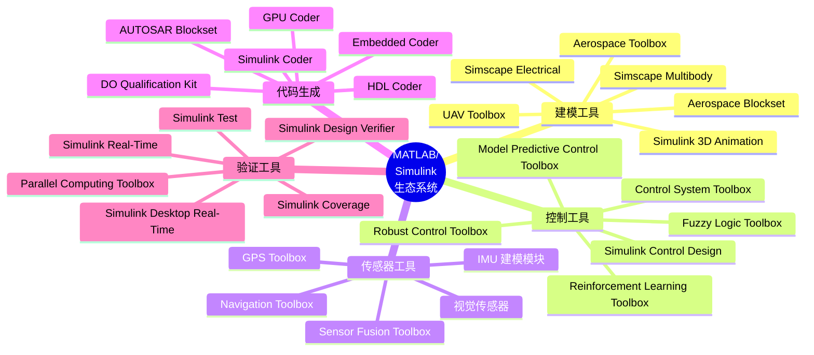
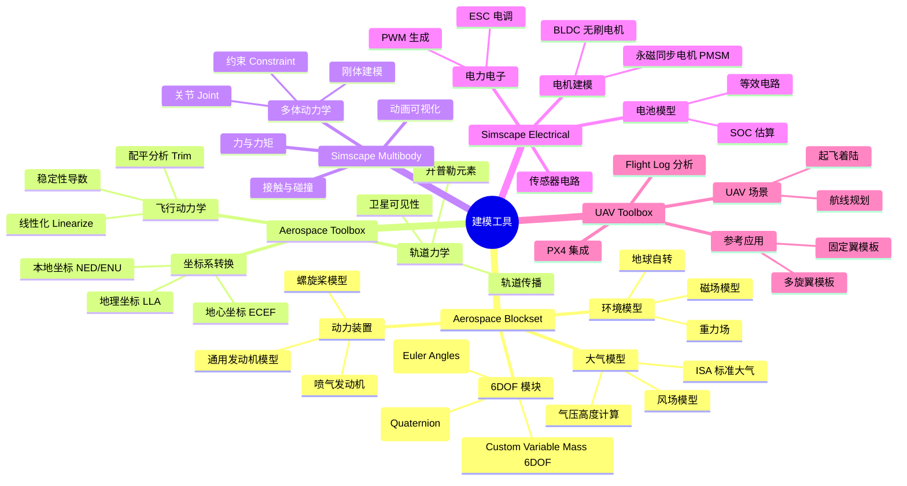
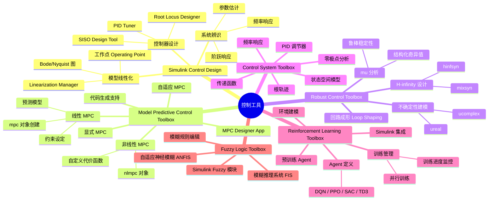
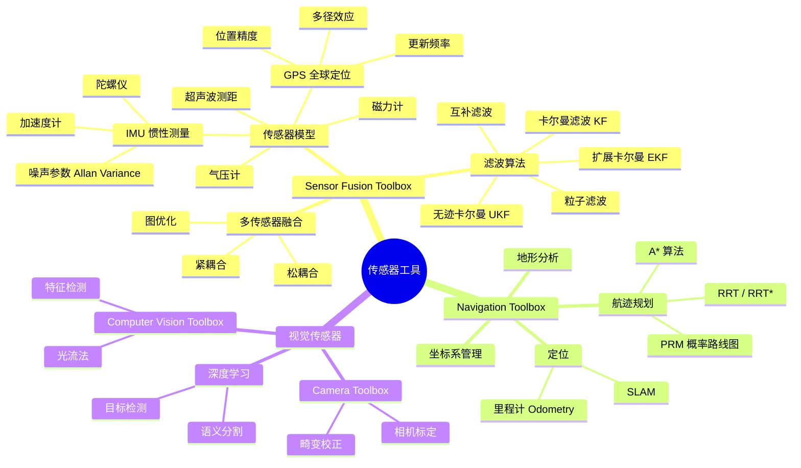
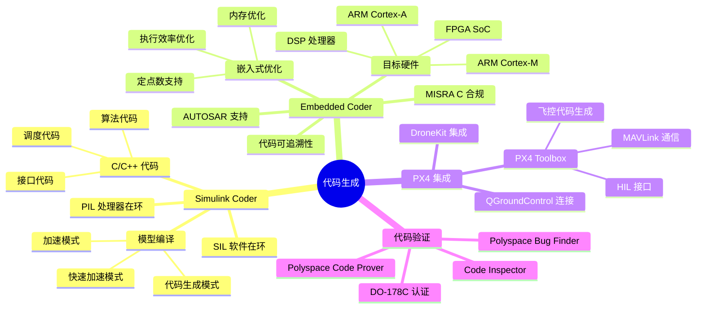
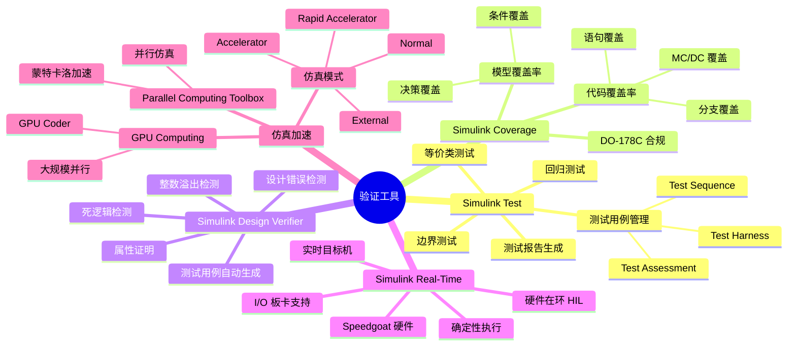
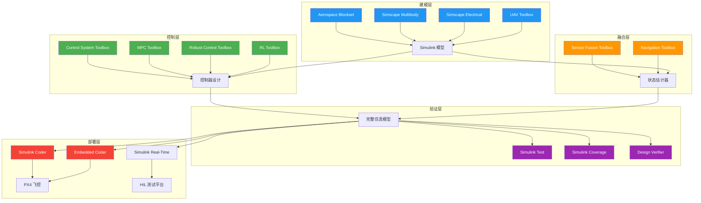

# MATLAB/Simulink 工具箱生态图

> 本文档以思维导图形式展示 MATLAB/Simulink 在无人机仿真领域的工具箱生态系统，涵盖建模、控制、传感器、代码生成和验证五大板块。

---

## 工具箱全景总览

---

## 分支一：建模工具

---

## 分支二：控制工具

---

## 分支三：传感器工具

---

## 分支四：代码生成

---

## 分支五：验证工具

---

## 工具箱协作关系

---

## 许可证与版本要求

| 工具箱 | 许可证类型 | 最低版本建议 | 年费(学术) |
|--------|-----------|-------------|-----------|
| Aerospace Blockset | 需单独授权 | R2022a+ | 含在 Campus License |
| Simscape | 需单独授权 | R2022a+ | 含在 Campus License |
| UAV Toolbox | 需单独授权 | R2022b+ | 含在 Campus License |
| MPC Toolbox | 需单独授权 | R2022a+ | 含在 Campus License |
| RL Toolbox | 需单独授权 | R2022a+ | 含在 Campus License |
| Embedded Coder | 需单独授权 | R2022a+ | 含在 Campus License |
| Simulink Real-Time | 需单独授权 | R2022a+ | 含在 Campus License |

> 大多数高校可通过 MATLAB Campus License 获取全部工具箱授权。个人版需按工具箱单独购买。
