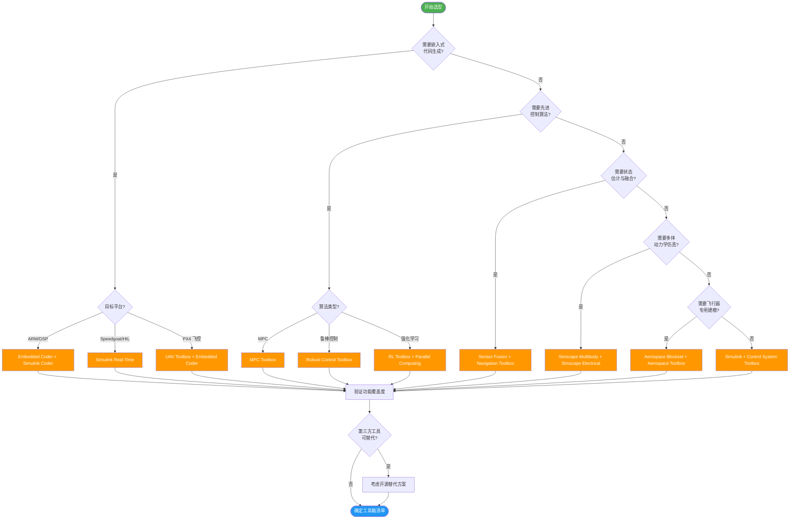

# 工具箱选型指南

> 本文档为 Simulink 无人机动力学仿真项目提供 MATLAB/Simulink 工具箱的详细选型建议，包括功能对比、许可证信息和选型决策流程。

---

## 一、官方工具箱对比

### 1.1 核心建模工具箱

| 工具箱 | 必需/推荐 | 无人机关键功能 | 许可证需求 | 替代方案 |
|--------|----------|---------------|-----------|---------|
| **Aerospace Blockset** | 必需 | 6-DOF 模块、ISA 大气模型、风场模型、动力装置模型 | 单独授权 | 手写 Simulink 6-DOF 模型（工作量大） |
| **Aerospace Toolbox** | 推荐 | 坐标系转换、轨道力学、配平分析、稳定性导数 | 单独授权 | 手写坐标变换函数 |
| **Simscape Multibody** | 推荐 | 多体动力学、刚体关节、约束、动画可视化 | 单独授权 | 6DOF Blockset（功能有限） |
| **Simscape Electrical** | 推荐 | BLDC 电机、电池模型、PWM、ESC 电调 | 单独授权 | 手写电机微分方程 |
| **UAV Toolbox** | 推荐 | UAV 参考应用、航线规划、Flight Log 分析、PX4 集成 | 单独授权 | 自建 UAV 工具函数 |

### 1.2 控制设计工具箱

| 工具箱 | 必需/推荐 | 无人机关键功能 | 许可证需求 | 替代方案 |
|--------|----------|---------------|-----------|---------|
| **Simulink Control Design** | 必需 | 模型线性化、工作点分析、PID Tuner、Bode/Nyquist | 单独授权 | 手动线性化 + Control System Toolbox |
| **Control System Toolbox** | 必需 | 传递函数、状态空间、零极点、频率响应 | 单独授权 | Python control 库 |
| **MPC Toolbox** | 推荐 | 线性/非线性 MPC、约束处理、自适应 MPC | 单独授权 | CasADi + IPOPT（开源） |
| **Robust Control Toolbox** | 可选 | H-inf 控制、mu 分析、不确定性建模 | 单独授权 | MATLAB 手写 Riccati 求解 |
| **Reinforcement Learning Toolbox** | 可选 | PPO/SAC/TD3、Simulink 集成、并行训练 | 单独授权 | Stable-Baselines3（Python 开源） |
| **Fuzzy Logic Toolbox** | 可选 | 模糊推理系统、ANFIS、Simulink Fuzzy 模块 | 单独授权 | Python scikit-fuzzy |

### 1.3 传感器与导航工具箱

| 工具箱 | 必需/推荐 | 无人机关键功能 | 许可证需求 | 替代方案 |
|--------|----------|---------------|-----------|---------|
| **Sensor Fusion Toolbox** | 推荐 | EKF/UKF/粒子滤波、IMU/GPS 噪声建模、多传感器融合 | 单独授权 | 手写 EKF（教学价值高） |
| **Navigation Toolbox** | 推荐 | A*/RRT 路径规划、SLAM、里程计 | 单独授权 | OMPL（C++ 开源） |

### 1.4 代码生成与部署工具箱

| 工具箱 | 必需/推荐 | 无人机关键功能 | 许可证需求 | 替代方案 |
|--------|----------|---------------|-----------|---------|
| **Simulink Coder** | 推荐 | C/C++ 代码生成、SIL/PIL 测试 | 单独授权 | 手写 C 代码 |
| **Embedded Coder** | 可选 | 嵌入式优化、定点数、ARM/DSP 目标、MISRA C | 单独授权 | GCC + 手动优化 |
| **Simulink Real-Time** | 可选 | 实时目标机、HIL 测试、Speedgoat 硬件接口 | 单独授权 | dSPACE（成本更高） |
| **AUTOSAR Blockset** | 可选 | AUTOSAR 架构、组件化开发 | 单独授权 | 手动 AUTOSAR 配置 |

### 1.5 验证与测试工具箱

| 工具箱 | 必需/推荐 | 无人机关键功能 | 许可证需求 | 替代方案 |
|--------|----------|---------------|-----------|---------|
| **Simulink Test** | 推荐 | 测试用例管理、Test Harness、回归测试 | 单独授权 | 手动测试脚本 |
| **Simulink Coverage** | 可选 | 代码覆盖率、MC/DC、DO-178C 合规 | 单独授权 | gcov（C 代码覆盖） |
| **Simulink Design Verifier** | 可选 | 属性证明、测试用例自动生成、死逻辑检测 | 单独授权 | Polyspace（更贵） |
| **Parallel Computing Toolbox** | 推荐 | 并行仿真、蒙特卡洛加速、GPU 支持 | 单独授权 | Python multiprocessing |

---

## 二、第三方工具箱

| 工具箱 | 开源 | 简述 | 关键功能 | 兼容性 | 链接 |
|--------|------|------|----------|--------|------|
| **LADAC** | 是 | 飞行动力学分析工具箱 | 气动数据库、6-DOF 仿真、线性化、稳定性分析 | MATLAB R2020a+ | [GitHub](https://github.com/iff-gsc/LADAC) |
| **FOMCON** | 是 | 分数阶微积分工具箱 | 分数阶 PID、分数阶系统辨识 | MATLAB R2019b+ | [GitHub](https://github.com/altmany/export_fig) |
| **YALMIP** | 是 | 优化建模语言 | LMI、SDP、MPC 建模接口 | MATLAB R2018a+ | [GitHub](https://github.com/yalmip/YALMIP) |
| **CasADi** | 是 | 非线性优化框架 | 自动微分、NLP 求解器接口、MPC | MATLAB/Python/C++ | [GitHub](https://github.com/casadi/casadi) |
| **CVX** | 是 | 凸优化建模 | SDP、SOCP、QP 求解 | MATLAB R2019a+ | [GitHub](https://github.com/cvxr/CVX) |
| **Drake** | 是 | 动力学仿真 | 多体动力学、优化、控制 | MATLAB/Python/C++ | [GitHub](https://github.com/RobotLocomotion/drake) |

---

## 三、工具箱组合方案

### 方案 A：学术研究入门（最低配置）

| 工具箱 | 用途 | 是否必需 |
|--------|------|----------|
| Aerospace Blockset | 6-DOF 建模 | 必需 |
| Control System Toolbox | 控制器设计 | 必需 |
| Simulink Control Design | 线性化 | 推荐 |
| Simulink 基础 | 仿真平台 | 必需 |
| MATLAB 基础 | 矩阵运算 | 必需 |

**预估成本**：学术 Campus License 通常包含以上全部。

### 方案 B：完整控制系统开发

| 工具箱 | 用途 | 是否必需 |
|--------|------|----------|
| Aerospace Blockset | 6-DOF 建模 | 必需 |
| Aerospace Toolbox | 坐标转换 | 推荐 |
| Simscape Electrical | 电机/电池 | 推荐 |
| UAV Toolbox | UAV 专用功能 | 推荐 |
| Control System Toolbox | 控制器设计 | 必需 |
| Simulink Control Design | 线性化 | 必需 |
| MPC Toolbox | MPC 控制 | 推荐 |
| Sensor Fusion Toolbox | 状态估计 | 推荐 |
| Navigation Toolbox | 路径规划 | 推荐 |
| Parallel Computing Toolbox | 并行仿真 | 推荐 |

### 方案 C：嵌入式飞控部署

| 工具箱 | 用途 | 是否必需 |
|--------|------|----------|
| 方案 B 全部 | 基础开发 | 必需 |
| Simulink Coder | 代码生成 | 必需 |
| Embedded Coder | 嵌入式优化 | 必需 |
| Simulink Test | 测试验证 | 推荐 |
| Simulink Coverage | 覆盖率 | 推荐 |
| Simulink Real-Time | HIL 测试 | 推荐 |
| DO Qualification Kit | 认证支持 | 可选 |

### 方案 D：强化学习与前沿研究

| 工具箱 | 用途 | 是否必需 |
|--------|------|----------|
| 方案 B 全部 | 基础开发 | 必需 |
| Reinforcement Learning Toolbox | RL 训练 | 必需 |
| Fuzzy Logic Toolbox | 模糊控制 | 可选 |
| Parallel Computing Toolbox | 并行训练 | 推荐 |
| GPU Coder | GPU 加速 | 可选 |

---

## 四、工具箱选型决策流程图

---

## 五、版本兼容性矩阵

| 工具箱 | R2022a | R2022b | R2023a | R2023b | R2024a | R2024b |
|--------|--------|--------|--------|--------|--------|--------|
| Aerospace Blockset | OK | OK | OK | OK | OK | OK |
| UAV Toolbox | -- | OK | OK | OK | OK | OK |
| Simscape Multibody | OK | OK | OK | OK | OK | OK |
| MPC Toolbox | OK | OK | OK | OK | OK | OK |
| RL Toolbox | OK | OK | OK | OK | OK | OK |
| Simulink Coder | OK | OK | OK | OK | OK | OK |
| Embedded Coder | OK | OK | OK | OK | OK | OK |
| Simulink Real-Time | OK | OK | OK | OK | OK | OK |

> 建议使用 R2023b 或更高版本，以获得最佳功能支持和 Bug 修复。

---

## 六、学术许可证信息

### 6.1 MATLAB Campus License

- **覆盖范围**：多数高校可通过 IT 部门获取全校 MATLAB Campus License
- **包含工具箱**：通常包括全部工具箱（含 Simulink Real-Time）
- **使用方式**：校园网内激活，或通过 VPN 远程访问
- **查询途径**：学校 IT 部门 或 [MathWorks 学术页面](https://www.mathworks.com/academia.html)

### 6.2 个人学术版

- **MATLAB Student**：约 $55/年，含部分工具箱
- **MATLAB Student Suite**：约 $99/年，含 Simulink + 常用工具箱
- **附加工具箱**：每个约 $10-30/年（学生价）
- **购买地址**：[MathWorks 学生商店](https://www.mathworks.com/store)

### 6.3 研究团队版

- **MATLAB Individual Academic License**：按工具箱定价，约 $500-2000/年
- **MATLAB Concurrent License**：浮动许可证，适合实验室共享
- **联系 MathWorks 销售**：获取研究团队报价

### 6.4 开源替代方案总览

| MATLAB 功能 | 开源替代 | 语言 | 成熟度 |
|------------|---------|------|--------|
| Simulink 仿真 | OpenModelica | Modelica | 高 |
| 控制系统设计 | Python control | Python | 中 |
| MPC | CasADi + IPOPT | Python/C++ | 高 |
| RL 训练 | Stable-Baselines3 | Python | 高 |
| 路径规划 | OMPL | C++ | 高 |
| 传感器融合 | Robot Localization (ROS) | C++ | 高 |
| 代码生成 | ROS 2 + MicroROS | C++ | 高 |
| 优化求解 | SciPy / CVXPY | Python | 高 |

---

## 七、快速选型建议

| 场景 | 推荐方案 | 预估工具箱数 |
|------|---------|-------------|
| 课程作业/教学 | 方案 A | 3-4 个 |
| 硕士论文研究 | 方案 B | 8-10 个 |
| 飞控产品开发 | 方案 C | 12-15 个 |
| 前沿算法研究 | 方案 D | 10-12 个 |
| 预算有限 | 开源替代 + MATLAB 基础 | 2-3 个 + 开源库 |
